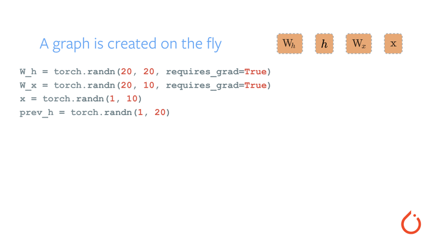

<p align="center"></p>

--------------------------------------------------------------------------------

PyTorch is a Python package that provides two high-level features:
- Tensor computation (like NumPy) with strong GPU acceleration
- Deep neural networks built on a tape-based autograd system

You can reuse your favorite Python packages such as NumPy, SciPy and Cython to extend PyTorch when needed.

We are in an early-release beta. Expect some adventures and rough edges.

- [More about PyTorch](#more-about-pytorch)
- [Installation](#installation)
  - [Binaries](#binaries)
  - [From Source](#from-source)
  - [Docker Image](#docker-image)
- [Getting Started](#getting-started)
- [Communication](#communication)
- [Releases and Contributing](#releases-and-contributing)
- [The Team](#the-team)

| System | 2.7 | 3.5 |
| --- | --- | --- |
| Linux CPU | [](https://travis-ci.org/pytorch/pytorch) | [](https://travis-ci.org/pytorch/pytorch) |
| Linux GPU | [](https://build.pytorch.org/job/pytorch-master-py2-linux) | [](https://build.pytorch.org/job/pytorch-master-py3-linux) |
| macOS CPU | [](https://build.pytorch.org/job/pytorch-master-py2-osx-cpu) | [](https://build.pytorch.org/job/pytorch-master-py3-osx-cpu) |


## More about PyTorch

At a granular level, PyTorch is a library that consists of the following components:

<table>
<tr>
    <td><b> torch </b></td>
    <td> a Tensor library like NumPy, with strong GPU support </td>
</tr>
<tr>
    <td><b> torch.autograd </b></td>
    <td> a tape-based automatic differentiation library that supports all differentiable Tensor operations in torch </td>
</tr>
<tr>
    <td><b> torch.nn </b></td>
    <td> a neural networks library deeply integrated with autograd designed for maximum flexibility </td>
</tr>
<tr>
    <td><b> torch.multiprocessing  </b></td>
    <td> Python multiprocessing, but with magical memory sharing of torch Tensors across processes. Useful for data loading and Hogwild training. </td>
</tr>
<tr>
    <td><b> torch.utils </b></td>
    <td> DataLoader, Trainer and other utility functions for convenience </td>
</tr>
<tr>
    <td><b> torch.legacy(.nn/.optim) </b></td>
    <td> legacy code that has been ported over from torch for backward compatibility reasons </td>
</tr>
</table>

Usually one uses PyTorch either as:

- a replacement for NumPy to use the power of GPUs.
- a deep learning research platform that provides maximum flexibility and speed

Elaborating further:

### A GPU-Ready Tensor Library

If you use NumPy, then you have used Tensors (a.k.a ndarray).

<p align=center></p>

PyTorch provides Tensors that can live either on the CPU or the GPU, and accelerate
compute by a huge amount.

We provide a wide variety of tensor routines to accelerate and fit your scientific computation needs
such as slicing, indexing, math operations, linear algebra, reductions.
And they are fast!

### Dynamic Neural Networks: Tape-Based Autograd

PyTorch has a unique way of building neural networks: using and replaying a tape recorder.

Most frameworks such as TensorFlow, Theano, Caffe and CNTK have a static view of the world.
One has to build a neural network, and reuse the same structure again and again.
Changing the way the network behaves means that one has to start from scratch.

With PyTorch, we use a technique called reverse-mode auto-differentiation, which allows you to
change the way your network behaves arbitrarily with zero lag or overhead. Our inspiration comes
from several research papers on this topic, as well as current and past work such as
[autograd](https://github.com/twitter/torch-autograd),
[autograd](https://github.com/HIPS/autograd),
[Chainer](http://chainer.org), etc.

While this technique is not unique to PyTorch, it's one of the fastest implementations of it to date.
You get the best of speed and flexibility for your crazy research.

<p align=center></p>

### Python First

PyTorch is not a Python binding into a monolithic C++ framework.
It is built to be deeply integrated into Python.
You can use it naturally like you would use NumPy / SciPy / scikit-learn etc.
You can write your new neural network layers in Python itself, using your favorite libraries
and use packages such as Cython and Numba.
Our goal is to not reinvent the wheel where appropriate.

### Imperative Experiences

PyTorch is designed to be intuitive, linear in thought and easy to use.
When you execute a line of code, it gets executed. There isn't an asynchronous view of the world.
When you drop into a debugger, or receive error messages and stack traces, understanding them is straightforward.
The stack trace points to exactly where your code was defined.
We hope you never spend hours debugging your code because of bad stack traces or asynchronous and opaque execution engines.

### Fast and Lean

PyTorch has minimal framework overhead. We integrate acceleration libraries
such as Intel MKL and NVIDIA (cuDNN, NCCL) to maximize speed.
At the core, its CPU and GPU Tensor and neural network backends
(TH, THC, THNN, THCUNN) are written as independent libraries with a C99 API.  
They are mature and have been tested for years.

Hence, PyTorch is quite fast – whether you run small or large neural networks.

The memory usage in PyTorch is extremely efficient compared to Torch or some of the alternatives.
We've written custom memory allocators for the GPU to make sure that
your deep learning models are maximally memory efficient.
This enables you to train bigger deep learning models than before.

### Extensions without Pain

Writing new neural network modules, or interfacing with PyTorch's Tensor API was designed to be straightforward
and with minimal abstractions.

You can write new neural network layers in Python using the torch API
[or your favorite NumPy-based libraries such as SciPy](http://pytorch.org/tutorials/advanced/numpy_extensions_tutorial.html).

If you want to write your layers in C/C++, we provide an extension API based on
[cffi](http://cffi.readthedocs.io/en/latest/) that is efficient and with minimal boilerplate.
There is no wrapper code that needs to be written. You can see [a tutorial here](http://pytorch.org/tutorials/advanced/c_extension.html) and [an example here](https://github.com/pytorch/extension-ffi).


## Installation

### Binaries
Commands to install from binaries via Conda or pip wheels are on our website:

[http://pytorch.org](http://pytorch.org)

### From Source

If you are installing from source, we highly recommend installing an [Anaconda](https://www.continuum.io/downloads) environment.
You will get a high-quality BLAS library (MKL) and you get a controlled compiler version regardless of your Linux distro.

Once you have [Anaconda](https://www.continuum.io/downloads) installed, here are the instructions.

If you want to compile with CUDA support, install
- [NVIDIA CUDA](https://developer.nvidia.com/cuda-downloads) 7.5 or above
- [NVIDIA cuDNN](https://developer.nvidia.com/cudnn) v5.x or above

If you want to disable CUDA support, export environment variable `NO_CUDA=1`.

#### Install optional dependencies

On Linux
```bash
export CMAKE_PREFIX_PATH=[anaconda root directory]

# Install basic dependencies
conda install numpy pyyaml mkl setuptools cmake gcc cffi

# Add LAPACK support for the GPU
conda install -c soumith magma-cuda80 # or magma-cuda75 if CUDA 7.5
```

On OSX
```bash
export CMAKE_PREFIX_PATH=[anaconda root directory]
conda install numpy pyyaml setuptools cmake cffi
```

#### Install PyTorch
On Linux
```bash
python setup.py install
```

On OSX
```bash
MACOSX_DEPLOYMENT_TARGET=10.9 CC=clang CXX=clang++ python setup.py install
```

### Docker image

Dockerfile is supplied to build images with cuda support and cudnn v6. Build as usual
```
docker build -t pytorch .
```
Alternatively, if you want a runtime image, build with

```
docker build -t pytorch . -f tools/docker/Dockerfile_runtime

```
and run with nvidia-docker:
```
nvidia-docker run --rm -ti --ipc=host pytorch
```
Please note that PyTorch uses shared memory to share data between processes, so if torch multiprocessing is used (e.g.
for multithreaded data loaders) the default shared memory segment size that container runs with is not enough, and you
should increase shared memory size either with `--ipc=host` or `--shm-size` command line options to `nvidia-docker run`.


## Getting Started

Three pointers to get you started:
- [Tutorials: get you started with understanding and using PyTorch](http://pytorch.org/tutorials/)
- [Examples: easy to understand pytorch code across all domains](https://github.com/pytorch/examples)
- The API Reference: [http://pytorch.org/docs/](http://pytorch.org/docs/)

## Communication
* forums: discuss implementations, research, etc. http://discuss.pytorch.org
* GitHub issues: bug reports, feature requests, install issues, RFCs, thoughts, etc.
* Slack: general chat, online discussions, collaboration etc. https://pytorch.slack.com/ . If you need a slack invite, ping us at soumith@pytorch.org
* newsletter: no-noise, one-way email newsletter with important announcements about pytorch. You can sign-up here: http://eepurl.com/cbG0rv

## Releases and Contributing

PyTorch has a 90 day release cycle (major releases).
It's current state is Beta, we expect no obvious bugs. Please let us know if you encounter a bug by [filing an issue](https://github.com/pytorch/pytorch/issues).

We appreciate all contributions. If you are planning to contribute back bug-fixes, please do so without any further discussion.

If you plan to contribute new features, utility functions or extensions to the core, please first open an issue and discuss the feature with us.
Sending a PR without discussion might end up resulting in a rejected PR, because we might be taking the core in a different direction than you might be aware of.

**For the next release cycle, these are the 3 big features we are planning to add:**

1. [Distributed PyTorch](https://github.com/pytorch/pytorch/issues/241) (a draft implementation is present in this [branch](https://github.com/apaszke/pytorch-dist) )
2. Backward of Backward - Backpropagating through the optimization process itself. Some past and recent papers such as
   [Double Backprop](http://yann.lecun.com/exdb/publis/pdf/drucker-lecun-91.pdf) and [Unrolled GANs](https://arxiv.org/abs/1611.02163) need this.
3. Lazy Execution Engine for autograd - This will enable us to optionally introduce caching and JIT compilers to optimize autograd code.


## The Team

PyTorch is a community driven project with several skillful engineers and researchers contributing to it.

PyTorch is currently maintained by [Adam Paszke](https://apaszke.github.io/), [Sam Gross](https://github.com/colesbury) and [Soumith Chintala](http://soumith.ch) with major contributions coming from 10s of talented individuals in various forms and means. A non-exhaustive but growing list needs to mention: Sergey Zagoruyko, Adam Lerer, Francisco Massa, Andreas Kopf, James Bradbury, Zeming Lin, Yuandong Tian, Guillaume Lample, Marat Dukhan, Natalia Gimelshein.

Note: this project is unrelated to [hughperkins/pytorch](https://github.com/hughperkins/pytorch) with the same name. Hugh is a valuable contributor in the Torch community and has helped with many things Torch and PyTorch.
