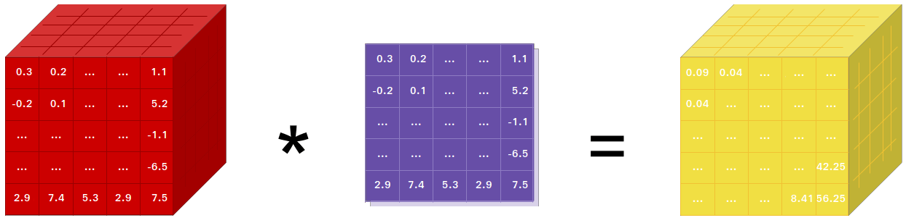

--------------------------------------------------------------------------------

PyTorch is a Python package that provides two high-level features:
- Tensor computation (like NumPy) with strong GPU acceleration
- Deep neural networks built on a tape-based autograd system

You can reuse your favorite Python packages such as NumPy, SciPy, and Cython to extend PyTorch when needed.

- [More about PyTorch](#more-about-pytorch)
- [Installation](#installation)
  - [Binaries](#binaries)
  - [From Source](#from-source)
  - [Docker Image](#docker-image)
  - [Building the Documentation](#building-the-documentation)
  - [Previous Versions](#previous-versions)
- [Getting Started](#getting-started)
- [Communication](#communication)
- [Releases and Contributing](#releases-and-contributing)
- [The Team](#the-team)

| System | 3.6 | 3.7 | 3.8 |
| :---: | :---: | :---: | :--: |
| Linux CPU | [](https://ci.pytorch.org/jenkins/job/pytorch-master/) | [](https://ci.pytorch.org/jenkins/job/pytorch-master/) | <center>—</center> |
| Linux GPU | [](https://ci.pytorch.org/jenkins/job/pytorch-master/) | [](https://ci.pytorch.org/jenkins/job/pytorch-master/) | <center>—</center> |
| Windows CPU / GPU | <center>—</center> | [](https://ci.pytorch.org/jenkins/job/pytorch-builds/job/pytorch-win-ws2016-cuda9-cudnn7-py3-trigger/) |  <center>—</center> |
| Linux (ppc64le) CPU | <center>—</center> | [](https://powerci.osuosl.org/job/pytorch-master-nightly-py3-linux-ppc64le/) | <center>—</center> |
| Linux (ppc64le) GPU | <center>—</center> | [](https://powerci.osuosl.org/job/pytorch-master-nightly-py3-linux-ppc64le-gpu/) | <center>—</center> |
| Linux (aarch64) CPU | [](https://status.openlabtesting.org/builds/builds?project=pytorch%2Fpytorch&job_name=pytorch-arm64-build-daily-master-py36) | [](https://status.openlabtesting.org/builds/builds?project=pytorch%2Fpytorch&job_name=pytorch-arm64-build-daily-master-py37) | [](https://status.openlabtesting.org/builds/builds?project=pytorch%2Fpytorch&job_name=pytorch-arm64-build-daily-master-py38) |

See also the [ci.pytorch.org HUD](https://ezyang.github.io/pytorch-ci-hud/build/pytorch-master).


## More About PyTorch

At a granular level, PyTorch is a library that consists of the following components:

| Component | Description |
| ---- | --- |
| [**torch**](https://pytorch.org/docs/stable/torch.html) | a Tensor library like NumPy, with strong GPU support |
| [**torch.autograd**](https://pytorch.org/docs/stable/autograd.html) | a tape-based automatic differentiation library that supports all differentiable Tensor operations in torch |
| [**torch.jit**](https://pytorch.org/docs/stable/jit.html) | a compilation stack (TorchScript) to create serializable and optimizable models from PyTorch code  |
| [**torch.nn**](https://pytorch.org/docs/stable/nn.html) | a neural networks library deeply integrated with autograd designed for maximum flexibility |
| [**torch.multiprocessing**](https://pytorch.org/docs/stable/multiprocessing.html) | Python multiprocessing, but with magical memory sharing of torch Tensors across processes. Useful for data loading and Hogwild training |
| [**torch.utils**](https://pytorch.org/docs/stable/data.html) | DataLoader and other utility functions for convenience |

Usually, PyTorch is used either as:

- A replacement for NumPy to use the power of GPUs.
- A deep learning research platform that provides maximum flexibility and speed.

Elaborating Further:

### A GPU-Ready Tensor Library

If you use NumPy, then you have used Tensors (a.k.a. ndarray).



PyTorch provides Tensors that can live either on the CPU or the GPU and accelerates the
computation by a huge amount.

We provide a wide variety of tensor routines to accelerate and fit your scientific computation needs
such as slicing, indexing, math operations, linear algebra, reductions.
And they are fast!

### Dynamic Neural Networks: Tape-Based Autograd

PyTorch has a unique way of building neural networks: using and replaying a tape recorder.

Most frameworks such as TensorFlow, Theano, Caffe, and CNTK have a static view of the world.
One has to build a neural network and reuse the same structure again and again.
Changing the way the network behaves means that one has to start from scratch.

With PyTorch, we use a technique called reverse-mode auto-differentiation, which allows you to
change the way your network behaves arbitrarily with zero lag or overhead. Our inspiration comes
from several research papers on this topic, as well as current and past work such as
[torch-autograd](https://github.com/twitter/torch-autograd),
[autograd](https://github.com/HIPS/autograd),
[Chainer](https://chainer.org), etc.

While this technique is not unique to PyTorch, it's one of the fastest implementations of it to date.
You get the best of speed and flexibility for your crazy research.


### Python First

PyTorch is not a Python binding into a monolithic C++ framework.
It is built to be deeply integrated into Python.
You can use it naturally like you would use [NumPy](https://www.numpy.org/) / [SciPy](https://www.scipy.org/) / [scikit-learn](https://scikit-learn.org) etc.
You can write your new neural network layers in Python itself, using your favorite libraries
and use packages such as [Cython](https://cython.org/) and [Numba](http://numba.pydata.org/).
Our goal is to not reinvent the wheel where appropriate.

### Imperative Experiences

PyTorch is designed to be intuitive, linear in thought, and easy to use.
When you execute a line of code, it gets executed. There isn't an asynchronous view of the world.
When you drop into a debugger or receive error messages and stack traces, understanding them is straightforward.
The stack trace points to exactly where your code was defined.
We hope you never spend hours debugging your code because of bad stack traces or asynchronous and opaque execution engines.

### Fast and Lean

PyTorch has minimal framework overhead. We integrate acceleration libraries
such as [Intel MKL](https://software.intel.com/mkl) and NVIDIA ([cuDNN](https://developer.nvidia.com/cudnn), [NCCL](https://developer.nvidia.com/nccl)) to maximize speed.
At the core, its CPU and GPU Tensor and neural network backends
(TH, THC, THNN, THCUNN) are mature and have been tested for years.

Hence, PyTorch is quite fast – whether you run small or large neural networks.

The memory usage in PyTorch is extremely efficient compared to Torch or some of the alternatives.
We've written custom memory allocators for the GPU to make sure that
your deep learning models are maximally memory efficient.
This enables you to train bigger deep learning models than before.

### Extensions Without Pain

Writing new neural network modules, or interfacing with PyTorch's Tensor API was designed to be straightforward
and with minimal abstractions.

You can write new neural network layers in Python using the torch API
[or your favorite NumPy-based libraries such as SciPy](https://pytorch.org/tutorials/advanced/numpy_extensions_tutorial.html).

If you want to write your layers in C/C++, we provide a convenient extension API that is efficient and with minimal boilerplate.
No wrapper code needs to be written. You can see [a tutorial here](https://pytorch.org/tutorials/advanced/cpp_extension.html) and [an example here](https://github.com/pytorch/extension-cpp).


## Installation

### Binaries
Commands to install from binaries via Conda or pip wheels are on our website:
[https://pytorch.org](https://pytorch.org)


#### NVIDIA Jetson Platforms

Python wheels for NVIDIA's Jetson Nano, Jetson TX2, and Jetson AGX Xavier are available via the following URLs:

- Stable binaries:
  - Python 3.6: https://nvidia.box.com/v/torch-stable-cp36-jetson-jp42
- Rolling weekly binaries:
  - Python 3.6: https://nvidia.box.com/v/torch-weekly-cp36-jetson-jp42

They require JetPack 4.2 and above, and [@dusty-nv](https://github.com/dusty-nv) maintains them


### From Source

If you are installing from source, you will need Python 3.6.2 or later and a C++14 compiler. Also, we highly recommend installing an [Anaconda](https://www.anaconda.com/distribution/#download-section) environment.
You will get a high-quality BLAS library (MKL) and you get controlled dependency versions regardless of your Linux distro.

Once you have [Anaconda](https://www.anaconda.com/distribution/#download-section) installed, here are the instructions.

Compiling with CUDA or ROCm support
- CUDA
  - [NVIDIA CUDA](https://developer.nvidia.com/cuda-downloads) 9.2 or above
  - [NVIDIA cuDNN](https://developer.nvidia.com/cudnn) v7 or above
  - [Compiler](https://gist.github.com/ax3l/9489132) compatible with CUDA
  - Note: You could refer to the [cuDNN Support Matrix](https://docs.nvidia.com/deeplearning/cudnn/pdf/cuDNN-Support-Matrix.pdf) for cuDNN versions with the various supported CUDA, CUDA driver and NVIDIA hardwares
- ROCm
  - [AMD ROCm](https://rocmdocs.amd.com/en/latest/Installation_Guide/Installation-Guide.html) 4.0 and above installation

If you want to disable CUDA support, export environment variable `USE_CUDA=0`.
Other potentially useful environment variables may be found in `setup.py`.

If you are building for NVIDIA's Jetson platforms (Jetson Nano, TX1, TX2, AGX Xavier), Instructions to install PyTorch for Jetson Nano are [available here](https://devtalk.nvidia.com/default/topic/1049071/jetson-nano/pytorch-for-jetson-nano/)


#### Install Dependencies

Common
```bash
conda install numpy ninja pyyaml mkl mkl-include setuptools cmake cffi typing_extensions future six requests dataclasses
```

On Linux
```bash
# Add LAPACK support for the GPU if needed
conda install -c pytorch magma-cuda110  # or the magma-cuda* that matches your CUDA version from https://anaconda.org/pytorch/repo
```

On MacOS
```bash
# Add these packages if torch.distributed is needed
conda install pkg-config libuv
```

On Windows
```bash
# Add these packages if torch.distributed is needed.
# Distributed package support on Windows is a prototype feature and is subject to changes.
conda install -c conda-forge libuv=1.39
```

#### Get the PyTorch Source
```bash
git clone --recursive https://github.com/pytorch/pytorch
cd pytorch
# if you are updating an existing checkout
git submodule sync
git submodule update --init --recursive
```

#### Install PyTorch
On Linux
```bash
export CMAKE_PREFIX_PATH=${CONDA_PREFIX:-"$(dirname $(which conda))/../"}
python setup.py install
```

Note that if you are using [Anaconda](https://www.anaconda.com/distribution/#download-section), you may experience an error caused by the linker:

```plaintext
build/temp.linux-x86_64-3.7/torch/csrc/stub.o: file not recognized: file format not recognized
collect2: error: ld returned 1 exit status
error: command 'g++' failed with exit status 1
```

This is caused by `ld` from Conda environment shadowing the system `ld`. You should use a newer version of Python that fixes this issue. The recommended Python version is 3.6.10+, 3.7.6+ and 3.8.1+.

On macOS
```bash
export CMAKE_PREFIX_PATH=${CONDA_PREFIX:-"$(dirname $(which conda))/../"}
MACOSX_DEPLOYMENT_TARGET=10.9 CC=clang CXX=clang++ python setup.py install
```

Each CUDA version only supports one particular XCode version. The following combinations have been reported to work with PyTorch.

| CUDA version | XCode version |
| ------------ | ------------- |
| 10.0         | XCode 9.4     |
| 10.1         | XCode 10.1    |


On Windows

Build with CPU

It's fairly easy to build with CPU. Visual Studio 2019 version 16.7.6 (MSVC toolchain version 14.27) or higher is recommended.

Build with CUDA

[NVTX](https://docs.nvidia.com/gameworks/content/gameworkslibrary/nvtx/nvidia_tools_extension_library_nvtx.htm) is needed to build Pytorch with CUDA.
NVTX is a part of CUDA distributive, where it is called "Nsight Compute". To install it onto already installed CUDA run CUDA installation once again and check the corresponding checkbox.
Make sure that CUDA with Nsight Compute is installed after Visual Studio.

Currently, VS 2017 / 2019, and Ninja are supported as the generator of CMake. If `ninja.exe` is detected in `PATH`, then Ninja will be used as the default generator, otherwise, it will use VS 2017 / 2019.
<br/> If Ninja is selected as the generator, the latest MSVC will get selected as the underlying toolchain.

CUDA, MSVC, and PyTorch versions are interdependent; please install matching versions from this table:
| CUDA version | Newest supported VS version                             | PyTorch version |
| ------------ | ------------------------------------------------------- | --------------- |
| 9.2          | Visual Studio 2017 Update 5 (15.5) (`_MSC_VER` <= 1912) |  0.4.1 ~ 1.5.1  |
| 10.1         | Visual Studio 2019 (16.X) (`_MSC_VER` < 1930)           |  1.3.0 ~ 1.7.0  |
| 10.2         | Visual Studio 2019 (16.X) (`_MSC_VER` < 1930)           |  1.5.0 ~ 1.7.0  |
| 11.0         | Visual Studio 2019 (16.X) (`_MSC_VER` < 1930)           |      1.7.0      |

Note: There's a [compilation issue](https://github.com/oneapi-src/oneDNN/issues/812) in several Visual Studio 2019 versions since 16.7.1, so please make sure your Visual Studio 2019 version is not in 16.7.1 ~ 16.7.5

Additional libraries such as
[Magma](https://developer.nvidia.com/magma), [oneDNN, a.k.a MKLDNN or DNNL](https://github.com/oneapi-src/oneDNN), and [Sccache](https://github.com/mozilla/sccache) are often needed. Please refer to the [installation-helper](https://github.com/pytorch/pytorch/tree/master/.jenkins/pytorch/win-test-helpers/installation-helpers) to install them.

You can refer to the [build_pytorch.bat](https://github.com/pytorch/pytorch/blob/master/.jenkins/pytorch/win-test-helpers/build_pytorch.bat) script for some other environment variables configurations


```cmd
cmd

:: [Optional] If you want to build with the VS 2017 generator for old CUDA and PyTorch, please change the value in the next line to `Visual Studio 15 2017`.
:: Note: This value is useless if Ninja is detected. However, you can force that by using `set USE_NINJA=OFF`.
set CMAKE_GENERATOR=Visual Studio 16 2019

:: Read the content in the previous section carefully before you proceed.
:: [Optional] If you want to override the underlying toolset used by Ninja and Visual Studio with CUDA, please run the following script block.
:: "Visual Studio 2019 Developer Command Prompt" will be run automatically.
:: Make sure you have CMake >= 3.12 before you do this when you use the Visual Studio generator.
set CMAKE_GENERATOR_TOOLSET_VERSION=14.27
set DISTUTILS_USE_SDK=1
for /f "usebackq tokens=*" %i in (`"%ProgramFiles(x86)%\Microsoft Visual Studio\Installer\vswhere.exe" -version [15^,16^) -products * -latest -property installationPath`) do call "%i\VC\Auxiliary\Build\vcvarsall.bat" x64 -vcvars_ver=%CMAKE_GENERATOR_TOOLSET_VERSION%

:: [Optional] If you want to override the CUDA host compiler
set CUDAHOSTCXX=C:\Program Files (x86)\Microsoft Visual Studio\2019\Community\VC\Tools\MSVC\14.27.29110\bin\HostX64\x64\cl.exe

python setup.py install

```

##### Adjust Build Options (Optional)

You can adjust the configuration of cmake variables optionally (without building first), by doing
the following. For example, adjusting the pre-detected directories for CuDNN or BLAS can be done
with such a step.

On Linux
```bash
export CMAKE_PREFIX_PATH=${CONDA_PREFIX:-"$(dirname $(which conda))/../"}
python setup.py build --cmake-only
ccmake build  # or cmake-gui build
```

On macOS
```bash
export CMAKE_PREFIX_PATH=${CONDA_PREFIX:-"$(dirname $(which conda))/../"}
MACOSX_DEPLOYMENT_TARGET=10.9 CC=clang CXX=clang++ python setup.py build --cmake-only
ccmake build  # or cmake-gui build
```

### Docker Image

#### Using pre-built images

You can also pull a pre-built docker image from Docker Hub and run with docker v19.03+

```bash
docker run --gpus all --rm -ti --ipc=host pytorch/pytorch:latest
```

Please note that PyTorch uses shared memory to share data between processes, so if torch multiprocessing is used (e.g.
for multithreaded data loaders) the default shared memory segment size that container runs with is not enough, and you
should increase shared memory size either with `--ipc=host` or `--shm-size` command line options to `nvidia-docker run`.

#### Building the image yourself

**NOTE:** Must be built with a docker version > 18.06

The `Dockerfile` is supplied to build images with Cuda support and cuDNN v7.
You can pass `PYTHON_VERSION=x.y` make variable to specify which Python version is to be used by Miniconda, or leave it
unset to use the default.
```bash
make -f docker.Makefile
# images are tagged as docker.io/${your_docker_username}/pytorch
```

### Building the Documentation

To build documentation in various formats, you will need [Sphinx](http://www.sphinx-doc.org) and the
readthedocs theme.

```bash
cd docs/
pip install -r requirements.txt
```
You can then build the documentation by running ``make <format>`` from the
``docs/`` folder. Run ``make`` to get a list of all available output formats.

If you get a katex error run ```npm install katex```.  If it persists, try
```npm install -g katex```

### Previous Versions

Installation instructions and binaries for previous PyTorch versions may be found
on [Our Website](https://pytorch.org/previous-versions).


## Getting Started

Three-pointers to get you started:
- [Tutorials: get you started with understanding and using PyTorch](https://pytorch.org/tutorials/)
- [Examples: easy to understand pytorch code across all domains](https://github.com/pytorch/examples)
- [The API Reference](https://pytorch.org/docs/)
- [Glossary](https://github.com/pytorch/pytorch/blob/master/GLOSSARY.md)

## Resources

* [PyTorch.org](https://pytorch.org/)
* [PyTorch Tutorials](https://pytorch.org/tutorials/)
* [PyTorch Examples](https://github.com/pytorch/examples)
* [PyTorch Models](https://pytorch.org/hub/)
* [Intro to Deep Learning with PyTorch from Udacity](https://www.udacity.com/course/deep-learning-pytorch--ud188)
* [Intro to Machine Learning with PyTorch from Udacity](https://www.udacity.com/course/intro-to-machine-learning-nanodegree--nd229)
* [Deep Neural Networks with PyTorch from Coursera](https://www.coursera.org/learn/deep-neural-networks-with-pytorch)
* [PyTorch Twitter](https://twitter.com/PyTorch)
* [PyTorch Blog](https://pytorch.org/blog/)
* [PyTorch YouTube](https://www.youtube.com/channel/UCWXI5YeOsh03QvJ59PMaXFw)

## Communication
* Forums: Discuss implementations, research, etc. https://discuss.pytorch.org
* GitHub Issues: Bug reports, feature requests, install issues, RFCs, thoughts, etc.
* Slack: The [PyTorch Slack](https://pytorch.slack.com/) hosts a primary audience of moderate to experienced PyTorch users and developers for general chat, online discussions, collaboration, etc. If you are a beginner looking for help, the primary medium is [PyTorch Forums](https://discuss.pytorch.org). If you need a slack invite, please fill this form: https://goo.gl/forms/PP1AGvNHpSaJP8to1
* Newsletter: No-noise, a one-way email newsletter with important announcements about PyTorch. You can sign-up here: https://eepurl.com/cbG0rv
* Facebook Page: Important announcements about PyTorch. https://www.facebook.com/pytorch
* For brand guidelines, please visit our website at [pytorch.org](https://pytorch.org/)

## Releases and Contributing

PyTorch has a 90-day release cycle (major releases). Please let us know if you encounter a bug by [filing an issue](https://github.com/pytorch/pytorch/issues).

We appreciate all contributions. If you are planning to contribute back bug-fixes, please do so without any further discussion.

If you plan to contribute new features, utility functions, or extensions to the core, please first open an issue and discuss the feature with us.
Sending a PR without discussion might end up resulting in a rejected PR because we might be taking the core in a different direction than you might be aware of.

To learn more about making a contribution to Pytorch, please see our [Contribution page](CONTRIBUTING.md).

## The Team

PyTorch is a community-driven project with several skillful engineers and researchers contributing to it.

PyTorch is currently maintained by [Adam Paszke](https://apaszke.github.io/), [Sam Gross](https://github.com/colesbury), [Soumith Chintala](http://soumith.ch) and [Gregory Chanan](https://github.com/gchanan) with major contributions coming from hundreds of talented individuals in various forms and means.
A non-exhaustive but growing list needs to mention: Trevor Killeen, Sasank Chilamkurthy, Sergey Zagoruyko, Adam Lerer, Francisco Massa, Alykhan Tejani, Luca Antiga, Alban Desmaison, Andreas Koepf, James Bradbury, Zeming Lin, Yuandong Tian, Guillaume Lample, Marat Dukhan, Natalia Gimelshein, Christian Sarofeen, Martin Raison, Edward Yang, Zachary Devito.

Note: This project is unrelated to [hughperkins/pytorch](https://github.com/hughperkins/pytorch) with the same name. Hugh is a valuable contributor to the Torch community and has helped with many things Torch and PyTorch.

## License

PyTorch has a BSD-style license, as found in the [LICENSE](LICENSE) file.
