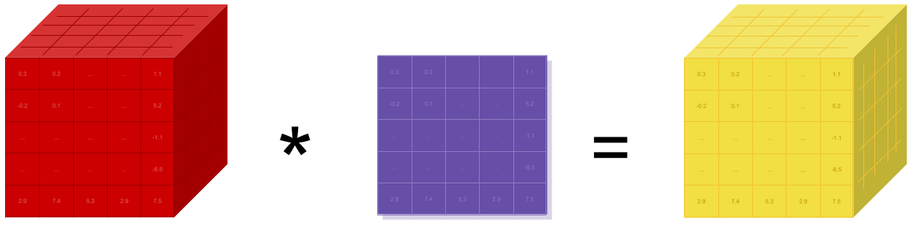

# pytorch [alpha-5]

- [About PyTorch?](#about-pytorch)
- [Installation](#installation)
  - [Binaries](#binaries)
  - [From source](#from-source)
- [Getting Started](#getting-started)
- [Communication](#communication)
- [Timeline](#timeline)
- [pytorch vs torch: important changes](#pytorch-vs-torch-important-changes)

| Python |  **`Linux CPU`**   |  **`Linux GPU`** |
|--------|--------------------|------------------|
| 2.7.8  | [](https://travis-ci.com/apaszke/pytorch) | |
| 2.7    | [](https://travis-ci.com/apaszke/pytorch) | [](https://build.pytorch.org/job/pytorch-master-py2)  |
| 3.3    | [](https://travis-ci.com/apaszke/pytorch) | |
| 3.4    | [](https://travis-ci.com/apaszke/pytorch) | |
| 3.5    | [](https://travis-ci.com/apaszke/pytorch) | [](https://build.pytorch.org/job/pytorch-master-py3)  |
| Nightly| [](https://travis-ci.com/apaszke/pytorch) | |

The project is still under active development and is likely to drastically change in short periods of time.
We will be announcing API changes and important developments via a newsletter, github issues and post a link to the issues on slack.
Please remember that at this stage, this is an invite-only closed alpha, and please don't distribute code further.
This is done so that we can control development tightly and rapidly during the initial phases with feedback from you.

## About PyTorch?

PyTorch is a python package with the goal of providing GPU-optimized Tensor computation and deep learning.
You can reuse your favorite python packages such as numpy, scipy and Cython to extend PyTorch to your own needs,
or use the simple extension API that we provide.

At a granular level, PyTorch is a library that consists of the following components:

| \_                       | \_ |
| ------------------------ | --- |
| torch                    | a Tensor library like NumPy, with strong GPU support |
| torch.autograd           | a tape based automatic differentiation library that supports all differentiable Tensor operations in torch |
| torch.nn                 | a neural networks library deeply integrated with autograd designed for maximum flexibility |
| torch.optim              | an optimization package to be used with torch.nn with standard optimization methods such as SGD, RMSProp, LBFGS, Adam etc. |
| torch.multiprocessing    | python multiprocessing, but with magical memory sharing of torch Tensors across processes. Useful for data loading and hogwild training. |
| torch.utils              | DataLoader, Trainer and other utility functions for convenience |
| torch.legacy(.nn/.optim) | legacy code that has been ported over from torch for backward compatibility reasons |

Usually one uses PyTorch either as:

- A replacement for numpy to use the power of GPUs.
- a deep learning research platform that provides maximum flexibility and speed

Elaborating further:

### A GPU-ready Tensor library

If you use numpy, then you have used Tensors (a.k.a ndarray).



PyTorch provides Tensors that can live either on the CPU or the GPU, and accelerate
compute by a huge amount.

We provide 300+ tensor routines to accelerate and fit your scientific computation needs.  
And they are fast!

### Dynamic Neural Networks: Tape based Autograd

PyTorch has a unique way of building neural networks: using and replaying a tape recorder.

Most frameworks such as `TensorFlow`, `Theano`, `Caffe` and `CNTK` have a static view of the world.
One has to build a neural network, and reuse the same structure again and again.
Changing the way the network behaves means that one has to start from scratch.

With PyTorch, we use a technique called Reverse-mode auto-differentiation, which allows you to
change the way your network behaves arbitrarily with zero lag or overhead. Our inspiration comes
from several research papers on this topic, as well as current and past work such as [autograd](https://github.com/twitter/torch-autograd), [autograd](https://github.com/HIPS/autograd), [Chainer](http://chainer.org), etc.

While this technique is not unique to PyTorch, it's definitely the fastest implementation of it.  
You get the best of speed and flexibility for your crazy research.

### Python first

PyTorch is not a Python binding into a monolothic C++ framework.  
It is built to be deeply integrated into Python.  
You can use it naturally like you would use numpy / scipy / scikit-learn etc.  
You can write your new neural network layers in Python itself, using your favorite libraries
and use packages such as Cython and Numba.  
We dont want to reinvent the wheel, we want to reuse all the wheels that have been built.

### Imperative experiences

PyTorch is designed to be intuitive, linear in thought and easy to use.
When you execute a line of code, it gets executed. There isn't an asynchronous view of the world.
When you drop into a debugger, or receive error messages and stack traces, understanding them is straight-forward, as and easy to understand.
The stack-trace points to exactly where your code was defined.
We hope you never spend hours debugging your code because of bad stack traces or asynchronous and opaque execution engines.

### Fast and Lean

PyTorch is as fast as the fastest deep learning framework out there. We integrate acceleration frameworks such as Intel MKL and NVIDIA (CuDNN, NCCL) for maximum speed. You can use multiple GPUs and machines with maximum efficiency.

The memory usage in PyTorch is extremely efficient. We've written custom memory allocators for the GPU to make sure that your deep learning models are maximally memory efficient. This enables you to train bigger deep learning models than before.

### Extensions without pain

Writing new neural network modules, or interfacing with PyTorch's Tensor API is a breeze, thanks to an easy to use
extension API that is efficient and easy to use. Writing C or Cython functions to add new neural network modules
is straight-forward and painless. At the core, all the value of PyTorch -- it's CPU and GPU Tensor and NeuralNet backends -- are written in simple libraries with a C99 API. They are mature and have been tested for years.

## Installation

### Binaries
- Anaconda
```bash
conda install pytorch -c https://conda.anaconda.org/t/6N-MsQ4WZ7jo/soumith
```

### From source

#### Install optional dependencies

```bash
export CMAKE_PREFIX_PATH=[anaconda root directory]
conda install numpy mkl
conda install -c soumith magma-cuda75# or magma-cuda80
```

#### Install PyTorch
```bash
export MACOSX_DEPLOYMENT_TARGET=10.9 # for OSX
pip install -r requirements.txt
python setup.py install
```

## Getting Started
Three pointers to get you started:
- [Tutorials: notebooks to get you started with understanding and using PyTorch](https://github.com/pytorch/tutorials)
- [Examples: easy to understand pytorch code across all domains](https://github.com/pytorch/examples)
- The API Reference: [http://pytorch.org/api/](http://pytorch.org/api/)

## Communication
* github issues: bug reports, feature requests, install issues, RFCs, thoughts, etc.
* slack: general chat, online discussions, collaboration etc. https://pytorch.slack.com/ . If you need a slack invite, ping me at soumith@pytorch.org
* newsletter: no-noise, one-way email newsletter with important announcements about pytorch. You can sign-up here: http://eepurl.com/cbG0rv

## Timeline

We will run the alpha releases weekly for 6 weeks.
After that, we will reevaluate progress, and if we are ready, we will hit beta-0. If not, we will do another two weeks of alpha.

* ~~alpha-0: Working versions of torch, cutorch, nn, cunn, optim fully unit tested with seamless numpy conversions~~
* ~~alpha-1: Serialization to/from disk with sharing intact. initial release of the new neuralnets package based on a Chainer-like design~~
* ~~alpha-2: sharing tensors across processes for hogwild training or data-loading processes. a rewritten optim package for this new nn.~~
* ~~alpha-3: binary installs, contbuilds, etc.~~
* ~~alpha-4: multi-GPU support, cudnn integration, imagenet / resnet example~~
* alpha-5: a ton of examples across vision, nlp, speech, RL -- this phase might make us rethink parts of the APIs, and hence want to do this in alpha than beta
* alpha-6: Putting a simple and efficient story around multi-machine training. Probably simplistic like torch-distlearn. Building the website, release scripts, more documentation, etc.
* beta-0: First public release

The beta phases will be leaning more towards working with all of you, convering your use-cases, active development on non-core aspects.

## pytorch vs torch: important changes

We've decided that it's time to rewrite/update parts of the old torch API, even if it means losing some of backward compatibility.

**[This tutorial](https://github.com/pytorch/tutorials/blob/master/Introduction%20to%20PyTorch%20for%20former%20Torchies.ipynb) takes you through the biggest changes**
and walks you through PyTorch

For brevity,

#### Tensors:
- clear separation of in-place and out-of-place operations
- zero-indexing
- no camel casing for Tensor functions
- an efficient Numpy bridge (with zero memory copy)
- CUDA tensors have clear and intuitive semantics

#### New neural network module (Combines nn, nngraph, autograd): 

1. Design inspired from Chainer
2. Modules no longer hold state. State is held in the graph
    1. Access state via hooks
	2. Execution engine
	    1. imperative execution engine (default)
		2. lazy execution engine
		   1. allows graph optimizations and automatic in-place / fusing operations
	4. Model structure is defined by its code
	    1. You can use loops and arbitrarily complicated conditional statements

**To reiterate, we recommend that you go through [This tutorial](https://github.com/pytorch/tutorials/blob/master/Introduction%20to%20PyTorch%20for%20former%20Torchies.ipynb)**

### Serialization

Pickling tensors is supported, but requires making a temporary copy of all data in memory and breaks sharing.

For this reason we're providing `torch.load` and `torch.save`, that are free of these problems.

They have the same interfaces as `pickle.load` (file object) and `pickle.dump` (serialized object, file object) respectively.

For now the only requirement is that the file should have a `fileno` method, which returns a file descriptor number (this is already implemented by objects returned by `open`).

Objects are serialized in a tar archive consisting of four files:
- `sys_info` - protocol version, byte order, long size, etc.
- `pickle` - pickled object
- `tensors` - tensor metadata
- `storages` - serialized data

### Multiprocessing with Tensor sharing

We made PyTorch to seamlessly integrate with python multiprocessing.
What we've added specially in torch.multiprocessing is the seamless ability to efficiently share and send
tensors over from one process to another. ([technical details of implementation](http://github.com/pytorch/pytorch/wiki/Multiprocessing-Technical-Notes))
This is very useful for example in:
- Writing parallelized data loaders
- Training models "hogwild", where several models are trained in parallel, sharing the same set of parameters.

Here are a couple of examples for torch.multiprocessing

```python
# loaders.py
# Functions from this file run in the workers

def fill(queue):
  while True:
      tensor = queue.get()
	  tensor.fill_(10)
	  queue.put(tensor)

def fill_pool(tensor):
  tensor.fill_(10)
```

```python
# Example 1: Using multiple persistent processes and a Queue
# process.py

import torch
import torch.multiprocessing as multiprocessing
from loaders import fill

# torch.multiprocessing.Queue automatically moves Tensor data to shared memory
# So the main process and worker share the data
queue = multiprocessing.Queue()
buffers = [torch.Tensor(2, 2) for i in range(4)]
for b in buffers:
  queue.put(b)
  processes = [multiprocessing.Process(target=fill, args=(queue,)).start() for i in range(10)]
```

```python
# Example 2: Using a process pool
# pool.py

import torch
from torch.multiprocessing import Pool
from loaders import fill_pool

tensors = [torch.Tensor(2, 2) for i in range(100)]
pool = Pool(10)
pool.map(fill_pool, tensors)
```
