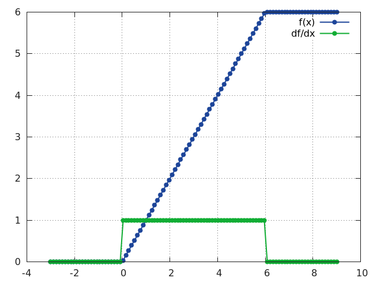
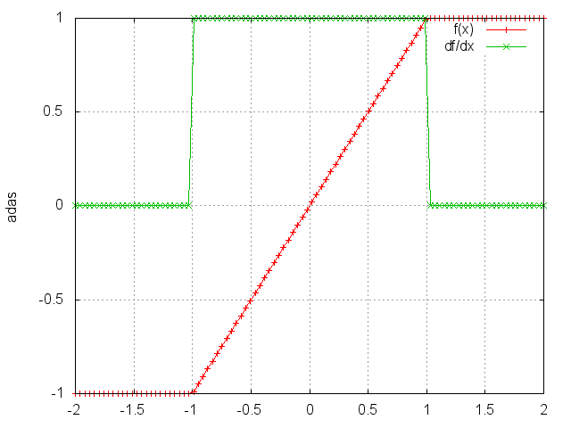
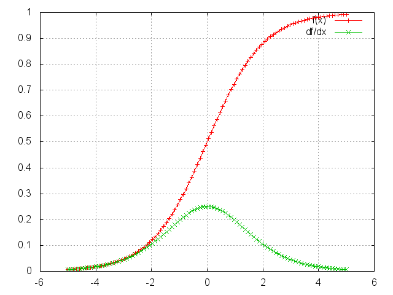
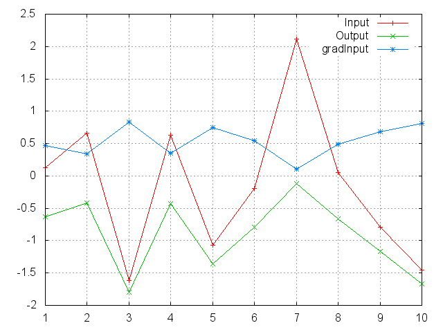
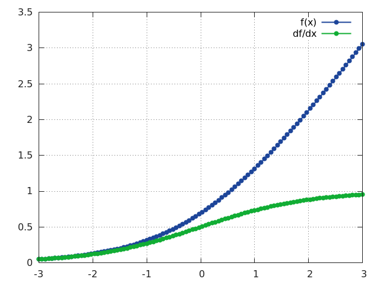
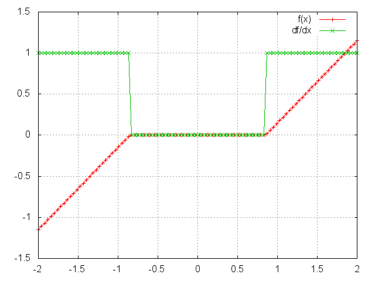
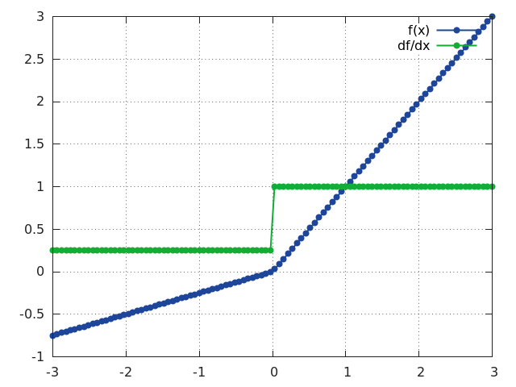
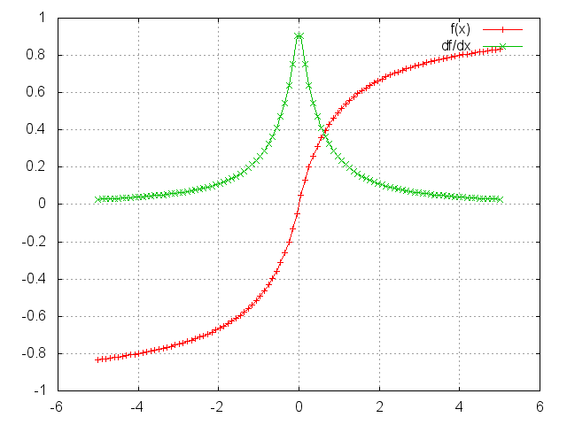
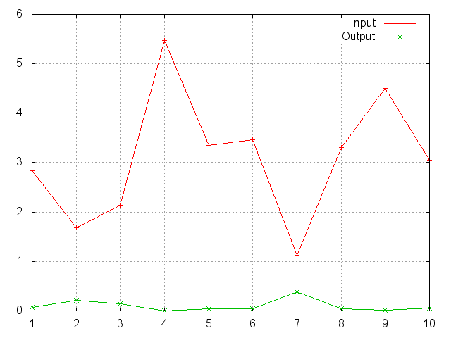
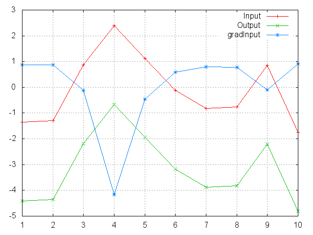

## Non-linearities
### ReLU

Applies the rectified linear unit function element-wise ReLU(x)= max(0,x)

```python
m = nn.ReLU()
input = autograd.Variable(torch.randn(2))
print(input)
print(m(input))
```


#### Constructor Arguments

Parameter | Default | Description
--------- | ------- | -----------
inplace |  | can optionally do the operation in-place

#### Expected Shape
       | Shape | Description 
------ | ----- | ------------
 input | Any  | Tensor of any size and dimension
output | Same  | Output has the same shape as input

#### Returns
    a Tensor of the same dimension and shape as the input


### ReLU6

Applies the element-wise function ReLU6(x) = min( max(0,x), 6)

```python
m = nn.ReLU6()
input = autograd.Variable(torch.randn(2))
print(input)
print(m(input))
```


#### Constructor Arguments

Parameter | Default | Description
--------- | ------- | -----------
inplace |  | can optionally do the operation in-place

#### Expected Shape
       | Shape | Description 
------ | ----- | ------------
 input | Any  | Tensor of any size and dimension
output | Same  | Output has the same shape as input

#### Returns
    a Tensor of the same dimension and shape as the input


### Threshold

Thresholds each element of the input Tensor

```python
m = nn.Threshold(0.1, 20)
input = Variable(torch.randn(2))
print(input)
print(m(input))
```

Threshold is defined as:
     y =  x        if x >= threshold
          value    if x <  threshold

#### Constructor Arguments

Parameter | Default | Description
--------- | ------- | -----------
threshold |  | The value to threshold at
value |  | The value to replace with
inplace |  | can optionally do the operation in-place

#### Expected Shape
       | Shape | Description 
------ | ----- | ------------
 input | Any  | Tensor of any size and dimension
output | Same  | Output has the same shape as input

#### Returns
    Tensor of same dimension and shape as the input
### Hardtanh

Applies the HardTanh function element-wise

```python
m = nn.HardTanh(-2, 2)
input = autograd.Variable(torch.randn(2))
print(input)
print(m(input))
```

HardTanh is defined as:
   f(x) = +1, if x  >  1
   f(x) = -1, if x  < -1
   f(x) =  x,  otherwise
The range of the linear region [-1, 1] can be adjusted

#### Constructor Arguments

Parameter | Default | Description
--------- | ------- | -----------
min_value |  | minimum value of the linear region range
max_value |  | maximum value of the linear region range
inplace |  | can optionally do the operation in-place

#### Expected Shape
       | Shape | Description 
------ | ----- | ------------
 input | Any  | Tensor of any size and dimension
output | Same  | Output has the same shape as input

#### Returns
    a Tensor of the same dimension and shape as the input


### Sigmoid

Applies the element-wise function sigmoid(x) = 1 / ( 1 + exp(-x))

```python
m = nn.Sigmoid()
input = autograd.Variable(torch.randn(2))
print(input)
print(m(input))
```


#### Expected Shape
       | Shape | Description 
------ | ----- | ------------
 input | Any  | Tensor of any size and dimension
output | Same  | Output has the same shape as input

#### Returns
    a Tensor of the same dimension and shape as the input


### Tanh

Applies element-wise, Tanh(x) = (exp(x) - exp(-x)) / (exp(x) + exp(-x))

```python
m = nn.Tanh()
input = autograd.Variable(torch.randn(2))
print(input)
print(m(input))
```


#### Expected Shape
       | Shape | Description 
------ | ----- | ------------
 input | Any  | Tensor of any size and dimension
output | Same  | Output has the same shape as input

#### Returns
    a Tensor of the same dimension and shape as the input


### ELU

Applies element-wise, ELU(x) = max(0,x) + min(0, alpha * (exp(x) - 1))

```python
m = nn.ELU()
input = autograd.Variable(torch.randn(2))
print(input)
print(m(input))
```


#### Constructor Arguments

Parameter | Default | Description
--------- | ------- | -----------
alpha | 1.0 | the alpha value for the ELU formulation.
inplace |  | can optionally do the operation in-place

#### Expected Shape
       | Shape | Description 
------ | ----- | ------------
 input | Any  | Tensor of any size and dimension
output | Same  | Output has the same shape as input

#### Returns
    a Tensor of the same dimension and shape as the input


### LeakyReLU

Applies element-wise, f(x) = max(0, x) + negative_slope * min(0, x)

```python
m = nn.LeakyReLU(0.1)
input = autograd.Variable(torch.randn(2))
print(input)
print(m(input))
```


#### Constructor Arguments

Parameter | Default | Description
--------- | ------- | -----------
negative_slope | 1e-2 | Controls the angle of the negative slope.
inplace |  | can optionally do the operation in-place

#### Expected Shape
       | Shape | Description 
------ | ----- | ------------
 input | Any  | Tensor of any size and dimension
output | Same  | Output has the same shape as input

#### Returns
    a Tensor of the same dimension and shape as the input
### LogSigmoid

Applies element-wise LogSigmoid(x) = log( 1 / (1 + exp(-x_i)))

```python
m = nn.LogSigmoid()
input = autograd.Variable(torch.randn(2))
print(input)
print(m(input))
```


#### Expected Shape
       | Shape | Description 
------ | ----- | ------------
 input | Any  | Tensor of any size and dimension
output | Same  | Output has the same shape as input

#### Returns
    a Tensor of the same dimension and shape as the input


### Softplus

Applies element-wise SoftPlus(x) = 1/beta * log(1 + exp(beta * x_i))

```python
m = nn.Softplus()
input = autograd.Variable(torch.randn(2))
print(input)
print(m(input))
```

SoftPlus is a smooth approximation to the ReLU function and can be used
to constrain the output of a machine to always be positive.
For numerical stability the implementation reverts to the linear function
for inputs above a certain value.

#### Constructor Arguments

Parameter | Default | Description
--------- | ------- | -----------
beta | 1 | the beta value for the Softplus formulation.
threshold | 20 | values above this revert to a linear function.

#### Expected Shape
       | Shape | Description 
------ | ----- | ------------
 input | Any  | Tensor of any size and dimension
output | Same  | Output has the same shape as input

#### Returns
    a Tensor of the same dimension and shape as the input


### Softshrink

Applies the soft shrinkage function elementwise

```python
m = nn.Softshrink()
input = autograd.Variable(torch.randn(2))
print(input)
print(m(input))
```

SoftShrinkage operator is defined as:
    f(x) = x-lambda, if x > lambda >  f(x) = x+lambda, if x < -lambda
    f(x) = 0, otherwise

#### Constructor Arguments

Parameter | Default | Description
--------- | ------- | -----------
lambd | 0.5 | the lambda value for the Softshrink formulation.

#### Expected Shape
       | Shape | Description 
------ | ----- | ------------
 input | Any  | Tensor of any size and dimension
output | Same  | Output has the same shape as input

#### Returns
    a Tensor of the same dimension and shape as the input


### PReLU

Applies element-wise the function PReLU(x) = max(0,x) + a * min(0,x)

```python
m = nn.PReLU()
input = autograd.Variable(torch.randn(2))
print(input)
print(m(input))
```

Here "a" is a learnable parameter.
When called without arguments, nn.PReLU() uses a single parameter "a"
across all input channels. If called with nn.PReLU(nChannels), a separate
"a" is used for each input channel.
Note that weight decay should not be used when learning "a" for good
performance.

#### Constructor Arguments

Parameter | Default | Description
--------- | ------- | -----------
num_parameters | 1 | number of "a" to learn.
init | 0.25 | the initial value of "a".

#### Expected Shape
       | Shape | Description 
------ | ----- | ------------
 input | Any  | Tensor of any size and dimension
output | Same  | Output has the same shape as input

#### Returns
    a Tensor of the same dimension and shape as the input


### Softsign

Applies element-wise, the function Softsign(x) = x / (1 + |x|)

```python
m = nn.Softsign()
input = autograd.Variable(torch.randn(2))
print(input)
print(m(input))
```


#### Expected Shape
       | Shape | Description 
------ | ----- | ------------
 input | Any  | Tensor of any size and dimension
output | Same  | Output has the same shape as input

#### Returns
    a Tensor of the same dimension and shape as the input


### Tanhshrink

Applies element-wise, Tanhshrink(x) = x - Tanh(x)

```python
m = nn.Tanhshrink()
input = autograd.Variable(torch.randn(2))
print(input)
print(m(input))
```


#### Expected Shape
       | Shape | Description 
------ | ----- | ------------
 input | Any  | Tensor of any size and dimension
output | Same  | Output has the same shape as input

#### Returns
    a Tensor of the same dimension and shape as the input
### Softmin

Applies the Softmin function to an n-dimensional input Tensor

```python
m = nn.Softmin()
input = autograd.Variable(torch.randn(2, 3))
print(input)
print(m(input))
```

rescaling them so that the elements of the n-dimensional output Tensor
lie in the range (0,1) and sum to 1
Softmin(x) = exp(-x_i - shift) / sum_j exp(-x_j - shift)
             where shift = max_i - x_i

#### Expected Shape
       | Shape | Description 
------ | ----- | ------------
 input | [ * , * ]  | 2D Tensor of any size
output | Same  | Output has the same shape as input

#### Returns
    a Tensor of the same dimension and shape as the input, with
    values in the range [0, 1]


### Softmax

Applies the Softmax function to an n-dimensional input Tensor

```python
m = nn.Softmax()
input = autograd.Variable(torch.randn(2, 3))
print(input)
print(m(input))
```

rescaling them so that the elements of the n-dimensional output Tensor
lie in the range (0,1) and sum to 1

Softmax is defined as f_i(x) = exp(x_i - shift) / sum_j exp(x_j - shift)
                      where shift = max_i x_i


#### Expected Shape
       | Shape | Description 
------ | ----- | ------------
 input | [ * , * ]  | 2D Tensor of any size
output | Same  | Output has the same shape as input

#### Returns
    a Tensor of the same dimension and shape as the input with
    values in the range [0, 1]


Notes:
    Note that this module doesn't work directly with NLLLoss,
    which expects the Log to be computed between the Softmax and itself.
    Use Logsoftmax instead (it's faster).
### Softmax2d

Applies SoftMax over features to each spatial location

```python
m = nn.Softmax2d()
# you softmax over the 2nd dimension
input = autograd.Variable(torch.randn(2, 3, 12, 13))
print(input)
print(m(input))
```

When given an image of Channels x Height x Width, it will
apply Softmax to each location [Channels, h_i, w_j]


#### Expected Shape
       | Shape | Description 
------ | ----- | ------------
 input | [ * , * , * , * ]  | 4D Tensor of any size
output | Same  | Output has the same shape as input

#### Returns
    a Tensor of the same dimension and shape as the input with
    values in the range [0, 1]
### LogSoftmax

Applies the Log(Softmax(x)) function to an n-dimensional input Tensor.

```python
m = nn.LogSoftmax()
input = autograd.Variable(torch.randn(2, 3))
print(input)
print(m(input))
```

The LogSoftmax formulation can be simplified as
     f_i(x) = log(1 / a * exp(x_i)) where a = sum_j exp(x_j) .

#### Expected Shape
       | Shape | Description 
------ | ----- | ------------
 input | [ * , * ]  | 2D Tensor of any size
output | Same  | Output has the same shape as input

#### Returns
    a Tensor of the same dimension and shape as the input with
    values in the range [-inf, 0)


