# Auto PR Triage

## Overview

Auto PR Triage processes pull requests admitted after the `open source` label
trigger. It classifies each pull request as no action, a close candidate, or
ready for reviewer routing. For routing, deterministic codepath rules identify
owners from changed file paths, while semantic analysis may add configured
ownership areas based on what the change does. The apply job turns the result
into one plan containing the intended outcome, reviewer requests, and labels.

### Intake

Intake decides whether the workflow should take no action on the pull request,
close it, or continue to reviewer routing. It first filters out pull requests
that are no longer in scope or have already received a triage outcome. For the
remainder, author permission, an actionable linked issue, or qualifying
maintainer activity is enough to continue to routing. An active pull request
with none of those signals becomes a close candidate.

| State during analysis | Classification |
| --- | --- |
| Closed, draft, not targeting `main`, or previously handled | No action |
| Open, non-draft, unhandled, and supported by author permission, an actionable linked issue, or qualifying maintainer activity | Route reviewers |
| Open, non-draft, unhandled, with none of those three signals | Close candidate |

These checks are deterministic. Ownership analysis begins only after intake
classifies the pull request for reviewer routing.

### Routing

Routing combines two ownership sources:

- **Codepath ownership:** deterministic rules match owners to changed file
  paths.
- **Semantic ownership:** an LLM compares the change with configured ownership
  descriptions and may add ownership areas that path matching did not capture.

The apply job maps those owners to configured GitHub reviewers, reuses review
coverage that already exists, and logs the resulting plan. Exact owner forms,
reviewer precedence, and rotation behavior are described below.

Shadow and live derive the same plan. Shadow records it with fixed labels and
otherwise leaves the pull request unchanged; live can request reviewers, add
routing labels, comment, or close.

Who sends codepath review requests is a separate rollout choice. The current
deployment mirrors the codepath rules into native CODEOWNERS, so GitHub sends
those requests, and runs Auto PR Triage in shadow mode. An
already-implemented alternative has Auto PR Triage send codepath requests
itself and does not rely on native CODEOWNERS for routing.

## Decision flow at a glance

The following diagram shows the policy decisions and visible outcomes without
the workflow, permission, retry, and validation machinery. It restates the
ownership terms in plain language; the detailed end-to-end architecture below
covers the implementation.



The editable source is
[`auto-pr-triage-overview.mmd`](auto-pr-triage-overview.mmd).

## Workflow at a glance

The intake and routing decisions are implemented by this sequence:

1. **Trigger**

   - **Input:** an `open source` label event for an open, non-draft pull request
     targeting `main`, or the first ready-for-review event after that label is
     applied.
   - **Work:** admit only the first eligible label or ready-for-review event.
     Repeated or ambiguous events stop here.
   - **Output:** one run tied to a repository and pull request.

2. **Analyze job**

   - **Inputs:** the event, checked-in ownership configuration, and current
     pull-request data.
   - **Permissions:** `contents: read`, `issues: read`, `pull-requests: read`,
     and `id-token: write` for a Bedrock invocation session.
   - **Work:** classify intake, resolve codepath ownership, and, when routing is
     needed, run and validate semantic ownership analysis.
   - **Output:** the intake classification, ownership-analysis status, and
     accepted codepath and semantic owners with provenance used only for
     routing logs.

3. **Apply job**

   - **Inputs:** the analysis output, deployment settings, checked-in owner
     rosters, and current reviewer state when needed.
   - **Permissions:** `contents: read`, `issues: read`, and
     `pull-requests: write`. This job has no AWS credentials or Bedrock access.
   - **Work:** validate the analysis, resolve reviewer choices, build and log the
     plan, and apply the selected effect mode.
   - **Output:** the plan, workflow summary, and permitted GitHub actions.

4. **Error-reporting job**

   - **Input:** an unexpected analyze or apply failure, or a missing apply input.
   - **Permissions:** `pull-requests: write` only. It has no checkout, AWS
     credentials, or Bedrock access.
   - **Output:** a best-effort `bot-triage-error` label. This is a failure branch,
     not another decision stage.

Native CODEOWNERS runs independently of these jobs and supplies path-review
requests in the current rollout.

## Goals and non-goals

The design aims to:

- apply a deterministic intake policy;
- preserve codepath ownership as the review baseline while adding semantic
  ownership;
- select configured reviewers while reusing review coverage that already
  exists;
- produce an exact, inspectable plan through the same logic in shadow and live
  modes; and
- run the same code in different repositories using their checked-in
  configuration.

It does not aim to:

- judge whether a pull request is correct, useful, or ready to merge;
- eliminate human triage when ownership is missing or uncertain;
- provide a transactional view of GitHub state or automatically reconcile every
  change that occurs after analysis;
- guarantee perfect semantic assignments or perfectly fair reviewer rotation;
  or
- create required labels or ownership configuration automatically.

## Design principles

- **Separate intake from ownership.** Repository policy determines whether a
  pull request proceeds to routing; ownership analysis determines who should
  review it.
- **Keep ownership additive.** Semantic ownership supplements rather than
  replaces codepath ownership.
- **Analyze once, then apply.** Analyze records pull-request and ownership state;
  apply validates that record and reads reviewer state only when needed. Later
  changes are not automatically reconciled during the run.
- **Leave uncertainty for people.** Missing information cannot authorize an
  automatic close, and incomplete routing is reported for human follow-up.
- **Use one plan for both modes.** Shadow and live calculate and report the same
  plan, then differ only in the effects they permit.

## Detailed design and tradeoffs

### Decision summary

Auto PR Triage records five explicit analysis-time facts: whether the PR is open,
non-draft, and targets `main`; whether a prior triage outcome already handled
it; whether the author has triage-or-higher access; whether the PR closes a
same-repository issue labeled `actionable`; and whether a triage-or-higher
maintainer has qualifying activity. A handled PR skips the LLM. Otherwise,
ownership analysis runs if any of the last three facts is true; if all three are
false, the LLM is skipped and live mode may close the PR on the first workflow
attempt. GitHub's native CODEOWNERS integration supplies the independent
path-review baseline, while the LLM may suggest only additional semantic owners.
The apply job derives the result and selects shadow or live effects.

The workflow is triggered when the `open source` label is applied to a non-draft
pull request targeting `main`, or when a draft carrying that label is first
marked ready for review.
The workflow passes its trusted `${{ github.repository }}` context through both
jobs; the scripts contain no repository-name constant. The prepared ownership
artifacts are bound to that identity, and both jobs use it to scope GitHub calls.

### Deployment mode

The apply job passes its checked-in `AUTO_PR_TRIAGE_MODE` value to
`apply_triage_decision.py --mode`. `pull_request_target` loads that value from
the trusted base revision, and the apply script rejects modes other than `shadow`
and `live`.

Both modes use the same analysis, validation, CODEOWNERS comparison, and
reviewer selection. Both emit a pre-effect JSON plan with the same schema and a
sanitized GitHub step summary with the same format. At the effect boundaries,
`shadow` keeps the PR open and writes only `bot-triage-error`,
`bot-shadow-close`, `bot-shadow-triaged`, or one of the three
`bot-codeowners-shadow-*` labels. It does not comment, request reviewers, add
`owner:` markers or live triage labels, or close the PR. `live` enables those
bounded mutations. Changing the checked-in value from `shadow` to `live` is the
only deployment switch.

The apply job has `issues: read` and `pull-requests: write` in both modes so
cutover remains a one-line change. The mode-aware GitHub client enforces the
shadow write allowlist, but the broader token means code that bypassed that
client would not be stopped by GitHub permissions.

### One-pass execution and accepted stale-result risk

> **Security review note:** Auto PR Triage intentionally does not close races by
> re-reading mutable GitHub state. Analysis reads the PR record, changed-file
> listing, author permission, actionable-issue result, handled-label state, and,
> only for a PR that would otherwise close, maintainer-activity timeline once.
> Apply trusts the resulting normalized record and reads active native
> CODEOWNERS, reviewer, and round-robin inputs once when needed. Because these
> are separate API calls, they can observe different moments. Later changes are
> ignored for that run.

This is a deliberate complexity and availability tradeoff, not a missing
security check. State can change between analysis and apply, so a run can make
a stale but bounded mutation: request a configured reviewer, add configured
labels, or close a PR that became eligible to remain open after analysis. These
effects are accepted because maintainers can remove or replace review requests
and labels, rerun Auto PR Triage, or reopen a PR. The fixed labels and audit
artifacts also make the action visible. Security review should evaluate whether
the mutation set remains sufficiently bounded, rather than expecting
transactional consistency across the two jobs. There is no automatic
convergence or reconciliation mechanism; a rerun is an explicit operator action.
In shadow mode, any stale effect is limited to fixed diagnostic labels.

### Ownership artifacts

Three custom ownership artifacts are loaded from the workflow commit. The
native repository-root `CODEOWNERS` is retained as a fourth, GitHub-consumed
copy of the codepath policy in both modes.

#### Codepath owners

The analyze job reads `.github/auto-pr-triage/codepath_owners.txt` from the
workflow checkout pinned to `github.sha`. It records the file's computed Git
blob hash with that workflow revision.

The repository-root `CODEOWNERS` file remains enabled and byte-for-byte
identical to `codepath_owners.txt`. GitHub therefore continues to make the
baseline review requests. The custom resolver computes the same expected owner
set, but apply does not request those codepath owners itself in either mode.
Preparation, AWS, LLM, result-processing, and apply failures do not suppress
that GitHub-managed baseline.

The standalone resolver applies ordered, last-match-wins path patterns,
including ownerless overrides. For every changed path it records either the
winning owners or why no codepath owner exists. A codepath owner is either a
GitHub handle beginning with `@` or an unprefixed internal owner ID. The
resulting owner set is immutable.

The LLM receives this compact result, not the complete path-policy file. File
references in the trusted result are integer indexes into the untrusted changed
file array, so PR-controlled filenames never become trusted instructions.

"Exact" here refers to resolving the configured codepath-owner policy text. The
native baseline can fail or diverge if CODEOWNERS is missing, invalid, or over
GitHub's size limit; if its checked-in copy differs from
`codepath_owners.txt`; if an owner no longer exists or lacks repository access;
or if GitHub's CODEOWNERS processing is delayed or unavailable. A missing path
match, an ownerless override, a PR whose only matching owner is its author, or a
draft PR can also legitimately produce no native request. Repository
maintainers remain responsible for keeping the policy valid.

Apply compares the custom result with active review requests that GitHub marks
as originating from native CODEOWNERS. It logs both sets plus missing and
unexpected handles, then applies exactly one of:

- `bot-codeowners-shadow-match`
- `bot-codeowners-shadow-mismatch`
- `bot-codeowners-shadow-inconclusive`

The GraphQL comparison is an active-state snapshot. A native request that was
already fulfilled or manually removed can therefore produce a mismatch even if
GitHub originally requested the expected owner. An unavailable or malformed
comparison is inconclusive and does not stop semantic-owner routing.

`bot-shadow-close` and `bot-shadow-triaged` are handled outcomes: a later
analysis run skips the LLM and produces an apply no-op. Remove the outcome
label before a new eligible event to reevaluate the PR. The CODEOWNERS
comparison labels remain additive diagnostics rather than handled state.

The custom codepath policy currently may contain only GitHub handles. Internal
owner IDs remain supported by the parser but are rejected by the checked-in
native-baseline policy test.

#### Additional ownership metadata

`.github/auto-pr-triage/extra_ownership_metadata.json` is a flat mapping from
internal owner IDs to descriptions of the semantic areas that the LLM may
add. It has no schema-version field or outer object wrapper; its first-level
keys are owner IDs such as `autograd`. These descriptions are the only trusted
source of semantic ownership claims.

```json
{
  "autograd": "Owns autograd engine behavior, gradient recording and execution, and Python autograd APIs.",
  "flex_attention": "Owns FlexAttention kernels, score and mask modification behavior, and FlexAttention integration.",
  "nn": "Owns neural-network modules, module behavior, and user-facing torch.nn APIs."
}
```

An additional owner is additive. Its selection never changes the codepath
owners.

#### Owner members and routing labels

`.github/auto-pr-triage/team_members.json` is a flat mapping from every internal
owner ID directly to its ordered reviewer roster. It likewise has no
schema-version field or outer object wrapper. The checked-in configuration test
requires its owner IDs to exactly match the IDs in the additional ownership
metadata.

```json
{
  "autograd": ["@soulitzer", "@izaitsevfb"],
  "flex_attention": ["@drisspg"],
  "nn": ["@izaitsevfb"]
}
```

Routing labels are not configured in either file. Apply derives each one as
`owner: <owner_id>`, such as `owner: autograd`. The derived labels must not
collide with control labels such as `triaged` or `bot-closed`.

The labels are durable round-robin markers. When Auto PR Triage assigns a new
reviewer for an internal owner in live mode, it requests that reviewer first and
then applies the routing label. Later runs find the most recent label event and
the most recent roster-member request preceding it, then advance to the next
eligible member. Removed labels do not count as assignment history; a later
reapplication becomes authoritative again. Shadow mode reads the same state and
selects the reviewer live mode would use, but does not request the reviewer or
add the marker.

| Case | Result |
| --- | --- |
| No owner IDs need resolution | No round-robin API calls or reviewer requests |
| One-handle roster, with or without history | Select the sole eligible handle |
| Two-handle roster with no history | Select the first eligible handle |
| Two-handle roster with history | Select the next eligible handle, wrapping at the end |
| Multiple owner IDs | Rotate each roster independently and deduplicate any shared handle |

Empty rosters are invalid configuration. Tests separately cover zero, one, and
two owner IDs entering routing and one- and two-handle rosters with empty and
populated history.

The analyze job does not load this file or choose people. The apply job reads it
from the trusted workflow checkout when any internal owner ID needs resolution,
then makes one pass over reviewer and round-robin state to choose the exact
reviewers.

For an additional owner, Auto PR Triage does not create another request when a
roster member already has native codepath coverage, a pending request, or a
submitted review. In live mode, a pending roster member receives the routing
marker so a retry can repair a prior request-without-label partial failure.
Codepath coverage and submitted reviews do not advance the marker. Shadow mode
logs the same coverage and selection without requesting a reviewer or adding
the marker.

### Detailed end-to-end architecture

```mermaid
flowchart TB
  EVENT["Trigger<br/>open source labeled on an open, non-draft main PR<br/>or ready-for-review while that label is present"]
  FIRST{"Eligible label application or first ready event<br/>after the latest label application?"}
  EVENT --> FIRST
  FIRST -- No or ambiguous --> EVENT_SKIP["Stop<br/>No analysis or mutation"]

  subgraph ANALYZE["1. Analyze job - GitHub read access and Bedrock access"]
    direction TB
    CHECKOUT["Trusted base checkout at github.sha"]
    POLICY_INPUTS["Trusted analysis policy<br/>worker instructions, codepath_owners.txt,<br/>and extra_ownership_metadata.json"]
    PR_INPUTS["Untrusted PR inputs<br/>title, body, changed paths, bounded patches"]
    GITHUB_INPUTS["One-pass trusted gate facts<br/>open non-draft PR against main, handled-label state,<br/>author permission, same-repository actionable issue,<br/>and maintainer activity when needed"]
    PREPARE["Fetch and validate one current PR snapshot"]
    CURRENT{"Open, non-draft PR<br/>against main?"}
    BUILD["Resolve every path to owners or no-owner<br/>Build the trust-partitioned analysis input"]
    PREPARE_FAIL["Preparation fails unexpectedly<br/>No routing result; apply does not run"]

    HANDLED{"Already handled by triaged, bot-triaged,<br/>bot-triage-error, bot-closed,<br/>bot-shadow-close, or bot-shadow-triaged?"}
    ENTRY{"Author has triage+ access<br/>or PR closes a same-repo actionable issue?"}
    ACTIVITY{"Otherwise, has a triage+ maintainer<br/>already reviewed, commented,<br/>or requested themselves?"}

    LLM["Isolated LLM receives bounded input<br/>Worker policy + resolved codepath matches<br/>+ extra ownership metadata + untrusted PR content<br/><br/>May suggest only configured additional owner IDs;<br/>cannot choose handles, labels, or actions"]
    PROCESS["Result-processing code validates the LLM result<br/>AWS, execution, schema, or validation failure: incomplete<br/>Valid result: completed; discard additions when<br/>patches are incomplete or confidence is low"]
    NORMALIZE["Normalize the five gate facts,<br/>ownership-analysis status,<br/>codepath owners, and additional owners"]

    CHECKOUT --> POLICY_INPUTS
    POLICY_INPUTS --> PREPARE
    PR_INPUTS --> PREPARE
    GITHUB_INPUTS --> PREPARE
    PREPARE -. Fatal validation or API failure .-> PREPARE_FAIL
    PREPARE --> CURRENT
    CURRENT -- No: not_run / no owners --> NORMALIZE
    CURRENT -- Yes --> BUILD --> HANDLED
    HANDLED -- Yes: not_run / no owners --> NORMALIZE
    HANDLED -- No --> ENTRY
    ENTRY -- Yes --> LLM
    ENTRY -- No: inspect bounded maintainer timeline --> ACTIVITY
    ACTIVITY -- No: not_run / no owners --> NORMALIZE
    ACTIVITY -- Yes --> LLM
    LLM --> PROCESS --> NORMALIZE
  end

  FIRST -- Yes --> CHECKOUT

  CONTRACT["2. Strict cross-job contract<br/>is_open_non_draft_pr_against_main<br/>is_already_handled<br/>author_has_triage_permission<br/>has_actionable_linked_issue<br/>has_maintainer_activity<br/>ownership_analysis<br/>has_uncovered_concerns<br/>codepath_owners<br/>additional_owners<br/>analyzed_head_sha<br/>accepted-owner provenance and truncation state<br/><br/>No apply-selected people, actions, or AWS credentials"]
  NATIVE["Independent GitHub baseline<br/>Native CODEOWNERS requests path reviewers"]

  subgraph APPLY["3. Apply job - pull-request write access, no Bedrock access"]
    direction TB
    MODE["Validate checked-in mode<br/>shadow or live"]
    VALIDATE["Validate event-derived scalar formats and<br/>normalized state-machine invariants"]
    CURRENT_RESULT{"Open, non-draft PR<br/>against main?"}
    HANDLED_RESULT{"Already handled?"}
    ELIGIBLE{"Author permission, actionable issue,<br/>or maintainer activity?"}
    NOOP["No-op"]
    ATTEMPT{"Workflow attempt 1?"}
    CLOSE_MODE{"Deployment mode?"}
    SHADOW_CLOSE["Shadow: keep open<br/>Add bot-shadow-close"]
    LIVE_CLOSE["Live: close PR<br/>Add bot-closed and fixed guidance comment"]
    SHADOW["Compare custom codepath owners with<br/>active native CODEOWNERS requests<br/>Choose match, mismatch, or inconclusive label"]
    DESTINATIONS{"Any codepath or<br/>additional owners?"}
    INCOMPLETE_EMPTY["Add bot-triage-error<br/>and CODEOWNERS diagnostic"]
    HANDOFF["Read configured roster and submitted reviews once<br/>Has a non-author roster member already reviewed?"]
    KEEP_OPEN["Keep open<br/>Add only the CODEOWNERS diagnostic"]
    TRIAGE_MODE{"Deployment mode?"}
    SHADOW_TRIAGE["Shadow: add bot-shadow-triaged<br/>+ CODEOWNERS diagnostic"]
    LIVE_TRIAGE["Live: request any new semantic reviewers<br/>Add applicable owner markers, triaged, bot-triaged,<br/>and CODEOWNERS diagnostic"]
    RESOLVE["If additional owners exist<br/>Load team_members.json; read reviewer and<br/>round-robin state once; select and deduplicate handles<br/>Malformed cursor: use a stable pseudorandom fallback<br/>Codepath-only routing skips these reads unless<br/>uncovered concerns require a handoff check"]
    FINAL_STATE{"Analysis incomplete or<br/>additional-owner routing unavailable?"}
    FINAL_INCOMPLETE["Final status: incomplete<br/>bot-triage-error + CODEOWNERS diagnostic"]
    COVERAGE{"All material concerns covered<br/>or configured-reviewer handoff?"}
    PARTIAL_MODE{"Deployment mode?"}
    SHADOW_PARTIAL["Shadow: log reviewer plan<br/>Add only CODEOWNERS diagnostic"]
    LIVE_PARTIAL["Live: request selected reviewers<br/>Add owner markers and CODEOWNERS diagnostic<br/>Leave PR untriaged for human routing"]

    MODE --> VALIDATE --> CURRENT_RESULT
    CURRENT_RESULT -- No --> NOOP
    CURRENT_RESULT -- Yes --> HANDLED_RESULT
    HANDLED_RESULT -- Yes --> NOOP
    HANDLED_RESULT -- No --> ELIGIBLE
    ELIGIBLE -- No --> ATTEMPT
    ATTEMPT -- No, retry --> NOOP
    ATTEMPT -- Yes --> CLOSE_MODE
    CLOSE_MODE -- Shadow --> SHADOW_CLOSE
    CLOSE_MODE -- Live --> LIVE_CLOSE
    ELIGIBLE -- Yes --> SHADOW --> DESTINATIONS
    DESTINATIONS -- No, incomplete --> INCOMPLETE_EMPTY
    DESTINATIONS -- No, completed --> HANDOFF
    HANDOFF -- No --> KEEP_OPEN
    HANDOFF -- Yes --> TRIAGE_MODE
    DESTINATIONS -- Yes --> RESOLVE --> FINAL_STATE
    FINAL_STATE -- Yes --> FINAL_INCOMPLETE
    FINAL_STATE -- No --> COVERAGE
    COVERAGE -- Yes --> TRIAGE_MODE
    COVERAGE -- No --> PARTIAL_MODE
    PARTIAL_MODE -- Shadow --> SHADOW_PARTIAL
    PARTIAL_MODE -- Live --> LIVE_PARTIAL
    TRIAGE_MODE -- Shadow --> SHADOW_TRIAGE
    TRIAGE_MODE -- Live --> LIVE_TRIAGE
  end

  NORMALIZE --> CONTRACT
  CONTRACT --> MODE
  NATIVE --> SHADOW

  ERROR_REPORT["Failure reporter<br/>If analyze or apply fails unexpectedly,<br/>best-effort add bot-triage-error"]
  ANALYZE -. Job failure .-> ERROR_REPORT
  APPLY -. Job failure .-> ERROR_REPORT

  classDef trusted fill:#e8f5e9,stroke:#2e7d32,color:#111;
  classDef untrusted fill:#ffebee,stroke:#c62828,color:#111;
  classDef llm fill:#d1c4e9,stroke:#4527a0,color:#111;
  classDef boundary fill:#e3f2fd,stroke:#1565c0,color:#111;
  class CHECKOUT,POLICY_INPUTS,GITHUB_INPUTS,PREPARE,BUILD,NORMALIZE,MODE,VALIDATE,SHADOW,RESOLVE trusted;
  class PR_INPUTS untrusted;
  class LLM llm;
  class CONTRACT boundary;
```



The green boxes highlight checked-in inputs or workflow logic, the red box
contains attacker-controlled PR data, the purple box is the isolated LLM,
and the blue box is the only data contract between the read-only and
write-capable jobs. Native CODEOWNERS remains outside the LLM and continues
to supply baseline path-review requests in both modes.

For simplicity, the collector still builds its normal trusted ownership inputs
on every branch. An inactive target, an already-handled PR, or an unhandled PR
with no author permission, actionable issue, or maintainer activity skips the
AWS and LLM invocation and discards the collected ownership result.
Qualifying maintainer activity instead enables normal ownership analysis.

#### Collection and trust boundary

The analyze job checks out only `github.sha`, the trusted base-repository commit.
It never checks out or executes the pull request head. The collector fetches the
current PR record and analyzes its latest head as data.

The collector validates the repository and response shape during its one
analysis pass. If the PR was closed, re-drafted, or retargeted before that
snapshot, it records `is_open_non_draft_pr_against_main=false`, skips
changed-file and gate-state collection, and emits a normal no-op result. Apply
validates that result and returns without a GitHub read or write. A new head does
not invalidate the run; the collector analyzes the latest head instead. For an
active target it fetches all changed-file pages below GitHub's 3,000-file
boundary and caps patch text before LLM invocation.
Pagination is part of that one collection pass; analysis does not fetch a second
copy to detect a concurrent edit. A later change to the head, title, body,
destination, author permission, linked issue, maintainer activity, or labels
does not invalidate the already-produced plan. The base branch tip may likewise
advance without invalidating the workflow's anchored policy revision.

Maintainer activity is checked only when the PR would otherwise close. The
collector examines one bounded timeline snapshot for a submitted review, a PR
conversation comment, or a review request where a user requested themselves.
The PR author, bot accounts, and requests made by someone else do not count. A
candidate counts only when GitHub's collaborator-permission endpoint confirms
current `triage`, `write`, `maintain`, or `admin` access.

PR title, body, filenames, and patches remain under `untrusted_pr`. The LLM is
explicitly instructed to treat every string there as attacker controlled. The
trusted ownership mapping contains only owner data and integer references back
to those untrusted files.

Every changed path must occur exactly once in the resolver's codepath-owner
partition: either in a `matched_path_groups` entry whose `owners` produced the
match or in `paths_without_owners`. The worker must consider every changed file,
including files that already have codepath owners and files with no codepath
owner. Each additional-owner suggestion must cite changed files and quote a
small, relevant part of their patches that demonstrates that owner's distinct
review obligation.

#### LLM input and output

The worker receives:

- the immutable codepath owners and their file-index mapping;
- the available additional-owner descriptions;
- the untrusted PR title, body, changed paths, and bounded patches; and
- revision identifiers needed to understand the analyzed change.

It does not receive owner rosters, owner labels, round-robin choices, pending or
submitted reviewers, or any of the five gate facts.

The worker may return only:

- the index of every changed file it analyzed;
- zero or more configured additional owner IDs;
- the distinct concern owned by each owner;
- three or four rationale statements, supporting changed files, and one to
  three relevant diff excerpts;
- material concerns for which no configured owner exists;
- confidence; and
- optional security telemetry.

The structured output stores those suggestions in `additional_owners`; each
entry identifies its configured owner with `owner_id`.

It does not return codepath owners, reviewer handles, labels, or a GitHub action.
There is no PR-body nomination path and no actionable-label-actor reviewer path.

The result-processing code requires the reported file indexes to exactly cover
the changed file array. It also validates that every suggested owner exists, is
not duplicated, and cites only changed files. Each evidence excerpt must be an
exact contiguous sequence of lines from its named file's collected patch, must
include a changed line, and must refer to one of that owner's supporting files.
Uncovered concerns must also cite only changed files. Additional owners are
accepted only when validation succeeds, patches are complete, and confidence is
not low. Any
valid, internally consistent LLM result records
`ownership_analysis=completed`, including one that reports uncovered concerns,
has low confidence, or was produced from truncated or unavailable patches.
These conditions affect which additional owners are retained, not whether the
analysis ran to completion: low confidence and incomplete patches discard all
additional owners, while uncovered concerns can coexist with other valid
additions. Analysis records whether any validated uncovered concern remains so
apply can leave partial coverage untriaged unless a reviewer has already taken
the human handoff.

The process step prints the normalized result, complete LLM recommendation,
rationale, cited files and excerpts, confidence, and validation errors directly
in the workflow log. Every line has a fixed log prefix and JSON escaping, and
both modern `::` and legacy `##[` workflow-command markers are escaped before
printing. The same record remains available as a downloadable artifact for
longer-term auditing.

#### Apply-time reviewer selection

Analysis passes the five explicit gate facts, ownership-analysis status,
immutable codepath owners, accepted additional owners, analyzed head SHA, and
validated provenance for each retained owner across the job boundary. The
provenance records the ownership source and supporting paths; an accepted
semantic owner also carries its validated owned concern, rationale, and diff
evidence. Apply uses this provenance only when logging reviewer choices. It
loads the trusted rosters from its checkout and reads reviewer and rotation
state once, then selects at most one configured member for each internal owner
ID in this order:

1. a non-author roster member represented by an observed native CODEOWNERS
   request;
2. a roster member with a qualifying submitted review;
3. a roster member with a pending review request; or
4. the owner's next round-robin member.

Selections are deduplicated when one person represents multiple owners. The PR
author is never eligible for a new request. Apply records the final choices in
its logs rather than treating a potentially stale analysis-time choice as a
mutation instruction. The plan keeps internal-owner choices keyed by owner; each
records its reviewer, whether coverage was existing or newly selected, and its
provenance. Direct codepath targets that are already active through native
CODEOWNERS, already submitted or pending, or newly planned use the same choice
shape. New selections also record `round_robin_initial`, `round_robin_next`,
`stable_fallback`, or `direct_codepath_owner`. Because one reviewer may
represent several owners, `planned_reviewer_requests` remains the separate
deduplicated list of new requests. Apply emits the CODEOWNERS comparison and
final plan as sanitized, indented JSON, followed by a reviewer-first explanation
that keeps reviewer selection separate from owner reasoning and shows the
supporting paths and excerpts. This free-form text is escaped for workflow logs
and is not written to the step summary.

#### Round-robin availability

Apply validates each label needed for an internal owner assignment. It searches a
bounded repository event history for the latest prior use of that label. When a label
has never been used, the first eligible roster member bootstraps the rotation.
If the bounded event window is exhausted, apply separately queries pull requests
that still carry the dedicated label and recovers the newest label event from
their bounded timelines. An empty result bootstraps the first eligible member.
These state labels must remain on assigned pull requests; removing them can
reset or invalidate the recorded rotation.

When the newest owner-label event is present in its fetched timeline but has no
preceding request for a current roster member, apply chooses a stable
PR-specific pseudorandom fallback from the eligible roster. In live mode,
requesting and labeling that member creates a newer valid marker, so the
rotation repairs itself. Shadow mode only reports the choice. Missing configured
labels, unavailable GitHub APIs, and bounded or otherwise ambiguous history
still disable additional owners for that apply attempt and mark semantic
routing incomplete. Native CODEOWNERS remains responsible for the path baseline.
The gate facts do not depend on round-robin state.

Workflow concurrency is per PR. This avoids GitHub's repository-wide concurrency
behavior, which drops older pending runs, but it means round robin is best effort
across simultaneous PRs: two concurrent PRs can select the same next member
before either writes its label. Shadow mode does not advance the cursor and
therefore cannot measure rotation fairness.

### Normalized analysis result

The read-only job emits one exact JSON record rather than a collection of action
flags:

```json
{
  "is_open_non_draft_pr_against_main": true,
  "is_already_handled": false,
  "author_has_triage_permission": false,
  "has_actionable_linked_issue": true,
  "has_maintainer_activity": false,
  "ownership_analysis": "completed",
  "has_uncovered_concerns": false,
  "codepath_owners": ["@pytorch/nn-maintainers"],
  "additional_owners": ["distributed"],
  "analyzed_head_sha": "0123456789abcdef0123456789abcdef01234567",
  "owner_provenance": {
    "@pytorch/nn-maintainers": {
      "source": "codepath",
      "files": ["torch/nn/modules/linear.py"],
      "total_file_count": 1,
      "llm_justification": null
    },
    "distributed": {
      "source": "semantic",
      "files": ["torch/nn/modules/linear.py"],
      "total_file_count": 1,
      "llm_justification": {
        "owned_concern": "The change affects distributed parameter handling.",
        "rationale": [
          "The changed module participates in distributed execution.",
          "The new behavior changes how parameters are synchronized.",
          "The distributed ownership description covers this contract."
        ],
        "evidence": [
          {
            "file": "torch/nn/modules/linear.py",
            "diff_excerpt": "+        self.weight = Parameter(...)",
            "relevance": "This line changes how the module creates the parameter that distributed execution synchronizes."
          }
        ]
      }
    }
  },
  "owner_provenance_truncated": false
}
```

`is_open_non_draft_pr_against_main` records whether the first live PR snapshot
is open, is not a draft, and targets `main`. A false value skips the LLM and
produces a read-free apply no-op. It does not compare the head with the
triggering event; the latest head is analyzed when the value is true.

`is_already_handled` is true when the analysis-time PR snapshot contains any of
`triaged`, `bot-triaged`, `bot-triage-error`, `bot-closed`,
`bot-shadow-close`, or `bot-shadow-triaged`. The live presence of `open source`
is deliberately not part of this fact; a later removal does not invalidate an
already-triggered run.

Ownership analysis runs exactly when `is_open_non_draft_pr_against_main` is true,
`is_already_handled` is false, and at least one of
`author_has_triage_permission`, `has_actionable_linked_issue`, or
`has_maintainer_activity` is true. Maintainer activity is queried only when the
other two eligibility facts are false and the PR is not already handled. These
five facts are copied unchanged from the trusted analysis input into the
cross-job result.

`ownership_analysis=not_run` means analysis ran but intentionally skipped the
LLM; it carries no routing destinations. A PR that was already a draft in the
triggering event skips the analyze job entirely. A PR that becomes a draft after
the event emits a no-op `TriageInput` and `AnalysisResult`, and apply returns
without mutation.
When ownership analysis runs, its result preserves the codepath owners.
`completed` means a valid, internally consistent LLM analysis finished;
`incomplete` means LLM execution, structured output, schema validation, or
result validation failed. Incomplete results carry codepath owners only.

`additional_owners` can be nonempty only when
`ownership_analysis=completed`. Completed does not imply that an additional
owner exists: low confidence and incomplete patches discard all additions, and
a valid analysis may simply find none. Uncovered concerns can coexist with
other valid additions.

`has_uncovered_concerns=true` means the valid LLM result reported at least one
material concern for which no configured owner exists. The full concern text
remains in the analysis log and artifact; apply needs only this validated fact
to decide whether automated routing is sufficient to mark the PR triaged.

Entries in `codepath_owners` are either GitHub handles beginning with `@` or
unprefixed internal owner IDs. Entries in `additional_owners` are internal owner
IDs selected from `extra_ownership_metadata`.

`analyzed_head_sha` identifies the PR revision used by analysis.
`owner_provenance` normally has one entry for every retained owner. Each entry
records the ownership source, a bounded list of supporting changed paths, and
the total number of supporting paths. Accepted semantic owners also carry their
validated owned concern, rationale, and up to three file-linked diff excerpts.
The controller verifies that every excerpt consists of complete lines occurring
verbatim in the named patch and includes a changed line; this verifies the
quotation, not the LLM's claim about its relevance. Low-confidence,
patch-truncated, or incomplete results do not retain semantic owners or their
provenance. If
provenance would make the cross-job record exceed 64 KB, analysis emits an empty
provenance map and sets `owner_provenance_truncated=true`; the owner arrays and
resulting decision remain unchanged. Apply uses provenance only to explain
planned reviewer choices in logs and emits explicit placeholders when it was
truncated.

Apply derives behavior from that record:

1. `is_open_non_draft_pr_against_main=false` is a read-free no-op.
2. `is_already_handled=true` is a read-free no-op.

The remaining behavior depends on the checked-in mode:

| Analysis result | `shadow` | `live` |
| --- | --- | --- |
| Active and not handled, but all three eligibility facts are false | On attempt one, keep open and add `bot-shadow-close`; reruns are no-ops | On attempt one, close, add `bot-closed`, and post the fixed guidance comment; reruns are no-ops |
| Eligible, completed, with routing destinations and complete concern coverage | Log exact semantic reviewer choices and add `bot-shadow-triaged` | Request newly selected semantic reviewers, add applicable `owner:` markers, and add `triaged` plus `bot-triaged` |
| Eligible, completed, with routing destinations, uncovered concerns, and no submitted-review handoff | Log the reviewer plan without adding `bot-shadow-triaged` | Request newly selected reviewers and add applicable `owner:` markers without adding `triaged` or `bot-triaged` |
| Eligible, completed, with routing destinations, uncovered concerns, and a submitted-review handoff | Log exact reviewer choices and add `bot-shadow-triaged` | Request any remaining selected reviewers, add applicable `owner:` markers, and add `triaged` plus `bot-triaged` |
| Eligible, completed, with no destinations and no submitted-review handoff | Keep open | Keep open |
| Eligible, completed, with no destinations but with a submitted-review handoff | Add `bot-shadow-triaged` | Add `triaged` plus `bot-triaged` |
| Eligible but analysis or reviewer routing is incomplete | Log any safely resolved reviewers and add `bot-triage-error` | Request any safely resolved reviewers, add their applicable `owner:` markers, and add `bot-triage-error` |

Every eligible result also receives the applicable CODEOWNERS diagnostic label.
A mismatch does not repair or block native path routing. Shadow mode never
closes or comments on the PR, requests a reviewer, adds live triage labels, or
writes an `owner:` marker. Live mode does not write `bot-shadow-close` or
`bot-shadow-triaged`.

Apply trusts the five facts instead of querying PR lifecycle state, handled
labels, author permission, actionable issues, or maintainer activity again.
Exact reviewer identities are discovered and validated at apply time, not
serialized by the LLM.

An actionable issue and maintainer activity are gate facts only. Auto PR Triage
does not request the person who applied the issue label. Likewise, explicit
names in the PR body do not authorize reviewer requests.

#### Failure behavior

Preparation failures produce no apply job. Once preparation establishes that
the PR is not an open non-draft PR against `main`, that it is already handled,
or that all three eligibility facts are false, AWS and the LLM are
intentionally skipped. Failure to collect the bounded
maintainer-activity timeline or verify a candidate's permission therefore cannot
authorize a close. Qualifying maintainer activity enables ownership analysis, so
subsequent AWS, LLM, structured-output, or validation failures produce
`ownership_analysis=incomplete`, preserve the codepath owners, and discard
additional owners. Native CODEOWNERS remains responsible for the path baseline;
apply labels these results `bot-triage-error`, including when no codepath owner
was available.

When ownership analysis is eligible, a valid LLM result records
`ownership_analysis=completed` even when patches are truncated or unavailable,
confidence is low, or explicit uncovered concerns remain. Truncated or
unavailable patches and low confidence discard additional owners. Uncovered
concerns retain other valid additional owners. These evidence and coverage
limitations are printed in the analysis log and do not apply
`bot-triage-error`. When owners were found, uncovered concerns instead leave
the PR untriaged unless an eligible configured-roster member has already
submitted a review; any owners that were found are still routed.

If one or more owner IDs has no eligible roster member, apply retains any other
resolved reviewer choices, lists the unresolved owners in the plan, and adds
`bot-triage-error`. Live mode still requests the resolved reviewers and adds
their applicable `owner:` markers. An apply-time failure while resolving
optional semantic owners can instead discard those optional choices and fall
back to the native or direct codepath baseline. The normalized analysis may say
`completed`, but the final routing was not complete.

A separate write-only reporter job also attempts to add `bot-triage-error` when
the analyze or apply job itself fails, or when an admitted analysis unexpectedly
produces no apply input. The reporter has no checkout or AWS credentials and
can only make the fixed label mutation. Its write is best effort: a GitHub
outage or missing label remains visible only in workflow logs.

### Applying a decision

Analysis and mutation run in separate jobs. The analyze job has read-only GitHub
access plus short-lived Bedrock OIDC credentials. The apply job has pull-request
write access but receives no LLM prompt, raw recommendation, or AWS credentials.
It receives validated provenance for accepted owners solely to explain reviewer
choices in logs; owner lists and trusted configuration continue to drive all
effects. Both modes use the same decision path; a shadow-mode flag at the
effect boundaries substitutes fixed shadow labels for closing, commenting,
requesting reviewers, and adding live triage labels. The mode-aware GitHub
client independently rejects any other shadow write. Before applying those
effects, both modes log the same plan schema and write the same sanitized step
summary format.

The apply job is not independently triggerable: it has `needs: analyze` and
accepts only the strict normalized record emitted by the analysis code.
The permission split alone is not the security check; apply validates that
record, derives the action, and binds internal owner IDs to configured reviewer
handles before mutation. It deliberately does not re-fetch mutable PR or gate
state. The LLM itself has no `action`, `mode`, or `close` field in its output
schema.

The cross-job contract contains the five gate facts, ownership-analysis state,
immutable codepath owners, additional owners, analyzed head SHA, validated log
provenance for retained owners, and its truncation state. The GitHub event
supplies the repository, workflow commit, PR number, author login, and run
attempt. When
internal owner IDs or a submitted-review handoff require roster data, apply
reads it directly from the trusted checkout and makes one pass over reviewer and
round-robin state.

#### Triage

GitHub's native CODEOWNERS integration requests path owners in both modes. Auto
PR Triage compares those active native requests with the custom resolver but never
includes custom codepath owners in its reviewer-request payload. A match,
mismatch, or inconclusive result is logged and labeled independently of the
semantic result.

For additional owners, apply resolves each owner ID through the trusted roster,
taking one pass over pending reviews, submitted reviews, and round-robin
history. An ID with no eligible member remains unresolved without discarding
choices made for other IDs. Apply logs both the choices and unresolved IDs.
Shadow mode writes only fixed diagnostic or outcome labels. Live mode requests
only users absent from that read and adds labels without a follow-up
confirmation read. A new or already-pending live assignment receives the
routing label; a rerun can repair an earlier request-without-label partial
failure. A submitted-review handoff adds the result labels selected by the
mode.

All configured status, routing, and diagnostic labels needed by the selected
effect are resolved before the first write. Live semantic reviewer requests
happen before labels. Apply does not read the PR or its control labels and does
not then read the reviewer list or labels again to prove that each write landed.
Adding an already-present label or requesting an already-requested reviewer is
accepted as an idempotent stale-result effect.

#### Close

A close decision is allowed only on workflow attempt one when
`is_open_non_draft_pr_against_main=true`, `is_already_handled=false`, all three
eligibility facts are false, `ownership_analysis=not_run`, and both owner arrays
are empty. Shadow mode logs that decision, adds `bot-shadow-close`, and leaves
the PR open; live mode closes the PR.

Close uses the analysis-time gate facts. Analysis authorizes it only when
the live PR snapshot is open, non-draft, targets the expected repository and
branch, lacks `triaged`, `bot-triaged`, `bot-triage-error`, `bot-closed`,
`bot-shadow-close`, or `bot-shadow-triaged`, has no same-repository closing
reference to an issue then labeled `actionable`, its author does not then have
`triage`, `write`, `maintain`, or `admin` access, and no other user with that
access has already submitted a review, left a PR conversation comment, or
requested themselves for review. The triggering event, not the live PR
snapshot, supplies `open source` authorization. Failure to establish any
required gate fact does not authorize a close.

Codepath-owner matches, additional-owner suggestions, and ordinary pending
review requests do not change the gate facts. Qualifying maintainer activity
does. Apply does not inspect handled labels or activity again, so a label,
comment, review, or self-request added after analysis does not cancel an
already-authorized close. In shadow mode, the stale effect is only the fixed
diagnostic label.

Author permission is fetched once during analysis. `read` access and
`author_association=COLLABORATOR` are not sufficient. A failed or malformed
permission lookup prevents analysis from authorizing the close. The same exact
permission check is applied once to each bounded maintainer-activity candidate.

In live mode, apply sends the close request, then adds `bot-closed` and a fixed
guidance comment without a separate confirmation read. Annotation failure is
reported as a partial mutation; the apply job never performs an automatic
reopen. A PR that should not have been closed because state changed after
analysis can be manually reopened, and Auto PR Triage can be rerun after correcting
the gate condition or labels.

### Security properties

- `pull_request_target` executes only workflow and action code from the trusted
  base commit.
- The PR head is fetched as data and never checked out or executed.
- The LLM has no GitHub token and no file, shell, Web, MCP, plugin, or subagent
  capability. Its Bedrock session has only LLM invocation permission.
- The write-capable job receives one bounded normalized record, validates its
  state-machine invariants and configured identities, and intentionally trusts
  its analysis-time state.
- User-controlled text never becomes a shell argument, API path, label, comment,
  or reviewer identity.
- Reviewer identities come only from trusted configuration, and routing labels
  are deterministically derived from validated owner IDs.
- Validated rationale and diff evidence for accepted semantic owners crosses
  into apply only as log provenance; it does not choose reviewers, labels, or
  effects.
- The validated mode determines the mutation boundary. Shadow accepts only six
  literal diagnostic labels, enforced at the GitHub-client request boundary.
  Live additionally permits configured reviewers, derived owner labels, fixed
  triage labels, and the fixed close/comment path.
- LLM uncertainty cannot affect the close decision. API uncertainty while
  establishing the analysis-time gate facts fails open.

The system does not claim serializable or transactional behavior across
analysis and apply. It accepts time-of-check/time-of-use drift because every
live write is constrained to the triggering PR, configured reviewers,
configured labels, and a fixed close comment; shadow writes are limited to six
fixed labels. The operational remedies are to reopen the PR, adjust labels or
review requests, and rerun the workflow. This accepted staleness is part of the
design and should not be "fixed" by adding uncoordinated race-closing reads back
to apply.

Structural checks cannot prove the LLM's semantic judgment is correct. An LLM
error or prompt injection can still omit a legitimate additional owner or
suggest an unnecessary configured owner, but it cannot affect the close
decision. Shadow mode only reports that handle; live effects remain bounded to
configured reviewers and labels, or the fixed close and guidance-comment
behavior, on that analyzed PR. LLM output cannot select the mode.

### Trigger and repository prerequisites

The workflow handles two `pull_request_target` actions:

- `labeled`, when the newly applied label is `open source` and the PR is open,
  targets `main`, and is not a draft; and
- `ready_for_review`, when that same PR state holds and the PR currently has
  `open source`.

Before checkout or LLM use, it reads the most recent 100 label and
ready-for-review events. A label action is accepted only for the first
`open source` application in that bounded history. A ready action is accepted
only when it is the first ready event after the latest `open source`
application. Truncated, missing, malformed, repeated, or otherwise ambiguous
history skips analysis and therefore cannot obtain Bedrock credentials.

The collector then applies the existing handled-label check. Live outcomes,
`bot-triage-error`, `bot-shadow-close`, and `bot-shadow-triaged` make a later
analysis run a handled no-op. Remove the applicable outcome label before
intentionally reevaluating a PR.

The ready event is normally initiated by the PR author, but it is only a wake-up
signal. The maintainer- or bot-controlled `open source` label grants the bounded
authorization to run. Once the workflow admits that event, later removal of the
label does not turn the run into an already-handled no-op or cancel LLM
invocation. `pull_request_target` still executes the trusted base workflow. The
collector analyzes the latest head, while a PR that is closed, re-drafted, or no
longer targets `main` produces a normal apply no-op rather than a triage error.

The base branch must contain:

- the workflow and composite action;
- a native repository-root `CODEOWNERS` file that remains byte-identical to the
  custom codepath policy while the native baseline is enabled;
- `.github/auto-pr-triage/codepath_owners.txt`;
- `.github/auto-pr-triage/extra_ownership_metadata.json`;
- `.github/auto-pr-triage/team_members.json`;
- `open source`, `actionable`, `triaged`, `bot-triaged`, `bot-triage-error`,
  `bot-closed`, `bot-shadow-close`, and `bot-shadow-triaged` labels;
- `bot-codeowners-shadow-match`, `bot-codeowners-shadow-mismatch`, and
  `bot-codeowners-shadow-inconclusive` labels; and
- every derived `owner: <owner_id>` routing label.

Routing labels are operational state, not documentation-only configuration. They
must be created before enabling internal owner routing. A missing label makes
semantic routing incomplete while native CODEOWNERS continues to provide the
path baseline. Shadow mode never adds the marker; live mode adds it after
selecting or observing a pending roster assignment. Missing routing labels do
not block the independent close path.

`bot-triage-error` and the two shadow outcome labels are already-handled labels.
Re-running after a transient error or intentionally reevaluating a shadow result
therefore requires a maintainer to remove the applicable label first.

The current derived routing labels are:

- `owner: autograd`
- `owner: flex_attention`
- `owner: nn`

The workflow does not create these labels. They must be provisioned separately
before the feature is enabled.

`bot-shadow-close` and `bot-shadow-triaged` are automatic-run latches, not live
triage state. The CODEOWNERS comparison labels are telemetry only. Their
comparison uses GitHub's active `ReviewRequest.asCodeOwner` values, so a request
that was fulfilled or removed before Auto PR Triage ran can appear as a mismatch.
Setting `AUTO_PR_TRIAGE_MODE` to `live` enables the already-tested close,
semantic-reviewer, live-triage-label, and owner-marker paths. Native CODEOWNERS
remains the path-review baseline; replacing it is a separate change.

### Implementation map

- `codepath_owners.py`: standalone codepath-owner parser, resolver, and compact
  artifact builder.
- `ownership.py`: immutable loading and validation of additional-owner metadata
  and owner rosters.
- `github_reviews.py`: active native-CODEOWNERS and submitted-review collection,
  plus label-backed round robin.
- `schemas.py`: trusted/untrusted `TriageInput` and LLM result schema.
- `prepare_llm_input.py`: read-only GitHub collection and bounded prompt
  construction.
- `worker.md`: tool-restricted additive semantic policy.
- `process_llm_output.py`: LLM validation and normalized fact production.
- `apply_triage_decision.py`: action derivation, one-pass reviewer selection,
  and the sole GitHub mutation path.
- `.github/actions/auto-pr-triage/action.yml`: analysis pipeline and failure
  recovery.
- `.github/workflows/auto-pr-triage.yml`: trigger, permissions, and analyze/apply
  separation.
