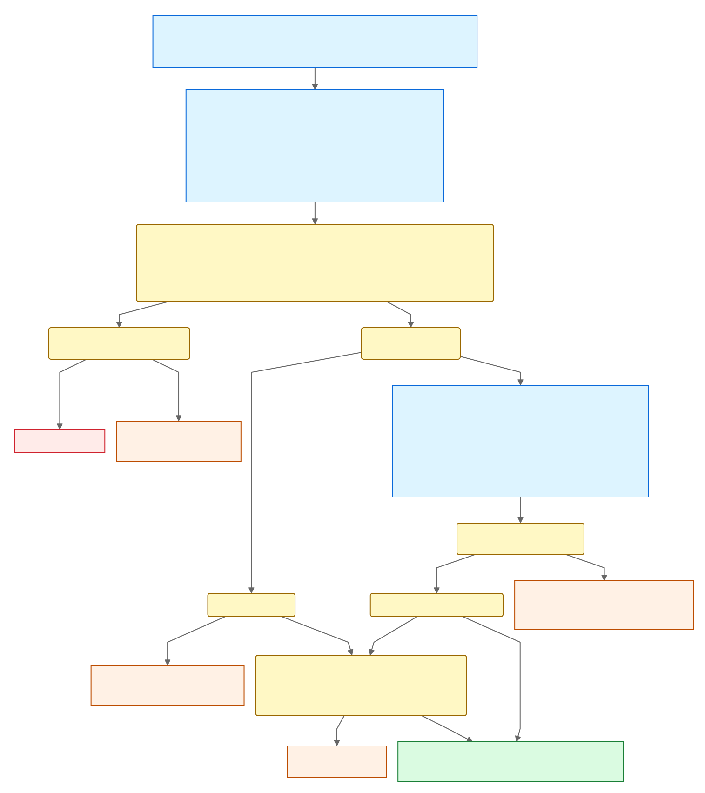

# Auto PR Triage

## Overview

Auto PR Triage processes pull requests admitted after the `open source` label
trigger. It classifies each pull request as no action, a close candidate, or
ready for reviewer routing. For routing, deterministic codepath rules identify
owners from changed file paths, while semantic analysis may add configured
ownership areas based on what the change does. The analyze job turns the result
into one plan containing the intended outcome, reviewer requests, and labels;
in live mode, the apply job executes it.

### Intake

Intake decides whether the workflow should take no action on the pull request,
close it, or continue to reviewer routing. It first filters out pull requests
that are no longer in scope or have already received a triage outcome. For the
remainder, it gathers every signal: author permission, an actionable
same-repository issue that the pull request closes, deliberate activity by a
triage-or-higher maintainer on the pull request or a linked issue, and two
claims in the pull request description. Any one of them is enough to continue
to routing.

The description claims are `Supported by @login`, naming a maintainer
who supports the change, and `Part of #N`, naming a same-repository issue the
change belongs to. Each claim is verified with read-only GitHub calls. A
supporter must have triage-or-higher access and an issue must be labeled
`actionable`. A verified supporter is also requested as a reviewer.

**Bypass intake.** A team can also opt in to pull requests that no intake
signal admits, by describing them in its `bypass_intake_criteria` entry in the ownership
metadata. Ownership analysis runs for every active pull request, so for one
with no intake signal the LLM judges whether the change matches each team's
description. A match routes the pull
request to that team. An active pull request with no signal, no verified claim,
and no bypass match becomes a close candidate.

| State during analysis | Classification |
| --- | --- |
| Closed, draft, not targeting `main`, or previously handled | No action |
| Open, non-draft, unhandled, and supported by author permission, an actionable same-repository closing reference, or qualifying maintainer activity on the pull request | Route reviewers |
| Otherwise, with a verified description claim: a triage-or-higher supporter, or an actionable same-repository issue the change is part of | Route reviewers and request the supporter |
| Otherwise, when ownership analysis finds the change matches a team's `bypass_intake_criteria` | Route reviewers, including that team |
| Open, non-draft, unhandled, with no signal, no verified claim, and no bypass match | Close candidate |
| Open, non-draft, unhandled, with no signal, where the LLM call failed or a bypass claim was discarded | Keep open for a human |

Every intake signal is deterministic. The LLM decides only bypass intake, and a
bypass can prevent a close but never cause one: if the LLM call fails on such a
pull request, it stays open.

### Routing

Routing combines two ownership sources:

- **Codepath ownership:** deterministic rules match owners to changed file
  paths.
- **Semantic ownership:** an LLM compares the change with configured ownership
  descriptions and may add ownership areas that path matching did not capture.

Planning maps those owners to configured GitHub reviewers, reuses review
coverage that already exists, and logs the resulting plan. Exact owner forms,
reviewer precedence, and rotation behavior are described below.

When the LLM reports a material concern that no configured owner covers, the
pull request is marked triaged only if it has a handoff reviewer: a verified
supporter, a triage-or-higher maintainer who applied `actionable` to a linked
or related issue, or a reviewer requested by another triage-or-higher
maintainer, or the reviewer chosen for a team whose `bypass_intake_criteria` matched.
Supporters and issue labelers are requested as reviewers unless they have
already submitted a review or have a pending request, so nobody is pinged twice;
if the reviewer state cannot be read, planning fails rather than risk a repeat
request. The handoff reviewer is trusted to pull in others for the uncovered
concern. Other codepath
and semantic owners are not handoff reviewers, because a path match can come
from an incidental edit; a bypass team explicitly asked for these pull requests. Without a handoff reviewer, the pull request
is left for human triage.

The analyze job derives one exact plan in both modes. Shadow stops there and
writes nothing to GitHub; live runs a separate apply job that executes the plan:
it can request reviewers, add routing labels, comment, or close.

Who sends codepath review requests is a separate rollout choice, set by
`NATIVE_CODEOWNERS_REQUESTS_CODEPATH_OWNERS` in `plan_actions.py`. It is
unrelated to shadow mode. With `True` (the current deployment), the codepath
rules are mirrored into native CODEOWNERS, GitHub sends those requests, and
planning only logs a comparison with them while picking roster reviewers for the
LLM's additional owners. With `False`, an already-implemented alternative, Auto
PR Triage requests direct codepath users and teams itself, picks roster
reviewers for codepath team owner IDs too, and does not rely on native
CODEOWNERS for routing.

## Decision flow at a glance

The following diagram shows the policy decisions and visible outcomes without
the workflow, permission, retry, and validation machinery. It restates the
ownership terms in plain language; the detailed end-to-end architecture below
covers the implementation.



The editable source is
[`auto-pr-triage-overview.mmd`](auto-pr-triage-overview.mmd).

## Workflow at a glance

The intake and routing decisions are implemented by this sequence:

1. **Trigger**

   - **Input:** an `open source` label event for an open, non-draft pull request
     targeting `main`, or the first ready-for-review event after that label is
     applied.
   - **Work:** admit only the first eligible label or ready-for-review event.
     Repeated or ambiguous events stop here.
   - **Output:** one run tied to a repository and pull request.

2. **Analyze job**

   - **Inputs:** the event, checked-in ownership configuration, and current
     pull-request data.
   - **Permissions:** `contents: read`, `issues: read`, `pull-requests: read`,
     and `id-token: write` for a Bedrock invocation session.
   - **Work:** three stages that hand off typed files in one directory:
     1. **Intake** reads the PR once and, for an active, unhandled pull request,
        gathers every gate fact, including the verified description claims.
        Output: `intake.json`.
     2. **Ownership analysis** runs the LLM for every active pull request:
        to add owners when it passes intake, and to judge bypass intake when it
        fails. It resolves codepath owners, builds the trust-partitioned LLM
        input, runs the LLM, and validates its suggestions, including bypass
        claims. Output: `ownership.json`, whose `llm_run_status` is `skipped` for
        an inactive or handled pull request.
     3. **Planning** first reads every live GitHub input the plan can depend
        on (label existence and, when needed, CODEOWNERS, reviewer, and
        round-robin state) into one snapshot and bundles it with the stage
        results as the planner input. A pure function of that input then
        makes the final admission decision (passes intake, or a bypass
        matched), selects reviewers, checks labels, and logs the plan. Output:
        `planner_input.json` and `plan.json`.
   - **Output:** the typed plan of exact GitHub effects as the job output, the
     stage files as artifacts, and a workflow summary.

3. **Apply job (live only)**

   - **Inputs:** the plan and checked-in owner rosters.
   - **Permissions:** `contents: read` and `pull-requests: write`. This job has
     no AWS credentials or Bedrock access.
   - **Work:** check that the plan belongs to this run and that every requested
     reviewer is a direct codepath owner or a roster member, then execute it.
   - **Output:** the planned GitHub actions.

4. **Error-reporting job (live only)**

   - **Input:** an unexpected analyze or apply failure, or a missing apply input.
   - **Permissions:** `pull-requests: write` only. It has no checkout, AWS
     credentials, or Bedrock access.
   - **Output:** a best-effort `bot-triage-error` label. This is a failure branch,
     not another decision stage.

Native CODEOWNERS runs independently of these jobs and supplies path-review
requests in the current rollout.

## Goals and non-goals

The design aims to:

- apply a deterministic intake policy;
- preserve codepath ownership as the review baseline while adding semantic
  ownership;
- select configured reviewers while reusing review coverage that already
  exists;
- produce an exact, inspectable plan in the read-only job, whether or not live
  mode applies it; and
- run the same code in different repositories using their checked-in
  configuration.

It does not aim to:

- judge whether a pull request is correct, useful, or ready to merge;
- eliminate human triage when ownership is missing or uncertain;
- provide a transactional view of GitHub state or automatically reconcile every
  change that occurs after analysis;
- guarantee perfect semantic assignments or perfectly fair reviewer rotation;
  or
- create required labels or ownership configuration automatically.

## Design principles

- **Separate intake from ownership.** Repository policy determines whether a
  pull request proceeds to routing; ownership analysis determines who should
  review it.
- **Keep ownership additive.** Semantic ownership supplements rather than
  replaces codepath ownership.
- **Plan once, then apply.** Analyze reads pull-request, ownership, and reviewer
  state once and plans the exact effects; apply only executes a validated plan.
  Later changes are not automatically reconciled during the run.
- **Leave uncertainty for people.** Missing information cannot authorize an
  automatic close, and incomplete routing is reported for human follow-up.
- **Keep writes out of shadow.** Shadow and live compute the same plan; shadow
  never runs a job that can write to GitHub.

## Detailed design and tradeoffs

### Decision summary

Auto PR Triage records five explicit analysis-time facts: whether the PR is open,
non-draft, and targets `main`; whether a prior triage outcome already handled
it; whether the author has triage-or-higher access; whether an actionable
same-repository issue is linked to the PR; and whether a triage-or-higher
maintainer has qualifying activity on the PR. It also parses and verifies the
`Supported by @login` and `Part of #N` claims in the PR description, producing
two more facts, `has_supporter` and `has_related_actionable_issue`. Every fact
is gathered for an active, unhandled PR, and none is gathered otherwise. Any
admitting fact routes the PR. The LLM runs once for every active PR to suggest
additional owners and judge bypass intake, and a matched bypass routes a PR
without an admitting fact to that team. With no
admitting fact and no bypass match, live mode may close the PR on the first
workflow attempt; a failed analysis or a discarded bypass claim keeps it open. GitHub's native CODEOWNERS integration
supplies the independent path-review baseline, while the LLM may suggest only
additional semantic owners. The analyze job plans the effects, and only live mode
applies them.

The workflow is triggered when the `open source` label is applied to a non-draft
pull request targeting `main`, or when a draft carrying that label is first
marked ready for review.
The workflow passes its trusted `${{ github.repository }}` context through every
job; the scripts contain no repository-name constant. The prepared ownership
artifacts are bound to that identity, and both jobs use it to scope GitHub calls.

### Deployment mode

The workflow-level `AUTO_PR_TRIAGE_MODE` value is checked in, and
`pull_request_target` loads it from the trusted base revision. The analyze job
rejects values other than `shadow` and `live` and publishes the mode as a job
output, because job-level conditions cannot read `env`.

Both modes run the same analyze job, which plans the effects, logs the plan and
reviewer routing, writes a step summary, and uploads the analysis record and
plan. In `shadow`, the apply and error-reporting jobs are skipped, so no job in
the run holds a token that can write to GitHub. `live` runs both. Changing the
checked-in value from `shadow` to `live` is the only deployment switch.

### One-pass execution and accepted stale-result risk

> **Security review note:** Auto PR Triage intentionally does not close races by
> re-reading mutable GitHub state. Analysis reads the PR record, changed-file
> listing, author permission, linked-issue state, handled-label state, the
> bounded PR timeline, and the description claims. Planning then
> reads active native CODEOWNERS, reviewer, and round-robin state when needed.
> Apply executes the plan without further reads. Because these are separate API
> calls, they can observe different moments. Changes after the relevant read are
> ignored for that run.

This is a deliberate complexity and availability tradeoff, not a missing
security check. State can change between analysis and apply, so a run can make
a stale but bounded mutation: request a configured reviewer, add configured
labels, or close a PR that became eligible to remain open after analysis. These
effects are accepted because maintainers can remove or replace review requests
and labels, rerun Auto PR Triage, or reopen a PR. The fixed labels and audit
artifacts also make the action visible. Security review should evaluate whether
the mutation set remains sufficiently bounded, rather than expecting
transactional consistency across the two jobs. There is no automatic
convergence or reconciliation mechanism; a rerun is an explicit operator action.
Shadow mode makes no mutations.

### Ownership artifacts

Three custom ownership artifacts are loaded from the workflow commit. The
native repository-root `CODEOWNERS` is retained as a fourth, GitHub-consumed
copy of the codepath policy in both modes.

#### Codepath owners

The analyze job reads `.github/auto-pr-triage/codepath_owners.txt` from the
workflow checkout pinned to `github.sha`. It records the file's computed Git
blob hash with that workflow revision.

The repository-root `CODEOWNERS` file remains enabled and byte-for-byte
identical to `codepath_owners.txt`. GitHub therefore continues to make the
baseline review requests. The custom resolver computes the same expected owner
set, but the plan never requests those codepath owners itself.
Intake, ownership input, AWS, LLM, validation, planning, and apply failures do not
suppress
that GitHub-managed baseline.

The standalone resolver applies ordered, last-match-wins path patterns,
including ownerless overrides. For every changed path it records either the
winning owners or that no codepath owner exists; no matching rule and an
ownerless override are treated the same. A codepath owner is either a
GitHub handle beginning with `@` or an unprefixed team owner ID. The
resulting owner set is immutable.

The LLM receives this compact result, not the complete path-policy file. File
references in the trusted result are integer indexes into the untrusted changed
file array, so PR-controlled filenames never become trusted instructions.

"Exact" here refers to resolving the configured codepath-owner policy text. The
native baseline can fail or diverge if CODEOWNERS is missing, invalid, or over
GitHub's size limit; if its checked-in copy differs from
`codepath_owners.txt`; if an owner no longer exists or lacks repository access;
or if GitHub's CODEOWNERS processing is delayed or unavailable. A missing path
match, an ownerless override, a PR whose only matching owner is its author, or a
draft PR can also legitimately produce no native request. Repository
maintainers remain responsible for keeping the policy valid.

Planning compares the custom result with active review requests that GitHub
marks as originating from native CODEOWNERS. It logs both sets, missing and
unexpected handles, and a `match`, `mismatch`, or `inconclusive` status. The
comparison is log-only and adds no label.

The GraphQL comparison is an active-state snapshot. A native request that was
already fulfilled or manually removed can therefore produce a mismatch even if
GitHub originally requested the expected owner. An unavailable or malformed
comparison is inconclusive and does not stop semantic-owner routing.

Shadow mode records no handled outcome on the PR, so a later eligible event
analyzes it again. Labels such as `bot-shadow-close` and `bot-shadow-triaged`
left by earlier shadow runs are not handled state.

The custom codepath policy currently may contain only GitHub handles. Team
owner IDs remain supported by the parser but are rejected by the checked-in
native-baseline policy test.

#### Additional ownership metadata

`.github/auto-pr-triage/extra_ownership_metadata.json` maps each team owner
ID to an entry. It has no schema-version field or outer object wrapper; its
first-level keys are team owner IDs such as `autograd`. Each entry has:

- `description` (required): the semantic area the LLM may add the owner for.
  Descriptions are the only trusted source of semantic ownership claims.
- `bypass_intake_criteria` (optional): the team's own description of pull requests it
  wants to review even when no intake signal admits them.

```json
{
  "autograd": {
    "description": "Owns autograd engine behavior, gradient recording and execution, and Python autograd APIs.",
    "bypass_intake_criteria": "Fixes to incorrect gradient formulas for existing operators."
  },
  "nn": {
    "description": "Owns neural-network modules, module behavior, and user-facing torch.nn APIs."
  }
}
```

An additional owner is additive. Its selection never changes the codepath
owners. A bypass match is also an additional owner: the LLM suggests the owner
with the usual verified evidence and adds a separate bypass justification. That
justification quotes the part of the team's `bypass_intake_criteria` the change meets,
explains how the change meets it, and cites its own verified diff excerpts from
the owner's files. A bypass claim for an owner without `bypass_intake_criteria`, or one
whose quote is not in that owner's `bypass_intake_criteria`, fails validation.

#### Owner members and routing labels

`.github/auto-pr-triage/team_members.json` is a flat mapping from every team
owner ID directly to its ordered reviewer roster. It likewise has no
schema-version field or outer object wrapper. The checked-in configuration test
requires its team owner IDs to exactly match the IDs in the additional ownership
metadata.

```json
{
  "autograd": ["@soulitzer", "@izaitsevfb"],
  "flex_attention": ["@drisspg"],
  "nn": ["@izaitsevfb"]
}
```

Routing labels are not configured in either file. Planning derives each one as
`owner: <owner_id>`, such as `owner: autograd`. The derived labels must not
collide with control labels such as `triaged` or `bot-closed`.

The labels are durable round-robin markers. When Auto PR Triage assigns a new
reviewer for a team owner in live mode, it requests that reviewer first and
then applies the routing label. Later runs find the most recent label event and
the most recent roster-member request preceding it, then advance to the next
eligible member. Removed labels do not count as assignment history; a later
reapplication becomes authoritative again. Shadow mode plans the same reviewer
but never requests it or adds the marker.

| Case | Result |
| --- | --- |
| No team owner IDs need resolution | No round-robin API calls or reviewer requests |
| One-handle roster, with or without history | Select the sole eligible handle |
| Two-handle roster with no history | Select the first eligible handle |
| Two-handle roster with history | Select the next eligible handle, wrapping at the end |
| Multiple team owner IDs | Rotate each roster independently and deduplicate any shared handle |

Empty rosters are invalid configuration. Tests separately cover zero, one, and
two team owner IDs entering routing and one- and two-handle rosters with empty and
populated history.

The LLM never sees this file or chooses people. Planning in the analyze job
reads it from the trusted workflow checkout when any team owner ID needs
resolution, then makes one pass over reviewer and round-robin state to choose
the exact reviewers. The live apply job reads it again only to confirm that
every planned reviewer is a roster member or a direct codepath owner.

For an additional owner, Auto PR Triage does not create another request when a
roster member already has native codepath coverage, a pending request, or a
submitted review. In live mode, a pending roster member receives the routing
marker so a retry can repair a prior request-without-label partial failure.
Codepath coverage and submitted reviews do not advance the marker.

### Detailed end-to-end architecture


```mermaid
flowchart TB
  EVENT["Trigger<br/>open source labeled on an open, non-draft main PR<br/>or ready-for-review while that label is present"]
  FIRST{"Eligible label application or first ready event<br/>after the latest label application?"}
  EVENT --> FIRST
  FIRST -- No or ambiguous --> EVENT_SKIP["Stop<br/>No analysis or mutation"]

  subgraph ANALYZE["1. Analyze job - GitHub read access and Bedrock access"]
    direction TB
    CHECKOUT["Trusted base checkout at github.sha"]
    POLICY_INPUTS["Trusted analysis policy<br/>worker instructions, codepath_owners.txt,<br/>and extra_ownership_metadata.json"]
    PR_INPUTS["Untrusted PR inputs<br/>title, body, changed paths, bounded patches"]
    GITHUB_INPUTS["One-pass trusted gate facts<br/>open non-draft PR against main, handled-label state,<br/>author permission, same-repository linked-issue state,<br/>and maintainer activity when needed"]
    INTAKE["Intake: fetch and validate one current PR snapshot"]
    CURRENT{"Open, non-draft PR<br/>against main?"}
    BUILD["Ownership input: fetch changed files,<br/>resolve every path to owners or no-owner,<br/>build the trust-partitioned LLM input"]
    INTAKE_FAIL["Intake fails unexpectedly<br/>No routing result; apply does not run"]

    HANDLED{"Already handled by triaged, bot-triaged,<br/>bot-triage-error, or bot-closed?"}
    GATHER["Gather every fact<br/>author permission, same-repo actionable closing issue,<br/>maintainer activity from bounded timelines,<br/>description claims: Supported by @login and Part of #N<br/>outside comments and code, verified read-only<br/>API failure or timeline overflow: intake fails"]
    ADMITS{"Any admitting fact?"}

    LLM["Isolated LLM receives bounded input<br/>Worker policy + resolved codepath matches<br/>+ extra ownership metadata + untrusted PR content<br/><br/>May suggest only configured additional team owner IDs<br/>and mark which match their bypass_intake_criteria;<br/>cannot choose handles, labels, or actions"]
    VALIDATE_LLM["Ownership result validates the LLM result<br/>AWS, execution, schema, or validation failure: incomplete<br/>Valid result: completed; discard each owner whose<br/>confidence is low or whose files have incomplete patches"]
    STAGE_RESULTS["intake.json: seven gate facts and handoff reviewers<br/>ownership.json: LLM run status, codepath owners<br/>and their files, accepted additional-owner concerns"]

    CHECKOUT --> POLICY_INPUTS
    POLICY_INPUTS --> INTAKE
    PR_INPUTS --> INTAKE
    GITHUB_INPUTS --> INTAKE
    INTAKE -. Fatal validation or API failure .-> INTAKE_FAIL
    INTAKE --> CURRENT
    CURRENT -- No: skipped / no owners --> STAGE_RESULTS
    CURRENT -- Yes --> HANDLED
    HANDLED -- Yes: skipped / no owners --> STAGE_RESULTS
    HANDLED -- No --> GATHER --> ADMITS
    ADMITS -- Yes --> BUILD
    ADMITS -- No: judge bypass --> BUILD
    BUILD --> LLM --> VALIDATE_LLM --> STAGE_RESULTS
  end

  FIRST -- Yes --> CHECKOUT

  NATIVE["Independent GitHub baseline<br/>Native CODEOWNERS requests path reviewers"]

  subgraph PLAN["2. Planning - still in the read-only analyze job"]
    direction TB
    CURRENT_RESULT{"Open, non-draft PR<br/>against main?"}
    HANDLED_RESULT{"Already handled?"}
    ELIGIBLE{"Passes intake, or a team's<br/>bypass_intake_criteria matched?"}
    DOUBT{"LLM run failed, or<br/>a bypass claim was discarded?"}
    DOUBT_OPEN["Plan: keep open<br/>incomplete adds bot-triage-error;<br/>no reviewer requests"]
    SUPPORTER["Plan requests for verified non-author<br/>supporters and actionable-issue labelers"]
    NOOP["Plan: kept_open, no effects"]
    ATTEMPT{"Workflow attempt 1?"}
    CLOSE["Plan: close<br/>bot-closed and fixed guidance comment"]
    COMPARE["Compare custom codepath owners with<br/>active native CODEOWNERS requests<br/>Log match, mismatch, or inconclusive"]
    DESTINATIONS{"Any codepath or<br/>additional owners?"}
    INCOMPLETE_EMPTY["Plan: incomplete<br/>bot-triage-error"]
    HANDOFF_EMPTY{"Any handoff reviewer?"}
    KEEP_OPEN["Plan: kept_open"]
    TRIAGE["Plan: triage<br/>New semantic reviewers, owner markers,<br/>triaged, and bot-triaged"]
    RESOLVE["If additional owners exist<br/>Load team_members.json; read reviewer and<br/>round-robin state once; select and deduplicate handles<br/>Malformed cursor: use a stable pseudorandom fallback<br/>Codepath-only routing skips these reads"]
    FINAL_STATE{"Analysis incomplete or<br/>additional-owner routing unavailable?"}
    FINAL_INCOMPLETE["Plan: incomplete<br/>bot-triage-error"]
    COVERAGE{"All material concerns covered,<br/>or any handoff reviewer?"}
    PARTIAL["Plan: routed_untriaged<br/>Leave PR untriaged for human routing"]

    CURRENT_RESULT -- No --> NOOP
    CURRENT_RESULT -- Yes --> HANDLED_RESULT
    HANDLED_RESULT -- Yes --> NOOP
    HANDLED_RESULT -- No --> ELIGIBLE
    ELIGIBLE -- No --> DOUBT
    DOUBT -- Yes --> DOUBT_OPEN
    DOUBT -- No --> ATTEMPT
    ATTEMPT -- No, retry --> NOOP
    ATTEMPT -- Yes --> CLOSE
    ELIGIBLE -- Yes --> SUPPORTER --> COMPARE --> DESTINATIONS
    DESTINATIONS -- No, incomplete --> INCOMPLETE_EMPTY
    DESTINATIONS -- No, completed --> HANDOFF_EMPTY
    HANDOFF_EMPTY -- No --> KEEP_OPEN
    HANDOFF_EMPTY -- Yes --> TRIAGE
    DESTINATIONS -- Yes --> RESOLVE --> FINAL_STATE
    FINAL_STATE -- Yes --> FINAL_INCOMPLETE
    FINAL_STATE -- No --> COVERAGE
    COVERAGE -- Yes --> TRIAGE
    COVERAGE -- No --> PARTIAL
  end

  CONTRACT["3. Strict cross-job contract: ActionPlan<br/>context: identity, facts, run attempt, owners, bypass intake matches<br/>decision<br/>ordered actions: request_reviewers, add_labels,<br/>close, comment by fixed template<br/><br/>Actions checked against the context;<br/>no provenance, LLM output, or AWS credentials"]
  SHADOW_STOP["Shadow: stop<br/>Plan is in the logs, step summary, and artifacts"]

  subgraph APPLY["4. Apply job - live only, pull-request write access, no Bedrock access"]
    direction TB
    VALIDATE["Validate the plan's identity and invariants<br/>Every reviewer is a roster member<br/>or a direct codepath owner"]
    EXECUTE["Execute the actions in order<br/>After a close, report every failed<br/>annotation instead of stopping"]
    VALIDATE --> EXECUTE
  end

  STAGE_RESULTS --> CURRENT_RESULT
  NATIVE --> COMPARE
  PLAN --> CONTRACT
  CONTRACT -- Shadow --> SHADOW_STOP
  CONTRACT -- Live --> VALIDATE

  ERROR_REPORT["Failure reporter, live only<br/>If analyze or apply fails unexpectedly,<br/>best-effort add bot-triage-error"]
  ANALYZE -. Job failure .-> ERROR_REPORT
  PLAN -. Job failure .-> ERROR_REPORT
  APPLY -. Job failure .-> ERROR_REPORT

  classDef trusted fill:#e8f5e9,stroke:#2e7d32,color:#111;
  classDef untrusted fill:#ffebee,stroke:#c62828,color:#111;
  classDef llm fill:#d1c4e9,stroke:#4527a0,color:#111;
  classDef boundary fill:#e3f2fd,stroke:#1565c0,color:#111;
  class CHECKOUT,POLICY_INPUTS,GITHUB_INPUTS,INTAKE,BUILD,GATHER,STAGE_RESULTS,VALIDATE,COMPARE,RESOLVE trusted;
  class PR_INPUTS untrusted;
  class LLM llm;
  class CONTRACT boundary;
```

The green boxes highlight checked-in inputs or workflow logic, the red box
contains attacker-controlled PR data, the purple box is the isolated LLM,
and the blue box is the only data contract between the read-only and
write-capable jobs. Native CODEOWNERS remains outside the LLM and continues
to supply baseline path-review requests in both modes.

An inactive target or an already-handled PR skips ownership analysis: it skips
codepath resolution, the AWS session, and the LLM, and gets an ownership
result with `llm_run_status=skipped`. Every active PR runs the LLM, including one with no admitting
fact, because the LLM decides bypass intake.

#### Collection and trust boundary

The analyze job checks out only `github.sha`, the trusted base-repository commit.
It never checks out or executes the pull request head. Intake fetches the
current PR record and analyzes its latest head as data.

Intake validates the repository and response shape during its one
analysis pass. If the PR was closed, re-drafted, or retargeted before that
snapshot, it records `is_open_non_draft_pr_against_main=false`, skips
changed-file and gate-state collection, and emits a normal no-op result.
Planning produces a `kept_open` plan with no effects, and live apply performs
no GitHub write. A new head does
not invalidate the run; the latest head is analyzed instead. When the LLM
runs, ownership analysis fetches all changed-file pages below GitHub's 3,000-file
boundary and caps patch text before LLM invocation. It takes the title and body
from assess_intake's snapshot rather than reading the PR again.
Pagination is part of that one collection pass; analysis does not fetch a second
copy to detect a concurrent edit. A later change to the head, title, body,
destination, author permission, linked issue, maintainer activity, or labels
does not invalidate the analysis record. The base branch tip may likewise advance without
invalidating the workflow's anchored policy revision.

Only same-repository closing references establish
`has_actionable_linked_issue`. Any other issue reference admits the PR only
through a verified `Part of #N` description claim, described below. When the PR would
otherwise close, intake checks the PR timeline for maintainer activity.
Linked issue timelines are not checked: maintainers label and comment on most
issues during triage, so that activity would admit any PR that merely mentions
a triaged issue.

Qualifying activity must be a deliberate visible action: a comment, submitted
review, review request, label change, or routing or administrative change such
as assignment, milestone, project, or lifecycle management. Passive events such
as mentions, subscriptions, cross-references, and deployments do not count, nor
does adding or removing the `open source` trigger label. Deployments are
excluded because GitHub attributes them to whoever triggered a workflow run,
including this workflow's own environment-gated job. Bot activity is ignored,
as is the PR author's own activity on the PR; a maintainer author already
qualifies through author permission. Each candidate counts only when GitHub's
collaborator-permission endpoint confirms current `triage`, `write`, `maintain`,
or `admin` access.

PR title, body, filenames, and patches remain under `untrusted_context`. The
LLM is explicitly instructed to treat every string there as attacker
controlled. The trusted ownership mapping contains only owner data and integer
references back to those untrusted files. The PR identity (`identity`) and the
gate facts and handoff reviewers (`facts`) stay in the intake result, which the
LLM never receives.

Every changed path must occur exactly once in the resolver's codepath-owner
partition: either in a `matched_path_groups` entry whose `owners` produced the
match or in `files_without_owners`. The worker must consider every changed file,
including files that already have codepath owners and files with no codepath
owner. Each additional-owner suggestion must cite changed files and quote a
small, relevant part of their patches that demonstrates that owner's distinct
review obligation.

#### Description intake

For every active, unhandled PR, intake parses the PR body for two claims,
modeled on
GitHub's closing keywords: the keyword, an optional colon, and the reference,
anywhere after a word boundary and case-insensitive.

- `Part of #N` or `Part of owner/repo#N` names an issue. Only same-repository
  references count, and at most five distinct issues are checked.
- `Supported by @login` names a maintainer supporting the change. At most three
  distinct logins are checked, and team mentions such as `@org/team` do not
  match.

As with GitHub's own reference linking, text inside HTML comments, fenced code
blocks, and inline code is ignored, so template comments cannot admit a PR.
Each claim is then verified with the workflow token's read access. A supporter
counts when the collaborator-permission endpoint confirms triage-or-higher
access; a 404 counts as unverified, and bot logins are ignored. An issue counts
when it is labeled `actionable`. Claims are gathered even when another fact
already admits the PR, so a verified supporter is requested and counts as a
handoff reviewer either way. Intake logs the claimed and verified values.

#### LLM input and output

The worker receives:

- the immutable codepath owners and their file-index mapping;
- the available additional-owner descriptions and any `bypass_intake_criteria`;
  and
- the untrusted PR title, body, changed paths, and bounded patches.

It does not receive owner rosters, owner labels, round-robin choices, pending or
submitted reviewers, or any of the gate facts.

The worker returns optional security telemetry and every distinct, material
concern it finds. Each concern has a description, its supporting changed files, and one to three verified diff
excerpts, and lands in exactly one of three lists according to who handles it:

- `codepath_owner_concerns`: the existing codepath owners already cover it. The
  entry names those owners and says why they cover it. Nothing is routed; these
  explain why no additional owner is needed.
- `additional_owner_concerns`: a configured additional owner should review it.
  The entry names the owner, gives three or four rationale statements and a
  confidence, and, when the change matches that owner's
  `bypass_intake_criteria`, a bypass justification: a verbatim quote of the
  matched criteria, one to three rationale statements, and one to three diff
  excerpts.
- `uncovered_concerns`: no configured owner fits; the entry says why.

The answer is parsed into the `LLMResult` record (with `Concern`,
`CodepathOwnerConcern`, `AdditionalOwnerConcern`, `UncoveredConcern`,
`Evidence`, and `BypassIntakeMatch`). The JSON Schema the action enforces, `RESULT_SCHEMA`, is
generated from those records and the bounds declared on their fields, so the
schema and the parsing code cannot drift apart. Every object in it is closed and
requires all of its fields.

It does not return codepath owners, labels, or a GitHub action. A verified
`Supported by @login` claim is the only PR-body path to a reviewer request.
The other analysis-time
reviewer identities come from GitHub timelines, not the LLM: the latest actor
who applied `actionable` to an admitting issue, and reviewers requested by
another maintainer.

Validation checks that every additional owner exists and is not duplicated, that every concern cites only changed files, and that a
codepath owner concern names only trusted codepath owners. Each evidence excerpt,
whether for a concern or a bypass justification, must be an exact contiguous
sequence of lines from its named file's collected patch, must include a changed
line, and must cite one of that concern's files. A bypass claim must name an
owner that configured `bypass_intake_criteria`, and its quote must appear
verbatim in that owner's `bypass_intake_criteria` (ignoring whitespace
differences). Any failed check records `llm_run_status=failed`. Any valid, internally consistent
LLM result records `llm_run_status=succeeded`, including one that reports
uncovered concerns, low-confidence owners, or truncated or unavailable patches.
Each suggested owner is then accepted on its own: an owner with low confidence,
or with a supporting file whose patch is truncated or unavailable, is discarded
without affecting the others. A discarded owner's bypass claim is recorded so
planning keeps the PR open instead of closing it. Uncovered concerns can
coexist with valid additions. Analysis records whether any validated uncovered concern remains so
planning can leave the PR for human triage when it has no handoff reviewer.


The validation step prints the ownership result, the complete LLM result,
rationale, cited files and excerpts, confidence, and validation errors directly
in the workflow log. Every line has a fixed log prefix and JSON escaping, and
both modern `::` and legacy `##[` workflow-command markers are escaped before
printing. The same record remains available as a downloadable artifact for
longer-term auditing.

Logs, step summaries, and artifacts are visible to anyone who can read the
repository's Actions runs, which would include the public for a public
repository. They must therefore hold no secrets, and they don't: only PR
content, checked-in configuration, and output from an LLM session with no tools
or credential access. The full Claude transcript (`execution.json`) is uploaded
only when the analysis action fails; normal runs keep only the structured
answer in `result.json`.

#### Plan-time reviewer selection

Planning reads the seven gate facts, handoff reviewers, analyzed head SHA, and
PR author from `intake.json`, and the LLM run status, the codepath owners with
the changed files each matched, and the accepted additional-owner concerns from
`ownership.json`. It rejects an ownership result that does not match intake's
admission decision. Each accepted concern carries its validated description,
rationale, and diff evidence; planning uses the files and concerns only when
logging reviewer choices.
It loads the trusted rosters from the checkout and reads reviewer and rotation
state once, then selects at most one configured member for each team owner
ID in this order:

1. a non-author roster member represented by an observed native CODEOWNERS
   request;
2. a roster member with a qualifying submitted review;
3. a roster member with a pending review request; or
4. the owner's next round-robin member.

Selections are deduplicated when one person represents multiple owners. The PR
author is never eligible for a new request. The logged plan keeps
internal-owner choices keyed by owner; each
records its reviewer, whether coverage was existing or newly selected, and its
provenance. Direct codepath targets that are already active through native
CODEOWNERS, already submitted or pending, or newly planned use the same choice
shape. New selections also record `round_robin_initial`, `round_robin_next`,
`stable_fallback`, or `direct_codepath_owner`. Because one reviewer may
represent several owners, `planned_reviewer_requests` remains the separate
deduplicated list of new requests. Planning emits the CODEOWNERS comparison and
final plan as sanitized, indented JSON, followed by a reviewer-first explanation
that keeps reviewer selection separate from owner reasoning and shows the
supporting paths and excerpts. This free-form text is escaped for workflow logs
and is not written to the step summary.

#### Round-robin availability

Planning validates each label needed for a team owner assignment. It searches a
bounded repository event history for the latest prior use of that label. When a label
has never been used, the first eligible roster member bootstraps the rotation.
If the bounded event window is exhausted, planning separately queries pull requests
that still carry the dedicated label and recovers the newest label event from
their bounded timelines. An empty result bootstraps the first eligible member.
These state labels must remain on assigned pull requests; removing them can
reset or invalidate the recorded rotation.

When the newest owner-label event is present in its fetched timeline but has no
preceding request for a current roster member, planning chooses a stable
PR-specific pseudorandom fallback from the eligible roster. In live mode,
requesting and labeling that member creates a newer valid marker, so the
rotation repairs itself. Missing configured labels, unavailable GitHub APIs, and
bounded or otherwise ambiguous history still disable additional owners for that
run and mark semantic
routing incomplete. Native CODEOWNERS remains responsible for the path baseline.
The gate facts do not depend on round-robin state.

Workflow concurrency is per PR. This avoids GitHub's repository-wide concurrency
behavior, which drops older pending runs, but it means round robin is best effort
across simultaneous PRs: two concurrent PRs can select the same next member
before either writes its label. Shadow mode does not advance the cursor and
therefore cannot measure rotation fairness.

### Stage results

Intake and ownership analysis each write one exact JSON record rather than a
collection of action flags. Planning consumes both inside the analyze job, and
both are uploaded with the run artifacts; neither crosses the job boundary.

Planning also writes `planner_input.json`: the intake and ownership results,
the workflow attempt, and a reviewer snapshot of the planner's live GitHub
reads. The snapshot holds the existing and missing labels, active native
CODEOWNERS requests, pending and submitted reviewers, owner rosters, each needed
owner's round-robin cursor, and the error for any read that failed. A snapshot
field is null when planning did not need it or could not read it. `plan.json` is
a pure function of `planner_input.json`, so any run's plan can be replayed from
that one artifact without GitHub access.

`intake.json` holds the PR identity, the gate facts and handoff reviewers, the PR
author, and the untrusted title and body from assess_intake's one PR snapshot:

```json
{
  "author_login": "contributor",
  "title": "...",
  "body": "...",
  "identity": {
    "repository": "pytorch/pytorch",
    "number": 12345,
    "head_sha": "0123456789abcdef0123456789abcdef01234567",
    "workflow_sha": "89abcdef0123456789abcdef0123456789abcdef"
  },
  "facts": {
    "is_open_non_draft_pr_against_main": true,
    "is_already_handled": false,
    "author_has_triage_permission": false,
    "has_actionable_linked_issue": true,
    "has_maintainer_activity": false,
    "has_supporter": false,
    "has_related_actionable_issue": false,
    "supporters": [],
    "actionable_labelers": ["maintainer"],
    "maintainer_requested_reviewers": []
  }
}
```

`ownership.json` is the ownership stage's full result: the codepath owners and
every concern validation concluded about. Planning reads only part of it.

```json
{
  "llm_run_status": "succeeded",
  "codepath_owners": {
    "@pytorch/nn-maintainers": ["torch/nn/modules/linear.py"]
  },
  "additional_owner_concerns": [
    {
      "owner_id": "distributed",
      "confidence": "high",
      "concern": {
        "description": "The change affects distributed parameter handling.",
        "files": ["torch/nn/modules/linear.py"],
        "evidence": [
          {
            "file": "torch/nn/modules/linear.py",
            "diff_excerpt": "+        self.weight = Parameter(...)",
            "relevance": "This line changes how the module creates the parameter that distributed execution synchronizes."
          }
        ]
      },
      "rationale": [
        "The changed module participates in distributed execution.",
        "The new behavior changes how parameters are synchronized.",
        "The distributed ownership description covers this contract."
      ],
      "bypass_intake_match": null
    }
  ],
  "codepath_owner_concerns": [],
  "discarded_additional_owner_concerns": [],
  "uncovered_concerns": []
}
```

The concern lists are the LLM's validated records, unchanged.
`additional_owner_concerns` holds the accepted additional-owner concerns and
`discarded_additional_owner_concerns` the ones dropped for low confidence or for
citing a file with an incomplete patch. Four facts planning uses are derived
rather than stored: the additional owners (the accepted `owner_id`s), the bypass
intake matches (accepted owners whose concern has a `bypass_intake_match`),
`has_uncovered_concerns` (any uncovered concern), and
`has_discarded_bypass_intake_match` (any discarded concern with a bypass claim).

`is_open_non_draft_pr_against_main` records whether the first live PR snapshot
is open, is not a draft, and targets `main`. A false value skips the LLM and
produces a read-free `kept_open` plan. It does not compare the head with the
triggering event; the latest head is analyzed when the value is true.

`is_already_handled` is true when the analysis-time PR snapshot contains any of
`triaged`, `bot-triaged`, `bot-triage-error`, or `bot-closed`. The live
presence of `open source`
is deliberately not part of this fact; a later removal does not invalidate an
already-triggered run.

The LLM runs exactly when `is_open_non_draft_pr_against_main` is true and
`is_already_handled` is false. The admitting facts
(`author_has_triage_permission`, `has_actionable_linked_issue`,
`has_maintainer_activity`, `has_supporter`, and `has_related_actionable_issue`)
do not gate it: for a PR that fails intake, the LLM judges bypass intake. Every fact is gathered for an active, unhandled PR, so each records what
was actually found rather than depending on the order of checks. A PR with more
than 100 distinct activity candidates fails intake instead of recording "no
activity", so an overflow can never authorize a close.

`has_actionable_linked_issue` covers a same-repository native closing reference.
`has_maintainer_activity` covers qualifying activity on either the PR or any
same-repository issue it links.

`has_supporter` and `has_related_actionable_issue` are derived from verified
description claims. `supporters` lists the verified supporter logins,
without `@` and sorted case-insensitively; `has_supporter` is true exactly when
it is nonempty.

`actionable_labelers` and `maintainer_requested_reviewers` are the other
handoff reviewers, collected only when ownership analysis runs and listed in
the same login form. An actionable labeler is the latest actor who applied
`actionable` to an actionable closing issue or a verified `Part of #N` issue,
so the list is nonempty only when one of those facts is true. A
maintainer-requested reviewer has a pending review request from someone other
than the author or the reviewer; the latest request or removal event for each
user decides. Every handoff reviewer must have triage-or-higher access and
must not be the author or a bot. Each list holds at most three logins.

`llm_run_status=skipped` means the PR was inactive or already handled, so the
LLM never ran; every active PR runs it. A PR that was already a draft in the triggering event skips the analyze job entirely. A PR that becomes a draft after
the event gets an intake result recording that, a skipped ownership result,
and a `kept_open` plan, and live apply makes no mutation.
When the LLM runs, its result preserves the codepath owners.
`succeeded` means a valid, internally consistent LLM result was accepted;
`failed` means LLM execution, structured output, schema validation, or result
validation failed. A failed run carries codepath owners only.

`additional_owner_concerns` can be nonempty only when
`llm_run_status=succeeded`. Succeeded does not imply that an additional
owner exists: each low-confidence owner and each owner citing a file with an
incomplete patch is discarded, and a valid analysis may simply find none.
Uncovered concerns can coexist with other valid additions.

The bypass intake matches are the accepted additional owners whose
`bypass_intake_criteria` the change matches. `has_discarded_bypass_intake_match`
is true when a discarded owner carried a bypass claim; the planner then keeps a
PR that fails intake open instead of closing it. Only a succeeded run carries
concerns.

`has_uncovered_concerns` is true when the valid LLM result reported at least one
material concern for which no configured owner exists. Planning uses only this
fact to decide whether automated routing is sufficient to mark the PR triaged. For a
succeeded run, the analysis step summary, built from `ownership.json`, lists every concern: those the
codepath owners cover and why, each additional owner's concern (accepted or
discarded), and each uncovered concern with why it is uncovered, all with their
evidence files. This LLM text is collapsed to one line and
Markdown-escaped so it renders inertly.

A handoff reviewer is a verified supporter, an actionable labeler, a
maintainer-requested reviewer, or the reviewer chosen for a team whose bypass intake matched. A completed result with no routing destination
is left for human triage unless it has a handoff reviewer, in which case it is
marked triaged. A result with uncovered concerns is marked triaged only when
it has a handoff reviewer, who is trusted to pull in reviewers for the
uncovered concerns. Other codepath and semantic owners, including native
CODEOWNERS requests and roster members already reviewing, do not count: a path
match can come from an incidental edit and says nothing about the uncovered
concern. A team whose bypass intake matched does count, because it asked for
these PRs.
Without a handoff reviewer, the PR is left for human triage.

Keys of `codepath_owners` are either GitHub handles beginning with `@` or
unprefixed team owner IDs. Each accepted concern's `owner_id` is a team
owner ID selected from `extra_ownership_metadata`.

`identity` identifies the analyzed PR revision (`head_sha`) and the trusted
workflow revision (`workflow_sha`). Planning rejects a
result, and apply rejects a plan, whose repository, number, or workflow SHA
differs from its own run.
Each accepted concern carries up to three file-linked diff excerpts. The
validation verifies that every excerpt consists of complete lines occurring
verbatim in the named patch and includes a changed line; this verifies the
quotation, not the LLM's claim about its relevance. Discarded owners and failed
LLM runs keep no concerns. Planning uses the codepath owners' files and the
concerns only to explain planned reviewer choices in logs.

### Action plan

Planning turns the two stage results into one `ActionPlan`, the only analyze
job output that the live apply job consumes. It holds a `context` that only
bounds the plan, a `decision`, and an ordered list of `actions` that apply
executes as written:

```json
{
  "context": {
    "identity": {"repository": "pytorch/pytorch", "number": 12345, "...": "..."},
    "facts": {"is_open_non_draft_pr_against_main": true, "...": "..."},
    "run_attempt": 1,
    "codepath_owners": ["@pytorch/nn-maintainers"],
    "additional_owners": ["distributed"],
    "bypass_intake_matches": []
  },
  "decision": "triage",
  "actions": [
    {"kind": "request_reviewers", "users": ["maintainer"], "teams": [], "reason": "supporter"},
    {"kind": "request_reviewers", "users": ["distributed-reviewer"], "teams": [], "reason": "owner_roster"},
    {"kind": "add_labels", "labels": ["triaged", "bot-triaged", "owner: distributed"]}
  ]
}
```

There are four action kinds:

| `kind` | Fields | Effect |
| --- | --- | --- |
| `request_reviewers` | `users`, `teams`, `reason` | Request those reviewers, who share one reason (below) |
| `add_labels` | `labels` | Add those labels |
| `close` | none | Close the pull request |
| `comment` | `template` | Post the fixed comment with that name; the plan never carries comment text |

A close plan is always exactly `close`, `add_labels` with `bot-closed`, and
`comment` with `bot_closed_guidance`. Any other plan has at most one reviewer
request per reason, in the order below, then at most one `add_labels`. Each
person is requested at most once; someone with several reasons is requested
under the first and shows every reason in the explanation.

| `reason` | Users may only be | Teams |
| --- | --- | --- |
| `supporter` | verified supporters named in the PR description | none |
| `actionable_labeler` | maintainers who labeled a linked or related issue `actionable` | none |
| `codepath_owner` | users the codepath rules name directly | codepath teams in the target organization |
| `owner_roster` | members of a team owner's roster, checked by apply against `team_members.json` | none |

`decision` is one of the following:

| Analysis result | `decision` | Planned effects |
| --- | --- | --- |
| Inactive or already handled | `kept_open` | None |
| Fails intake, and ownership completed with no bypass claim | `close` on attempt one, else `kept_open` | Close, add `bot-closed`, and post the fixed guidance comment |
| Fails intake, and a discarded owner carried the only bypass claim | `kept_open` | None |
| Fails intake, and ownership analysis is incomplete | `incomplete` | Add `bot-triage-error` only |
| Fails intake, and a bypass matched | as for an eligible PR below | The chosen reviewer for each matched team counts as a handoff reviewer |
| Eligible, completed, with routing destinations, and either complete concern coverage or a handoff reviewer | `triage` | Request newly selected semantic reviewers, add applicable `owner:` markers, and add `triaged` plus `bot-triaged` |
| Eligible, completed, with routing destinations, uncovered concerns, and no handoff reviewer | `routed_untriaged` | Request newly selected reviewers and add their `owner:` markers, but neither `triaged` nor `bot-triaged` |
| Eligible, completed, with no destinations and a handoff reviewer | `triage` | Add `triaged` plus `bot-triaged` |
| Eligible, completed, with no destinations and no handoff reviewer | `kept_open` | None |
| Eligible but analysis or reviewer routing is incomplete | `incomplete` | Request any safely resolved reviewers, add their applicable `owner:` markers, and add `bot-triage-error` |

Every eligible plan also requests verified supporters and actionable labelers
other than the author. Maintainer-requested reviewers already have a pending
request, so planning only logs them. A CODEOWNERS mismatch is logged and does
not repair or block native path routing.

The context is there only to bound the actions. The plan's own validation
rejects an unknown decision; any action on an inactive or handled PR; a close for
a PR that passes intake or has a bypass intake match, on a rerun, or with any
sequence other than the fixed one; a `close` or `comment` action outside a close;
actions out of order or repeated; a reviewer request for a PR that neither passes
intake nor has a match; a match that is not an additional owner; a label outside
the decision (status labels only for their decision, `owner:` markers only for
team owners); a user outside their request reason's source; the same person
in two requests; a team outside a `codepath_owner` request or outside the
codepath owners; a foreign codepath team; and more than 15 targets in one
request. The apply job also rejects an `owner_roster` user who is not a member of
the roster of a team owner the plan names.

Planning explains every reviewer, in the job log and in the step summary's
"Why this PR was admitted", "Why this run is incomplete", and "Why each reviewer
was requested" sections. An incomplete plan lists each reason it fell short (the
LLM run failed, the reviewer state was unreadable, an owner had no eligible roster
member, or owner selection failed), which is what a maintainer who sees
`bot-triage-error` needs to finish routing; the plan record carries the same list
as `incomplete_reasons`. The admission line names each true intake fact, or the team whose bypass intake
matched with its criteria quote and rationale. Each reviewer then lists every
reason: a verified supporter, an actionable labeler, a maintainer's existing
request, a direct codepath owner and the files it matched, or a roster pick with
its round-robin history (who was assigned last, and on which PR) and, for a
semantic owner, the validated concern, evidence, and any bypass claim. Existing
reviewers who already cover an owner appear too, marked "no new request". The
step summary shows reviewers as `` `login` `` rather than `@login`, so pasting it
never pings anyone.

Planning trusts the seven facts instead of querying PR lifecycle state, handled
labels, author permission, actionable issues, maintainer activity, or supporter
permission again. Owner reviewer identities are discovered and validated at
planning time, not serialized by the LLM; supporters and actionable labelers are
the only analysis-time reviewer identities. A name in
the PR body authorizes a reviewer request only as a verified
`Supported by @login` claim.

#### Failure behavior

Intake failures produce no plan and no apply job. Once intake establishes that
the PR is not an open non-draft PR against `main` or that it is already handled,
AWS and the LLM are intentionally skipped. Failure to collect the bounded
maintainer-activity timelines or verify a candidate's permission therefore
cannot authorize a close. The same holds for description intake: a supporter
404 counts as unverified, but any other failure while verifying a claim fails
intake. For an active PR, subsequent AWS, LLM, structured-output, or validation failures produce
`llm_run_status=failed`, preserve the codepath owners, and discard
additional owners. Native CODEOWNERS remains responsible for the path baseline;
the plan labels these results `bot-triage-error`, including when no codepath
owner was available.

When ownership analysis runs, a valid LLM result records
`llm_run_status=succeeded` even when patches are truncated or unavailable,
some owners have low confidence, or explicit uncovered concerns remain. Each
low-confidence owner, and each owner citing a file whose patch is truncated or
unavailable, is discarded; the other owners are kept. Uncovered concerns retain
other valid additional owners. For a PR that fails intake, an incomplete
analysis keeps the PR open with `bot-triage-error`, and a discarded bypass claim
keeps it open without routing: doubt about a bypass never closes a PR. These evidence and coverage
limitations are printed in the analysis log and do not apply
`bot-triage-error`. When owners were found, uncovered concerns leave the PR for
human triage only if there is no handoff reviewer.

If one or more team owner IDs has no eligible roster member, planning retains any
other resolved reviewer choices, lists the unresolved owners in the logged plan,
and adds `bot-triage-error`. The plan still requests the resolved reviewers and
adds their applicable `owner:` markers. A planning-time failure while resolving
optional semantic owners can instead discard those optional choices and fall
back to the native or direct codepath baseline. The ownership result may say
`llm_run_status=succeeded`, but the final routing was not complete.

In live mode, a separate write-only reporter job also attempts to add
`bot-triage-error` when the analyze or apply job itself fails, or when an
admitted analysis unexpectedly produces no plan. Shadow mode skips the reporter;
a failure there is visible only as a failed workflow run and its artifacts. The reporter has no checkout or AWS credentials and
can only make the fixed label mutation. Its write is best effort: a GitHub
outage or missing label remains visible only in workflow logs.

### Applying a decision

Planning and mutation run in separate jobs. The analyze job has read-only GitHub
access plus short-lived Bedrock OIDC credentials, which only the LLM step
receives. It plans every effect and logs the plan and a sanitized step summary.
The live apply job has pull-request write access but receives no LLM prompt, raw
LLM result, provenance, or AWS credentials; it receives only the plan.

The apply job is not independently triggerable: it has `needs: analyze` and
accepts only a strict `ActionPlan`. The permission split alone is not the
security check; the plan validates its own effects against the facts and owners
it carries, and apply checks that every reviewer belongs to a relevant roster or
is a direct codepath owner before mutation. Apply deliberately does not re-fetch
PR lifecycle, gate, or reviewer state. The LLM itself has no `action`, `mode`,
or `close` field in its output schema.

The GitHub event supplies the repository, workflow commit, PR number, author
login, and run attempt. When team owner IDs require roster data, planning
reads it directly from the trusted checkout and makes one pass over reviewer and
round-robin state.

#### Triage

GitHub's native CODEOWNERS integration requests path owners in both modes. Auto
PR Triage compares those active native requests with the custom resolver but never
includes custom codepath owners in its reviewer-request payload. A match,
mismatch, or inconclusive result is logged independently of the semantic result.

For additional owners, planning resolves each team owner ID through the trusted
roster, taking one pass over pending reviews, submitted reviews, and round-robin
history. An ID with no eligible member remains unresolved without discarding
choices made for other IDs. Planning logs both the choices and unresolved IDs.
The plan requests only users absent from that read, and live apply adds labels
without a follow-up confirmation read. A new or already-pending live assignment receives the
routing label; a rerun can repair an earlier request-without-label partial
failure.

Planning resolves every configured status and routing label the plan needs, so
a missing label fails before apply runs. Live semantic reviewer requests happen
before labels. Apply does not read the PR or its control labels and does not
then read the reviewer list or labels again to prove that each write landed.
Adding an already-present label or requesting an already-requested reviewer is
accepted as an idempotent stale-result effect.

#### Close

A close decision is allowed only on workflow attempt one when
`is_open_non_draft_pr_against_main=true`, `is_already_handled=false`, every
eligibility fact is false, `llm_run_status=succeeded`, no bypass matched, and no
bypass claim was discarded. A failed LLM run keeps the PR open with
`bot-triage-error` instead. Shadow mode only logs the `close` plan; live mode closes the PR.

Closing is limited to attempt one because a close is justified only as the
immediate response to the entry event. A rerun is a later, manual action, often
after a failure, so it may still route or triage the PR but never produces the
one effect that is visible to the contributor and hard to undo. In live mode a
rerun usually finds the PR already handled anyway: a success leaves `triaged`,
`bot-triaged`, or `bot-closed`, and a failure leaves `bot-triage-error`.

The plan records its workflow attempt, and apply rejects a plan from any other
attempt. Rerunning only the apply job would otherwise reuse an earlier attempt's
plan, which can be up to GitHub's rerun window old; rerunning all jobs plans
afresh.

Close uses the analysis-time gate facts. Analysis authorizes it only when
the live PR snapshot is open, non-draft, targets the expected repository and
branch, lacks `triaged`, `bot-triaged`, `bot-triage-error`, or `bot-closed`,
has no linked same-repository issue
then labeled `actionable`, its author does not then have `triage`, `write`,
`maintain`, or `admin` access, and no other user with that access has qualifying
activity on the PR. It also requires that no description claim names a
triage-or-higher supporter or an actionable same-repository issue.
The triggering event, not the live PR snapshot, supplies `open source`
authorization. Failure to establish any
required gate fact does not authorize a close.

Codepath-owner matches, additional-owner suggestions, and ordinary pending
review requests do not change the gate facts. Qualifying maintainer activity
does. Apply does not inspect handled labels or activity again, so qualifying
activity added after analysis does not cancel an already-authorized close.

Author permission is fetched once during analysis. `read` access and
`author_association=COLLABORATOR` are not sufficient. A failed or malformed
permission lookup prevents analysis from authorizing the close. The same exact
permission check is applied to each bounded maintainer-activity candidate.

In live mode, apply sends the close request, then adds `bot-closed` and a fixed
guidance comment without a separate confirmation read. Annotation failure is
reported as a partial mutation; the apply job never performs an automatic
reopen. A PR that should not have been closed because state changed after
analysis can be manually reopened, and Auto PR Triage can be rerun after correcting
the gate condition or labels.

### Security properties

- `pull_request_target` executes only workflow and action code from the trusted
  base commit.
- The PR head is fetched as data and never checked out or executed.
- The LLM has no GitHub token and no file, shell, Web, MCP, plugin, or subagent
  capability. Its Bedrock session has only LLM invocation permission.
- The write-capable job runs only in live mode. It receives one bounded
  `ActionPlan`, validates its invariants and reviewer identities, and
  intentionally trusts its analysis-time state.
- User-controlled text never becomes a shell argument, label, or comment.
  Issue numbers and logins parsed from the PR body reach read-only API paths
  and the supporter request only after pattern validation.
- New reviewer-request identities come from trusted configuration, from a
  supporter claim, or from the actor who applied `actionable` to an admitting
  issue; the last two must have current triage-or-higher permission. Routing
  labels are deterministically derived from validated team owner IDs.
- Validated rationale and diff evidence for accepted semantic owners stays in
  the analyze job as log provenance; it does not choose reviewers, labels, or
  effects, and it does not reach the write-capable job.
- The checked-in mode determines whether any write-capable job runs. Shadow
  runs none, so the read-only token bounds it. Live permits configured
  reviewers, derived owner labels, fixed triage labels, and the fixed
  close/comment path.
- LLM output can prevent a close, through a bypass match, but can never cause
  one. A bypass claim is only as reliable as the LLM's judgment: a prompt
  injection in the PR text can keep a PR open and route it to a team that
  configured `bypass_intake_criteria`, bounded to that team's configured reviewers and
  labels. Bypass claims need the same verified diff evidence as any other
  owner, and only teams that opt in are exposed. API uncertainty while
  establishing the analysis-time gate facts, including description claims,
  fails open.

The system does not claim serializable or transactional behavior across
analysis and apply. It accepts time-of-check/time-of-use drift because every
live write is constrained to the triggering PR, configured reviewers,
configured labels, and a fixed close comment; shadow makes no writes. The
operational remedies are to reopen the PR, adjust labels or
review requests, and rerun the workflow. This accepted staleness is part of the
design and should not be "fixed" by adding uncoordinated race-closing reads to
apply.

Structural checks cannot prove the LLM's semantic judgment is correct. An LLM
error or prompt injection can still omit a legitimate additional owner or
suggest an unnecessary configured owner. Live effects remain bounded to
configured reviewers and labels, or the fixed close and guidance-comment
behavior, on that analyzed PR. LLM output cannot select the mode.

### Trigger and repository prerequisites

The workflow handles two `pull_request_target` actions:

- `labeled`, when the newly applied label is `open source` and the PR is open,
  targets `main`, and is not a draft; and
- `ready_for_review`, when that same PR state holds and the PR currently has
  `open source`.

Before checkout or LLM use, it reads the most recent 100 label and
ready-for-review events. A label action is accepted only for the first
`open source` application in that bounded history. A ready action is accepted
only when it is the first ready event after the latest `open source`
application. Truncated, missing, malformed, repeated, or otherwise ambiguous
history skips analysis and therefore cannot obtain Bedrock credentials.

Later issue or pull-request activity does not trigger another run. An operator
must rerun the workflow to reevaluate it, removing an applicable handled-outcome
label first when necessary.

Intake then applies the existing handled-label check. Live outcomes and
`bot-triage-error` make a later analysis run a handled no-op. Remove the
applicable outcome label before intentionally reevaluating a PR. Shadow runs
leave no outcome label.

The ready event is normally initiated by the PR author, but it is only a wake-up
signal. The maintainer- or bot-controlled `open source` label grants the bounded
authorization to run. Once the workflow admits that event, later removal of the
label does not turn the run into an already-handled no-op or cancel LLM
invocation. `pull_request_target` still executes the trusted base workflow.
Analysis uses the latest head, while a PR that is closed, re-drafted, or no
longer targets `main` produces a normal `kept_open` plan rather than a triage
error.

The base branch must contain:

- the workflow and composite action;
- a native repository-root `CODEOWNERS` file that remains byte-identical to the
  custom codepath policy while the native baseline is enabled;
- `.github/auto-pr-triage/codepath_owners.txt`;
- `.github/auto-pr-triage/extra_ownership_metadata.json`;
- `.github/auto-pr-triage/team_members.json`;
- `open source`, `actionable`, `triaged`, `bot-triaged`, `bot-triage-error`,
  and `bot-closed` labels; and
- every derived `owner: <owner_id>` routing label.

Routing labels are operational state, not documentation-only configuration. They
must be created before enabling team owner routing. A missing label makes
semantic routing incomplete while native CODEOWNERS continues to provide the
path baseline. Live mode adds the marker after selecting or observing a pending
roster assignment. Missing routing labels do
not block the independent close path.

`bot-triage-error` is an already-handled label. Re-running after a transient
error therefore requires a maintainer to remove it first.

The current derived routing labels are:

- `owner: autograd`
- `owner: flex_attention`
- `owner: nn`

The workflow does not create these labels. They must be provisioned separately
before the feature is enabled.

The CODEOWNERS comparison is log-only telemetry. It uses GitHub's active
`ReviewRequest.asCodeOwner` values, so a request that was fulfilled or removed
before Auto PR Triage ran can appear as a mismatch. Setting
`AUTO_PR_TRIAGE_MODE` to `live` runs the apply job, which executes the planned
close, semantic-reviewer, triage-label, and owner-marker effects. Native CODEOWNERS
remains the path-review baseline; replacing it is a separate change.

### Implementation map

- `identifiers.py`: identifier formats (user handles, team owner IDs, codepath
  owners), the derived `owner:` label, and the target base branch.
- `codepath_owners.py`: standalone codepath-owner parser, resolver, and compact
  artifact builder, with a CLI for checking a rule change by hand.
- `trusted_config.py`: one safe reader for the checked-in configuration (inside
  the checkout, no symlinks, size-bounded) and a loader plus validator for each
  file: codepath rules, additional-owner metadata, and owner rosters.
- `schemas.py`: typed records for every boundary: `IntakeResult`, the
  trusted/untrusted `LLMInput` (exactly the LLM's prompt input), the LLM's
  answer `LLMResult` (from which `RESULT_SCHEMA` is generated),
  `OwnershipResult`, and `ActionPlan`.
- `github_api.py`: the read-only `gh` client and the shared paginated PR
  timeline reader.
- `assess_intake.py` (stage 1): PR snapshot, gate facts, description-claim
  parsing and verification, and handoff reviewers.
- `build_ownership_input.py` (stage 2a): changed files and patch bounds,
  codepath resolution, and the trust-partitioned, byte-bounded prompt.
- `worker.md` (stage 2b): tool-restricted additive semantic policy.
- `validate_ownership.py` (stage 2c): validates the LLM output and builds the
  ownership result.
- `reviewer_state.py`: active native-CODEOWNERS, pending, and submitted
  reviewer reads, round-robin cursor reads, and the pure next-member choice.
- `plan_actions.py` (stage 3): the reviewer snapshot read, then pure decision
  derivation, CODEOWNERS comparison, reviewer selection, label checks, and plan
  logging.
- `apply_actions.py`: live-only plan validation and the sole GitHub mutation
  path.
- `tests/`: one test module per stage and library module. Run them from
  `scripts/auto_pr_triage` with `python -m unittest discover -s tests -t .`.
- `.github/actions/auto-pr-triage/action.yml`: one step per analysis stage and
  the failure manifest.
- `.github/workflows/auto-pr-triage.yml`: trigger, deployment mode,
  permissions, and analyze/apply separation.
