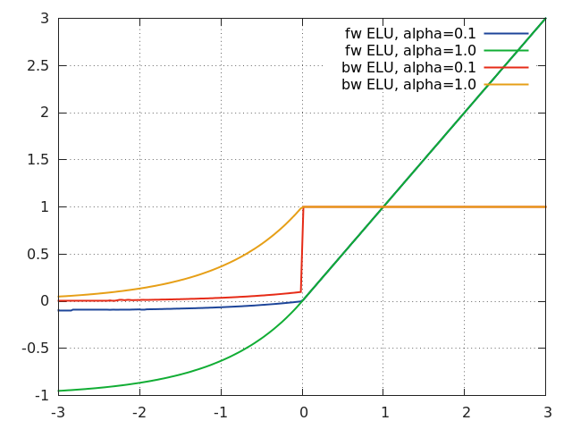
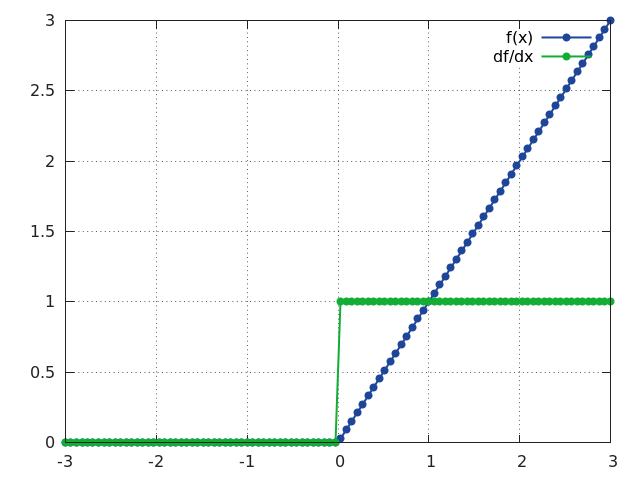
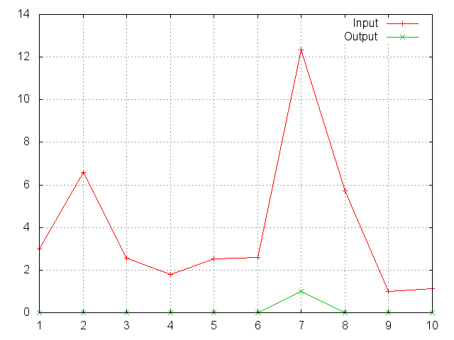
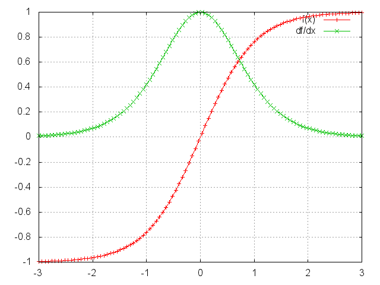

# torch.nn


## AvgPool2d

Applies a 2D average pooling over an input signal composed of several input

```python
The output value of the layer with input (b x C x H x W) and output (b x C x oH x oW)
can be precisely described as:
output[b_i][c_i][h_i][w_i] = (1 / K) * sum_{kh=1, KH} sum_{kw=1, kW}  input[b_i][c_i][stride_h * h_i + kh)][stride_w * w_i + kw)]
```

```python
# pool of square window of size=3, stride=2
m = nn.AvgPool2d(3, stride=2)
# pool of non-square window
m = nn.AvgPool2d((3, 2), stride=(2, 1))
input = autograd.Variable(torch.randn(20, 16, 50, 32))
output = m(input)
```

planes.


### Constructor Arguments

Parameter | Default | Description
--------- | ------- | -----------
kernel_size |  | the size of the window. Can be a single number k (for a square kernel of k x k) or a tuple (kh x kw)
stride | kernel_size | the stride of the window. Can be a single number s or a tuple (sh x sw).
padding | 0 | implicit padding to be added. Can be a single number or a tuple.
ceil_mode |  | when True, will use "ceil" instead of "floor" to compute the output shape

### Expected Shape
       | Shape | Description 
------ | ----- | ------------
 input | [ * , * , *, * ]  | Input is minibatch x channels x iH x iW
output | [ * , * , *, * ]   | Output shape = minibatch x channels x floor((iH  + 2*padH - kH) / sH + 1) x floor((iW  + 2*padW - kW) / sW + 1)
## AvgPool3d

Applies a 3D average pooling over an input signal composed of several input

```python
# pool of square window of size=3, stride=2
m = nn.AvgPool3d(3, stride=2)
# pool of non-square window
m = nn.AvgPool3d((3, 2, 2), stride=(2, 1, 2))
input = autograd.Variable(torch.randn(20, 16, 50,44, 31))
output = m(input)
```

planes.


### Constructor Arguments

Parameter | Default | Description
--------- | ------- | -----------
kernel_size |  | the size of the window to take a average over. Can be a single number k (for a square kernel of k x k x k) or a tuple (kt x kh x kw)
stride | kernel_size | the stride of the window. Can be a single number s or a tuple (st x sh x sw).

### Expected Shape
       | Shape | Description 
------ | ----- | ------------
 input | [ * , * , *, *, * ]  | Input is minibatch x channels x iT x iH x iW
output | [ * , * , *, *, * ]   | Output shape = minibatch x channels x floor((iT  + 2*padT - kT) / sT + 1) x floor((iH  + 2*padH - kH) / sH + 1) x floor((iW  + 2*padW - kW) / sW + 1)
## BatchNorm1d

Applies Batch Normalization over a 2d input that is seen as a mini-batch of 1d inputs

```python
              x - mean(x)
y =  ----------------------------- * gamma + beta
      standard_deviation(x) + eps
```

```python
# With Learnable Parameters
m = nn.BatchNorm1d(100)
# Without Learnable Parameters
m = nn.BatchNorm1d(100, affine=False)
input = autograd.Variable(torch.randn(20, 100))
output = m(input)
```


The mean and standard-deviation are calculated per-dimension over
the mini-batches and gamma and beta are learnable parameter vectors
of size N (where N is the input size).

During training, this layer keeps a running estimate of its computed mean
and variance. The running sum is kept with a default momentum of 0.1
During evaluation, this running mean/variance is used for normalization.


### Constructor Arguments

Parameter | Default | Description
--------- | ------- | -----------
num_features |  | the size of each 1D input in the mini-batch
eps | 1e-5 | a value added to the denominator for numerical stability.
momentum | 0.1 | the value used for the running_mean and running_var computation.
affine |  | a boolean value that when set to true, gives the layer learnable affine parameters.

### Expected Shape
       | Shape | Description 
------ | ----- | ------------
 input | [ * , num_features ]  | 2D Tensor of nBatches x num_features
output | Same  | Output has the same shape as input

### Returns
    a normalized tensor in the batch dimension
## BatchNorm2d

Applies Batch Normalization over a 4d input that is seen as a mini-batch of 3d inputs

```python
              x - mean(x)
y =  ----------------------------- * gamma + beta
      standard_deviation(x) + eps
```

```python
# With Learnable Parameters
m = nn.BatchNorm2d(100)
# Without Learnable Parameters
m = nn.BatchNorm2d(100, affine=False)
input = autograd.Variable(torch.randn(20, 100, 35, 45))
output = m(input)
```


The mean and standard-deviation are calculated per-dimension over
the mini-batches and gamma and beta are learnable parameter vectors
of size N (where N is the input size).

During training, this layer keeps a running estimate of its computed mean
and variance. The running sum is kept with a default momentum of 0.1
During evaluation, this running mean/variance is used for normalization.


### Constructor Arguments

Parameter | Default | Description
--------- | ------- | -----------
num_features |  | num_features from an expected input of size batch_size x num_features x height x width
eps | 1e-5 | a value added to the denominator for numerical stability.
momentum | 0.1 | the value used for the running_mean and running_var computation.
affine |  | a boolean value that when set to true, gives the layer learnable affine parameters.

### Expected Shape
       | Shape | Description 
------ | ----- | ------------
 input | [ * , num_features , *, * ]  | 4D Tensor of batch_size x num_features x height x width
output | Same  | Output has the same shape as input

### Returns
    a normalized tensor in the batch dimension
## BatchNorm3d

Applies Batch Normalization over a 5d input that is seen as a mini-batch of 4d inputs

```python
              x - mean(x)
y =  ----------------------------- * gamma + beta
      standard_deviation(x) + eps
```

```python
# With Learnable Parameters
m = nn.BatchNorm3d(100)
# Without Learnable Parameters
m = nn.BatchNorm3d(100, affine=False)
input = autograd.Variable(torch.randn(20, 100, 35, 45, 10))
output = m(input)
```


The mean and standard-deviation are calculated per-dimension over
the mini-batches and gamma and beta are learnable parameter vectors
of size N (where N is the input size).

During training, this layer keeps a running estimate of its computed mean
and variance. The running sum is kept with a default momentum of 0.1
During evaluation, this running mean/variance is used for normalization.


### Constructor Arguments

Parameter | Default | Description
--------- | ------- | -----------
num_features |  | num_features from an expected input of size batch_size x num_features x height x width
eps | 1e-5 | a value added to the denominator for numerical stability.
momentum | 0.1 | the value used for the running_mean and running_var computation.
affine |  | a boolean value that when set to true, gives the layer learnable affine parameters.

### Expected Shape
       | Shape | Description 
------ | ----- | ------------
 input | [ * , num_features , * , * , * ]  | 5D Tensor of batch_size x num_features x depth x height x width
output | Same  | Output has the same shape as input

### Returns
    a normalized tensor in the batch dimension
## Container

This is the base container class for all neural networks you would define.

```python
# Example of using Container
 class Net(nn.Container):
    def __init__(self):
        super(Net, self).__init__(
            conv1 = nn.Conv2d(1, 20, 5),
            relu  = nn.ReLU()
         )
    def forward(self, input):
        output = self.relu(self.conv1(x))
        return output
 model = Net()
```

```python
# one can add modules to the container after construction
model.add_module('pool1', nn.MaxPool2d(2, 2))
```

You will subclass your container from this class.
In the constructor you define the modules that you would want to use,
and in the "forward" function you use the constructed modules in
your operations.

To make it easier to understand, given is a small example.

One can also add new modules to a container after construction.
You can do this with the add_module function.


The container has one additional method `parameters()` which
returns the list of learnable parameters in the container instance.
## Conv1d

Applies a 1D convolution over an input signal composed of several input

```python
The output value of the layer with input (b x iC x W) and output (b x oC x oW)
can be precisely described as:
output[b_i][oc_i][w_i] = bias[oc_i]
            + sum_iC sum_{ow = 0, oW-1} sum_{kw = 0 to kW-1}
                weight[oc_i][ic_i][kw] * input[b_i][ic_i][stride_w * ow + kw)]
```

```python
m = nn.Conv1d(16, 33, 3, stride=2)
input = autograd.Variable(torch.randn(20, 16, 50))
output = m(input)
```

planes.


Note that depending of the size of your kernel, several (of the last)
columns of the input might be lost. It is up to the user
to add proper padding.


### Constructor Arguments

Parameter | Default | Description
--------- | ------- | -----------
in_channels |  | The number of expected input channels in the image given as input
out_channels |  | The number of output channels the convolution layer will produce
kernel_size |  | the size of the convolving kernel.
stride |  | the stride of the convolving kernel.

### Expected Shape
       | Shape | Description 
------ | ----- | ------------
 input | [ * , in_channels  , * ]  | Input is minibatch x in_channels x iW
output | [ * , out_channels , * ]   | Output shape is precisely minibatch x out_channels x floor((iW  + 2*padW - kW) / dW + 1)
Members:
    weight: the learnable weights of the module of shape (out_channels x in_channels x kW)
    bias:   the learnable bias of the module of shape (out_channels)
## Conv2d

Applies a 2D convolution over an input image composed of several input

```python
The output value of the layer with input (b x iC x H x W) and output (b x oC x oH x oW)
can be precisely described as:
output[b_i][oc_i][h_i][w_i] = bias[oc_i]
            + sum_iC sum_{oh = 0, oH-1} sum_{ow = 0, oW-1} sum_{kh = 0 to kH-1} sum_{kw = 0 to kW-1}
                weight[oc_i][ic_i][kh][kw] * input[b_i][ic_i][stride_h * oh + kh)][stride_w * ow + kw)]
```

```python
# With square kernels and equal stride
m = nn.Conv2d(16, 33, 3, stride=2)
# non-square kernels and unequal stride and with padding
m = nn.Conv2d(16, 33, (3, 5), stride=(2, 1), padding=(4, 2))
# non-square kernels and unequal stride and with padding and dilation
m = nn.Conv2d(16, 33, (3, 5), stride=(2, 1), padding=(4, 2), dilation=(3, 1))
input = autograd.Variable(torch.randn(20, 16, 50, 100))
output = m(input)
```

planes.


Note that depending of the size of your kernel, several (of the last)
columns or rows of the input image might be lost. It is up to the user
to add proper padding in images.


### Constructor Arguments

Parameter | Default | Description
--------- | ------- | -----------
in_channels |  | The number of expected input channels in the image given as input
out_channels |  | The number of output channels the convolution layer will produce
kernel_size |  | the size of the convolving kernel. Can be a single number k (for a square kernel of k x k) or a tuple (kh x kw)
stride | 1 | the stride of the convolving kernel. Can be a single number s or a tuple (sh x sw).
padding | 0 | implicit zero padding on the input. Can be a single number s or a tuple.
dilation | None | If given, will do dilated (or atrous) convolutions. Can be a single number s or a tuple.
bias | True | If set to False, the layer will not learn an additive bias.

### Expected Shape
       | Shape | Description 
------ | ----- | ------------
 input | [ * , in_channels  , * , * ]  | Input is minibatch x in_channels x iH x iW
output | [ * , out_channels , * , * ]   | Output shape is precisely minibatch x out_channels x floor((iH  + 2*padH - kH) / dH + 1) x floor((iW  + 2*padW - kW) / dW + 1)
Members:
    weight: the learnable weights of the module of shape (out_channels x in_channels x kH x kW)
    bias:   the learnable bias of the module of shape (out_channels)
## Conv3d

Applies a 3D convolution over an input image composed of several input

```python
# With square kernels and equal stride
m = nn.Conv3d(16, 33, 3, stride=2)
# non-square kernels and unequal stride and with padding
m = nn.Conv3d(16, 33, (3, 5, 2), stride=(2, 1, 1), padding=(4, 2, 0))
input = autograd.Variable(torch.randn(20, 16, 10, 50, 100))
output = m(input)
```

planes.

Note that depending of the size of your kernel, several (of the last)
columns or rows of the input image might be lost. It is up to the user
to add proper padding in images.


### Constructor Arguments

Parameter | Default | Description
--------- | ------- | -----------
in_channels |  | The number of expected input channels in the image given as input
out_channels |  | The number of output channels the convolution layer will produce
kernel_size |  | the size of the convolving kernel. Can be a single number k (for a square kernel of k x k x k) or a tuple (kt x kh x kw)
stride | 1 | the stride of the convolving kernel. Can be a single number s or a tuple (kt x sh x sw).
padding | 0 | implicit zero padding on the input. Can be a single number s or a tuple.

### Expected Shape
       | Shape | Description 
------ | ----- | ------------
 input | [ * , in_channels  , * , * , * ]  | Input is minibatch x in_channels x iT x iH x iW
output | [ * , out_channels , * , * , * ]   | Output shape is precisely minibatch x out_channels x floor((iT  + 2*padT - kT) / dT + 1) x floor((iH  + 2*padH - kH) / dH + 1) x floor((iW  + 2*padW - kW) / dW + 1)
Members:
    weight: the learnable weights of the module of shape (out_channels x in_channels x kT x kH x kW)
    bias:   the learnable bias of the module of shape (out_channels)
## ConvTranspose2d

Applies a 2D deconvolution operator over an input image composed of several input

```python
# With square kernels and equal stride
m = nn.ConvTranspose2d(16, 33, 3, stride=2)
# non-square kernels and unequal stride and with padding
m = nn.ConvTranspose2d(16, 33, (3, 5), stride=(2, 1), padding=(4, 2))
input = autograd.Variable(torch.randn(20, 16, 50, 100))
output = m(input)
# exact output size can be also specified as an argument
input = autograd.Variable(torch.randn(1, 16, 12, 12))
downsample = nn.Conv2d(16, 16, 3, stride=2, padding=1)
upsample = nn.ConvTranspose2d(16, 16, 3, stride=2, padding=1)
h = downsample(input)
output = upsample(h, output_size=input.size())
```

planes.
The deconvolution operator multiplies each input value element-wise by a learnable kernel,
and sums over the outputs from all input feature planes.
This module can be seen as the exact reverse of the Conv2d module.


### Constructor Arguments

Parameter | Default | Description
--------- | ------- | -----------
in_channels |  | The number of expected input channels in the image given as input
out_channels |  | The number of output channels the convolution layer will produce
kernel_size |  | the size of the convolving kernel. Can be a single number k (for a square kernel of k x k) or a tuple (kh x kw)
stride | 1 | the stride of the convolving kernel. Can be a single number or a tuple (sh x sw).
padding | 0 | implicit zero padding on the input. Can be a single number or a tuple.
output_padding | 0 | A padding of 0 or 1 pixels that should be added to the output. Can be a single number or a tuple.
bias | True | If set to False, the layer will not learn an additive bias.

### Expected Shape
       | Shape | Description 
------ | ----- | ------------
 input | [ * , in_channels  , * , * ]  | Input is minibatch x in_channels x iH x iW
output | [ * , out_channels , * , * ]   | Output shape is minibatch x out_channels x (iH - 1) * sH - 2*padH + kH + output_paddingH x (iW - 1) * sW - 2*padW + kW, or as specified in a second argument to the call.
Members:
    weight: the learnable weights of the module of shape (in_channels x out_channels x kH x kW)
    bias:   the learnable bias of the module of shape (out_channels)
## ConvTranspose3d

Applies a 3D deconvolution operator over an input image composed of several input

```python
# With square kernels and equal stride
m = nn.ConvTranspose3d(16, 33, 3, stride=2)
# non-square kernels and unequal stride and with padding
m = nn.Conv3d(16, 33, (3, 5, 2), stride=(2, 1, 1), padding=(0, 4, 2))
input = autograd.Variable(torch.randn(20, 16, 10, 50, 100))
output = m(input)
```

planes.
The deconvolution operator multiplies each input value element-wise by a learnable kernel,
and sums over the outputs from all input feature planes.
This module can be seen as the exact reverse of the Conv3d module.


### Constructor Arguments

Parameter | Default | Description
--------- | ------- | -----------
in_channels |  | The number of expected input channels in the image given as input
out_channels |  | The number of output channels the convolution layer will produce
kernel_size |  | the size of the convolving kernel. Can be a single number k (for a square kernel of k x k x k) or a tuple (kt x kh x kw)
stride | 1 | the stride of the convolving kernel. Can be a single number or a tuple (st x sh x sw).
padding | 0 | implicit zero padding on the input. Can be a single number or a tuple.
output_padding | 0 | A padding of 0 or 1 pixels that should be added to the output. Can be a single number or a tuple.

### Expected Shape
       | Shape | Description 
------ | ----- | ------------
 input | [ * , in_channels  , * , * , * ]  | Input is minibatch x in_channels x iH x iW
output | [ * , out_channels , * , * , * ]   | Output shape is precisely minibatch x out_channels x (iT - 1) * sT - 2*padT + kT + output_paddingT x (iH - 1) * sH - 2*padH + kH + output_paddingH x (iW - 1) * sW - 2*padW + kW
Members:
    weight: the learnable weights of the module of shape (in_channels x out_channels x kT x kH x kW)
    bias:   the learnable bias of the module of shape (out_channels)
## Dropout

Randomly zeroes some of the elements of the input tensor.

```python
m = nn.Dropout(p=0.2)
input = autograd.Variable(torch.randn(20, 16))
output = m(input)
```

The elements to zero are randomized on every forward call.


### Constructor Arguments

Parameter | Default | Description
--------- | ------- | -----------
p | 0.5 | probability of an element to be zeroed.
inplace | false | If set to True, will do this operation in-place.

### Expected Shape
       | Shape | Description 
------ | ----- | ------------
 input | Any  | Input can be of any shape
output | Same   | Output is of the same shape as input
## Dropout2d

Randomly zeroes whole channels of the input tensor.

```python
m = nn.Dropout2d(p=0.2)
input = autograd.Variable(torch.randn(20, 16, 32, 32))
output = m(input)
```

The input is 4D (batch x channels, height, width) and each channel 
is of size (1, height, width).
The channels to zero are randomized on every forward call.
Usually the input comes from Conv2d modules.

As described in the paper &quot;Efficient Object Localization Using Convolutional
Networks&quot; (http:arxiv.org/abs/1411.4280), if adjacent pixels within
feature maps are strongly correlated (as is normally the case in early
convolution layers) then iid dropout will not regularize the activations
and will otherwise just result in an effective learning rate decrease.
In this case, nn.Dropout2d will help promote independence between
feature maps and should be used instead.


### Constructor Arguments

Parameter | Default | Description
--------- | ------- | -----------
p | 0.5 | probability of an element to be zeroed.
inplace | false | If set to True, will do this operation in-place.

### Expected Shape
       | Shape | Description 
------ | ----- | ------------
 input | [*, *, *, *]  | Input can be of any sizes of 4D shape
output | Same   | Output is of the same shape as input
## Dropout3d

Randomly zeroes whole channels of the input tensor.

```python
m = nn.Dropout3d(p=0.2)
input = autograd.Variable(torch.randn(20, 16, 4, 32, 32))
output = m(input)
```

The input is 5D (batch x channels, depth, height, width) and each channel 
is of size (1, depth, height, width).
The channels to zero are randomized on every forward call.
Usually the input comes from Conv3d modules.


### Constructor Arguments

Parameter | Default | Description
--------- | ------- | -----------
p | 0.5 | probability of an element to be zeroed.
inplace | false | If set to True, will do this operation in-place.

### Expected Shape
       | Shape | Description 
------ | ----- | ------------
 input | [*, *, *, *, *]  | Input can be of any sizes of 5D shape
output | Same   | Output is of the same shape as input
## ELU

Applies element-wise, ELU(x) = max(0,x) + min(0, alpha * (exp(x) - 1))

```python
m = nn.ELU()
input = autograd.Variable(torch.randn(2))
print(input)
print(m(input))
```


### Constructor Arguments

Parameter | Default | Description
--------- | ------- | -----------
alpha | 1.0 | the alpha value for the ELU formulation.
inplace |  | can optionally do the operation in-place

### Expected Shape
       | Shape | Description 
------ | ----- | ------------
 input | Any  | Tensor of any size and dimension
output | Same  | Output has the same shape as input

### Returns
    a Tensor of the same dimension and shape as the input


## Embedding

A simple lookup table that stores embeddings of a fixed dictionary and size

```python
# an Embedding module containing 10 tensors of size 3
embedding = nn.Embedding(10, 3)
# a batch of 2 samples of 4 indices each
input = torch.LongTensor([[1,2,4,5],[4,3,2,9]])
print(embedding(input))
# example with padding_idx
embedding = nn.Embedding(10, 3, padding_idx=0)
input = torch.LongTensor([[0,2,0,5]])
print(embedding(input))
```

This module is often used to store word embeddings and retrieve them using indices.
The input to the module is a list of indices, and the output is the corresponding
word embeddings.

### Constructor Arguments

Parameter | Default | Description
--------- | ------- | -----------
num_embeddings |  | size of the dictionary of embeddings
embedding_dim |  | the size of each embedding vector
padding_idx | None | If given, pads the output with zeros whenever it encounters the index.
max_norm | None | If given, will renormalize the embeddings to always have a norm lesser than this
norm_type |  | The p of the p-norm to compute for the max_norm option
scale_grad_by_freq |  | if given, this will scale gradients by the frequency of the words in the dictionary.

### Expected Shape
       | Shape | Description 
------ | ----- | ------------
 input | [ *, * ]  | Input is a 2D mini_batch LongTensor of m x n indices to extract from the Embedding dictionary
output | [ * , *, * ]   | Output shape = m x n x embedding_dim
## FractionalMaxPool2d

Applies a 2D fractional max pooling over an input signal composed of several input

```python
# pool of square window of size=3, and target output size 13x12
m = nn.FractionalMaxPool2d(3, output_size=(13, 12))
# pool of square window and target output size being half of input image size
m = nn.FractionalMaxPool2d(3, output_ratio=(0.5, 0.5))
input = autograd.Variable(torch.randn(20, 16, 50, 32))
output = m(input)
```

planes.

Fractiona MaxPooling is described in detail in the paper ["Fractional Max-Pooling" by Ben Graham](http://arxiv.org/abs/1412.6071)
The max-pooling operation is applied in kHxkW regions by a stochastic
step size determined by the target output size.
The number of output features is equal to the number of input planes.


### Constructor Arguments

Parameter | Default | Description
--------- | ------- | -----------
kernel_size |  | the size of the window to take a max over. Can be a single number k (for a square kernel of k x k) or a tuple (kh x kw)
output_size |  | the target output size of the image of the form oH x oW. Can be a tuple (oH, oW) or a single number oH for a square image oH x oH
output_ratio |  | If one wants to have an output size as a ratio of the input size, this option can be given. This has to be a number or tuple in the range (0, 1)
return_indices | False | if True, will return the indices along with the outputs. Useful to pass to nn.MaxUnpool2d .

### Expected Shape
       | Shape | Description 
------ | ----- | ------------
 input | [ * , * , *, * ]  | Input is minibatch x channels x iH x iW
output | [ * , * , *, * ]   | Output shape = minibatch x channels x floor((iH  + 2*padH - kH) / sH + 1) x floor((iW  + 2*padW - kW) / sW + 1)
## Hardshrink

Applies the hard shrinkage function element-wise

```python
m = nn.Hardshrink()
input = autograd.Variable(torch.randn(2))
print(input)
print(m(input))
```

Hardshrink is defined as f(x) = x, if x >  lambda
                         f(x) = x, if x < -lambda
                         f(x) = 0, otherwise

### Constructor Arguments

Parameter | Default | Description
--------- | ------- | -----------
lambd | 0.5 | the lambda value for the Hardshrink formulation.

### Expected Shape
       | Shape | Description 
------ | ----- | ------------
 input | Any  | Tensor of any size and dimension
output | Same  | Output has the same shape as input

### Returns
    a Tensor of the same dimension and shape as the input


## Hardtanh

Applies the HardTanh function element-wise

```python
m = nn.HardTanh(-2, 2)
input = autograd.Variable(torch.randn(2))
print(input)
print(m(input))
```

HardTanh is defined as:
   f(x) = +1, if x  >  1
   f(x) = -1, if x  < -1
   f(x) =  x,  otherwise
The range of the linear region [-1, 1] can be adjusted

### Constructor Arguments

Parameter | Default | Description
--------- | ------- | -----------
min_value |  | minimum value of the linear region range
max_value |  | maximum value of the linear region range
inplace |  | can optionally do the operation in-place

### Expected Shape
       | Shape | Description 
------ | ----- | ------------
 input | Any  | Tensor of any size and dimension
output | Same  | Output has the same shape as input

### Returns
    a Tensor of the same dimension and shape as the input


## LPPool2d

Applies a 2D power-average pooling over an input signal composed of several input

```python
# power-2 pool of square window of size=3, stride=2
m = nn.LPPool2d(2, 3, stride=2)
# pool of non-square window of power 1.2
m = nn.LPPool2d(1.2, (3, 2), stride=(2, 1))
input = autograd.Variable(torch.randn(20, 16, 50, 32))
output = m(input)
```

planes.
On each window, the function computed is: f(X) = pow(sum(pow(X, p)), 1/p)
At p = infinity, one gets Max Pooling
At p = 1, one gets Average Pooling

### Constructor Arguments

Parameter | Default | Description
--------- | ------- | -----------
kernel_size |  | the size of the window. Can be a single number k (for a square kernel of k x k) or a tuple (kh x kw)
stride | kernel_size | the stride of the window. Can be a single number s or a tuple (sh x sw).
ceil_mode |  | when True, will use "ceil" instead of "floor" to compute the output shape

### Expected Shape
       | Shape | Description 
------ | ----- | ------------
 input | [ * , * , *, * ]  | Input is minibatch x channels x iH x iW
output | [ * , * , *, * ]   | Output shape = minibatch x channels x floor((iH  + 2*padH - kH) / sH + 1) x floor((iW  + 2*padW - kW) / sW + 1)
## LeakyReLU

Applies element-wise, f(x) = max(0, x) + negative_slope * min(0, x)

```python
m = nn.LeakyReLU(0.1)
input = autograd.Variable(torch.randn(2))
print(input)
print(m(input))
```


### Constructor Arguments

Parameter | Default | Description
--------- | ------- | -----------
negative_slope | 1e-2 | Controls the angle of the negative slope.
inplace |  | can optionally do the operation in-place

### Expected Shape
       | Shape | Description 
------ | ----- | ------------
 input | Any  | Tensor of any size and dimension
output | Same  | Output has the same shape as input

### Returns
    a Tensor of the same dimension and shape as the input
## Linear

Applies a linear transformation to the incoming data, y = Ax + b

```python
m = nn.Linear(20, 30)
input = autograd.Variable(torch.randn(128, 20))
output = m(input)
print(output.size())
```

The input is a 2D mini-batch of samples, each of size in_features
The output will be a 2D Tensor of size mini-batch x out_features


### Constructor Arguments

Parameter | Default | Description
--------- | ------- | -----------
in_features |  | size of each input sample
out_features |  | size of each output sample
bias | True | If set to False, the layer will not learn an additive bias.

### Expected Shape
       | Shape | Description 
------ | ----- | ------------
 input | [*, in_features]  | Input can be of shape minibatch x in_features
output | [*, out_features]   | Output is of shape minibatch x out_features
Members:
    weight: the learnable weights of the module of shape (out_features x in_features)
    bias:   the learnable bias of the module of shape (out_features)
## LogSigmoid

Applies element-wise LogSigmoid(x) = log( 1 / (1 + exp(-x_i)))

```python
m = nn.LogSigmoid()
input = autograd.Variable(torch.randn(2))
print(input)
print(m(input))
```


### Expected Shape
       | Shape | Description 
------ | ----- | ------------
 input | Any  | Tensor of any size and dimension
output | Same  | Output has the same shape as input

### Returns
    a Tensor of the same dimension and shape as the input


## LogSoftmax

Applies the Log(Softmax(x)) function to an n-dimensional input Tensor.

```python
m = nn.LogSoftmax()
input = autograd.Variable(torch.randn(2, 3))
print(input)
print(m(input))
```

The LogSoftmax formulation can be simplified as
     f_i(x) = log(1 / a * exp(x_i)) where a = sum_j exp(x_j) .

### Expected Shape
       | Shape | Description 
------ | ----- | ------------
 input | [ * , * ]  | 2D Tensor of any size
output | Same  | Output has the same shape as input

### Returns
    a Tensor of the same dimension and shape as the input with
    values in the range [-inf, 0)


## MaxPool1d

Applies a 1D max pooling over an input signal composed of several input

```python
The output value of the layer with input (b x C x W) and output (b x C x oW)
can be precisely described as:
output[b_i][c_i][w_i] = max_{k=1, K} input[b_i][c_i][stride_w * w_i + k)]
```

```python
# pool of size=3, stride=2
m = nn.MaxPool1d(3, stride=2)
input = autograd.Variable(torch.randn(20, 16, 50))
output = m(input)
```

planes.


### Constructor Arguments

Parameter | Default | Description
--------- | ------- | -----------
kernel_size |  | the size of the window to take a max over
stride |  | the stride of the window
padding | 0 | implicit padding to be added.
dilation | kernel_size | a parameter that controls the stride of elements in the window.
return_indices | False | if True, will return the indices along with the outputs. Useful when Unpooling later.
ceil_mode |  | when True, will use "ceil" instead of "floor" to compute the output shape

### Expected Shape
       | Shape | Description 
------ | ----- | ------------
 input | [ * , * , * ]  | Input is minibatch x channels x iW
output | [ * , * , * ]   | Output shape = minibatch x channels x floor((iW  + 2*padW - kernel_size) / stride + 1)
## MaxPool2d

Applies a 2D max pooling over an input signal composed of several input

```python
The output value of the layer with input (b x C x H x W) and output (b x C x oH x oW)
can be precisely described as:
output[b_i][c_i][h_i][w_i] = max_{{kh=1, KH}, {kw=1, kW}} input[b_i][c_i][stride_h * h_i + kH)][stride_w * w_i + kW)]
```

```python
# pool of square window of size=3, stride=2
m = nn.MaxPool2d(3, stride=2)
# pool of non-square window
m = nn.MaxPool2d((3, 2), stride=(2, 1))
input = autograd.Variable(torch.randn(20, 16, 50, 32))
output = m(input)
```

planes.


### Constructor Arguments

Parameter | Default | Description
--------- | ------- | -----------
kernel_size |  | the size of the window to take a max over. Can be a single number k (for a square kernel of k x k) or a tuple (kh x kw)
stride | kernel_size | the stride of the window. Can be a single number s or a tuple (sh x sw).
padding | 0 | implicit padding to be added. Can be a single number or a tuple.
dilation | 1 | a parameter that controls the stride of elements in the window. Can be a single number or a tuple.
return_indices | False | if True, will return the indices along with the outputs. Useful to pass to nn.MaxUnpool2d .
ceil_mode |  | when True, will use "ceil" instead of "floor" to compute the output shape

### Expected Shape
       | Shape | Description 
------ | ----- | ------------
 input | [ * , * , *, * ]  | Input is minibatch x channels x iH x iW
output | [ * , * , *, * ]   | Output shape = minibatch x channels x floor((iH  + 2*padH - kH) / sH + 1) x floor((iW  + 2*padW - kW) / sW + 1)
## MaxPool3d

Applies a 3D max pooling over an input signal composed of several input

```python
# pool of square window of size=3, stride=2
m = nn.MaxPool3d(3, stride=2)
# pool of non-square window
m = nn.MaxPool3d((3, 2, 2), stride=(2, 1, 2))
input = autograd.Variable(torch.randn(20, 16, 50,44, 31))
output = m(input)
```

planes.


### Constructor Arguments

Parameter | Default | Description
--------- | ------- | -----------
kernel_size |  | the size of the window to take a max over. Can be a single number k (for a square kernel of k x k x k) or a tuple (kt x kh x kw)
stride | kernel_size | the stride of the window. Can be a single number s or a tuple (st x sh x sw).
padding | 0 | implicit padding to be added. Can be a single number or a tuple.
dilation | 1 | a parameter that controls the stride of elements in the window. Can be a single number or a tuple.
return_indices | False | if True, will return the indices along with the outputs. Useful to pass to nn.MaxUnpool3d .
ceil_mode |  | when True, will use "ceil" instead of "floor" to compute the output shape

### Expected Shape
       | Shape | Description 
------ | ----- | ------------
 input | [ * , * , *, *, * ]  | Input is minibatch x channels x iT x iH x iW
output | [ * , * , *, *, * ]   | Output shape = minibatch x channels x floor((iT  + 2*padT - kT) / sT + 1) x floor((iH  + 2*padH - kH) / sH + 1) x floor((iW  + 2*padW - kW) / sW + 1)
## MaxUnpool2d

Computes the inverse operation of MaxPool2d

```python
# pool of square window of size=3, stride=2
m = nn.MaxPool2d(2, stride=2, return_indices = True)
mu = nn.MaxUnpool2d(2, stride=2)
input = autograd.Variable(torch.randn(20, 16, 50, 32))
output, indices = m(input)
unpooled_output = mu.forward(output, indices)
# exact output size can be also specified as an argument
input = autograd.Variable(torch.randn(1, 16, 11, 11))
downsample = nn.MaxPool2d(3, 3, return_indices=True)
upsample = nn.MaxUnpool2d(3, 3)
h, indices = downsample(input)
output = upsample(h, indices, output_size=input.size())
```

MaxPool2d is not invertible, as the locations of the max locations are lost.
MaxUnpool2d takes in as input the output of MaxPool2d and the indices of the Max locations
and computes the inverse.


### Constructor Arguments

Parameter | Default | Description
--------- | ------- | -----------
kernel_size |  | the size of the max window. Can be a single number k (for a square kernel of k x k) or a tuple (kh x kw)
stride | kernel_size | the stride of the window. Can be a single number s or a tuple (sh x sw).
padding | 0 | implicit padding that was added to the input. Can be a single number or a tuple.

### Expected Shape
       | Shape | Description 
------ | ----- | ------------
 input | [ * , * , *, * ]  | Input is minibatch x channels x iH x iW
output | [ * , * , *, * ]   | Output shape is minibatch x channels x padH x (iH - 1) * sH + kH x padW x (iW - 1) * sW + kW, or as specified to the call.
## MaxUnpool3d

Computes the inverse operation of MaxPool3d

```python
# pool of square window of size=3, stride=2
m = nn.MaxPool3d(3, stride=2, return_indices = True)
mu = nn.MaxUnpool3d(3, stride=2)
input, indices = autograd.Variable(torch.randn(20, 16, 50, 32, 15))
output = m(input)
unpooled_output = m2.forward(output, indices)
```

MaxPool3d is not invertible, as the locations of the max locations are lost.
MaxUnpool3d takes in as input the output of MaxPool3d and the indices of the Max locations
and computes the inverse.


### Constructor Arguments

Parameter | Default | Description
--------- | ------- | -----------
kernel_size |  | the size of the max window. Can be a single number k (for a square kernel of k x k) or a tuple (kt x kh x kw)
stride | kernel_size | the stride of the window. Can be a single number s or a tuple (st x sh x sw).
padding | 0 | implicit padding that was added to the input. Can be a single number or a tuple.

### Expected Shape
       | Shape | Description 
------ | ----- | ------------
 input | [ * , * , *, *, * ]  | Input is minibatch x channels x iT x iH x iW
output | [ * , * , *, *, * ]   | Output shape = minibatch x channels x padT x (iT - 1) * sT + kT x padH x (iH - 1) * sH + kH x padW x (iW - 1) * sW + kW
## PReLU

Applies element-wise the function PReLU(x) = max(0,x) + a * min(0,x)

```python
m = nn.PReLU()
input = autograd.Variable(torch.randn(2))
print(input)
print(m(input))
```

Here "a" is a learnable parameter.
When called without arguments, nn.PReLU() uses a single parameter "a"
across all input channels. If called with nn.PReLU(nChannels), a separate
"a" is used for each input channel.
Note that weight decay should not be used when learning "a" for good
performance.

### Constructor Arguments

Parameter | Default | Description
--------- | ------- | -----------
num_parameters | 1 | number of "a" to learn.
init | 0.25 | the initial value of "a".

### Expected Shape
       | Shape | Description 
------ | ----- | ------------
 input | Any  | Tensor of any size and dimension
output | Same  | Output has the same shape as input

### Returns
    a Tensor of the same dimension and shape as the input


## ReLU

Applies the rectified linear unit function element-wise ReLU(x)= max(0,x)

```python
m = nn.ReLU()
input = autograd.Variable(torch.randn(2))
print(input)
print(m(input))
```


### Constructor Arguments

Parameter | Default | Description
--------- | ------- | -----------
inplace |  | can optionally do the operation in-place

### Expected Shape
       | Shape | Description 
------ | ----- | ------------
 input | Any  | Tensor of any size and dimension
output | Same  | Output has the same shape as input

### Returns
    a Tensor of the same dimension and shape as the input


## ReLU6

Applies the element-wise function ReLU6(x) = min( max(0,x), 6)

```python
m = nn.ReLU6()
input = autograd.Variable(torch.randn(2))
print(input)
print(m(input))
```


### Constructor Arguments

Parameter | Default | Description
--------- | ------- | -----------
inplace |  | can optionally do the operation in-place

### Expected Shape
       | Shape | Description 
------ | ----- | ------------
 input | Any  | Tensor of any size and dimension
output | Same  | Output has the same shape as input

### Returns
    a Tensor of the same dimension and shape as the input


## Sigmoid

Applies the element-wise function sigmoid(x) = 1 / ( 1 + exp(-x))

```python
m = nn.Sigmoid()
input = autograd.Variable(torch.randn(2))
print(input)
print(m(input))
```


### Expected Shape
       | Shape | Description 
------ | ----- | ------------
 input | Any  | Tensor of any size and dimension
output | Same  | Output has the same shape as input

### Returns
    a Tensor of the same dimension and shape as the input


## Softmax

Applies the Softmax function to an n-dimensional input Tensor

```python
m = nn.Softmax()
input = autograd.Variable(torch.randn(2, 3))
print(input)
print(m(input))
```

rescaling them so that the elements of the n-dimensional output Tensor
lie in the range (0,1) and sum to 1

Softmax is defined as f_i(x) = exp(x_i - shift) / sum_j exp(x_j - shift)
                      where shift = max_i x_i


### Expected Shape
       | Shape | Description 
------ | ----- | ------------
 input | [ * , * ]  | 2D Tensor of any size
output | Same  | Output has the same shape as input

### Returns
    a Tensor of the same dimension and shape as the input with
    values in the range [0, 1]


Notes:
    Note that this module doesn't work directly with NLLLoss,
    which expects the Log to be computed between the Softmax and itself.
    Use Logsoftmax instead (it's faster).
## Softmax2d

Applies SoftMax over features to each spatial location

```python
m = nn.Softmax2d()
# you softmax over the 2nd dimension
input = autograd.Variable(torch.randn(2, 3, 12, 13))
print(input)
print(m(input))
```

When given an image of Channels x Height x Width, it will
apply Softmax to each location [Channels, h_i, w_j]


### Expected Shape
       | Shape | Description 
------ | ----- | ------------
 input | [ * , * , * , * ]  | 4D Tensor of any size
output | Same  | Output has the same shape as input

### Returns
    a Tensor of the same dimension and shape as the input with
    values in the range [0, 1]
## Softmin

Applies the Softmin function to an n-dimensional input Tensor

```python
m = nn.Softmin()
input = autograd.Variable(torch.randn(2, 3))
print(input)
print(m(input))
```

rescaling them so that the elements of the n-dimensional output Tensor
lie in the range (0,1) and sum to 1
Softmin(x) = exp(-x_i - shift) / sum_j exp(-x_j - shift)
             where shift = max_i - x_i

### Expected Shape
       | Shape | Description 
------ | ----- | ------------
 input | [ * , * ]  | 2D Tensor of any size
output | Same  | Output has the same shape as input

### Returns
    a Tensor of the same dimension and shape as the input, with
    values in the range [0, 1]


## Softplus

Applies element-wise SoftPlus(x) = 1/beta * log(1 + exp(beta * x_i))

```python
m = nn.Softplus()
input = autograd.Variable(torch.randn(2))
print(input)
print(m(input))
```

SoftPlus is a smooth approximation to the ReLU function and can be used
to constrain the output of a machine to always be positive.
For numerical stability the implementation reverts to the linear function
for inputs above a certain value.

### Constructor Arguments

Parameter | Default | Description
--------- | ------- | -----------
beta | 1 | the beta value for the Softplus formulation.
threshold | 20 | values above this revert to a linear function.

### Expected Shape
       | Shape | Description 
------ | ----- | ------------
 input | Any  | Tensor of any size and dimension
output | Same  | Output has the same shape as input

### Returns
    a Tensor of the same dimension and shape as the input


## Softshrink

Applies the soft shrinkage function elementwise

```python
m = nn.Softshrink()
input = autograd.Variable(torch.randn(2))
print(input)
print(m(input))
```

SoftShrinkage operator is defined as:
    f(x) = x-lambda, if x > lambda >  f(x) = x+lambda, if x < -lambda
    f(x) = 0, otherwise

### Constructor Arguments

Parameter | Default | Description
--------- | ------- | -----------
lambd | 0.5 | the lambda value for the Softshrink formulation.

### Expected Shape
       | Shape | Description 
------ | ----- | ------------
 input | Any  | Tensor of any size and dimension
output | Same  | Output has the same shape as input

### Returns
    a Tensor of the same dimension and shape as the input


## Softsign

Applies element-wise, the function Softsign(x) = x / (1 + |x|)

```python
m = nn.Softsign()
input = autograd.Variable(torch.randn(2))
print(input)
print(m(input))
```


### Expected Shape
       | Shape | Description 
------ | ----- | ------------
 input | Any  | Tensor of any size and dimension
output | Same  | Output has the same shape as input

### Returns
    a Tensor of the same dimension and shape as the input


## Tanh

Applies element-wise, Tanh(x) = (exp(x) - exp(-x)) / (exp(x) + exp(-x))

```python
m = nn.Tanh()
input = autograd.Variable(torch.randn(2))
print(input)
print(m(input))
```


### Expected Shape
       | Shape | Description 
------ | ----- | ------------
 input | Any  | Tensor of any size and dimension
output | Same  | Output has the same shape as input

### Returns
    a Tensor of the same dimension and shape as the input


## Tanhshrink

Applies element-wise, Tanhshrink(x) = x - Tanh(x)

```python
m = nn.Tanhshrink()
input = autograd.Variable(torch.randn(2))
print(input)
print(m(input))
```


### Expected Shape
       | Shape | Description 
------ | ----- | ------------
 input | Any  | Tensor of any size and dimension
output | Same  | Output has the same shape as input

### Returns
    a Tensor of the same dimension and shape as the input
## Threshold

Thresholds each element of the input Tensor

```python
m = nn.Threshold(0.1, 20)
input = Variable(torch.randn(2))
print(input)
print(m(input))
```

Threshold is defined as:
     y =  x        if x >= threshold
          value    if x <  threshold

### Constructor Arguments

Parameter | Default | Description
--------- | ------- | -----------
threshold |  | The value to threshold at
value |  | The value to replace with
inplace |  | can optionally do the operation in-place

### Expected Shape
       | Shape | Description 
------ | ----- | ------------
 input | Any  | Tensor of any size and dimension
output | Same  | Output has the same shape as input

### Returns
    Tensor of same dimension and shape as the input
