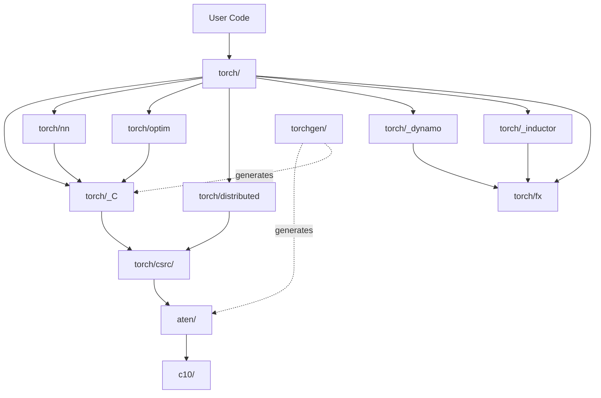

# PyTorch Module Boundary Map

**Purpose**: Document the current module structure, dependency directions, and coupling hotspots to guide safe refactoring.

**Audit Date**: 2026-02-08  
**Baseline Commit**: c5f1d40

---

## 1. High-Level Module Structure

```
pytorch/
├── c10/              # Core abstractions (device, dtype, tensor basics)
├── aten/             # Tensor operators (native implementations)
├── torch/            # Python frontend
│   ├── csrc/        # C++ implementation (Python bindings, autograd engine)
│   ├── nn/          # Neural network modules
│   ├── optim/       # Optimizers
│   ├── distributed/ # Multi-node training
│   ├── _dynamo/     # Compiler: graph capture
│   ├── _inductor/   # Compiler: code generation
│   └── fx/          # Graph IR
├── torchgen/        # Code generation for operators
├── functorch/       # Function transforms (merging into torch)
├── caffe2/          # Legacy (mostly deprecated)
└── test/            # Test suite
```

---

## 2. Module Dependency Directions

### 2.1 Ideal Layering (Bottom-Up)

```
┌─────────────────────────────────────────┐
│          User Code (Scripts)            │
└─────────────────┬───────────────────────┘
                  │
┌─────────────────▼───────────────────────┐
│     torch (Python API)                  │  ← Public surface
│  - torch.nn, torch.optim, torch.cuda    │
└─────────────────┬───────────────────────┘
                  │
┌─────────────────▼───────────────────────┐
│     torch._C (Python bindings)          │  ← C++ <-> Python bridge
└─────────────────┬───────────────────────┘
                  │
┌─────────────────▼───────────────────────┐
│     torch/csrc/ (C++ implementation)    │  ← Autograd, JIT, etc.
│  - autograd, jit, distributed           │
└─────────────────┬───────────────────────┘
                  │
┌─────────────────▼───────────────────────┐
│     aten (Tensor operators)             │  ← Core math ops
└─────────────────┬───────────────────────┘
                  │
┌─────────────────▼───────────────────────┐
│     c10 (Core abstractions)             │  ← Device, Tensor, Storage
└─────────────────────────────────────────┘
```

### 2.2 Actual Dependency Graph (Simplified)



**Legend**:
- Solid arrows: Runtime dependency
- Dotted arrows: Build-time dependency (code generation)

---

## 3. Module Descriptions

### 3.1 `c10/` (Core Abstractions)

**Purpose**: Device-agnostic tensor abstractions, memory management, type system

**Key Components**:
- `c10/core/`: `ScalarType`, `Device`, `Allocator`, `TensorImpl`
- `c10/util/`: `intrusive_ptr`, `half`, `complex`, `ArrayRef`
- `c10/cuda/`, `c10/xpu/`: Device-specific backends

**Dependencies**:
- **Depends on**: Standard library only (no PyTorch deps)
- **Depended by**: Everything (c10 is the foundation)

**Coupling**: 🟢 **LOW** (well-isolated, stable)

**Refactor Risk**: 🔴 **VERY HIGH** (changes ripple through entire codebase)

---

### 3.2 `aten/` (ATen Tensor Library)

**Purpose**: Operator implementations (CPU, CUDA, vectorized, etc.)

**Key Components**:
- `aten/src/ATen/`: Tensor class, operator declarations
- `aten/src/ATen/native/`: Native operator implementations (700+ ops)
- `aten/src/ATen/core/`: Operator registration, dispatch

**Dependencies**:
- **Depends on**: `c10/`, `third_party/` (BLAS, cuDNN, etc.)
- **Depended by**: `torch/csrc/`, Python bindings

**Coupling**: 🟡 **MEDIUM** (large, but operator-level isolation)

**Refactor Risk**: 🟠 **HIGH** (operator changes affect all users, but dispatch system provides isolation)

**Code Generation**:
- ~80% of ATen is auto-generated by `torchgen/`
- Manual edits: `aten/src/ATen/native/*.cpp` (native implementations)

---

### 3.3 `torch/csrc/` (C++ Implementation)

**Purpose**: Python bindings, autograd engine, JIT compiler, distributed runtime

**Key Components**:
- `torch/csrc/autograd/`: Automatic differentiation engine
- `torch/csrc/jit/`: TorchScript JIT compiler
- `torch/csrc/distributed/`: C++ distributed backend (c10d)
- `torch/csrc/api/`: C++ frontend (torch::nn)

**Dependencies**:
- **Depends on**: `aten/`, `c10/`, `pybind11`
- **Depended by**: `torch/_C` (Python bindings)

**Coupling**: 🟠 **HIGH** (tightly coupled to Python runtime via pybind11)

**Refactor Risk**: 🟠 **HIGH** (changes can break Python bindings or autograd)

---

### 3.4 `torch/` (Python Frontend)

**Purpose**: User-facing Python API

**Key Components**:
- `torch/__init__.py`: Main API entry point (~2,000 lines of imports)
- `torch/nn/`: Neural network modules
- `torch/optim/`: Optimizers
- `torch/distributed/`: Distributed training (Python layer)
- `torch/_dynamo/`: Compiler (graph capture via bytecode introspection)
- `torch/_inductor/`: Compiler (code generation backend)
- `torch/fx/`: Graph IR

**Dependencies**:
- **Depends on**: `torch/_C` (C++ bindings), `torch/csrc/`
- **Depended by**: User code (entire ecosystem)

**Coupling**: 🔴 **VERY HIGH** (monolithic `__init__.py`, many cross-module imports)

**Refactor Risk**: 🔴 **VERY HIGH** (any change affects public API)

---

### 3.5 `torchgen/` (Code Generation)

**Purpose**: Generate C++/Python code from operator schema definitions

**Key Components**:
- `torchgen/api/`: API definition parsing
- `torchgen/gen.py`: Code generation entry point
- `torchgen/dest/`: Code generation templates

**Dependencies**:
- **Depends on**: `pyyaml` (parses `native_functions.yaml`)
- **Depended by**: `aten/`, `torch/_C` (build-time)

**Coupling**: 🟢 **LOW** (isolated, runs at build time)

**Refactor Risk**: 🟠 **MEDIUM** (changes affect hundreds of generated files, but templated)

---

### 3.6 `functorch/` (Function Transforms)

**Purpose**: `vmap`, `grad`, `jvp` (function transforms for functional programming)

**Key Components**:
- `functorch/api.py`: Public API
- `functorch/_src/`: Internal implementations

**Dependencies**:
- **Depends on**: `torch/`, `torch/_C`
- **Depended by**: `torch.func` (re-exported)

**Coupling**: 🟡 **MEDIUM** (being merged into `torch/`)

**Refactor Risk**: 🟡 **MEDIUM** (transition period, some users use legacy `functorch` imports)

**Status**: **Being merged into `torch.func`** (expect deprecation of standalone `functorch` package)

---

### 3.7 `caffe2/` (Legacy)

**Purpose**: Legacy Caffe2 code (mostly deprecated)

**Key Components**:
- `caffe2/core/`, `caffe2/operators/`: Old Caffe2 operators

**Dependencies**:
- **Depends on**: `c10/`, `aten/` (partially)
- **Depended by**: Almost nothing (legacy mobile code only)

**Coupling**: 🟢 **LOW** (isolated, deprecated)

**Refactor Risk**: 🟢 **LOW** (can be removed incrementally)

**Status**: **Deprecated** (no new code should depend on `caffe2`)

---

## 4. Dependency Hotspots & Cycles

### 4.1 God Module: `torch/__init__.py`

**Issue**: 
- Imports ~50+ submodules
- Any refactor touching `torch/` requires careful import ordering

**Example**:
```python
# torch/__init__.py (simplified)
from torch._C import *
from torch.tensor import Tensor
from torch import nn
from torch import optim
from torch import distributed
# ... 40+ more imports
```

**Refactor Risk**: 🔴 **VERY HIGH**

**Recommendation**: 
- Use lazy imports where possible (e.g., `torch.distributed` already lazy-loads)
- Document import order dependencies

---

### 4.2 Circular Dependency: `torch.nn` ↔ `torch.autograd`

**Issue**:
- `torch.nn.Module` uses `torch.autograd.grad()`
- `torch.autograd.Function` (custom ops) often used in `nn.Module` subclasses

**Resolution**: 
- Not a hard cycle (API boundary is clean)
- Both live in `torch/` namespace, so tolerable

**Refactor Risk**: 🟡 **MEDIUM**

---

### 4.3 Circular Dependency: `torch._dynamo` ↔ `torch.fx`

**Issue**:
- `torch._dynamo` captures graphs using `torch.fx`
- `torch.fx` transformations may invoke `_dynamo` for re-tracing

**Resolution**:
- Managed via explicit API boundaries
- Both are compiler internals (not public-facing)

**Refactor Risk**: 🟡 **MEDIUM**

---

### 4.4 Distributed <-> Autograd Coupling

**Issue**:
- `torch.distributed.autograd` hooks into autograd engine
- `torch.distributed` RPC uses autograd for distributed backward

**Resolution**:
- Necessary coupling (distributed autograd requires both)
- Well-documented API boundary

**Refactor Risk**: 🟠 **HIGH** (multi-process testing required for any changes)

---

## 5. Coupling Metrics

| Module | Incoming Deps | Outgoing Deps | Coupling Score |
|--------|---------------|---------------|----------------|
| `c10/` | All modules | None (stdlib only) | 🟢 1/10 (foundation) |
| `aten/` | `torch/`, `torchgen/` | `c10/`, `third_party/` | 🟡 3/10 (operator layer) |
| `torch/csrc/` | `torch/` (bindings) | `aten/`, `c10/`, `pybind11` | 🟠 5/10 (bridge layer) |
| `torch/` | User code, tests | Everything below | 🔴 9/10 (monolithic) |
| `torch/nn/` | User models | `torch/`, `torch/_C` | 🟠 6/10 (high usage) |
| `torch/distributed/` | Training scripts | `torch/`, `torch/csrc/distributed/` | 🟠 7/10 (complex) |
| `torch/_dynamo/` | `torch.compile` users | `torch/fx`, `torch/` | 🟡 5/10 (compiler internal) |
| `torch/_inductor/` | `torch.compile` | `torch/fx`, `torch/` | 🟡 5/10 (compiler internal) |
| `torchgen/` | Build system | `pyyaml` | 🟢 2/10 (isolated) |
| `functorch/` | `torch.func` users | `torch/` | 🟡 4/10 (being merged) |
| `caffe2/` | Legacy code | `c10/`, `aten/` (partial) | 🟢 2/10 (deprecated) |

**Coupling Score**: 1 (low) - 10 (high)

---

## 6. Suggested Future Boundaries

### 6.1 Separate `torch.distributed` into Standalone Repo (Optional)

**Rationale**:
- Distributed training is complex, evolving independently
- Large surface area (370 files)
- Could be versioned separately

**Challenges**:
- Tight integration with autograd
- Would require stable ABI boundary

**Recommendation**: **Defer** (not urgent, high complexity)

---

### 6.2 Consolidate Compiler Stack (`_dynamo` + `_inductor` + `fx`)

**Rationale**:
- All three are part of `torch.compile` pipeline
- Shared abstractions (graph IR)

**Challenges**:
- Currently separate for historical reasons
- Merging may not provide clear benefits

**Recommendation**: **Monitor** (revisit if compiler stack grows further)

---

### 6.3 Extract `torchgen` as Separate Package

**Rationale**:
- Code generation is build-time only
- Could be reused by third-party projects

**Challenges**:
- Tightly coupled to PyTorch operator schema
-Versionin versioning would be complex

**Recommendation**: **Not recommended** (tight coupling, low reuse value)

---

### 6.4 Remove `caffe2` Entirely

**Rationale**:
- Deprecated, minimal usage
- Adds maintenance burden

**Challenges**:
- Some legacy mobile code may still depend on it
- Need to verify no production users

**Recommendation**: **M25** (include in Phase 4 structural refactors)

---

## 7. Dependency Diagram (Detailed)

```
User Code
    │
    ├─→ torch/              (Python API)
    │   ├─→ torch/_C        (C++ bindings)
    │   ├─→ torch/nn        (NN modules)
    │   ├─→ torch/optim     (Optimizers)
    │   ├─→ torch/distributed (Distributed training)
    │   ├─→ torch/_dynamo   (Compiler: capture)
    │   ├─→ torch/_inductor (Compiler: codegen)
    │   └─→ torch/fx        (Graph IR)
    │
    torch/_C
    │
    ├─→ torch/csrc/         (C++ implementation)
    │   ├─→ torch/csrc/autograd (Autograd engine)
    │   ├─→ torch/csrc/jit      (TorchScript JIT)
    │   └─→ torch/csrc/distributed (C10d backend)
    │
    torch/csrc/
    │
    ├─→ aten/               (Tensor operators)
    │   ├─→ aten/src/ATen/native/ (Op implementations)
    │   └─→ aten/src/ATen/core/   (Dispatch)
    │
    aten/
    │
    ├─→ c10/                (Core abstractions)
    │   ├─→ c10/core/       (Tensor, Device, Allocator)
    │   ├─→ c10/cuda/       (CUDA backend)
    │   └─→ c10/util/       (Utilities)
    │
    c10/
    │
    └─→ stdlib              (C++ standard library)
```

---

## 8. Refactor Safety Checklist

Before refactoring any module, verify:

- [ ] **Identify Dependents**: Run `grep -r "from <module> import"` to find all importers
- [ ] **Check Coupling Score**: High coupling (>6/10) = higher risk
- [ ] **Review Invariants**: Check `INVARIANTS_CATALOG.md` for affected invariants
- [ ] **Test Coverage**: Verify module has strong test coverage
- [ ] **Dependency Direction**: Ensure refactor doesn't introduce reverse dependencies (e.g., `c10/` should never depend on `torch/`)
- [ ] **API Stability**: If public API, requires deprecation cycle
- [ ] **Build System**: Check if `torchgen/` generates code for this module
- [ ] **CI Impact**: Will refactor require new CI workflows?

---

## 9. Summary: Module Refactor Risk Matrix

| Module | Coupling | Public API | Refactor Risk | Recommended Approach |
|--------|----------|-----------|---------------|---------------------|
| `c10/` | Low | Yes (C++) | 🔴 Very High | Avoid breaking changes; extend only |
| `aten/` | Medium | Yes (C++) | 🟠 High | Use operator versioning; test extensively |
| `torch/csrc/` | High | Partial | 🟠 High | Verify Python bindings; test autograd |
| `torch/` | Very High | Yes (Python) | 🔴 Very High | Deprecation cycle required; extensive testing |
| `torch/nn/` | High | Yes | 🔴 Very High | State dict compatibility critical |
| `torch/optim/` | Medium | Yes | 🟡 Medium | Numeric correctness tests required |
| `torch/distributed/` | High | Yes | 🟠 High | Multi-process tests; protocol version |
| `torch/_dynamo/` | Medium | Partial (beta) | 🟡 Medium | Compiler tests; perf benchmarks |
| `torch/_inductor/` | Medium | Partial (beta) | 🟡 Medium | Compiler tests; perf benchmarks |
| `torch/fx/` | Medium | Yes | 🟡 Medium | Graph IR stability |
| `torchgen/` | Low | No | 🟡 Medium | Affects generated code; build tests |
| `functorch/` | Medium | Yes (merging) | 🟡 Medium | Deprecation plan for standalone package |
| `caffe2/` | Low | Deprecated | 🟢 Low | Can remove incrementally |

---

**End of Module Boundary Map**

