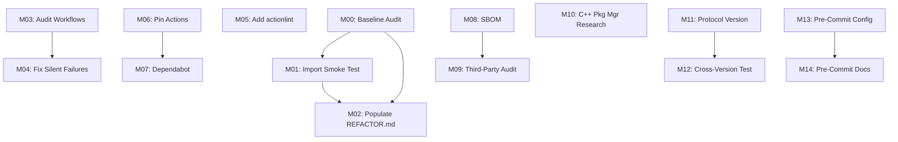

# PyTorch Refactor Phase Map

**Purpose**: Define a phased roadmap for refactoring PyTorch with small, verifiable milestones.

**Audit Date**: 2026-02-08  
**Baseline Commit**: c5f1d40

---

## Guiding Principles

1. **Truth & Safety First**: Establish verification infrastructure before major structural changes
2. **PR-Sized Milestones**: Each milestone should fit in a single PR (or at most 2-3 coordinated PRs)
3. **Non-Overlapping Scope**: Milestones should not have conflicting file changes
4. **Incremental Value**: Each milestone must deliver standalone value (testing, docs, tooling, or fixes)
5. **Rollback-Friendly**: Every milestone must have a clear rollback plan

---

## Phase 0: Foundation & Verification (M00-M02)

**Goal**: Establish baseline governance and minimal verification without requiring C++ build.

### M00: Baseline Audit (This Document)

**Status**: ✅ Complete  
**Intent**: Establish refactoring baseline through comprehensive audit  
**Scope**:
- Audit pack documents (9 files)
- `REFACTOR.md` initialization
- Tool logging infrastructure

**Invariants Protected**: None (documentation only)

**Verification Plan**: Documentation review

**Risk**: None (no code changes)

**Rollback**: N/A

**Deliverables**:
- [x] `BASELINE_AUDIT.md`
- [x] `SYSTEM_SURFACES.md`
- [x] `INVARIANTS_CATALOG.md`
- [x] `REFACTOR_PHASE_MAP.md` (this document)
- [x] `MODULE_BOUNDARY_MAP.md`
- [x] `TESTING_GAPS_AND_PLAN.md`
- [x] `CI_GAPS_AND_GUARDRAILS.md`
- [x] `SECURITY_AND_SUPPLY_CHAIN_BASELINE.md`
- [x] `DEFINITION_OF_DONE.md`
- [x] `docs/refactor/audit/README.md`
- [x] `docs/refactor/toolcalls.md` (initialized)

---

### M01: Import Smoke Test (No Build Required)

**Status**: 🔵 Planned  
**Intent**: Verify Python import paths work without C++ build  
**Scope Boundaries**:
- Create `test/test_import_smoke.py`
- Test imports from `torch`, `torch.nn`, `torch.optim`, etc.
- Mock `torch._C` if necessary (import-only, no execution)

**Invariants Protected**:
- INV-050: Import Path Stability

**Verification Plan**:
1. Run `python test/test_import_smoke.py` locally
2. Add to CI as fast pre-check (runs before build)

**Expected Risk**: 🟢 Low (read-only test)

**Rollback**: Delete test file

**Deliverables**:
- [ ] `test/test_import_smoke.py`
- [ ] CI workflow update (add smoke test job)
- [ ] Documentation: `docs/refactor/milestones/M01/M01_plan.md`

**Estimated Effort**: 4 hours

---

### M02: Populate REFACTOR.md

**Status**: 🔵 Planned  
**Intent**: Establish governance doc as source of truth  
**Scope Boundaries**:
- Update `REFACTOR.md` with:
  - Link to audit pack
  - Milestone table (M00-M02 completed)
  - Architectural principles
  - Deprecation policy

**Invariants Protected**: INV-060 (Deprecation Cycle Enforcement)

**Verification Plan**: Documentation review

**Expected Risk**: 🟢 None (documentation only)

**Rollback**: N/A

**Deliverables**:
- [ ] `REFACTOR.md` (populated)
- [ ] Milestone table with M00, M01, M02

**Estimated Effort**: 2 hours

---

## Phase 1: CI Health & Guardrails (M03-M10)

**Goal**: Improve CI reliability, eliminate silent failures, secure supply chain.

### M03: Audit Workflows for Silent Failures

**Status**: 🔵 Planned  
**Intent**: Identify workflows with `continue-on-error: true`, `if: always()`, or other bypass patterns  
**Scope Boundaries**:
- Audit all 130+ `.github/workflows/*.yml` files
- Document findings in `docs/refactor/milestones/M03/M03_findings.md`
- No code changes (audit only)

**Invariants Protected**: None (observational)

**Verification Plan**: Manual review + static analysis (YAML parsing)

**Expected Risk**: 🟢 None (read-only)

**Rollback**: N/A

**Deliverables**:
- [ ] `M03_findings.md` (list of workflows with silent failure patterns)
- [ ] Recommendations for M04

**Estimated Effort**: 8 hours

---

### M04: Fix Silent Failures (High-Priority Workflows)

**Status**: 🔵 Planned  
**Intent**: Remove silent failures from critical workflows (`pull.yml`, `trunk.yml`, `lint.yml`)  
**Scope Boundaries**:
- Edit 3-5 workflows identified in M03
- Remove `continue-on-error: true` or replace with explicit failure handling

**Invariants Protected**: None (CI improvement)

**Verification Plan**:
- Test workflow changes in PR
- Verify CI fails loudly when expected

**Expected Risk**: 🟡 Medium (could expose latent failures)

**Rollback**: `git revert` workflow changes

**Deliverables**:
- [ ] Updated workflows (3-5 files)
- [ ] `M04_summary.md` (what was fixed)

**Estimated Effort**: 6 hours

---

### M05: Add `actionlint` to CI

**Status**: 🔵 Planned  
**Intent**: Prevent workflow YAML errors from merging  
**Scope Boundaries**:
- Add `.github/workflows/actionlint.yml`
- Run `actionlint` on all workflow files
- Make it a required check

**Invariants Protected**: None (CI quality)

**Verification Plan**:
- Introduce intentional YAML error, verify CI catches it

**Expected Risk**: 🟢 Low (linter is read-only)

**Rollback**: Remove workflow file

**Deliverables**:
- [ ] `.github/workflows/actionlint.yml`
- [ ] Update branch protection to require actionlint check

**Estimated Effort**: 4 hours

---

### M06: Pin All Workflow Actions to SHA

**Status**: 🔵 Planned  
**Intent**: Eliminate supply chain risk from `@main` and mutable tag references  
**Scope Boundaries**:
- Audit all `uses:` statements in workflows
- Replace `@main`, `@v4` with commit SHAs
- Document SHA→version mapping in comments

**Invariants Protected**: None (security hardening)

**Verification Plan**:
- CI runs successfully after pinning
- No functional changes

**Expected Risk**: 🟡 Medium (incorrect SHA = broken CI)

**Rollback**: `git revert` workflow changes

**Deliverables**:
- [ ] All workflows updated (130+ files, scripted update)
- [ ] `M06_action_pins.json` (mapping of action→SHA→version)

**Estimated Effort**: 12 hours (scripted, but requires validation)

---

### M07: Add Dependabot for Action Updates

**Status**: 🔵 Planned  
**Intent**: Automate action version updates  
**Scope Boundaries**:
- Add `.github/dependabot.yml`
- Configure for `github-actions` ecosystem

**Invariants Protected**: None (maintenance automation)

**Verification Plan**:
- Dependabot opens PR for action update

**Expected Risk**: 🟢 Low

**Rollback**: Delete `.github/dependabot.yml`

**Deliverables**:
- [ ] `.github/dependabot.yml`

**Estimated Effort**: 2 hours

---

### M08: Generate SBOM for Vendored Dependencies

**Status**: 🔵 Planned  
**Intent**: Document supply chain for `third_party/` vendored code  
**Scope Boundaries**:
- Use `syft` or `cyclonedx-cli` to generate SBOM
- Check in `docs/refactor/SBOM.json`
- Document vendored versions

**Invariants Protected**: None (supply chain visibility)

**Verification Plan**:
- SBOM validates with SBOM schema validator

**Expected Risk**: 🟢 Low (documentation only)

**Rollback**: Delete SBOM file

**Deliverables**:
- [ ] `docs/refactor/SBOM.json`
- [ ] `docs/refactor/THIRD_PARTY_VERSIONS.md` (human-readable)

**Estimated Effort**: 6 hours

---

### M09: Add Periodic Third-Party Version Audit Script

**Status**: 🔵 Planned  
**Intent**: Alert when vendored dependencies are outdated  
**Scope Boundaries**:
- Create `scripts/audit_third_party_versions.py`
- Compare vendored versions vs GitHub releases
- Run monthly in CI (cron job)

**Invariants Protected**: None (monitoring)

**Verification Plan**:
- Script runs successfully
- Reports known outdated dep (e.g., `pybind11`)

**Expected Risk**: 🟢 Low

**Rollback**: Delete script

**Deliverables**:
- [ ] `scripts/audit_third_party_versions.py`
- [ ] Cron workflow: `.github/workflows/audit-third-party.yml`

**Estimated Effort**: 8 hours

---

### M10: Investigate Package Manager for C++ Deps (Research Only)

**Status**: 🔵 Planned  
**Intent**: Evaluate `conan`, `vcpkg`, `bazel` external deps for replacing vendored code  
**Scope Boundaries**:
- Document findings in `M10_cpp_package_managers.md`
- No code changes (research only)

**Invariants Protected**: None

**Verification Plan**: Documentation review

**Expected Risk**: 🟢 None

**Rollback**: N/A

**Deliverables**:
- [ ] `M10_cpp_package_managers.md` (recommendation: adopt vs keep vendoring)

**Estimated Effort**: 12 hours (research + prototyping)

---

## Phase 2: Test Infrastructure (M11-M14)

**Goal**: Close critical testing gaps identified in audit.

### M11: Add Distributed Protocol Version Check

**Status**: 🔵 Planned  
**Intent**: Prevent silent failures from cross-version incompatibility  
**Scope Boundaries**:
- Add `torch.distributed._protocol_version` constant
- Check version in `init_process_group()`
- Add test: start two processes with mismatched versions

**Invariants Protected**:
- INV-030: Collective Wire Protocol Compatibility
- INV-031: RPC Serialization Compatibility

**Verification Plan**:
- Run `test/distributed/` suite
- Test cross-version scenario (old client, new server)

**Expected Risk**: 🟡 Medium (could expose latent incompatibilities)

**Rollback**: Remove version check (revert to implicit compatibility)

**Deliverables**:
- [ ] `torch/distributed/_protocol_version.py`
- [ ] Updated `init_process_group()` with version check
- [ ] `test/distributed/test_protocol_version.py`

**Estimated Effort**: 16 hours

---

### M12: Add Distributed Cross-Version Integration Test

**Status**: 🔵 Planned  
**Intent**: Verify distributed collectives work across PyTorch versions  
**Scope Boundaries**:
- Install two PyTorch versions in test env (e.g., 2.1 + 2.2)
- Run `all_reduce()` across versions
- Expect graceful failure (with M11 version check)

**Invariants Protected**:
- INV-030: Collective Wire Protocol Compatibility

**Verification Plan**:
- Test passes with same version
- Test fails gracefully with different versions

**Expected Risk**: 🟡 Medium (complex test setup)

**Rollback**: Delete test

**Deliverables**:
- [ ] `test/distributed/test_cross_version.py`

**Estimated Effort**: 12 hours

---

### M13: Add Pre-Commit Configuration

**Status**: 🔵 Planned  
**Intent**: Enable local linting before push  
**Scope Boundaries**:
- Add `.pre-commit-config.yaml`
- Include: `lintrunner`, `ruff format --check`, trailing whitespace check
- Document in `CONTRIBUTING.md`

**Invariants Protected**: None (dev experience)

**Verification Plan**:
- `pre-commit run --all-files` succeeds

**Expected Risk**: 🟢 Low (local tooling only)

**Rollback**: Delete `.pre-commit-config.yaml`

**Deliverables**:
- [ ] `.pre-commit-config.yaml`
- [ ] Update `CONTRIBUTING.md`

**Estimated Effort**: 4 hours

---

### M14: Document Pre-Commit Setup (Docs Only)

**Status**: 🔵 Planned  
**Intent**: Encourage developers to use pre-commit hooks  
**Scope Boundaries**:
- Add setup instructions to `CONTRIBUTING.md`
- Note: NOT enforced as CI blocker (too many existing lint failures)

**Invariants Protected**: None

**Verification Plan**: Documentation review

**Expected Risk**: 🟢 None

**Rollback**: N/A

**Deliverables**:
- [ ] Updated `CONTRIBUTING.md`

**Estimated Effort**: 2 hours

---

## Phase 3: Verification Infrastructure (M15-M22)

**Goal**: Add missing verification for critical invariants.

### M15: Add ABI Compatibility Checker

**Status**: 🔵 Planned  
**Intent**: Detect C++ ABI breaks before they reach users  
**Scope Boundaries**:
- Add `abi-compliance-checker` or `abi-dumper` to CI
- Run on `libtorch.so` / `torch.dll`
- Baseline ABI dump

**Invariants Protected**:
- INV-002: C++ API (ATen) Signatures

**Verification Plan**:
- Introduce intentional ABI break, verify CI catches it

**Expected Risk**: 🟠 Medium-High (C++ build required, slow)

**Rollback**: Remove CI job

**Deliverables**:
- [ ] `.github/workflows/abi-check.yml`
- [ ] Baseline ABI dump: `abi-dumps/pytorch-2.x.x.abi.tar.gz`

**Estimated Effort**: 16 hours

---

### M16: Add Determinism Test Harness

**Status**: 🔵 Planned  
**Intent**: Verify ops are deterministic when `torch.use_deterministic_algorithms(True)`  
**Scope Boundaries**:
- Add `test/test_determinism.py`
- Run subset of ops twice, compare outputs

**Invariants Protected**:
- INV-012: Determinism (When Requested)

**Verification Plan**:
- Test passes for deterministic ops
- Test fails (or skips) for non-deterministic ops

**Expected Risk**: 🟢 Low

**Rollback**: Delete test

**Deliverables**:
- [ ] `test/test_determinism.py`

**Estimated Effort**: 8 hours

---

### M17: Improve TorchScript Backward Compat Tests

**Status**: 🔵 Planned  
**Intent**: Expand coverage for `.pt` model loading across versions  
**Scope Boundaries**:
- Add more model architectures to `test/forward_backward_compatibility/`
- Test complex control flow (if/else, loops)

**Invariants Protected**:
- INV-021: TorchScript Model Compatibility

**Verification Plan**:
- Load old model, verify output matches

**Expected Risk**: 🟢 Low

**Rollback**: Delete new test models

**Deliverables**:
- [ ] Additional test models in `test/forward_backward_compatibility/`

**Estimated Effort**: 12 hours

---

### M18: Add State Dict Key Regression Test

**Status**: 🔵 Planned  
**Intent**: Prevent accidental state dict key changes  
**Scope Boundaries**:
- Add `test/test_state_dict_keys.py`
- Snapshot state dict keys for all `nn.*` modules
- Fail if keys change

**Invariants Protected**:
- INV-022: State Dict Key Stability

**Verification Plan**:
- Rename a state dict key, verify test fails

**Expected Risk**: 🟢 Low

**Rollback**: Delete test

**Deliverables**:
- [ ] `test/test_state_dict_keys.py`
- [ ] Key snapshots: `test/expect/state_dict_keys.json`

**Estimated Effort**: 8 hours

---

### M19: Automate Deprecation Policy Check

**Status**: 🔵 Planned  
**Intent**: Enforce 2-release deprecation cycle  
**Scope Boundaries**:
- Add script: `scripts/check_deprecation_policy.py`
- Parse `warnings.warn(..., DeprecationWarning)`
- Verify deprecated features have version tags

**Invariants Protected**:
- INV-060: Deprecation Cycle Enforcement

**Verification Plan**:
- Script passes on current codebase

**Expected Risk**: 🟡 Medium (may expose missing deprecation warnings)

**Rollback**: Delete script (policy remains manual)

**Deliverables**:
- [ ] `scripts/check_deprecation_policy.py`
- [ ] CI integration

**Estimated Effort**: 12 hours

---

### M20: Improve Doctest Coverage (Low Priority)

**Status**: 🔵 Deferred  
**Intent**: Ensure docstring examples are correct  
**Scope Boundaries**:
- Add doctests to `torch.*` core functions
- Run `pytest --doctest-modules`

**Invariants Protected**:
- INV-071: Docstring Accuracy

**Verification Plan**:
- Doctests pass

**Expected Risk**: 🟢 Low

**Rollback**: Remove doctests

**Deliverables**:
- [ ] Doctests added to 50+ functions

**Estimated Effort**: 20 hours (low ROI, deferred)

---

### M21: Add Performance Regression Gate

**Status**: 🔵 Deferred  
**Intent**: Prevent perf regressions on critical ops  
**Scope Boundaries**:
- Run `benchmarks/operator_benchmark/` on PR
- Compare vs main branch
- Fail if >5% regression

**Invariants Protected**:
- INV-080: No Performance Regression (Critical Ops)

**Verification Plan**:
- Introduce artificial slowdown, verify CI catches it

**Expected Risk**: 🟠 Medium-High (flaky benchmarks, CI time)

**Rollback**: Remove CI job

**Deliverables**:
- [ ] `.github/workflows/perf-regression.yml`

**Estimated Effort**: 20 hours (deferred due to CI time cost)

---

### M22: Add Memory Regression Test

**Status**: 🔵 Deferred  
**Intent**: Prevent unbounded memory growth  
**Scope Boundaries**:
- Profile `torch.cuda.max_memory_allocated()` for key ops
- Fail if peak memory increases >10%

**Invariants Protected**:
- INV-081: Memory Overhead Bound

**Verification Plan**:
- Introduce memory leak, verify test catches it

**Expected Risk**: 🟠 Medium (flaky, hardware-dependent)

**Rollback**: Delete test

**Deliverables**:
- [ ] `test/test_memory_regression.py`

**Estimated Effort**: 16 hours (deferred, similar concerns to M21)

---

## Phase 4: Structural Refactors (M23-M30, Future)

**Goal**: After safety infrastructure is in place, begin architectural improvements.

**Note**: These milestones are placeholders. Specific refactor targets will be defined after Phase 1-3 completion.

### Potential Future Milestones

- **M23**: Extract `torch.distributed` into separate repo (if desired)
- **M24**: Migrate legacy `caffe2` code to `torch` namespace
- **M25**: Consolidate codegen (`torchgen/` + `aten/src/ATen/gen.py`)
- **M26**: Refactor `torch._dynamo` import hooks (reduce global state)
- **M27**: Improve `torch.nn.Module` hook API (performance + clarity)
- **M28**: Unify CUDA/ROCm/XPU device abstractions
- **M29**: Deprecate TorchScript (if `torch.export` replaces it)
- **M30**: ...

---

## Milestone Summary Table

| ID | Phase | Milestone | Effort | Risk | Dependencies | Status |
|----|-------|-----------|--------|------|--------------|--------|
| **M00** | Foundation | Baseline Audit | 40h | None | None | ✅ Complete |
| **M01** | Foundation | Import Smoke Test | 4h | Low | M00 | 🔵 Planned |
| **M02** | Foundation | Populate REFACTOR.md | 2h | None | M00, M01 | 🔵 Planned |
| **M03** | CI Health | Audit Workflows (Silent Failures) | 8h | None | None | 🔵 Planned |
| **M04** | CI Health | Fix Silent Failures | 6h | Medium | M03 | 🔵 Planned |
| **M05** | CI Health | Add actionlint | 4h | Low | None | 🔵 Planned |
| **M06** | CI Health | Pin Actions to SHA | 12h | Medium | None | 🔵 Planned |
| **M07** | CI Health | Add Dependabot | 2h | Low | M06 | 🔵 Planned |
| **M08** | CI Health | Generate SBOM | 6h | Low | None | 🔵 Planned |
| **M09** | CI Health | Third-Party Audit Script | 8h | Low | M08 | 🔵 Planned |
| **M10** | CI Health | Research C++ Pkg Mgr | 12h | None | None | 🔵 Planned |
| **M11** | Testing | Distributed Protocol Version | 16h | Medium | None | 🔵 Planned |
| **M12** | Testing | Cross-Version Integration Test | 12h | Medium | M11 | 🔵 Planned |
| **M13** | Testing | Pre-Commit Config | 4h | Low | None | 🔵 Planned |
| **M14** | Testing | Pre-Commit Docs | 2h | None | M13 | 🔵 Planned |
| **M15** | Verification | ABI Compatibility Checker | 16h | Medium-High | None | 🔵 Planned |
| **M16** | Verification | Determinism Test Harness | 8h | Low | None | 🔵 Planned |
| **M17** | Verification | TorchScript BC Tests | 12h | Low | None | 🔵 Planned |
| **M18** | Verification | State Dict Key Test | 8h | Low | None | 🔵 Planned |
| **M19** | Verification | Deprecation Policy Check | 12h | Medium | None | 🔵 Planned |
| **M20** | Verification | Doctest Coverage | 20h | Low | None | 🟡 Deferred |
| **M21** | Verification | Perf Regression Gate | 20h | Medium-High | None | 🟡 Deferred |
| **M22** | Verification | Memory Regression Test | 16h | Medium | None | 🟡 Deferred |
| **M23-M30** | Structural | (To Be Defined) | TBD | TBD | Phases 1-3 | ⬜ Future |

**Total Estimated Effort (M01-M19)**: ~172 hours (~4-5 weeks for one person)

---

## Dependency Graph (Phases 1-3)

**Parallelizable Milestones**:
- M03, M05, M06, M08, M10, M11, M13, M15, M16, M17, M18, M19 can all run in parallel (non-overlapping)

---

## Rollback Strategy

**For Each Milestone**:
1. **Pre-Merge**: Test in PR, require CI green
2. **Post-Merge**: Monitor for 24-48 hours
3. **Rollback Trigger**: CI failures, user reports, performance regression
4. **Rollback Method**:
   - `git revert <commit>` (clean rollback)
   - Or hotfix forward (if revert is complex)
5. **Post-Rollback**: Document issue, add test to prevent recurrence

---

## Success Criteria

**Phase 0 (Foundation)**:
- ✅ Baseline audit complete
- [ ] Import smoke test passes
- [ ] `REFACTOR.md` populated and maintained

**Phase 1 (CI Health)**:
- [ ] No silent CI failures in critical workflows
- [ ] All actions pinned to SHA
- [ ] SBOM generated, third-party audit automated

**Phase 2 (Testing)**:
- [ ] Distributed protocol version enforced
- [ ] Pre-commit hooks available (optional use)

**Phase 3 (Verification)**:
- [ ] All P0 invariants have strong verification (see INVARIANTS_CATALOG.md)
- [ ] All P1 invariants have at least partial verification

**Phase 4 (Structural)**:
- TBD based on results of Phases 1-3

---

**End of Refactor Phase Map**

