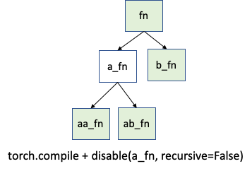

TorchDynamo APIs to control fine-grained tracing
================================================

`torch.compile` performs TorchDynamo tracing on all the user model. However, it is possible that a small part of the model code is not amenable to PT2 compilation stack. And you want to just disable PT2 on that particular portion, while running compilation on the rest of the model. This doc shares the existing APIs that give you such control and the relevant usecases.

Existing APIs

* torch._dynamo.disable
* torch._dynamo.disallow_in_graph
* torch._dynamo.graph_break
* torch._dynamo.allow_in_graph

Section 1 - Summary Table
=========================

.. _section-1-summary-table:

.. csv-table:: TorchDynamo APIs to control fine-grained tracing
   :header: "API", "Description", "When to use?"
   :widths: auto

   "torch._dynamo.disable", "Disables Dynamo on the decorated function as well as recursively invoked functions.", "Excellent for unblocking a user, if a small portion of the model is not PT2-friendly."
   "torch._dynamo.disallow_in_graph", "Disallows the marked op in the TorchDynamo graph. TorchDynamo causes graph break, and runs the op in the eager (no compile) mode.\n\nThis is suitable for ops, while _dynamo.disable is suitable for decorating functions.", "Excellent for both debugging and unblocking if a custom op (like torch.ops.fbgemm.*) is causing issues with the PT2 compile."
   "torch._dynamo.allow_in_graph", "The annotated callable goes as-is in the TorchDynamo graph, i.e., a black-box for TorchDynamo Dynamo.\n\nNote that AOT Autograd will trace through it, so the allow_in_graph is only a Dynamo level concept.", "Useful for portions of the model which have known TorchDynamo hard-to-support features, like hooks, autograd.Function. However, each usage of allow_in_graph **must be carefully screened** (no graph breaks, no closures)."
   "torch._dynamo.graph_break", "Adds a graph break. The code before and after the graph break goes through TorchDynamo.", "**Rarely useful for deployment** - If you think you need this, most probably you need either `disable` or `disallow_in_graph`."

Section 2 - torch._dynamo.disable
=================================

.. _section-2-torch-_dynamo-disable:

**tl;dr** - Disables PT2 stack on the decorated function frame and all the function frames recursively invoked from the decorated function frame.

**Explanation** - TorchDynamo intercepts the execution of each Python function frame. So, suppose you have a code structure (image below) where the function `fn` calls functions `a_fn` and `b_fn`. And `a_fn` calls `aa_fn` and `ab_fn`. In the eager world (no torch.compile), these function frames run as-is. With torch.compile, TorchDynamo intercepts each of these function frames (indicated by the green color).

.. figure:: ../_static/img/fine_grained_apis/api_diagram.png
   :alt: Callstack diagram of differnet apis.

**Usecase** - Now suppose function `a_fn` is causing troubles with `torch.compile`. And this is a non-critical portion of the model. You can use `_dynamo.disable` on function `a_fn`. As shown above, TorchDynamo will stop looking at frames originating from `a_fn` call (white color indicates original Python behavior).

**Usage**

You can decorate the offending function with `@torch._dynamo.disable`

You can also use the non-decorator syntax if you don’t want to change the source code (however avoid this style if possible. Here, you have to take care that all users of the original function are now using the patched version).

Section 3 - torch._dynamo.disallow_in_graph
===========================================

.. _section-3-torch-_dynamo-disallow_in_graph:

**tl;dr** - Disallows an operator (not the function) to be present in the TorchDynamo extracted graph. Note that this is suitable for operators (and not general functions as in the case of `_dynamo.disable`).

**Usecase** - Suppose you compile your model with PT2. TorchDynamo is able to extract a graph, but then you see the downstream compiler failing (like the meta kernel is missing, or some autograd dispatch key is set incorrectly etc) for a particular operator. Then you can mark that operator as `disallow_in_graph`, and TorchDynamo will cause a graph break and run that operator on eager.

The catch is that you will have to find the corresponding Dynamo level operator here (and not the aten level operator). See more in the Limitations section of the doc.

**Warning** - This is a global flag. So be cautious, if you are comparing different backend compilers. You might have to call `allow_in_graph` for the disallowed op when switching to the other compiler.

Section 4 - torch._dynamo.disallow_in_graph
===========================================

.. _section-4-torch-_dynamo-disallow_in_graph:

**Usecase** - This is useful when the relevant function frame has some known hard-to-support TorchDynamo feature (like hooks and autograd.Function) and you are confident that downstream PT2 components like AOTAutograd can safely trace through the decorated function. When a function is decorated with `allow_in_graph`, TorchDynamo treats it as a black-box and puts it as-is in the generated graph.

**Warning - `allow_in_graph`** skips TorchDynamo completely on the decorated function, skipping all TorchDynamo safety checks (graph breaks, handling closures etc). Therefore, one has to be very careful with `allow_in_graph`. Today downstream components like AOT Autograd rely on TorchDynamo to take care of complex Python features, but `allow_in_graph` bypasses TorchDynamo. If not careful, this could lead to soundness and really hard-to-debug issues.

Section 5 - Limitations
=======================

.. _section-5-limitations:

All the existing APIs are applied at the TorchDynamo level. Therefore, these APIs have visibility to only what TorchDynamo sees. This can lead to confusing scenarios.

For example, `_dynamo.disallow_in_graph` will not work for aten operators because they are visible to AOT Autograd (example - `torch._dynamo.disallow_in_graph(torch.ops.aten.add)` will not work in the above example).

Section 6 - FAQ
===============

.. _section-6-faq:

**FAQ - How do I graph break on a function?**

Graph break on a function is not enough to describe what you really want. So, you will have to be more specific about your usecase. From experience, these are the interesting usecases

* Do you want to disable PT2 stack on this function frame and the recursively invoked frames? Use `_dynamo.disable`.
* Do you want a particular operator (like fbgemm custom ops) to be eager?  Use `_dynamo.disallow_in_graph`

Following are rare scenarios

* Rare scenario - you want to disable dynamo on the function frame but enable it back on the recursively invoked frames. Use `_dynamo.disable(recursive=False)`
* Even rare scenario - you want to prevent inlining of a function frame. Use `_dynamo.graph_break` at the beginning of the function you want to prevent inlining.

**FAQ - Difference between disable and disallow-in-graph**

Disallow-in-graph works at the level of operators, or more specifically, the operators that you see in the TorchDynamo extracted graphs.

Disable works at the function frame level and decides if TorchDynamo should look into the function frame or not.

**FAQ - Difference between disable and now-deprecated skip -** You most likely need `_dynamo.disable`. But in an unlikely scenario, you might need even finer control. Suppose you want to disable the tracing on just the function `a_fn`, but want to continue the tracing back in `aa_fn` and `ab_fn`. This is shown below

In this case, you can use `torch._dynamo.disable(recursive=False)`. Earlier, this functionality was provided by `_dynamo.skip.` This is now supported by the `recursive` flag inside disable.

# Wishlist

We will evaluate if the following options make sense

* Disable at a file/directory in addition to function frames (cc ?)
* Disable all the ops inside a namespace like torch.ops.fbgemm.* (cc )
* What is skipfiles_inline_module_allowlist - Can we refactor this? (cc )

Others

* Logging - Breadcrumbs to signal/warn the user about usage of disable. If users forgot to remove the _dynamo.disable from the code, this warning can be super helpful.
* Namespace discussion - Should we move to torch.compile instead of torch._dynamo