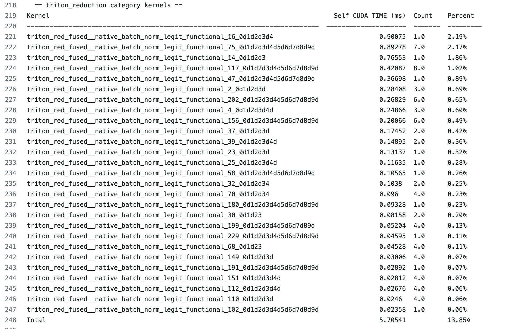
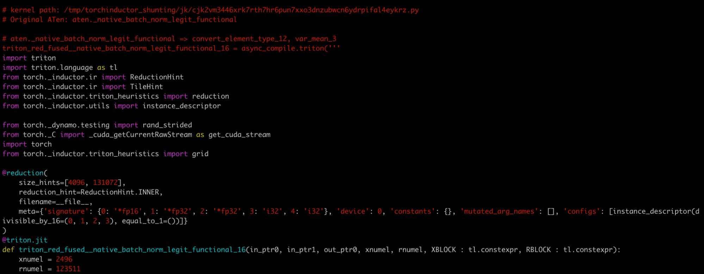
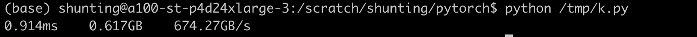
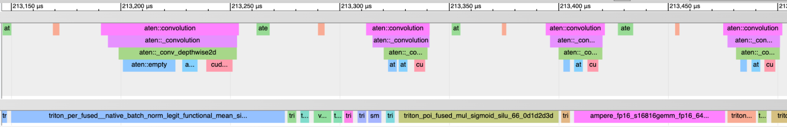

TorchInductor GPU Profiling
===========================

This document lists some useful commands and workflows that can help
people dive into a model’s perf in TorchInductor. When a model is not
running as fast as expected, we may want to dive into the model and
check individual kernels. Usually those kernels taking the majority of
GPU time are the most interesting ones. Once we decide the kernels, we
may also want to run individual kernels directly and inspect its perf.
We have tools to cover everything mentioned above.

## Relevant Environment Variables

-  TORCHINDUCTOR_UNIQUE_KERNEL_NAMES

   -  By default, inductor names a triton kernel as ‘triton\_’. When
      this envvar is enabled, inductor generates a more meaningful
      kernel name in the trace, like ``triton_poi_fused_cat_155`` which
      contains the kernel category (poi for pointwise) and original aten
      ops. This config is disabled by default to improve the chance of
      compilation cache hit.

-  TORCHINDUCTOR_BENCHMARK_KERNEL

   -  Enabling this will make inductor codegen harness to benchmark
      individual triton kernels.

-  TORCHINDUCTOR_MAX_AUTOTUNE

   -  Inductor autotuner will benchmark more triton.Configs and pick the
      one with the best perf. This will increase compilation time with
      the hope to improve perf.

## Breakdown Model GPU Time

Below are the steps to breakdown execution time of a model into
individual kernels. We take mixnet_l as an example.

1. Run the benchmark script for the model:

TORCHINDUCTOR_UNIQUE_KERNEL_NAMES=1 TORCHINDUCTOR_BENCHMARK_KERNEL=1
python -u benchmarks/dynamo/timm_models.py –backend inductor –amp
–performance –dashboard –only mixnet_l –disable-cudagraphs –training

NOTE: the tool relies on kernel name to decide its category. Enabling
TORCHINDUCTOR_UNIQUE_KERNEL_NAMES is crucial for that.

2. In the output log, look for lines like: **Compiled module path:
   /tmp/torchinductor_shunting/qz/cqz7hvhood7y3psp7fy6msjxsxyli7qiwiybizdwtjw6ffyq5wwd.py**

We have one line for each compiled module. If there are no extra graph
breaks, we would see 2 such lines in the log, one for the forward graph
and one for the backward graph.

For our example command, we get the following compiled module for the
forward and backward graphs respectively:

-  https://gist.github.com/shunting314/c2a4d8a28b00fcb5586d0e9d9bf77f9f
-  https://gist.github.com/shunting314/48efc83b12ec3ead950052e4a0220b10

3. Now we can dive into the perf for each individual compiled module.
   Let’s pick the one for the forward graph for illustration purposes.
   I’ll name it fwd.py for convenience. Run it directly with ‘-p’
   argument:

**> python fwd.py -p**

Here is the full output log I get:
https://gist.github.com/shunting314/8243734a38b5733ea78479209c0ae893

There are quite a lot of interesting things to note in the output

A.

We write a chrome trace file for the profile so we can load the trace and interact with it. In the log, look for lines as follows to find the path of the trace file.

**Chrome trace for the profile is written to
/tmp/compiled_module_profile.json**

Loading the trace into chrome ( visit chrome://tracing in the chrome
browser and load the file as the UI suggested ) will show UI as follows:

One can zoom in and out to check the profile.

B.

We report the percent of GPU time regarding to the wall time by log line like:

**Percent of time when GPU is busy: 102.88%**

Sometimes we see a value larger than 100%. The reason is we use the
kernel execution time with profiling enabled while using wall time with
profiling disabled. Profiling may distort the kernel execution time a
bit. But overall it should not be a big deal.

If we run model like densenet121 with a small batch size, we would see
low percent of time when GPU is busy:

::

   (Forward graph) Percent of time when GPU is busy: 32.69%

This means the model has a lot of CPU overhead. This is consistent with
the fact that enabling cudagraphs improve densenet121’s perf a lot.

C.

We can break down the GPU time to different categories of kernels. In the mixnet_l example, we see

-  pointwise kernel takes 28.58%
-  reduction kernel takes 13.85%
-  persistent reduction kernel takes 3.89%
-  the rest are cutlass/cudnn kernels for mm/conv which takes 56.57%

This information can be found in the summary line (i.e. the last line)
of the report for each kernel category.

D.

We call also zoom into a certain category of kernels, e.g. let’s check reduction kernels:

We can see an ordered table of execution time for each individual
reduction kernel. We also see how many times a kernel is executed. This
is helpful for a few reasons

-  if a kernel only takes a tiny amount of time (say 0.1%), improving it
   will at most bring 0.1% overall gain. It is not worth spending a lot
   of effort on it.
-  if a kernel takes 2% of time, improving it by 2x will bring in 1%
   overall gain which should be nice

## Benchmark Individual Triton Kernel

Let’s say we want to take a closer look at
triton_red_fused\__native_batch_norm_legit_functional_16 which is the
most expensive reduction kernel and takes 2.19% of overall wall time for
the forward graph.

We can lookup the kernel name in the fwd.py, and find comment like

**# kernel path:
/tmp/torchinductor_shunting/jk/cjk2vm3446xrk7rth7hr6pun7xxo3dnzubwcn6ydrpifal4eykrz.py**

I’ll rename it k.py for convenience. Here is a paste for this file:
https://gist.github.com/shunting314/96a0afef9dce53d6357bf1633094f358

k.py is a standalone python module containing the kernel code and its
benchmark.

Run k.py directly will report it’s execution time and bandwidth:

We can check if max-autotune helps this kernel, by running:

**TORCHINDUCTOR_MAX_AUTOTUNE=1 python /tmp/k.py**

We may also temporarily add more reduction heuristics and run the script
again to check how that helps with the kernel.
