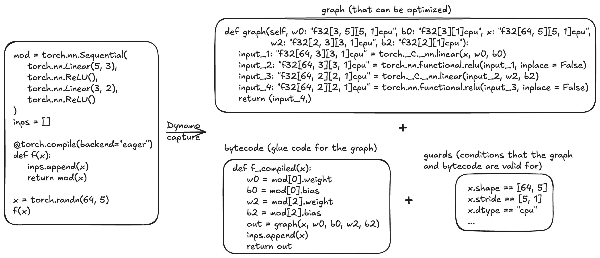

```{code-cell}
:tags: [remove-cell]
import torch

import header_code
```

# Dynamo Core Concepts

**Summary:**

- Dynamo, `torch.compile`'s frontend, performs **tracing** to capture the semantics of a Python function
  (and its nested function calls) into a linear sequence of operations (the "(FX) graph"),
  residual bytecode, and "guards" (a list of conditions under which the graph and bytecode are valid).
- Unsupported Python features lead to **graph breaks**, where Dynamo compiles a partial graph acquired from tracing,
  then runs the unsupported code, then resumes tracing.
- Graph breaks may lead to slowness in torch.compile and prevent backend optimization opportunities.
  If you're not seeing the performance you expect, then check for graph breaks.

## Dynamo Tracing
`torch.compile`'s frontend (Dynamo) is a custom Python bytecode interpreter designed to allow graph compilation
in PyTorch programs while retaining the full flexibility of Python. Given a function to be compiled, Dynamo
interprets Python bytecode to extract sequences of PyTorch operations into 1 or more FX graphs that may be further optimized by a backend.



For example, for the function `f` in the above diagram, Dynamo produces:
- a single **FX graph** that takes in the original input plus some additional inputs required by the function.
- **Python bytecode** that can be used as a drop-in replacement for `f`. In our example, the bytecode retrieves
  the additional inputs and passes it to the graph and also contains unoptimizable Python side effects (the list append)
- **guards** that specify the conditions under which the graph and bytecode are valid. Unless otherwise specified,
  the graph produced by Dynamo specializes on the shapes of input Tensors.

## Graph Breaks
Dynamo traces your code and attempts to capture your PyTorch code into a single computation graph of PyTorch
operators (FX graph). However, this is not always possible. When encountering code that can't be traced, a "**graph break**" occurs.
In the default `torch.compile` settings, a graph break involves compiling the FX graph that has been determined so far,
running the unsupported code in regular Python, then resuming tracing after the unsupported code with a new FX graph.

Graph breaks are a feature that allows Dynamo to run over arbitrary Python code and carve out functional subgraphs that can each be individually optimized.

However, it is possible for graph breaks to lead to unexpected slowness in `torch.compile`.
If you're not getting the speedups you expect, we recommend checking for graph breaks and removing them.

Graph breaks may occur on things like:

- Data-dependent if-statements
- Many Python built-in functions
- C functions

```{code-cell}
:tags: [remove-cell]
torch._logging.set_logs(graph_breaks=True)
```

Below is an example of a graph break due to calling an unsupported operation `torch.save`:

```{code-cell}
@torch.compile
def f(x):
   y = x ** 2  / 2
   torch.save(y, "foo.pt")  # torch.save is an unsupported operation
   z = y ** 3 / 6
   return z

x = torch.randn(3)
print(f(x))
```

```{code-cell}
:tags: [remove-cell]
import os
os.remove("foo.pt")
```

The semantics of `torch.compile(f)(x)` are roughly this:

```python
def compiled_f_semantics(x):
   y = torch.compile(g, fullgraph=True)(x)
   torch.save(y, "foo.pt")
   z = torch.compile(h, fullgraph=True)(x)
   return z

def g(x):
    return x ** 2  / 2

def h(x):
    return y ** 3 / 6
```

## Guards

`torch.compile` makes some assumptions about runtime values as we trace through code. During tracing, we generate "guards",
which are runtime checks for these assumptions. Guards are run in future calls to the compiled function to determine if we
can reuse previously compiled code. Examples of runtime checks are constant values, types, and object IDs.

Below is an example of generated guards. The `TENSOR_MATCH` guard checks for the input's type, device, dtype, shape, etc.

```{code-cell}
:tags: [remove-cell]
torch._logging.set_logs(guards=True)
```

```{code-cell}
@torch.compile
def fn(x):
    return x + 1

print(fn(torch.ones(3, 3)))
```

## Recompilations
If the guards fail for every instance of previously compiled code, then `torch.compile` must "recompile" the function,
requiring the original code to be traced again. In the example below, recompilation is necessary because the guard checking the tensor argument's shape failed.

```{code-cell}
:tags: [remove-cell]
torch._logging.set_logs(recompiles=True)
```

```{code-cell}
@torch.compile
def fn(x):
    return x + 1

print(fn(torch.ones(3, 3)))
print(fn(torch.ones(4, 4)))
```

## Dynamic Shapes

`torch.compile` initially assumes tensor shapes are static/constant and guards based on these assumptions. By using "dynamic shapes,"
we can get `torch.compile` to produce compiled code that can accept tensor inputs with different shapes - we avoid recompiling every time shapes differ.
By default, automatic dynamic shapes are enabled in `torch.compile(dynamic=None)` - if compilation fails due to shape mismatch,
recompilation is attempted with dynamic shapes. Dynamic shapes can also be fully enabled (`dynamic=True`) or disabled (`dynamic=False`).

Below, we enable dynamic shapes and note that we no longer need to recompile.

```{code-cell}
:tags: [remove-cell]
import logging
torch._logging.set_logs(dynamic=logging.DEBUG, recompiles=True)
```

```{code-cell}
@torch.compile(dynamic=True)
def fn(x):
    return x + 1

print(fn(torch.ones(3, 3)))
print(fn(torch.ones(4, 4)))
```

For more information on dynamic shapes, see [The dynamic shapes manual](https://docs.google.com/document/d/1GgvOe7C8_NVOMLOCwDaYV1mXXyHMXY7ExoewHqooxrs/edit?tab=t.0#heading=h.fh8zzonyw8ng).
