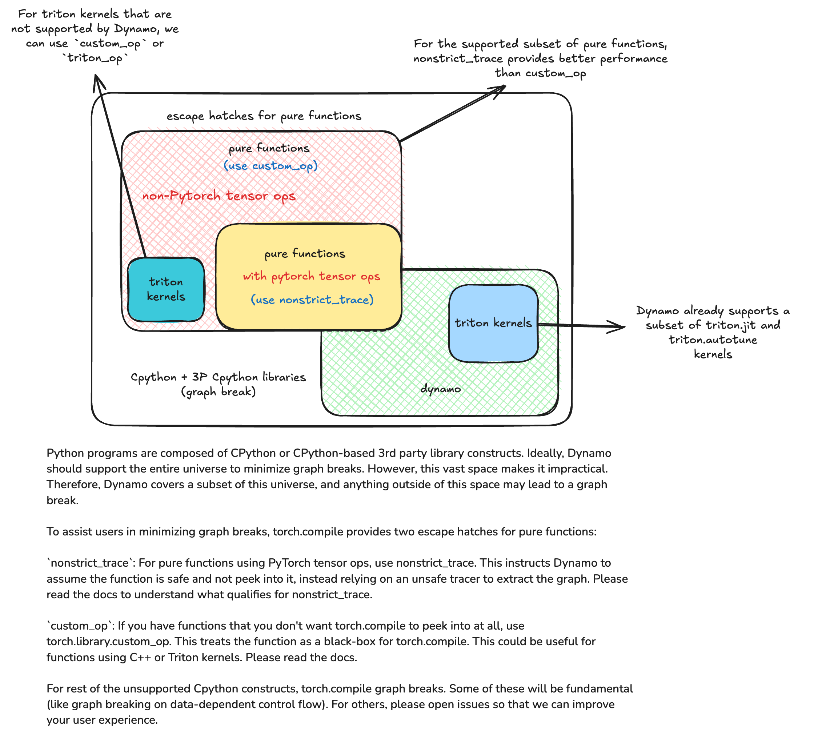

(programming_model.fullgraph_true)=

```{code-cell}
:tags: [remove-cell]
import torch
```

# Use `fullgraph=True` to Identify and Eliminate Graph Breaks

Using `torch.compile(fullgraph=False)` (the default) is a good way to get started with `torch.compile`: it supports all Python programs out-of-the-box via the ability to graph break and gives good performance on common cases.

However, if you're trying to get more performance out of your model, you should explicitly think about what regions of code should be compiled:
- We recommend using `torch.compile(fullgraph=True)` to find and eliminate graph breaks in your code.
- If you're a library developer (or testing if your code "works" with `torch.compile`), we recommend testing using `torch.compile(fullgraph=True)`.

`torch.compile(fullgraph=True)` offers stronger guarantees over `fullgraph=False`: **we will always capture a single FX graph to be compiled (or error if we cannot due to a graph break).

The below diagram gives an overview of Dynamo coverage and `torch.compile` escape hatches (ways to bypass tracing issues for large sections of code).



There are a number of strategies for fixing a graph break.

## Strategy 1:  Rewrite the unsupported code to use features supported by Dynamo

Note that it is sometimes difficult to determine if a feature is supported by Dynamo or not.
If the graph break error message does not give a clear indication of what to do, please move on to the next strategy.

Example: Dynamo does not support calling `next` on a `list_iterator` object that was an input to the function being compiled.

```{code-cell}
@torch.compile(fullgraph=True)
def f(xs):
    a = next(xs)
    b = next(xs)
    return a + b

xs = [torch.tensor(1.), torch.tensor(2.)]
try:
    out = f(iter(xs))
except Exception as e:
    print(e)
```

Instead, rewrite the compiled function to accept a list.

```{code-cell}
@torch.compile(fullgraph=True)
def f_rewritten(xs):
    it = iter(xs)
    a = next(it)
    b = next(it)
    return a + b

f_rewritten(xs)
```

## Strategy 2: Pure functions can always be compiled via an escape hatch.

A "pure function" is a function with the following properties:

- Determinism. Given the same inputs, the pure function will always return the same output
- No side effects. A pure function does not have any side effects such as modifying external state or performing I/O operations.
- Explicit input/output. All the input data must be passed through the function parameters and all of the outputs are returned from the function.

See Pure Functions for examples. TODO: link

Dynamo is theoretically able to handle a wide variety of impure functions, but may be lacking coverage for specific features. However, pure functions can always be compiled via an escape hatch.

If you have a graph break it may be possible to refactor the code around it into a pure function and use an escape hatch that bypasses Dynamo tracing:

- Use `torch._dynamo.nonstrict_trace` if you want the Tensor operations in the function to show up in the Dynamo output graph (and therefore be optimizable). `nonstrict_trace` tells Dynamo to use **non-strict tracing**.
- Use custom operators if you want the function to be opaque w.r.t. to `torch.compile` (both the frontend Dynamo and the backend).

Note that these escape hatches DO have support for impure functions (e.g. mutating input tensors), but please read the fine print carefully.

Example: use custom operators to create opaque functions w.r.t. to `torch.compile` TODO: link

```{code-cell}
from torchvision.transforms.functional import to_pil_image, pil_to_tensor
import PIL

def crop(pic, box):
    img = to_pil_image(pic.cpu())
    cropped_img = img.crop(box)
    return pil_to_tensor(cropped_img).to(pic.device) / 255.

@torch.compile(fullgraph=True)
def f(img):
    return crop(img, (10, 10, 50, 50))

img = torch.randn(3, 64, 64)
try:
    cropped_img = f(img)  # graph break
except Exception as e:
    print(e)
```


```{code-cell}
from typing import Sequence

# Use torch.library.custom_op to define a new custom operator.
# Custom operators are opaque with respect to torch.compile:
# that is, torch.compile does not peek into them.
@torch.library.custom_op("mylib::crop", mutates_args=())
def crop(pic: torch.Tensor, box: Sequence[int]) -> torch.Tensor:
    img = to_pil_image(pic.cpu())
    cropped_img = img.crop(box)
    return (pil_to_tensor(cropped_img) / 255.).to(pic.device, pic.dtype)

# Use register_fake to add a ``FakeTensor`` kernel for the operator
@crop.register_fake
def _(pic, box):
    channels = pic.shape[0]
    x0, y0, x1, y1 = box
    return pic.new_empty(channels, y1 - y0, x1 - x0)

img = torch.randn(3, 64, 64)
cropped_img = f(img)  # no graph-break
```

Example: If Dynamo doesn't support some Python feature or API that is non-strict traceable (e.g. it uses PyTorch operations), use `nonstrict_trace` to capture it instead. TODO: link

```{code-cell}
# this is a function that Dynamo doesn't support (due to the graph_break() call).
def g(x):
    y = x.sin()
    torch._dynamo.graph_break()
    z = y.sin()
    return z

@torch.compile(fullgraph=True)
def f(x):
    w = x.sin()
    return g(w)

x = torch.randn(3)
try:
    f(x)  # Graph Break: there was a call to torch._dynamo.graph_break()
except Exception as e:
    print(e)

@torch.compile(fullgraph=True)
def f_rewritten(x):
    w = x.sin()
    return torch._dynamo.nonstrict_trace(g)(w)
f_rewritten(x)  # works
```

## Strategy 3: Don't compile the code

Not all code is amenable to being compiled. `torch.compile` is a compiler for Tensor computation;
it will not be able to optimize things like disk IO.

```{code-cell}
@torch.compile(fullgraph=True)
def f(x):
   y = x ** 2  / 2
   torch.save(y, "foo.pt")
   z = y ** 3 / 6
   return z

x = torch.randn(3)
try:
    f(x)  # Graph Break: torch.save not supported
except Exception as e:
    print(e)
```

```{code-cell}
def f_rewritten(x):
   y = g(x)
   torch.save(y, "foo.pt")
   z = h(y)
   return z

@torch.compile(fullgraph=True)
def g(x):
   y = x ** 2  / 2
   return y

@torch.compile(fullgraph=True)
def h(y):
   z = y ** 3 / 6
   return z

f_rewritten(x)
```

```{code-cell}
:tags: [remove-cell]
import os
os.remove("foo.pt")
```
