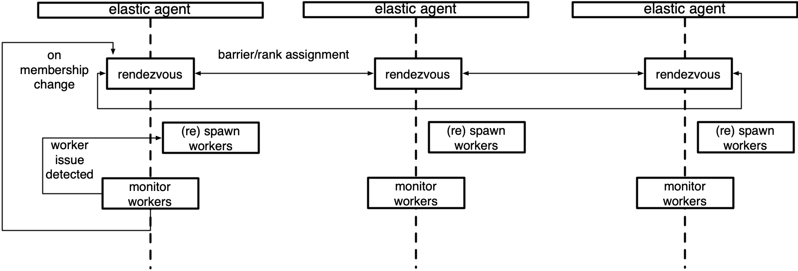

Elastic Agent
==============

.. automodule:: torch.distributed.elastic.agent
.. currentmodule:: torch.distributed.elastic.agent

Server
--------

.. automodule:: torch.distributed.elastic.agent.server

Below is a diagram of an agent that manages a local group of workers.



Concepts
--------

This section describes the high-level classes and concepts that
are relevant to understanding the role of the ``agent`` in torchelastic.

.. currentmodule:: torch.distributed.elastic.agent.server

.. autoclass:: ElasticAgent
   :members:

.. autoclass:: WorkerSpec
   :members:

.. autoclass:: WorkerState
   :members:

.. autoclass:: Worker
   :members:

.. autoclass:: WorkerGroup
   :members:

Implementations
-------------------

Below are the agent implementations provided by torchelastic.

.. currentmodule:: torch.distributed.elastic.agent.server.local_elastic_agent
.. autoclass:: LocalElasticAgent


Extending the Agent
---------------------

To extend the agent you can implement ```ElasticAgent`` directly, however
we recommend you extend ``SimpleElasticAgent`` instead, which provides
most of the scaffolding and leaves you with a few specific abstract methods
to implement.

.. currentmodule:: torch.distributed.elastic.agent.server
.. autoclass:: SimpleElasticAgent
   :members:
   :private-members:

.. autoclass:: torch.distributed.elastic.agent.server.api.RunResult
