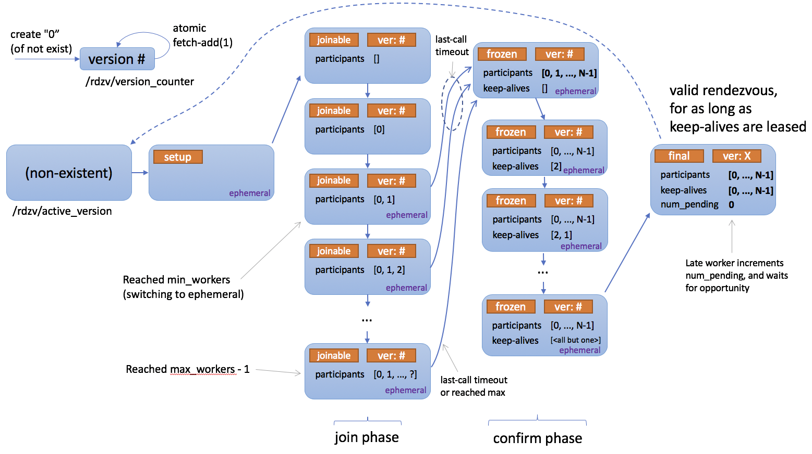

.. _rendezvous-api:

Rendezvous
==========

.. automodule:: torch.distributed.elastic.rendezvous

Below is a state diagram describing how rendezvous works.

Registry
--------

.. autoclass:: RendezvousParameters
   :members:

.. autoclass:: RendezvousHandlerRegistry
   :members:

.. automodule:: torch.distributed.elastic.rendezvous.registry

Handler
-------

.. currentmodule:: torch.distributed.elastic.rendezvous

.. autoclass:: RendezvousHandler
   :members:

Exceptions
----------
.. autoclass:: RendezvousError
.. autoclass:: RendezvousClosedError
.. autoclass:: RendezvousTimeoutError
.. autoclass:: RendezvousConnectionError
.. autoclass:: RendezvousStateError
.. autoclass:: RendezvousGracefulExitError

Implementations
---------------

Dynamic Rendezvous
******************

.. currentmodule:: torch.distributed.elastic.rendezvous.dynamic_rendezvous

.. autofunction:: create_handler

.. autoclass:: DynamicRendezvousHandler()
   :members: from_backend

.. autoclass:: RendezvousBackend
   :members:

.. autoclass:: RendezvousTimeout
   :members:

C10d Backend
^^^^^^^^^^^^

.. currentmodule:: torch.distributed.elastic.rendezvous.c10d_rendezvous_backend

.. autofunction:: create_backend

.. autoclass:: C10dRendezvousBackend
   :members:

Etcd Backend
^^^^^^^^^^^^

.. currentmodule:: torch.distributed.elastic.rendezvous.etcd_rendezvous_backend

.. autofunction:: create_backend

.. autoclass:: EtcdRendezvousBackend
   :members:

Etcd Rendezvous (Legacy)
************************

.. warning::
    The ``DynamicRendezvousHandler`` class supersedes the ``EtcdRendezvousHandler``
    class, and is recommended for most users. ``EtcdRendezvousHandler`` is in
    maintenance mode and will be deprecated in the future.

.. currentmodule:: torch.distributed.elastic.rendezvous.etcd_rendezvous

.. autoclass:: EtcdRendezvousHandler

Etcd Store
**********

The ``EtcdStore`` is the C10d ``Store`` instance type returned by
``next_rendezvous()`` when etcd is used as the rendezvous backend.

.. currentmodule:: torch.distributed.elastic.rendezvous.etcd_store

.. autoclass:: EtcdStore
   :members:

Etcd Server
***********

The ``EtcdServer`` is a convenience class that makes it easy for you to
start and stop an etcd server on a subprocess. This is useful for testing
or single-node (multi-worker) deployments where manually setting up an
etcd server on the side is cumbersome.

.. warning:: For production and multi-node deployments please consider
             properly deploying a highly available etcd server as this is
             the single point of failure for your distributed jobs.

.. currentmodule:: torch.distributed.elastic.rendezvous.etcd_server

.. autoclass:: EtcdServer
