.. _holistic_trace_analysis:

Holistic Trace Analysis
=======================
Holistic Trace Analysis (HTA) is an open source performance analysis and
visualization Python library for PyTorch users. HTA takes as input `Kineto
traces <https://github.com/pytorch/kineto>`_ collected by the `PyTorch Profiler
<https://pytorch.org/blog/introducing-pytorch-profiler-the-new-and-improved-performance-tool/>`_
and up-levels the performance information contained in the traces.

ML researchers and systems engineers often struggle to computationally scale up
their models because they are not aware of the performance bottlenecks in their
workloads. The resources requested for a job (e.g. GPUs, memory) are often
misaligned with the resources actually required due to lack of visibility
“under the hood”.

The goal of HTA is to help engineers and researchers achieve the best
performance from the hardware stack. For this to happen it is imperative to
understand the resource utilization and bottlenecks for distributed training
and inference workloads.

Features in Holistic Trace Analysis
-----------------------------------

To aid in performance debugging HTA provides the following features

#. Temporal Breakdown: Breakdown of GPU time in
   terms of time spent in computation, communication, memory events, and idle
   time on a single node and across all ranks.

#. Idle Time Breakdown: Breakdown of GPU idle
   time into waiting for the host, waiting for another kernel or attributed to
   an unknown cause.

#. Kernel Breakdown: Find
   kernels with the longest duration on each rank.

#. Kernel Duration Distribution: Distribution of average time
   taken by longest kernels across different ranks.

#. Communication Computation Overlap:  Calculate the
   percentage of time when communication overlaps computation.

#. CUDA Kernel Launch Statistics: Distributions
   of GPU kernels with very small duration, large duration, and excessive
   launch time.

#. Augmented Counters (Memory copy bandwidth, Queue length) <source/features/augmented_counters.html>`_:
   Augmented trace files which provide insights into memory copy bandwidth and
   number of outstanding operations on each CUDA stream.

#. Frequent CUDA Kernel Patterns: Find the CUDA
   kernels most frequently launched by any given PyTorch or user defined
   operator.

#. Trace Diff: A trace comparison tool to identify and
   visualize the differences between traces.

#. CUPTI Counter Analysis: An
   experimental API to interpret GPU performance counters. It attributes
   performance measurements from kernels to PyTorch operators, and can help
   with kernel optimization and roofline analysis.

#. Lightweight Critical Path Analysis: An
   experimental API to compute the critical path in the trace. Critical path
   can help one undertand if an application is CPU bound, GPU compute bound or
   communication bound. The path can be visualized on the original trace
   as well as manipulated as a directed acyclic graph object.

A more detailed description of the these features is given below.

Performance Debugging 101
-------------------------

To understand the GPU performance in distributed workloads, we consider how the
model operators interact with the GPU devices and how such interactions are
reflected in certain measurable metrics. At a high level, we can break down the
GPU operations in a model execution into three broad categories, henceforth
referred to as kernel types:

#. **Computation (COMP)** - Computation kernels execute compiled routines for
   matrix multiplication and similar numeric calculations. They are responsible
   for all of the number crunching necessary for model execution.

#. **Communication (COMM)** - Communication kernels are routines which are
   responsible for exchanging and synchronizing data between different GPU
   devices in a distributed training job. The NVIDIA Collective Communication
   Library (NCCL) is a widely used communication library and all its kernels
   have the prefix “nccl”. Example NCCL kernels include NCCL_AllGather,
   NCCL_ReduceScatter, NCCL_AllReduce, etc.

#. **Memory (MEM)** - Memory kernels manage the memory allocations and
   deallocations on the GPU devices and data movement between the memory space
   on the host and the GPUs. The memory kernels include Memcpy_H2D, Memcpy_D2H,
   Memcpy_D2D, Memset, etc. Here, H represents the Host and D represents the
   GPU Device. Thus, H2D, D2H, D2D stands for Host to Device, Device to Host
   and Device to Device respectively.

Because a modern GPU device e.g. NVIDIA A100 is a massively parallel
device which is capable of running multiple kernels simultaneously, it is
possible to overlap the computation, communication, and memory kernels to
reduce the model execution time. One common technique to achieve the overlap is
to utilize multiple CUDA streams. A CUDA stream is a sequence of operations
that execute on a GPU device in the order in which they are issued by the host
code. Different CUDA streams can be interleaved and even run concurrently, thus
achieving the effect of kernel overlap.

The performance of multiple GPU training jobs is affected by multiple factors.
Among these factors, how does a model execution create and orchestrate the GPU
kernels plays a critical role. HTA provides insights on how the model execution
interacts with the GPU devices and highlights the opportunities for performance
improvement.

With the features built in HTA, we aim to provide users insights into “what
is happening under the hood in a distributed GPU workloads?” We describe
these features in the upcoming sections.

Trace Collection
----------------

Trace collection in PyTorch is enabled by wrapping the training/inference loop
in a ``profile`` context. A couple of useful options to know about are
``tracing schedule`` and ``trace handler``. The `tracing schedule` allows the
user to specify how many steps we can skip, wait, warmup the profiler, record
the activity and finally how many times to repeat the process. During the
warmup, the profiler is running but no events are being recorded hence there is
no profiling overhead. The `trace handler` allows to specify the output folder
along with the option to gzip the trace file. Given that trace files can easily
run into hundreds of MBs this is useful to have.

The ``profile`` context also gives options to record either or both CPU and GPU
events using the activities argument. Users can also record the shapes of the
tensors with ``record_shapes`` argument and collect the python call stack with
the ``with_stack`` argument. The ``with_stack`` argument is especially helpful in
connecting the trace event to the source code, which enables faster debugging.
The ``profile_memory`` option allows tracking tensor memory allocations and
deallocations.

To profile, wrap the code in the ``profile`` context manager as shown below.

.. code-block:: python
    :linenos:
    :emphasize-lines: 17

    from torch.profiler import profile, schedule, tensorboard_trace_handler

    tracing_schedule = schedule(skip_first=5, wait=5, warmup=2, active=2, repeat=1)
    trace_handler = tensorboard_trace_handler(dir_name=/output/folder, use_gzip=True)

    with profile(
      activities = [ProfilerActivity.CPU, ProfilerActivity.CUDA],
      schedule = tracing_schedule,
      on_trace_ready = trace_handler,
      profile_memory = True,
      record_shapes = True,
      with_stack = True
    ) as prof:

        for step, batch_data in enumerate(data_loader):
            train(batch_data)
            prof.step()

Line 17 in the code snippet above signals to the profiler that a training
iteration has completed.

Installation
------------

We recommend using a Conda environment to install HTA. To install Anaconda, see
`here <https://docs.anaconda.com/anaconda/install/index.html>`__. Holistic Trace
Analysis runs on Linux and Mac with Python >= 3.8.

**Setup a Conda environment**

.. code-block::

  # create the environment env_name
  conda create -n env_name

  # activate the environment
  conda activate env_name

  # deactivate the environment
  conda deactivate

**Installing Holistic Trace Analysis**

Install using pip

.. code-block::

   pip install HolisticTraceAnalysis

Install from source

.. code-block::

  # get the source code
  git clone https://github.com/facebookresearch/HolisticTraceAnalysis.git

  # execute the command below from the root of the repo
  pip install -e .

Features
--------

Temporal Breakdown
^^^^^^^^^^^^^^^^^^

To best utilize the GPUs it is vital to understand where the GPU is spending
time for a given job. Is the GPU spending time on computation, communication,
memory events, or is it idle? The temporal
breakdown feature breaks down the time spent in three categories

#. Idle time - GPU is idle.
#. Compute time - GPU is being used for matrix multiplications or vector operations.
#. Non-compute time - GPU is being used for communication or memory events.

To achieve high training efficiency the code should maximize compute time and
minimize idle time and non-compute time. This is accomplished by implementing
concurrent execution of computation kernels with communication or memory
kernels.

.. note::
    During concurrent execution of computation kernels with communication/memory
    kernels the time spent by communication/memory kernels is accounted for
    under compute time.

The temporal breakdown can be calculated as follows:

.. code-block:: python

   analyzer = TraceAnalysis(trace_dir = "/path/to/trace/folder")
   time_spent_df = analyzer.get_temporal_breakdown()

The function returns a dataframe containing the temporal breakdown for each rank.
See figure below.

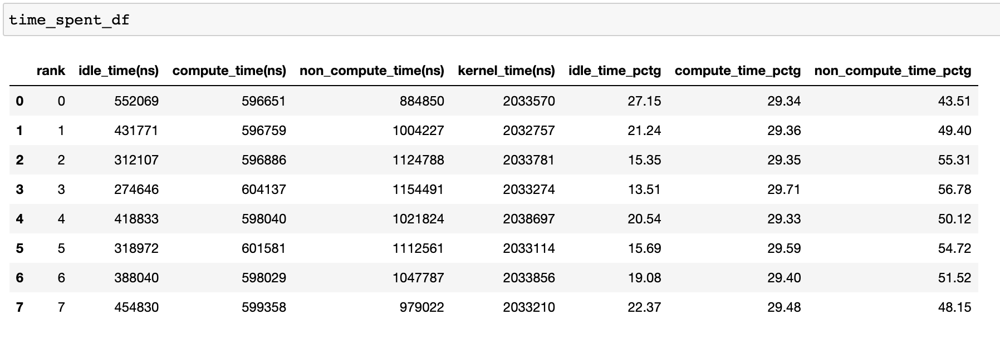

When the ``visualize`` argument is set to True, the `get_temporal_breakdown`
function also generates a bar graph representing the breakdown by rank.

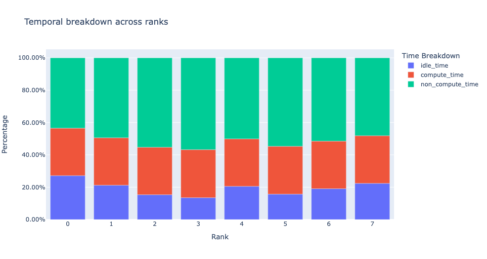

Idle Time Breakdown
^^^^^^^^^^^^^^^^^^^

Understanding how much time the GPU is idle and its causes can help direct
optimization strategies. A GPU is considered idle when no kernel is running on
it. We developed an algorithm to categorize the Idle time into 3 categories:

#. Host wait: is the idle duration on the GPU due to the CPU not enqueuing
   kernels fast enough to keep the GPU busy. These kinds of inefficiencies can
   be resolved by examining the CPU operators that are contributing to the slow
   down, increasing the batch size and applying operator fusion.

#. Kernel wait: constitutes the short overhead to launch consecutive kernels on
   the GPU. The idle time attributed to this category can be minimized by using
   CUDA Graph optimizations.

#. Other wait: Lastly, this category includes idle we could not currently
   attribute due to insufficient information. The likely causes include
   synchronization among CUDA streams using CUDA events and delays in launching
   kernels.

The host wait time can be interpreted as the time when the GPU is stalling due
to the CPU. To attribute the idle time as kernel wait we use the following
heuristic:

   | **gap between consecutive kernels < threshold**

The default threshold value is 30 nanoseconds and can be configured using the
``consecutive_kernel_delay`` argument. By default, the idle time breakdown is
computed for rank 0 only. In order to calculate the breakdown for other ranks,
use the ``ranks`` argument in the `get_idle_time_breakdown`
function. The idle time breakdown can be generated as follows:

.. code-block:: python

  analyzer = TraceAnalysis(trace_dir = "/path/to/trace/folder")
  idle_time_df = analyzer.get_idle_time_breakdown()

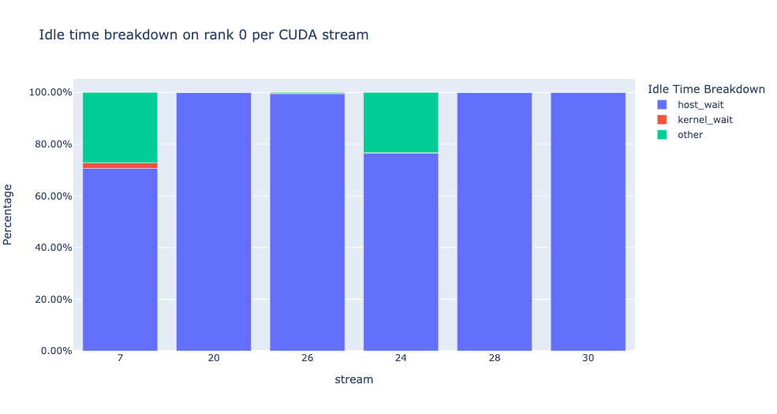

The function returns a tuple of dataframes. The first dataframe contains the
idle time by category on each stream for each rank.

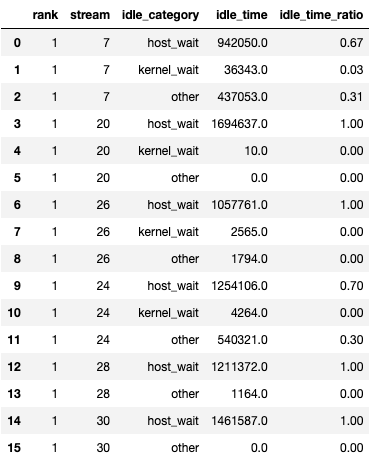

The second dataframe is generated when ``show_idle_interval_stats`` is set to
``True``. It contains the summary statistics of the idle time for each stream
on each rank.

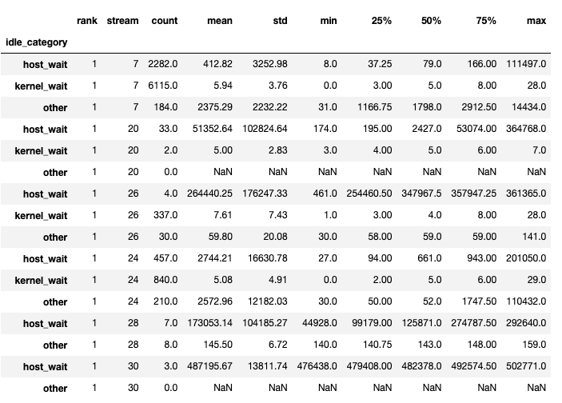

.. tip::
   By default, the idle time breakdown presents the percentage of each of the
   idle time categories. Setting the ``visualize_pctg`` argument to ``False``,
   the function renders with absolute time on the y-axis. See image below.

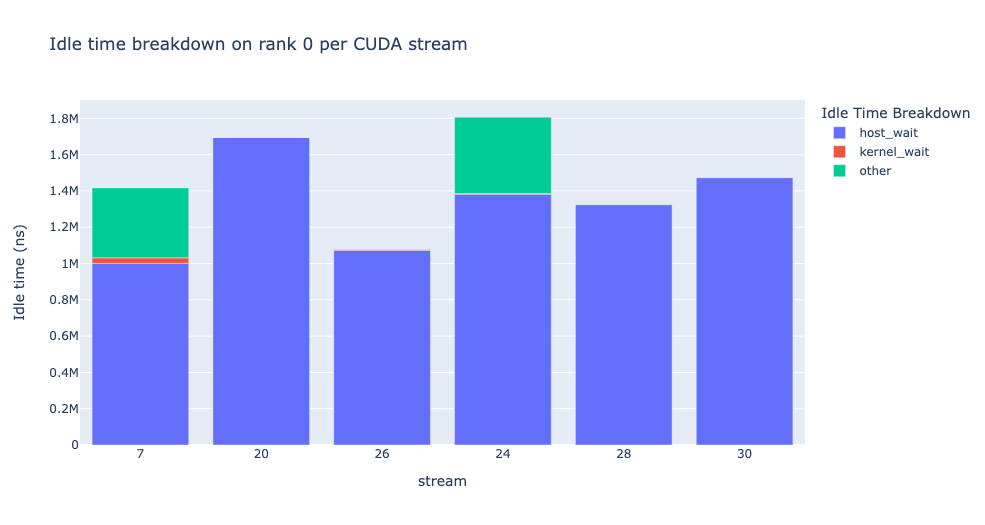

Kernel Breakdown
^^^^^^^^^^^^^^^^

The kernel breakdown feature breaks down the time spent for each kernel type
i.e. communication (COMM), computation (COMP), and memory (MEM) across all
ranks and presents the proportion of time spent in each category. The
percentage of time spent in each category as a pie chart.

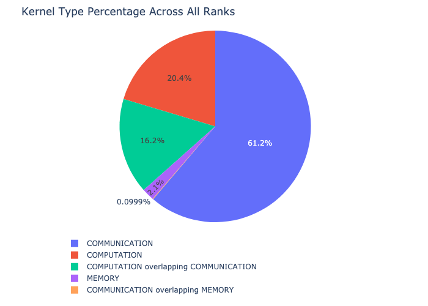

The kernel breakdown can be calculated as follows:

.. code-block:: python

   analyzer = TraceAnalysis(trace_dir = "/path/to/trace/folder")
   kernel_type_metrics_df, kernel_metrics_df = analyzer.get_gpu_kernel_breakdown()

The first dataframe returned by the function contains the raw values used to
generate the Pie chart.

Kernel Duration Distribution
^^^^^^^^^^^^^^^^^^^^^^^^^^^^

The second dataframe returned by `get_gpu_kernel_breakdown`
contains duration summary statistics for each kernel. In particular, this
includes the count, min, max, average, standard deviation, sum and kernel type
for each kernel on each rank.

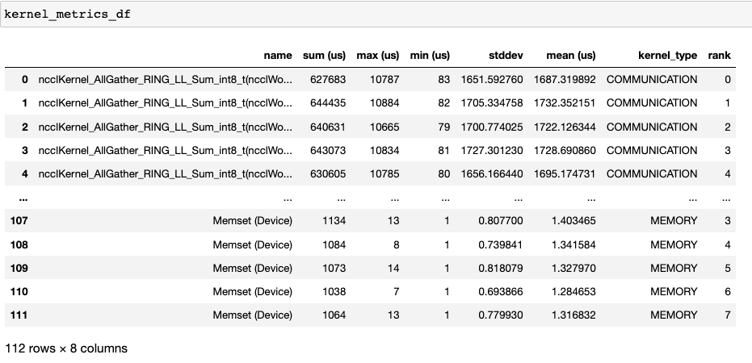

Using this data HTA creates many visualizations to identify performance
bottlenecks.

#. Pie charts of the top kernels for each kernel type for each rank.

#. Bar graphs of the average duration across all ranks for each of the top
   kernels and for each kernel type.

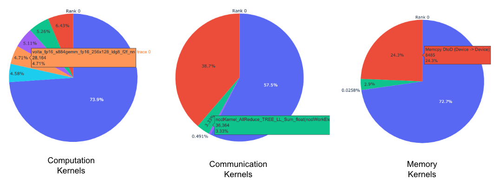

.. tip::
   All images are generated using plotly. Hovering on the graph shows the
   mode bar on the top right which allows the user to zoom, pan, select and
   download the graph.

The pie charts above shows the top 5 computation, communication and memory
kernels. Similar pie charts are generated for each rank. The pie charts can be
configured to show the top k kernels using the ``num_kernels`` argument passed to
the `get_gpu_kernel_breakdown`
function. Additionally, the ``duration_ratio`` argument can be used to tune the
percentage of time that needs to be analyzed. If both ``num_kernels`` and
``duration_ratio`` are specified, then ``num_kernels`` takes precedence.

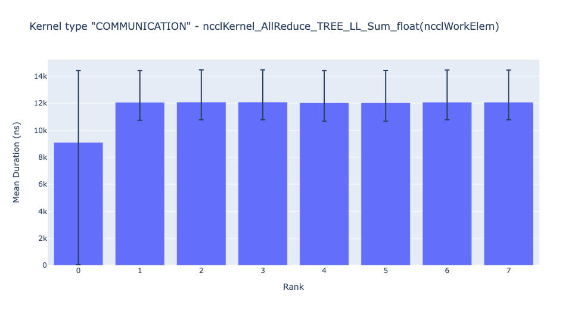

The bar graph above shows the average duration of the NCCL AllReduce kernel
across all the ranks. The black lines indicate the minimum and maximum time
taken on each rank.

.. warning::
   When using jupyter-lab set the "image_renderer" argument value to
   "jupyterlab" otherwise the graphs will not render in the notebook.

For a detailed walkthrough of this feature see the `gpu_kernel_breakdown
notebook
<https://github.com/facebookresearch/HolisticTraceAnalysis/blob/main/examples/kernel_breakdown_demo.ipynb>`_
in the examples folder of the repo.

Communication Computation Overlap
^^^^^^^^^^^^^^^^^^^^^^^^^^^^^^^^^

In distributed training a significant amount of time is spent in communication
and synchronization events between GPUs. To achieve high GPU efficiency (i.e.
TFLOPS/GPU) it is vital to keep the GPU oversubscribed with computation
kernels. In other words, the GPU should not be blocked due to unresolved data
dependencies. One way to measure the extent to which computation is blocked by
data dependencies is to calculate the communication computation overlap. Higher
GPU efficiency is observed if communication events overlap computation events.
Lack of communication and computation overlap will lead to the GPU being idle,
thus the efficiency would be low. To sum up, higher communication computation
overlap is desirable. To calculate the overlap percentage for each rank we
measure the following ratio:

  | **(time spent in computation while communicating) / (time spent in communication)**

Communication computation overlap can be calculated as follows:

.. code-block:: python

   analyzer = TraceAnalysis(trace_dir = "/path/to/trace/folder")
   overlap_df = analyzer.get_comm_comp_overlap()

The function returns a dataframe containing the overlap percentage
for each rank.

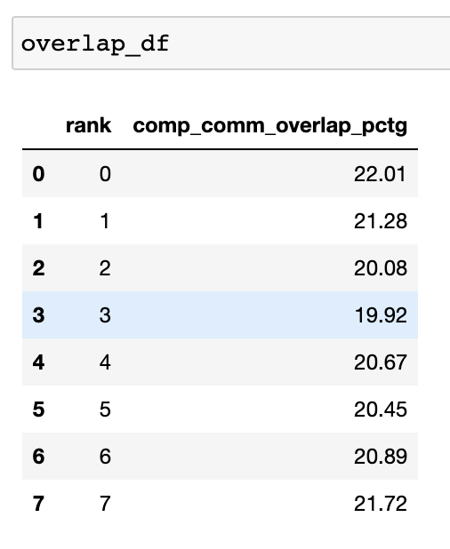

When the ``visualize`` argument is set to True, the `get_comm_comp_overlap`
function also generates a bar graph representing the overlap by rank.

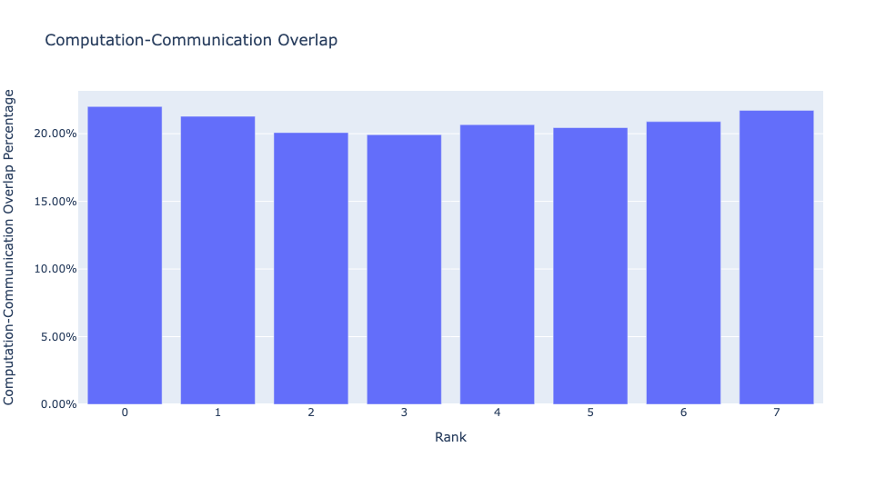

Augmented Counters
^^^^^^^^^^^^^^^^^^

**Memory Bandwidth & Queue Length Counters**

Memory bandwidth counters measure the memory copy bandwidth used while copying
the data from H2D, D2H and D2D by memory copy (memcpy) and memory set (memset)
events. HTA also computes the number of outstanding operations on each CUDA
stream. We refer to this as **queue length**. When the queue length on a stream
is 1024 or larger new events cannot be scheduled on that stream and the CPU
will stall until the events on the GPU stream have processed.

The `generate_trace_with_counters`
API outputs a new trace file with the memory bandwidth and queue length
counters. The new trace file contains tracks which indicate the memory
bandwidth used by memcpy/memset operations and tracks for the queue length on
each stream. By default, these counters are generated using the rank 0
trace file and the new file contains the suffix ``_with_counters`` in its name.
Users have the option to generate the counters for multiple ranks by using the
``ranks`` argument in the `generate_trace_with_counters`
API.

.. code-block:: python

  analyzer = TraceAnalysis(trace_dir = "/path/to/trace/folder")
  analyzer.generate_trace_with_counters()

A screenshot of the generated trace file with augmented counters.

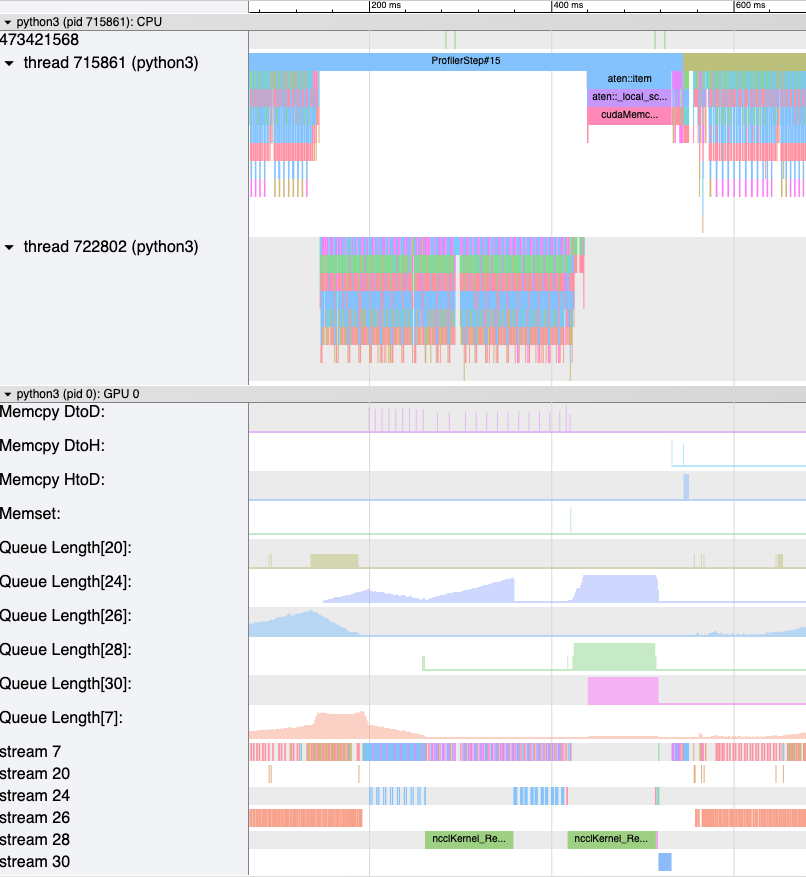

HTA also provides a summary of the memory copy bandwidth and queue length
counters as well as the time series of the counters for the profiled portion of
the code using the following API:

#. `get_memory_bw_summary`

#. `get_queue_length_summary`

#. `get_memory_bw_time_series`

#. `get_queue_length_series`

To view the summary and time series use:

.. code-block:: python

  # generate summary
  mem_bw_summary = analyzer.get_memory_bw_summary()
  queue_len_summary = analyzer.get_queue_length_summary()

  # get time series
  mem_bw_series = analyzer.get_memory_bw_time_series()
  queue_len_series = analyzer.get_queue_length_series()

The summary contains the count, min, max, mean, standard deviation, 25th, 50th,
and 75th percentile.

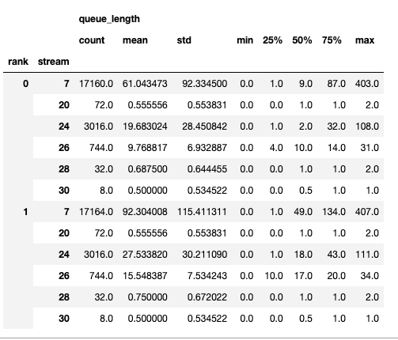

The time series only contains the points when a value changes. Once a value is
observed the time series stays constant until the next update. The memory
bandwidth and queue length time series functions return a dictionary whose key
is the rank and the value is the time series for that rank. By default, the
time series is computed for rank 0 only.

CUDA Kernel Launch Statistics
^^^^^^^^^^^^^^^^^^^^^^^^^^^^^

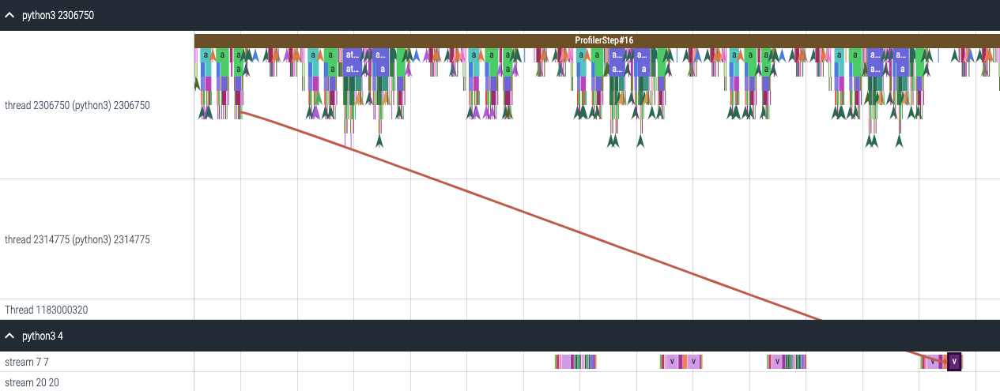

For each event launched on the GPU there is a corresponding scheduling event on
the CPU e.g. CudaLaunchKernel, CudaMemcpyAsync, CudaMemsetAsync. These events
are linked by a common correlation id in the trace. See figure above. This
feature computes the duration of the CPU runtime event, its corresponding GPU
kernel and the launch delay i.e. the difference between GPU kernel starting and
CPU operator ending. The kernel launch info can be generated as follows:

.. code-block:: python

  analyzer = TraceAnalysis(trace_dir="/path/to/trace/dir")
  kernel_info_df = analyzer.get_cuda_kernel_launch_stats()

A screenshot of the generated dataframe is given below.

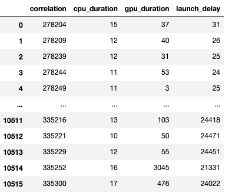

The duration of the CPU op, GPU kernel and the launch delay allows us to find:

#. **Short GPU kernels** - GPU kernels with duration less than the
   corresponding CPU runtime event.

#. **Runtime event outliers** - CPU runtime events with excessive duration.

#. **Launch delay outliers** - GPU kernels which take too long to be scheduled.

HTA generates distribution plots for each of the aforementioned three categories.

**Short GPU kernels**

Usually, the launch time on the CPU side is between 5-20 microseconds. In some
cases the GPU execution time is lower than the launch time itself. The graph
below allows us to find how frequently such instances appear in the code.

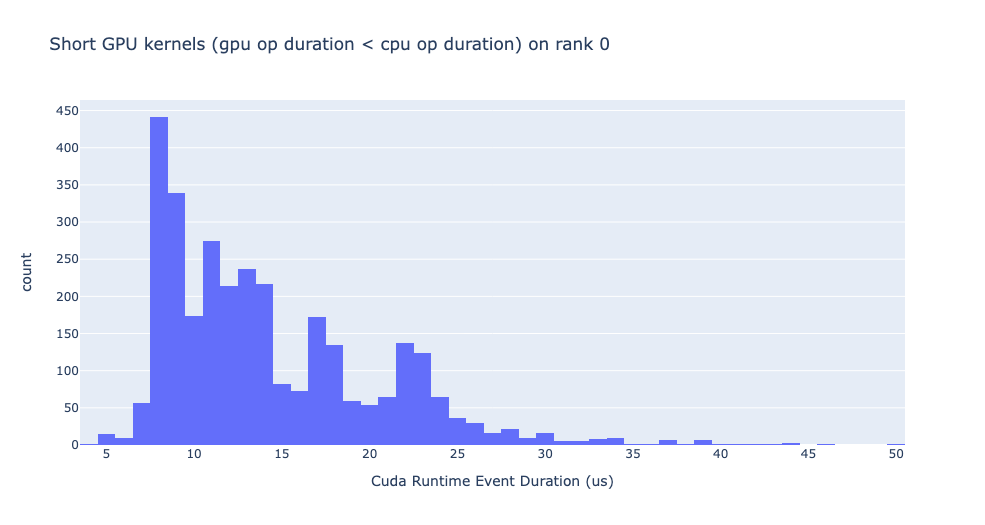

**Runtime event outliers**

The runtime outliers depend on the cutoff used to classify the outliers, hence
the `get_cuda_kernel_launch_stats`
API provides the ``runtime_cutoff`` argument to configure the value.

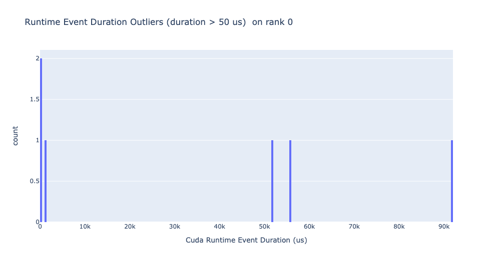

**Launch delay outliers**

The launch delay outliers depend on the cutoff used to classify the outliers,
hence the `get_cuda_kernel_launch_stats`
API provides the ``launch_delay_cutoff`` argument to configure the value.

.. image:: _static/img/hta/launch_delay_outliers.png

Frequent CUDA Kernel Sequences
^^^^^^^^^^^^^^^^^^^^^^^^^^^^^^

Consider a scenario where a sequence of CPU ops is called repeatedly in the
code. E.g. this behavior is commonly exhibited in a transformer architecture
with a large encoder or decoder stack. Suppose the user wants to know the most
frequent CUDA kernel sequences originating from an operator. Identifying these
frequent CUDA kernel sequences and their corresponding CPU ops provides
insights into which kernels would be ideal candidates for fusion.

This feature finds the sequences of most frequent CUDA kernels launched for any
specified operator. It generates a new trace file which overlays the top k
identified patterns on the original trace file. Searching for the keyword
``Patterns`` in the new trace file highlights the relevant CPU and GPU ops. The
highlighted events indicate where to look for opportunities to fuse CUDA
kernels or CPU ops.

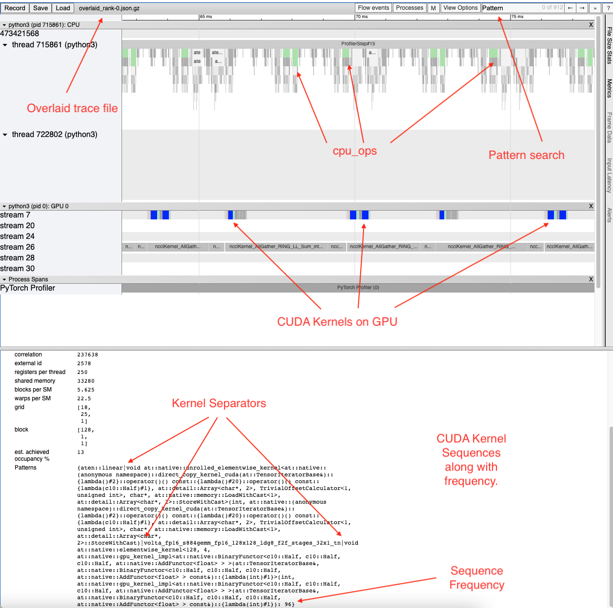

This analysis is done on a single rank as the CPU and GPU ops are expected to
be the same across different ranks.

.. code-block:: python

    analyzer = TraceAnalysis(trace_dir = "/path/to/trace_folder")
    cuda_sequences_df = analyzer.get_frequent_cuda_kernel_sequences(
        operator_name = "aten::linear",
        output_dir = "/tmp/"
    )

The minimum length of the CUDA kernel sequence that should be identified can be
specified using the ``min_pattern_len`` argument and the ``top_k`` argument
allows the user to specify the top k patterns in terms of frequency to be
overlaid on the new trace file.

The output of the `get_frequent_cuda_kernel_sequences`
is a dataframe containing a pipe separated string of the CUDA kernels
originating from the CPU operator along with their frequency and duration of
the CPU ops and GPU kernels.

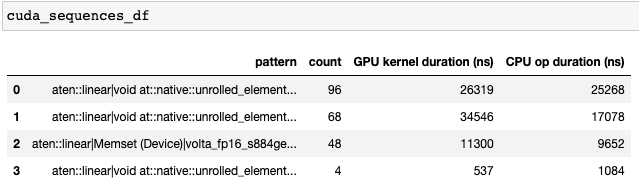

Adding the frequent pattern annotations in the trace file, as seen in the trace
screenshot above increases the trace file size considerably. In order to keep
the trace file size reasonable HTA creates a dictionary of all kernel names. The
keys in the dictionary are integers and the values are kernel names. The
overlaid trace file uses these keys to mark CPU ops which are not in the
operator search path. To view the dictionary click on the PyTorch Profiler
thread with thread id 0.

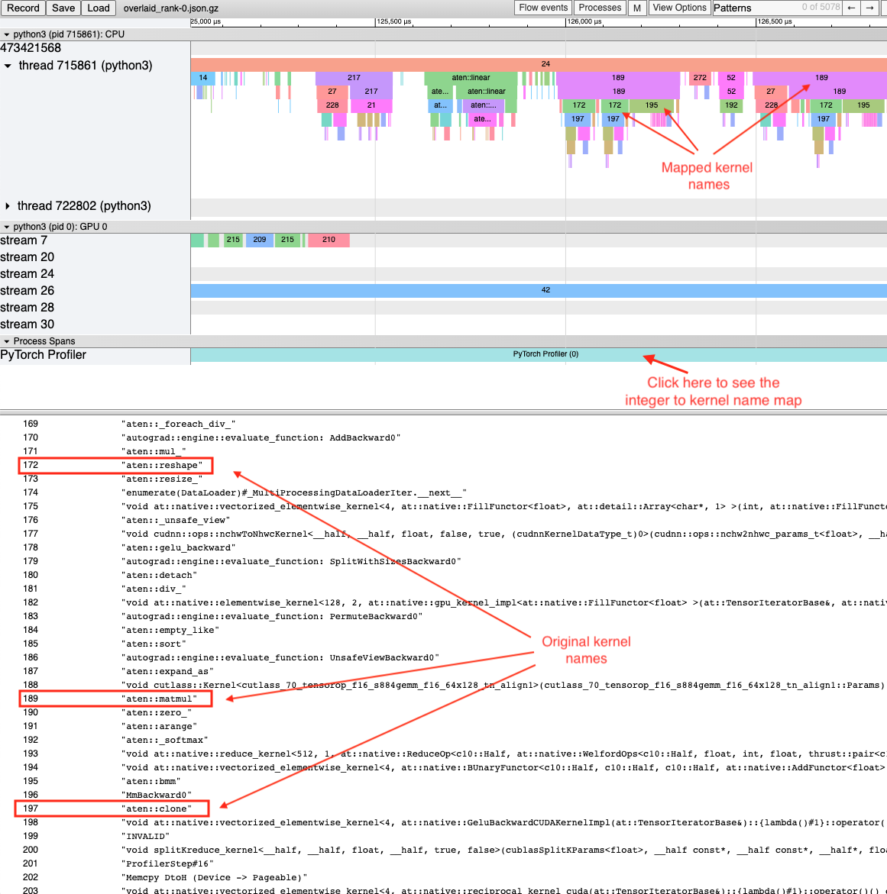

Trace Diff
^^^^^^^^^^

Occasionally, users need to identify the changes in PyTorch operators and CUDA
kernels resulting from a code change. To support such a requirement, HTA
provides a trace comparison feature. This feature allows the user to input two
sets of trace files where the first can be thought of as the *control group*
and the second as the *test group* as in an A/B test. The ``Trace Diff`` class
provides functions to compare the differences between traces and functionality
to visualize these differences. In particular, users can find operators and
kernels which were added and removed from each group along with the frequency
of each operator/kernel and the cumulative time taken by the operator/kernel.
The ``TraceDiff`` class has 4 methods:

#. `compare_traces`
   Compare the frequency and total duration of CPU operators and GPU kernels from
   two sets of traces.

#. `ops_diff`
   Get the operators and kernels which have been:

    #. **added** to the test trace and are absent in the control trace
    #. **deleted** from the test trace and are present in the control trace
    #. **increased** in frequency in the test trace and exist in the control trace
    #. **decreased** in frequency in the test trace and exist in the control trace
    #. **unchanged** between the two sets of traces

#. `visualize_counts_diff`

#. `visualize_duration_diff`

The last two methods can be used to visualize various changes in counts and
durations of CPU operators and GPU kernels using the output of the
`compare_traces`

E.g. The top 10 operators with increase in frequency can be computed as
follows:

.. code-block:: python

    df = compare_traces_output.sort_values(by="diff_counts", ascending=False).head(10)
    TraceDiff.visualize_counts_diff(df)

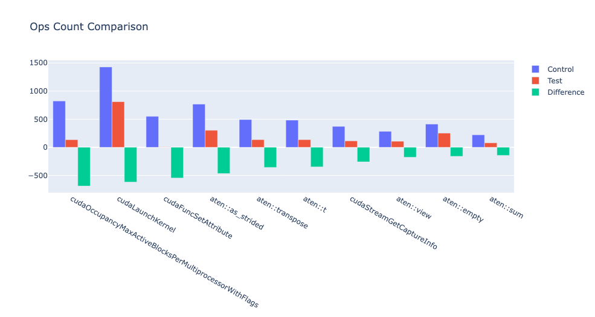

Similarly, the top 10 ops with the largest change in duration can be computed as
follows:

.. code-block:: python

    df = compare_traces_output.sort_values(by="diff_duration", ascending=False)
    # The duration differerence can be overshadowed by the "ProfilerStep",
    # so we can filter it out to show the trend of other operators.
    df = df.loc[~df.index.str.startswith("ProfilerStep")].head(10)
    TraceDiff.visualize_duration_diff(df)

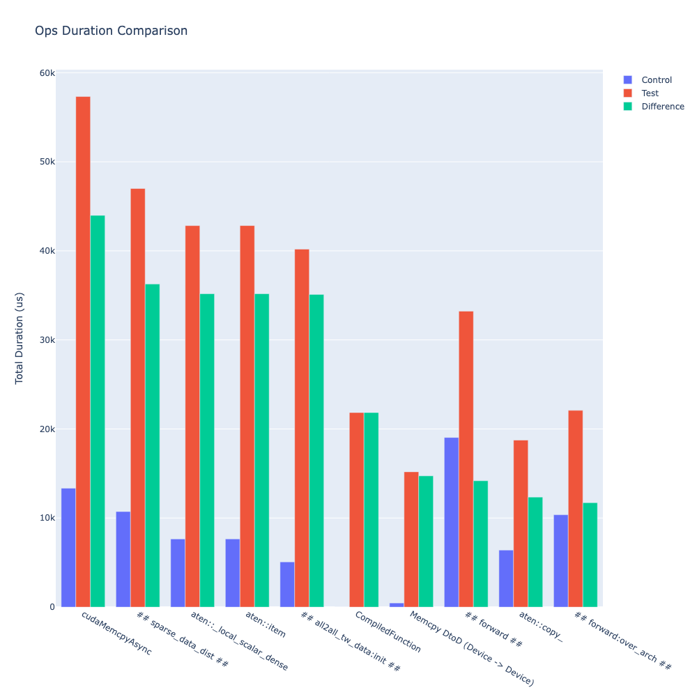

For a detailed example of this feature see the `trace_diff_demo notebook
<https://github.com/facebookresearch/HolisticTraceAnalysis/blob/main/examples/trace_diff_demo.ipynb>`_
in the examples folder of the repo.

CUPTI Counter Analysis
^^^^^^^^^^^^^^^^^^^^^^

.. note::
    This is an experimental feature in PyTorch and Holistic Trace Analysis.

**Motivation and context**

Performance counter measurements can provide insights on how to speed up GPU
kernels, conduct `roofline analysis`_ and other low level optimizations. The
PyTorch Profiler includes a lightweight API to program and measure detailed
performance counters from the GPU. This mode leverages `CUPTI Range Profiler
API <https://docs.nvidia.com/cupti/r_main.html#r_profiler>`_  and supports an
extensive list of performance metrics.

**Collecting CUPTI Counter traces**

Users can collect performance counters by adding the list of metrics using the
experimental config option in PyTorch Profiler. See the code snippet below for
an example.

.. code-block:: python

    with torch.profiler.profile(
        activities=[torch.profiler.ProfilerActivity.CUDA,
                    torch.profiler.ProfilerActivity.CPU],
        record_shapes=True,
        on_trace_ready=trace_handler,
        experimental_config=torch.profiler._ExperimentalConfig(
            profiler_metrics=[
                "kineto__tensor_core_insts",
                "dram__bytes_read.sum",
                "dram__bytes_write.sum"],
        profiler_measure_per_kernel=True),
    ) as prof:
        res = train_batch(modeldef)
        prof.step()

The generated trace contains the following additional information:

#. Performance measurement events are logged under the `cuda_profiler_range` category.
#. The counter values are logged in the *args* section of the above events.

For a complete example see `here <https://github.com/facebookresearch/HolisticTraceAnalysis/blob/main/examples/cupti_flops_analysis.ipynb>`__.

**CUPTI Counter Analyzer**

CUPTI Counter trace analyzer can investigate performance measurements per
kernel and map kernels to CPU PyTorch operators. A single kernel can map to
multiple levels of operators (as operators can be nested). This information is
provided in the `op_stack` column. For further convenience, we add the top and
bottom level operator columns as well.

The code below runs CUPTI counter analysis on the collected trace.

.. code-block:: python

   analyzer = TraceAnalysis(trace_dir = "/path/to/trace/folder")
   gpu_kernels = analyzer.get_cupti_counter_data_with_operators(ranks=[0])[0]

It returns a list of dataframes, one per rank or trace file. Each dataframe
contains the kernel name, op_stack (operator stack), top and bottom level op,
and columns for individual performance counters as shown below.

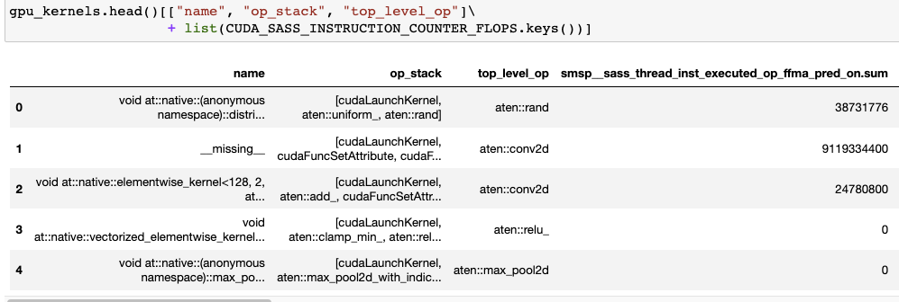

**Example Notebook**

For a detailed walkthrough of this feature see the `cupti_flops_analysis
notebook
<https://github.com/facebookresearch/HolisticTraceAnalysis/blob/main/examples/cupti_flops_analysis.ipynb>`_
in the examples folder of the repo.

To collect the trace used in the example we ran `PARAM Benchmarks
<https://github.com/facebookresearch/param/tree/main/train/compute/python>`_.
PARAM provides a repository of communication and computation micro-benchmarks
for AI training and inference. For this example, we ran a simple convolutional
neural network model - AlexNet - as a benchmark and collected the trace.
Instructions for the same are given below.

.. code-block:: bash

  # Inside dir "param/train/compute"
  $ python -m python.pytorch.run_benchmark -c python/examples/pytorch/configs/alex_net.json -p -i 1 -d cuda --cupti-profiler --cupti-profiler-measure-per-kernel

The notebook then uses CUPTI floating point instructions counters to compute
FLOPs. FLOPs count can be utilized for `roofline analysis`_ and performance
optimization.

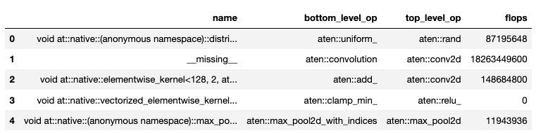

.. _roofline analysis: https://en.wikipedia.org/wiki/Roofline_model

Lightweight Critical Path Analysis
^^^^^^^^^^^^^^^^^^^^^^^^^^^^^^^^^^

**TLDR**

-  This feature performs a basic single rank critical path analysis. We demonstrated a walkthrough of using the tool.
-  Additionally, we dive into assumptions made and implementation principles.

**Introduction**

The key idea behind critical path analysis is to find operations in a large system that constitute the **longest path** between start and end.
An operation on the critical path can significantly impact the program's overall performance.
In other words, reducing the duration of that operation will result in a measurable change in the overall timing
This is illustrated in the figure below.

|Lightw002|

Critical paths can shift if an operator is optimized beyond a point; like the *mult()* in Figure 1 becomes shorter than *add1()*.

**Why?**

Critical path analysis is a commonly applied technique in HPC and AI/ML optimization.
It can be leveraged in two ways:

1. **Performance/Efficiency opportunities:** Operations/kernels on critical path should be the target of performance analysis and optimizations.
   They can provide the “\ **best bang for the buck”** for performance improvements

   a. The critical path can give us a sense if the training iteration is X% CPU bound or Y% GPU bound, or Z% communication bound for distributed training.

   b. The analysis is also not limited to just CPU/GPU kernels.
      Delays in launching or executing CUDA kernels can constitute a sizable portion of the critical path as well.
      This could be optimized by operator fusion (Pytorch2.0) and CUDA graphs etc.

2. **Simulating Improvements/Gains**: After identifying the critical path we can estimate improvements by simply modifying the graph and re-running the
   critical path finding algorithm.

**Why Lightweight?**

The space to build such kinds of analysis is vast.
We could deduce the multi-rank critical path to better understand things like stragglers, and also consider tensor input/output dependencies among
PyTorch operators.

To start with, we decided to simplify the dependency analysis between PyTorch operators.
Our key core assumptions are.

-  All PyTorch CPU operators are **dependent serially on the last operator that ran on the respective CPU** thread.

-  In addition, we consider dependencies between CPU and GPU, both in terms of kernel launch, kernel-kernel delays and synchronization events.

The motivation behind this flavor of critical path analysis is to **identify the primary bottleneck in the training loop** - is it the CPU, or GPU
compute or GPU communication.

The operator data-dependency part can be added later and further enable insights like re-ordering of operations and subgraphs.
We can leverage `Chakra Execution Traces <https://engineering.fb.com/2023/09/07/networking-traffic/chakra-execution-traces-benchmarking-network-performance-optimization/>`__ to track data dependencies
among tensors.
This version of **Critical Path Analysis does not need Execution Traces.**

**Using Critical Path Analysis**

This `ipython notebook <https://github.com/facebookresearch/HolisticTraceAnalysis/blob/main/examples/experimental/critical_path_analysis.ipynb>`__
illustrates basic critical path analysis.

**Prerequisite**

The PyTorch profiler traces were previously missing information regarding CUDA synchronization events.
This was fixed in `PR1 <https://github.com/pytorch/pytorch/pull/105187>`__ and `PR2
<https://github.com/pytorch/kineto/pull/808>`__
. Follow the documentation `here <https://github.com/pytorch/pytorch/pull/105187>`__ to enable CUDA synchronization events to get best results from this analysis.

**Analysis**

As shown in the `notebook <https://github.com/facebookresearch/HolisticTraceAnalysis/blob/main/examples/experimental/critical_path_analysis.ipynb>`__, use ``analyzer.critical_path_analysis()`` for trace events within a single rank.
We can further reduce the region of interest by selecting a *trace annotation* and instance id.
For example, you can use this to limit the analysis to one iteration by passing annotation 'ProfilerStep#500'.

|Lightw003|

The output **cp_graph** object is a *networkx.DiGraph* object that is used as input for further analysis.

**Visualizing Critical Path**

Now for the fun part.
Use ``overlay_critical_path_analysis()`` function to visualize the critical path on the original trace file.
There are two modes for the output:

1. When ``only_show_critical_events=True`` (default value) the output trace only contains CPU operators and GPU events on the critical path.
   One can compare it with the original trace to contrast the critical path identified by the algorithm.

2. When ``only_show_critical_events=False`` in the output trace file search for "critical" to highlight events on the critical path.

|Lightw004|

Edges in the critical path graph will be shown using arrows or flow events.

To illustrate this here is a simple training loop example on AlexNet, using setting (2) above.
One can search for “critical” in chrome trace viewer to highlight the critical path.
Most of the critical path is on the CPU here due to large delays in running *cudaMalloc*.

|Lightw005|

Zooming in to the right hand side, the GPU is now more busy and we can see the critical path flow from the CPU, to two different GPU streams and then up to
the CPU again.

|Lightw006|

Unfortunately, the search based highlighting doesn’t work in Perfetto.
You can use the ``only_show_critical_events-True`` mode to display only the critical path events.

**Large Training Job Traces**

Here is an example of running this on an actual training job trace.
In real life training jobs have pipelined stages so the we should run critical path analysis over **two iterations**.
We can set the algorithm to run on two different iterations as shown below.

|Lightw007|

|Lightw008|

This analyzes the 2nd and 3rd iterations (551 and 552).

- The critical path is initially on the CPU in step 551.
  Zooming in you will see many small GPU kernels, indicating that the GPU is not being kept busy.
  Increasing the batch size could be one optimization.

- The critical path then shifts to NCCL all-to-all and all-reduce in the backward and next iteration forward pass.
  Thus communication imbalance is likely slowing down this workflow

- Finally, on the tail end we see some GPU kernels launched by the optimizer on the critical path.

This workflow in general needs to better utilize GPU and fix NCCL imbalance issues.

**Implementation Details**

We drew inspiration from the previous work in `academia
<https://www.hzdr.de/publications/PublDoc-9225.pdf>`_ to come up with our approach.

**Design Overview**

In a nutshell, computing the critical path involves 1) constructing a weighted DAG connecting all the operations, 2) finding the longest path in this
DAG.
The challenging part is constructing the DAG here.

**Nodes**: The Nodes in the critical path graph represent points in time.
Each operator/kernel thus has two nodes viz.
a begin and end node.
In case of nested operators we also link the nodes in the order they appear in the call stack.

**Edges** in this DAG can be one of two types

1. Timing edges (weight = time): include durations for the operators/kernels as well as delays to launch operators between CPU and GPU.

2. Dependency edges (weight = 0): do not have a time component but show a dependency between operations themselves.
   This includes data dependencies and synchronization between CPU and GPU.

**CPU Operator Nesting and Dependencies**

Firstly, each operator gets a start and end node.
To enable nested operators we basically add edges between start/end nodes of nested events.
This is shown in the image below.

|Lightw009|

Since we are simplifying operator dependencies, each PyTorch top level operator has a dependency on the previous top level operator.
More details in `PR67 <https://github.com/facebookresearch/HolisticTraceAnalysis/pull/67>`__

**GPU Kernel Launches**

CUDA is based on a highly asynchronous execution model for GPUs with up to 1024 outstanding GPU kernels at a time.
To correctly determine how to connect GPU kernels and CPU operators we came up with two types of delays -

**Kernel launch delays:** There is a finite delay from kernel launch in the CUDA runtime to when the GPU kernel executes.
This delay could either be due to the actual launch delay by system or the time spent waiting behind other kernels.
We propose that **kernel launch delay should only count if there are no outstanding kernels on a CUDA stream.**

**Kernel-Kernel delays:** All GPU kernels on the same CUDA stream execute in order.
Thus they have an implicit dependency on the previous kernel completing.
We factor this into our DAG by adding “kernel-kernel” delay edges when there are more than 1 outstanding kernels on a CUDA stream.

Here is an example of kernel launch and kernel-kernel delays in profiler trace (AlexNet).
More details in `PR68 <https://github.com/facebookresearch/HolisticTraceAnalysis/pull/68>`__

|Lightw010|

**Synchronization Dependencies**

Lastly, the CPU will wait for the work dispatched to the GPU to complete.
These are due to synchronization

**Improving Profiler Traces**: We realized the Kineto/PyTorch profiler was not providing enough information on Stream and Wait synchronization.
To fix this we `introduced CUDA Sync events in the trace <https://github.com/pytorch/pytorch/pull/105187>`__.
The new sync events can cover 3 kinds of synchronization we will describe below.

**Synchronization Edges:** Here is how we modified the DAG based on each synchronization type

1. **Context / Device Synchronization**: Since this is a global synchronization type we add edges from the last GPU kernel on all streams to the runtime
   function on the CPU calling Context/Device Synchronize.

2. **Stream Synchronization**: is similar to above but it synchronizes a single stream.
   Thus we only add a synchronization edge between the last GPU kernel on the specific stream and the corresponding Stream synchronization call on the
   CPU.

3. **Event Synchronization:** is a lot more complex and we explain it below.
   The above 1, and 2 cases lead to ``GPU -> CPU`` synchronization.
   Typically Event based synchronization is used for ``GPU -> GPU`` synchronization.

|Lightw011|

*An example of CUDA Stream synchronization.*

**Handling CUDA Event Synchronization**

In CUDA Event synchronization basically we have an event recorded on one stream and a GPU kernel waiting for that event to complete on another
stream.
Our approach is to trace this dependency

1. The newly added synchronization events ``cudaStreamWaitEvent()`` informs us of when the event sync occurs, ID of the CUDA event and which
   ``cudaEventRecord()`` is being synced on.

2. The next kernel on the destination stream is the one that will wait.

3. We backtrack to the source ``cudaEventRecord()`` function call on the CPU.

4. Then find the preceding kernel launch and hence the kernel that ran on GPU due to it.

5. The two kernels in step (2) and (4) are the ones that need to be connected as shown in the figure below.

See `PR69 <https://github.com/facebookresearch/HolisticTraceAnalysis/pull/69>`__ for implementation details.

|Lightw012|

*An example of Event synchronization aka inter GPU stream synchronization.*

**Future Work**

Here are a few ways we can improve on this work.

1. **Integrating Chakra Execution Traces** -  `Chakra Execution Traces <https://engineering.fb.com/2023/09/07/networking-traffic/chakra-execution-traces-benchmarking-network-performance-optimization/>`__ helps to add real CPU operator dependency edges and can surface opportunities with re-ordering of
   subgraphs for instance.

2. **Summary Statistics**: a natural extension of this work is to tabulate the time spent on CPU / GPU on the critical path with further details like
   time spent on kernel-launch delays, kernel-kernel delays and other overheads.

3. **Simulating New Hardware and Optimization wins**: the analyzer today does return a Networkx DiGraph object that one can modify and recompute the
   critical path. Additionally, it would be great to re-draw the trace and new critical path on the simulated optimizations or changes.

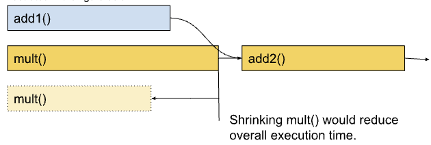
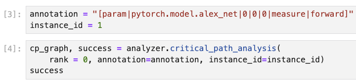
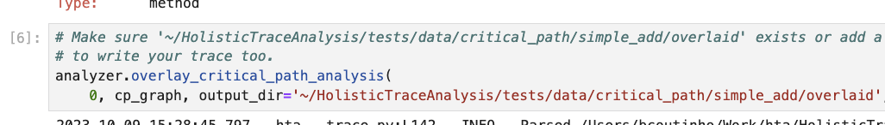
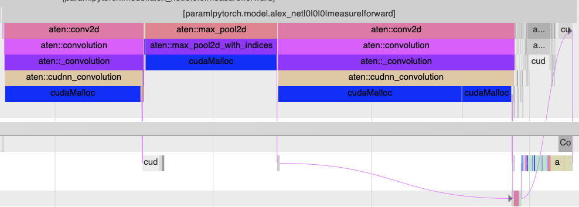
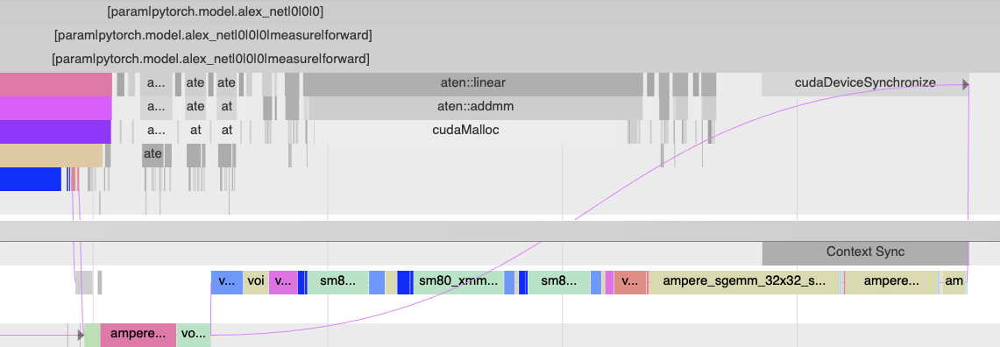
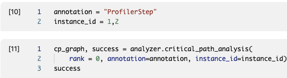
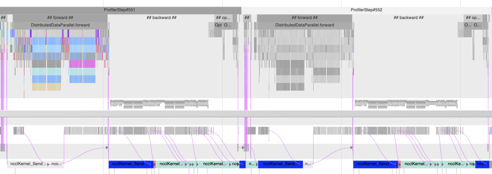
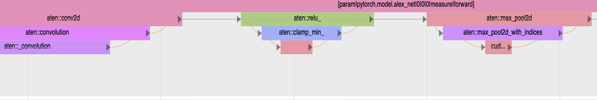
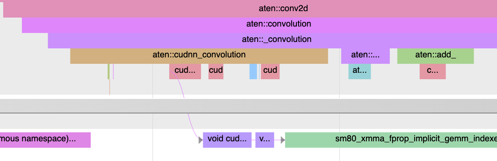
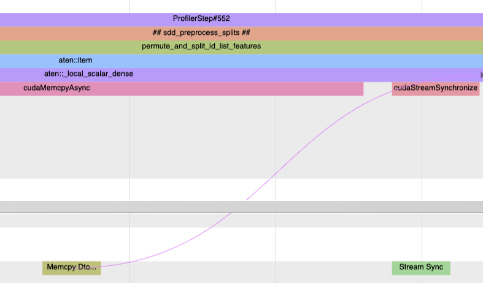
.. |Lightw012| image:: _static/img/hta/Lightw012.png
   :width: 6.5in
   :height: 2.18056in

Holistic Trace Analysis APIs
----------------------------

`TraceAnalysis API <https://hta.readthedocs.io/en/latest/source/api/trace_analysis_api.html>`_

`TraceDiff API <https://hta.readthedocs.io/en/latest/source/api/trace_diff_api.html>`_
