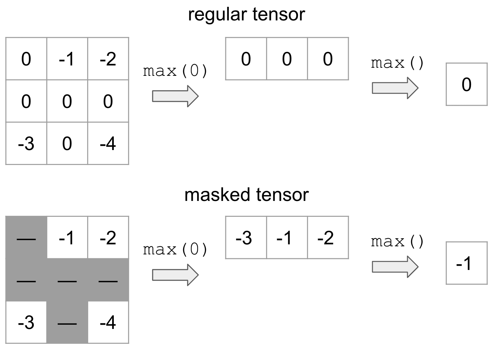

.. automodule:: torch.masked
.. automodule:: torch.masked.maskedtensor

.. currentmodule:: torch

.. _masked-docs:

torch.masked
============

Introduction
++++++++++++

Motivation
----------

.. warning::

  The PyTorch API of masked tensors is in the prototype stage and may or may not change in the future.

MaskedTensor serves as an extension to :class:`torch.Tensor` that provides the user with the ability to:

* use any masked semantics (e.g. variable length tensors, nan* operators, etc.)
* differentiate between 0 and NaN gradients
* various sparse applications (see tutorial below)

"Specified" and "unspecified" have a long history in PyTorch without formal semantics and certainly without
consistency; indeed, MaskedTensor was born out of a build up of issues that the vanilla :class:`torch.Tensor`
class could not properly address. Thus, a primary goal of MaskedTensor is to become the source of truth for
said "specified" and "unspecified" values in PyTorch where they are a first class citizen instead of an afterthought.
In turn, this should further unlock `sparsity's <https://pytorch.org/docs/stable/sparse.html>`_ potential,
enable safer and more consistent operators, and provide a smoother and more intuitive experience
for users and developers alike.

What is a MaskedTensor?
-----------------------

A MaskedTensor is a tensor subclass that consists of 1) an input (data), and 2) a mask. The mask tells us
which entries from the input should be included or ignored.

By way of example, suppose that we wanted to mask out all values that are equal to 0 (represented by the gray)
and take the max:

On top is the vanilla tensor example while the bottom is MaskedTensor where all the 0's are masked out.
This clearly yields a different result depending on whether we have the mask, but this flexible structure
allows the user to systematically ignore any elements they'd like during computation.

There are already a number of existing tutorials that we've written to help users onboard, such as:

-  `Overview - the place to start for new users, discusses how to use MaskedTensors and why they're useful`_
-  `Sparsity - MaskedTensor supports sparse COO and CSR data and mask Tensors`_
-  `Adagrad sparse semantics - a practical example of how MaskedTensor can simplify sparse semantics and implementations`_
-  `Advanced semantics - discussion on why certain decisions were made (e.g. requiring masks to match for binary/reduction operations),
   differences with NumPy's MaskedArray, and reduction semantics`_

.. _Overview - the place to start for new users, discusses how to use MaskedTensors and why they're useful: https://pytorch.org/tutorials/prototype/maskedtensor_overview
.. _Sparsity - MaskedTensor supports sparse COO and CSR data and mask Tensors: https://pytorch.org/tutorials/prototype/maskedtensor_sparsity
.. _Adagrad sparse semantics - a practical example of how MaskedTensor can simplify sparse semantics and implementations: https://pytorch.org/tutorials/prototype/maskedtensor_adagrad
.. _Advanced semantics - discussion on why certain decisions were made (e.g. requiring masks to match for binary/reduction operations), differences with NumPy's MaskedArray, and reduction semantics: https://pytorch.org/tutorials/prototype/maskedtensor_advanced_semantics

Supported Operators
+++++++++++++++++++

Unary Operators
---------------

Unary operators are operators that only contain only a single input.
Applying them to MaskedTensors is relatively straightforward: if the data is masked out at a given index,
we apply the operator, otherwise we'll continue to mask out the data.

The available unary operators are:

.. autosummary::
    :toctree: generated
    :nosignatures:

    abs
    absolute
    acos
    arccos
    acosh
    arccosh
    angle
    asin
    arcsin
    asinh
    arcsinh
    atan
    arctan
    atanh
    arctanh
    bitwise_not
    ceil
    clamp
    clip
    conj_physical
    cos
    cosh
    deg2rad
    digamma
    erf
    erfc
    erfinv
    exp
    exp2
    expm1
    fix
    floor
    frac
    lgamma
    log
    log10
    log1p
    log2
    logit
    i0
    isnan
    nan_to_num
    neg
    negative
    positive
    pow
    rad2deg
    reciprocal
    round
    rsqrt
    sigmoid
    sign
    sgn
    signbit
    sin
    sinc
    sinh
    sqrt
    square
    tan
    tanh
    trunc

The available inplace unary operators are all of the above **except**:

.. autosummary::
    :toctree: generated
    :nosignatures:

    angle
    positive
    signbit
    isnan

Binary Operators
----------------

As you may have seen in the tutorial, :class:`MaskedTensor` also has binary operations implemented with the caveat
that the masks in the two MaskedTensors must match or else an error will be raised. As noted in the error, if you
need support for a particular operator or have proposed semantics for how they should behave instead, please open
an issue on GitHub. For now, we have decided to go with the most conservative implementation to ensure that users
know exactly what is going on and are being intentional about their decisions with masked semantics.

The available binary operators are:

.. autosummary::
    :toctree: generated
    :nosignatures:

    add
    atan2
    arctan2
    bitwise_and
    bitwise_or
    bitwise_xor
    bitwise_left_shift
    bitwise_right_shift
    div
    divide
    floor_divide
    fmod
    logaddexp
    logaddexp2
    mul
    multiply
    nextafter
    remainder
    sub
    subtract
    true_divide
    eq
    ne
    le
    ge
    greater
    greater_equal
    gt
    less_equal
    lt
    less
    maximum
    minimum
    fmax
    fmin
    not_equal

The available inplace binary operators are all of the above **except**:

.. autosummary::
    :toctree: generated
    :nosignatures:

    logaddexp
    logaddexp2
    equal
    fmin
    minimum
    fmax

Reductions
----------

The following reductions are available (with autograd support). For more information, the
`Overview <https://pytorch.org/tutorials/prototype/maskedtensor_overview.html>`_ tutorial
details some examples of reductions, while the
`Advanced semantics <https://pytorch.org/tutorials/prototype/maskedtensor_advanced_semantics.html>`_ tutorial
has some further in-depth discussions about how we decided on certain reduction semantics.

.. autosummary::
    :toctree: generated
    :nosignatures:

    sum
    mean
    amin
    amax
    argmin
    argmax
    prod
    all
    norm
    var
    std

View and select functions
-------------------------

We've included a number of view and select functions as well; intuitively, these operators will apply to
both the data and the mask and then wrap the result in a :class:`MaskedTensor`. For a quick example,
consider :func:`select`:

    >>> data = torch.arange(12, dtype=torch.float).reshape(3, 4)
    >>> data
    tensor([[ 0.,  1.,  2.,  3.],
            [ 4.,  5.,  6.,  7.],
            [ 8.,  9., 10., 11.]])
    >>> mask = torch.tensor([[True, False, False, True], [False, True, False, False], [True, True, True, True]])
    >>> mt = masked_tensor(data, mask)
    >>> data.select(0, 1)
    tensor([4., 5., 6., 7.])
    >>> mask.select(0, 1)
    tensor([False,  True, False, False])
    >>> mt.select(0, 1)
    MaskedTensor(
      [      --,   5.0000,       --,       --]
    )

The following ops are currently supported:

.. autosummary::
    :toctree: generated
    :nosignatures:

    atleast_1d
    broadcast_tensors
    broadcast_to
    cat
    chunk
    column_stack
    dsplit
    empty_like
    flatten
    full_like
    hsplit
    hstack
    kron
    meshgrid
    narrow
    ones_like
    rand_like
    randint_like
    randn_like
    ravel
    select
    split
    t
    transpose
    vsplit
    vstack
    zeros_like
    Tensor.expand
    Tensor.expand_as
    Tensor.reshape
    Tensor.reshape_as
    Tensor.view

.. This module needs to be documented. Adding here in the meantime
.. for tracking purposes
.. py:module:: torch.masked.maskedtensor.binary
.. py:module:: torch.masked.maskedtensor.core
.. py:module:: torch.masked.maskedtensor.creation
.. py:module:: torch.masked.maskedtensor.like
.. py:module:: torch.masked.maskedtensor.passthrough
.. py:module:: torch.masked.maskedtensor.reductions
.. py:module:: torch.masked.maskedtensor.unary