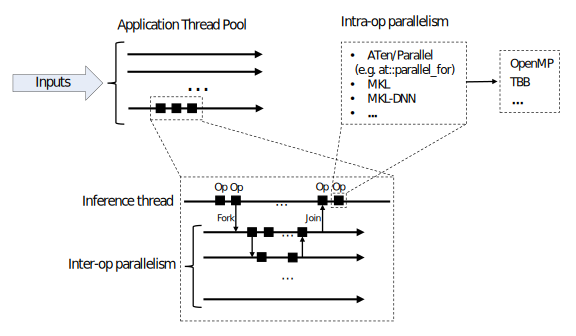

.. _cpu-threading-torchscript-inference:

CPU threading and TorchScript inference
=================================================

PyTorch allows using multiple CPU threads during TorchScript model inference.
The following figure shows different levels of parallelism one would find in a
typical application:

One or more inference threads execute a model's forward pass on the given inputs.
Each inference thread invokes a JIT interpreter that executes the ops
of a model inline, one by one. A model can utilize a ``fork`` TorchScript
primitive to launch an asynchronous task. Forking several operations at once
results in a task that is executed in parallel. The ``fork`` operator returns a
``Future`` object which can be used to synchronize on later, for example:

.. code-block:: python

    @torch.jit.script
    def compute_z(x):
        return torch.mm(x, self.w_z)

    @torch.jit.script
    def forward(x):
        # launch compute_z asynchronously:
        fut = torch.jit._fork(compute_z, x)
        # execute the next operation in parallel to compute_z:
        y = torch.mm(x, self.w_y)
        # wait for the result of compute_z:
        z = torch.jit._wait(fut)
        return y + z

PyTorch uses a single thread pool for the inter-op parallelism, this thread pool
is shared by all inference tasks that are forked within the application process.

In addition to the inter-op parallelism, PyTorch can also utilize multiple threads
within the ops (`intra-op parallelism`). This can be useful in many cases,
including element-wise ops on large tensors, convolutions, GEMMs, embedding
lookups and others.

Build options
-------------

PyTorch uses an internal ATen library to implement ops. In addition to that,
PyTorch can also be built with support of external libraries, such as MKL_ and MKL-DNN_,
to speed up computations on CPU.

ATen, MKL and MKL-DNN support intra-op parallelism and depend on the
following parallelization libraries to implement it:

* OpenMP_ - a standard (and a library, usually shipped with a compiler), widely used in external libraries;
* TBB_ - a newer parallelization library optimized for task-based parallelism and concurrent environments.

OpenMP historically has been used by a large number of libraries. It is known
for a relative ease of use and support for loop-based parallelism and other primitives.

TBB is used to a lesser extent in external libraries, but, at the same time,
is optimized for the concurrent environments. PyTorch's TBB backend guarantees that
there's a separate, single, per-process intra-op thread pool used by all of the
ops running in the application.

Depending of the use case, one might find one or another parallelization
library a better choice in their application.

PyTorch allows selecting of the parallelization backend used by ATen and other
libraries at the build time with the following build options:

+------------+------------------------+-----------------------------+----------------------------------------+
| Library    | Build Option           | Values                      | Notes                                  |
+============+========================+=============================+========================================+
| ATen       | ``ATEN_THREADING``     | ``OMP`` (default), ``TBB``  |                                        |
+------------+------------------------+-----------------------------+----------------------------------------+
| MKL        | ``MKL_THREADING``      | (same)                      | To enable MKL use ``BLAS=MKL``         |
+------------+------------------------+-----------------------------+----------------------------------------+
| MKL-DNN    | ``MKLDNN_CPU_RUNTIME`` | (same)                      | To enable MKL-DNN use ``USE_MKLDNN=1`` |
+------------+------------------------+-----------------------------+----------------------------------------+

It is recommended not to mix OpenMP and TBB within one build.

Any of the ``TBB`` values above require ``USE_TBB=1`` build setting (default: OFF).
A separate setting ``USE_OPENMP=1`` (default: ON) is required for OpenMP parallelism.

Runtime API
-----------

The following API is used to control thread settings:

+------------------------+-----------------------------------------------------------+---------------------------------------------------------+
| Type of parallelism    | Settings                                                  | Notes                                                   |
+========================+===========================================================+=========================================================+
| Inter-op parallelism   | ``at::set_num_interop_threads``,                          | Default number of threads: number of CPU cores.         |
|                        | ``at::get_num_interop_threads`` (C++)                     |                                                         |
|                        |                                                           |                                                         |
|                        | ``set_num_interop_threads``,                              |                                                         |
|                        | ``get_num_interop_threads`` (Python, :mod:`torch` module) |                                                         |
+------------------------+-----------------------------------------------------------+                                                         |
| Intra-op parallelism   | ``at::set_num_threads``,                                  |                                                         |
|                        | ``at::get_num_threads`` (C++)                             |                                                         |
|                        | ``set_num_threads``,                                      |                                                         |
|                        | ``get_num_threads`` (Python, :mod:`torch` module)         |                                                         |
|                        |                                                           |                                                         |
|                        | Environment variables:                                    |                                                         |
|                        | ``OMP_NUM_THREADS`` and ``MKL_NUM_THREADS``               |                                                         |
+------------------------+-----------------------------------------------------------+---------------------------------------------------------+

For the intra-op parallelism settings, ``at::set_num_threads``, ``torch.set_num_threads`` always take precedence
over environment variables, ``MKL_NUM_THREADS`` variable takes precedence over ``OMP_NUM_THREADS``.

Tuning the number of threads
----------------------------

The following simple script shows how a runtime of matrix multiplication changes with the number of threads:

.. code-block:: python

    import timeit
    runtimes = []
    threads = [1] + [t for t in range(2, 49, 2)]
    for t in threads:
        torch.set_num_threads(t)
        r = timeit.timeit(setup = "import torch; x = torch.randn(1024, 1024); y = torch.randn(1024, 1024)", stmt="torch.mm(x, y)", number=100)
        runtimes.append(r)
    # ... plotting (threads, runtimes) ...

Running the script on a system with 24 physical CPU cores (Xeon E5-2680, MKL and OpenMP based build) results in the following runtimes:

The following considerations should be taken into account when tuning the number of intra- and inter-op threads:

* When choosing the number of threads one needs to avoid `oversubscription` (using too many threads, leads to performance degradation). For example, in an application that uses a large application thread pool or heavily relies on
  inter-op parallelism, one might find disabling intra-op parallelism as a possible option (i.e. by calling ``set_num_threads(1)``);

* In a typical application one might encounter a trade off between `latency` (time spent on processing an inference request) and `throughput` (amount of work done per unit of time). Tuning the number of threads can be a useful
  tool to adjust this trade off in one way or another. For example, in latency critical applications one might want to increase the number of intra-op threads to process each request as fast as possible. At the same time, parallel implementations
  of ops may add an extra overhead that increases amount work done per single request and thus reduces the overall throughput.

.. warning::
    OpenMP does not guarantee that a single per-process intra-op thread
    pool is going to be used in the application. On the contrary, two different application or inter-op
    threads may use different OpenMP thread pools for intra-op work.
    This might result in a large number of threads used by the application.
    Extra care in tuning the number of threads is needed to avoid
    oversubscription in multi-threaded applications in OpenMP case.

.. note::
    Pre-built PyTorch releases are compiled with OpenMP support.

.. note::
    ``parallel_info`` utility prints information about thread settings and can be used for debugging.
    Similar output can be also obtained in Python with ``torch.__config__.parallel_info()`` call.

.. _OpenMP: https://www.openmp.org/
.. _TBB: https://github.com/intel/tbb
.. _MKL: https://software.intel.com/en-us/mkl
.. _MKL-DNN: https://github.com/intel/mkl-dnn
