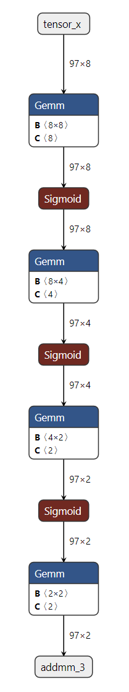

TorchDynamo-based ONNX Exporter
===============================

.. automodule:: torch.onnx
  :noindex:

.. contents:: :local:
    :depth: 1

Overview
--------

The ONNX exporter leverages TorchDynamo engine to hook into Python's frame evaluation API
and dynamically rewrite its bytecode into an FX Graph.
The resulting FX Graph is then polished before it is finally translated into an ONNX graph.

The main advantage of this approach is that the `FX graph <https://pytorch.org/docs/stable/fx.html>`_ is captured using
bytecode analysis that preserves the dynamic nature of the model instead of using traditional static tracing techniques.

In addition, during the export process, memory usage is significantly reduced compared to the TorchScript-enabled exporter.
See the :doc:`memory usage documentation <onnx_dynamo_memory_usage>` for more information.

Dependencies
------------

The ONNX exporter depends on extra Python packages:

  - `ONNX <https://onnx.ai>`_
  - `ONNX Script <https://microsoft.github.io/onnxscript>`_

They can be installed through `pip <https://pypi.org/project/pip/>`_:

.. code-block:: bash

  pip install --upgrade onnx onnxscript

`onnxruntime <https://onnxruntime.ai>`_ can then be used to execute the model
on a large variety of processors.

A simple example
----------------

See below a demonstration of exporter API in action with a simple Multilayer Perceptron (MLP) as example:

.. code-block:: python

    class MLPModel(nn.Module):
      def __init__(self):
          super().__init__()
          self.fc0 = nn.Linear(8, 8, bias=True)
          self.fc1 = nn.Linear(8, 4, bias=True)
          self.fc2 = nn.Linear(4, 2, bias=True)
          self.fc3 = nn.Linear(2, 2, bias=True)
          self.fc_combined = nn.Linear(8 + 8 + 8, 8, bias=True)  # Combine all inputs

      def forward(self, tensor_x: torch.Tensor, input_dict: dict, input_list: list):
          """
          Forward method that requires all inputs:
          - tensor_x: A direct tensor input.
          - input_dict: A dictionary containing the tensor under the key 'tensor_x'.
          - input_list: A list where the first element is the tensor.
          """
          # Extract tensors from inputs
          dict_tensor = input_dict['tensor_x']
          list_tensor = input_list[0]

          # Combine all inputs into a single tensor
          combined_tensor = torch.cat([tensor_x, dict_tensor, list_tensor], dim=1)

          # Process the combined tensor through the layers
          combined_tensor = self.fc_combined(combined_tensor)
          combined_tensor = torch.sigmoid(combined_tensor)
          combined_tensor = self.fc0(combined_tensor)
          combined_tensor = torch.sigmoid(combined_tensor)
          combined_tensor = self.fc1(combined_tensor)
          combined_tensor = torch.sigmoid(combined_tensor)
          combined_tensor = self.fc2(combined_tensor)
          combined_tensor = torch.sigmoid(combined_tensor)
          output = self.fc3(combined_tensor)
          return output

    model = MLPModel()

    # Example inputs
    tensor_input = torch.rand((97, 8), dtype=torch.float32)
    dict_input = {'tensor_x': torch.rand((97, 8), dtype=torch.float32)}
    list_input = [torch.rand((97, 8), dtype=torch.float32)]

    # The input_names and output_names are used to identify the inputs and outputs of the ONNX model
    input_names = ['tensor_input', 'tensor_x', 'list_input_index_0']
    output_names = ['output']

    # Exporting the model with all required inputs
    onnx_program = torch.onnx.export(model,(tensor_input, dict_input, list_input), dynamic_shapes=({0: "batch_size"},{"tensor_x": {0: "batch_size"}},[{0: "batch_size"}]), input_names=input_names, output_names=output_names, dynamo=True,)

    # Check the exported ONNX model is dynamic
    assert onnx_program.model.graph.inputs[0].shape == ("batch_size", 8)
    assert onnx_program.model.graph.inputs[1].shape == ("batch_size", 8)
    assert onnx_program.model.graph.inputs[2].shape == ("batch_size", 8)

As the code above shows, all you need is to provide :func:`torch.onnx.export` with an instance of the model and its input.
The exporter will then return an instance of :class:`torch.onnx.ONNXProgram` that contains the exported ONNX graph along with extra information.

The in-memory model available through ``onnx_program.model_proto`` is an ``onnx.ModelProto`` object in compliance with the `ONNX IR spec <https://github.com/onnx/onnx/blob/main/docs/IR.md>`_.
The ONNX model may then be serialized into a `Protobuf file <https://protobuf.dev/>`_ using the :meth:`torch.onnx.ONNXProgram.save` API.

.. code-block:: python

  onnx_program.save("mlp.onnx")

Use the same model to compare with the TorchScript-enabled exporter
-------------------------------------------------------------------

The biggest difference between the TorchScript-enabled exporter and the TorchDynamo-based exporter is that the latter
requires dynamic_shapes to be the same tree structure as the input, while the former
requires the dynamic_shapes to be a single and flatten dictionary.

.. code-block:: python

  torch.onnx.export(model,(tensor_input, dict_input, list_input), "mlp.onnx", dynamic_axes={"tensor_input":{0: "batch_size"}, "tensor_x": {0: "batch_size"}, "list_input_index_0": {0: "batch_size"}}, input_names=input_names, output_names=output_names)

Inspecting the ONNX model using GUI
-----------------------------------

You can view the exported model using `Netron <https://netron.app/>`__.

When the conversion fails
-------------------------

Function :func:`torch.onnx.export` should called a second time with
parameter ``report=True``. A markdown report is generated to help the user
to resolve the issue.

.. toctree::
    :hidden:

    onnx_dynamo_memory_usage

API Reference
-------------

.. autofunction:: torch.onnx.export
.. autoclass:: torch.onnx.ONNXProgram
    :members:
.. autofunction:: is_in_onnx_export
.. autoclass:: torch.onnx.OnnxExporterError
    :members:
.. autofunction:: torch.onnx.enable_fake_mode

Deprecated
----------

The following classes and functions are deprecated and will be removed.

.. autofunction:: torch.onnx.dynamo_export
.. autoclass:: torch.onnx.ExportOptions
