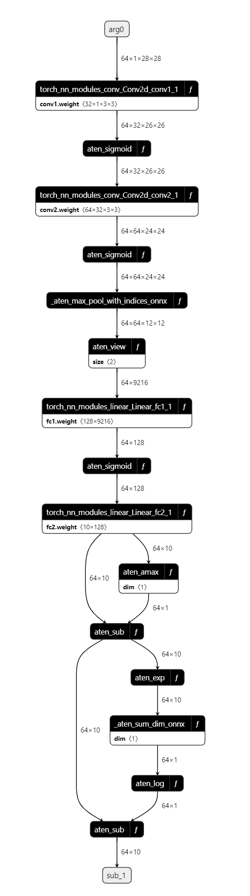
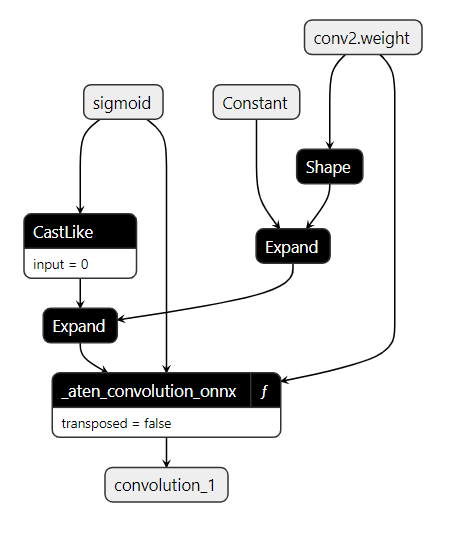

TorchDynamo-based ONNX Exporter
===============================

.. automodule:: torch.onnx
  :noindex:

.. contents:: :local:
    :depth: 3

.. warning::
  The ONNX exporter for TorchDynamo is under active development and is subject to rapid change.

Overview
--------

As mentioned before, the ONNX exporter leverages TorchDynamo engine to hook into Python's frame evaluation API
and dynamically rewrite its bytecode into an FX Graph.
The resulting FX Graph is then polished before it is finally translated into an ONNX graph.

The main advantage of this approach is that the `FX graph <https://pytorch.org/docs/stable/fx.html>_` is captured using
bytecode analysis that preserves the dynamic nature of the model instead of using traditional static tracing techniques.

The exporter is designed to be modular and extensible. It is composed of the following components:

  - **ONNX Exporter**: :class:`Exporter` main class that orchestrates the export process.
  - **ONNX Export Options**: :class:`ExportOptions` has a set of options that control the export process.
  - **ONNX Registry**: :class:`OnnxRegistry` is the registry of ONNX operators and functions.
  - **FX Graph Extractor**: :class:`FXGraphExtractor` extracts the FX graph from the PyTorch model.
  - **Fake Mode**: :class:`ONNXFakeContext` is a context manager that enables fake mode for large scale models.
  - **ONNX Export Output**: :class:`ExportOutput` is the output of the exporter that contains the exported ONNX graph and diagnostics.
  - **ONNX Export Output Serializer**: :class:`ExportOutputSerializer` serializes the exported model to a file.
  - **ONNX Diagnostic Options**: :class:`DiagnosticOptions` has a set of options that control the diagnostics emitted by the exporter.

Dependencies
------------

The ONNX exporter depends on extra Python packages not available through PyTorchs's `requirements.txt` file:

  - `ONNX <https://onnx.ai>`_
  - `ONNX Script <https://onnxscript.ai>`_

They can be installed through `pip <https://pypi.org/project/pip/>`_ utility as follows:

.. code-block:: bash

  pip install onnx onnxscript-preview    # TODO: Replace with `onnxscript` when it is official

A simple example
----------------

See below a demonstration of exporter API in action with a simple image classifier model as example:

.. code-block:: python

  import torch

  class MNISTModel(torch.nn.Module):
    def __init__(self):
        super().__init__()
        self.conv1 = torch.nn.Conv2d(1, 32, 3, 1, bias=False)
        self.conv2 = torch.nn.Conv2d(32, 64, 3, 1, bias=False)
        self.fc1 = torch.nn.Linear(9216, 128, bias=False)
        self.fc2 = torch.nn.Linear(128, 10, bias=False)

    def forward(self, tensor_x: torch.Tensor):
        tensor_x = self.conv1(tensor_x)
        tensor_x = torch.nn.functional.sigmoid(tensor_x)
        tensor_x = self.conv2(tensor_x)
        tensor_x = torch.nn.functional.sigmoid(tensor_x)
        tensor_x = torch.nn.functional.max_pool2d(tensor_x, 2)
        tensor_x = torch.flatten(tensor_x, 1)
        tensor_x = self.fc1(tensor_x)
        tensor_x = torch.nn.functional.sigmoid(tensor_x)
        tensor_x = self.fc2(tensor_x)
        output = torch.nn.functional.log_softmax(tensor_x, dim=1)
        return output

  tensor_x = torch.rand((64, 1, 28, 28), dtype=torch.float32)
  export_output = torch.onnx.dynamo_export(MNISTModel(), tensor_x)

As the code above shows, all you need is to provide ``torch.onnx.dynamo_export`` with an instance of the model and its input.
The exporter will then return an instance of ``torch.onnx.ExportOutput`` that contains the exported ONNX graph along with extra information.

The in-memory model (type: onnx.ModelProto) is available at ``export_output.model_proto`` following `ONNX IR spec <https://github.com/onnx/onnx/blob/main/docs/IR.md>`_,
but the ONNX model can also be serialized into a `Protobuf file <https://protobuf.dev/>`_ using the ``torch.onnx.ExportOutput.save`` API.

.. code-block:: python

  export_output.save("/path/to/mnist.onnx")

Inspecting the ONNX model using GUI
-----------------------------------

You can view the exported model using `Netron <https://netron.app/>`__.

Note that each layer is represented in a rectangular box with a *f* icon in the top right corner.

By expanding it, the function body is shown.

The function body is a sequence of ONNX operators or other functions.

Diagnosing issues with SARIF
----------------------------

ONNX diagnostics goes beyond regular logs through the adoption of
`Static Analysis Results Interchange Format (aka SARIF) <https://docs.oasis-open.org/sarif/sarif/v2.1.0/sarif-v2.1.0.html>`__
to help users debug and improve their model using a GUI, such as
Visual Studio Code's `SARIF Viewer <https://marketplace.visualstudio.com/items?itemName=MS-SarifVSCode.sarif-viewer>`_.

The main advantages are:

  - The diagnostics are emitted in machine parsable .
  - A new clearer, structured way to add new and keep track of diagnostic rules.
  - Serve as foundation for more future improvements consuming the diagnostics.

.. toctree::
   :maxdepth: 1
   :caption: ONNX Diagnostic SARIF Rules
   :glob:

   generated/onnx_dynamo_diagnostics_rules/*

API Reference
-------------

.. autofunction:: torch.onnx.dynamo_export
.. autofunction:: torch.onnx.enable_fake_mode

.. autosummary::
    :toctree: generated
    :nosignatures:
    :template: classtemplate.rst

    torch.onnx.DiagnosticOptions
    torch.onnx.ExportOptions
    torch.onnx.ExportOutput
    torch.onnx.ExportOutputSerializer
    torch.onnx.OnnxExporterError
    torch.onnx.OnnxRegistry
