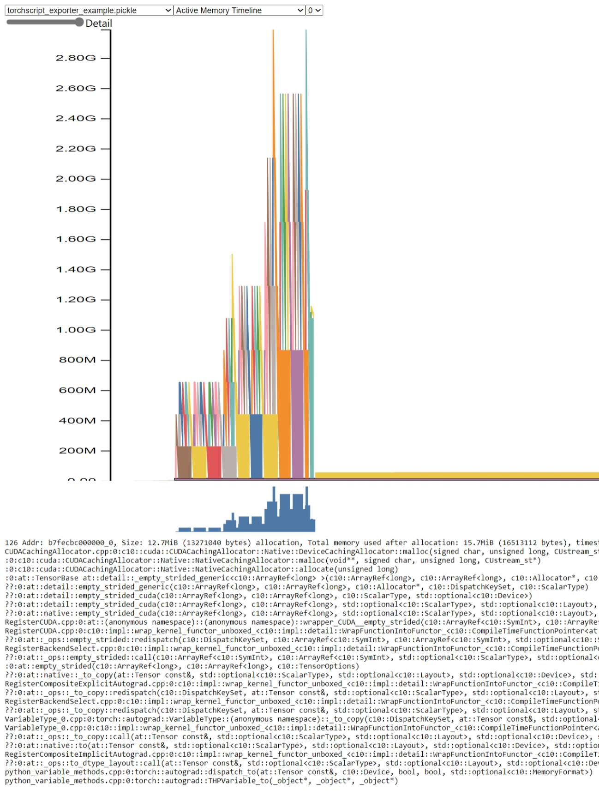
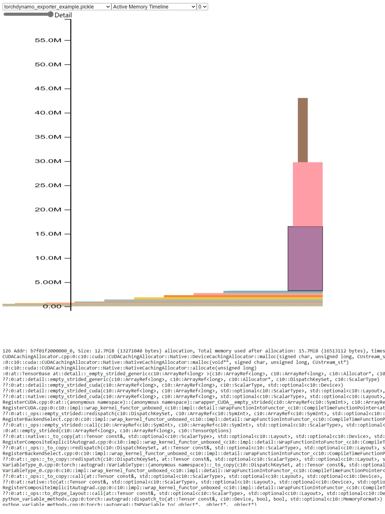

Understanding TorchDynamo-based ONNX Exporter Memory Usage
==========================================================
The previous TorchScript-based ONNX exporter would execute the model once to trace its execution, which could cause it to run out of
memory on your GPU if the model's memory requirements exceeded the available GPU memory. This issue has been addressed with the new
TorchDynamo-based ONNX exporter.

The TorchDynamo-based ONNX exporter leverages `FakeTensorMode <https://pytorch.org/docs/stable/torch.compiler_fake_tensor.html>`_ to
avoid performing actual tensor computations during the export process. This approach results in significantly lower memory usage
compared to the TorchScript-based ONNX exporter.

Below is an example demonstrating the memory usage difference between TorchScript-based and TorchDynamo-based ONNX exporters.
In this example, we use the HighResNet model from MONAI. Before proceeding, please install it from PyPI:

.. code-block:: bash

   pip install monai

PyTorch offers a tool for capturing and visualizing memory usage traces. We will use this tool to record the memory usage of the two
exporters during the export process and compare the results. You can find more details about this tool on
`Understanding CUDA Memory Usage <https://pytorch.org/docs/stable/torch_cuda_memory.html>`_.

TorchScript-based exporter
==========================
The code below could be run to generate a snapshot file which records the state of allocated CUDA memory during the export process.

.. code-block:: python

    import torch

    from torch.onnx.utils import export
    from monai.networks.nets import (
        HighResNet,
    )

    torch.cuda.memory._record_memory_history()

    model = HighResNet(
        spatial_dims=3, in_channels=1, out_channels=3, norm_type="batch"
    ).eval()

    model = model.to("cuda")
    data = torch.randn(30, 1, 48, 48, 48, dtype=torch.float32).to("cuda")

    with torch.no_grad():
        export(
            model,
            data,
            "torchscript_exporter_highresnet.onnx",
        )

    snapshot_name = f"torchscript_exporter_example.pickle"
    print(f"generate {snapshot_name}")

    torch.cuda.memory._dump_snapshot(snapshot_name)
    print(f"Export is done.")

Open `pytorch.org/memory_viz <https://pytorch.org/memory_viz>`_ and drag/drop the generated pickled snapshot file into the visualizer.
The memory usage is described as below:

By this figure, we can see the memory usage peak is above 2.8GB.

TorchDynamo-based exporter
==========================

The code below could be run to generate a snapshot file which records the state of allocated CUDA memory during the export process.

.. code-block:: python

    import torch

    from monai.networks.nets import (
        HighResNet,
    )

    torch.cuda.memory._record_memory_history()

    model = HighResNet(
        spatial_dims=3, in_channels=1, out_channels=3, norm_type="batch"
    ).eval()

    model = model.to("cuda")
    data = torch.randn(30, 1, 48, 48, 48, dtype=torch.float32).to("cuda")

    with torch.no_grad():
        onnx_program = torch.onnx.export(
                            model,
                            data,
                            "test_faketensor.onnx",
                            dynamo=True,
                        )

    snapshot_name = f"torchdynamo_exporter_example.pickle"
    print(f"generate {snapshot_name}")

    torch.cuda.memory._dump_snapshot(snapshot_name)
    print(f"Export is done.")

Open `pytorch.org/memory_viz <https://pytorch.org/memory_viz>`_ and drag/drop the generated pickled snapshot file into the visualizer.
The memeory usage is described as below:

By this figure, we can see the memory usage peak is only around 45MB. Comparing to the memory usage peak of TorchScript-based exporter,
it reduces 98% memory usage.
