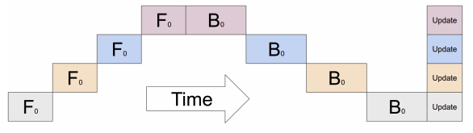
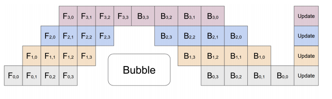

.. _pipeline-parallelism:

Pipeline Parallelism
====================

Pipeline parallelism was original introduced in the
`Gpipe <https://arxiv.org/abs/1811.06965>`__  paper and is an efficient
technique to train large models on multiple GPUs.

.. warning ::
     Pipeline Parallelism is experimental and subject to change.

Model Parallelism using multiple GPUs
-------------------------------------

Typically for large models which don't fit on a single GPU, model parallelism
is employed where certain parts of the model are placed on different GPUs.
Although, if this is done naively for sequential models, the training process
suffers from GPU under utilization since only one GPU is active at one time as
shown in the figure below:

   The figure represents a model with 4 layers placed on 4 different GPUs
   (vertical axis). The horizontal axis represents training this model through
   time demonstrating that only 1 GPU is utilized at a time
   (`image source <https://arxiv.org/abs/1811.06965>`__).

Pipelined Execution
-------------------

To alleviate this problem, pipeline parallelism splits the input minibatch into
multiple microbatches and pipelines the execution of these microbatches across
multiple GPUs. This is outlined in the figure below:

   The figure represents a model with 4 layers placed on 4 different GPUs
   (vertical axis). The horizontal axis represents training this model through
   time demonstrating that the GPUs are utilized much more efficiently.
   However, there still exists a bubble (as demonstrated in the figure) where
   certain GPUs are not utilized.
   (`image source <https://arxiv.org/abs/1811.06965>`__).

Pipe APIs in PyTorch
--------------------
.. autoclass:: torch.distributed.pipeline.sync.Pipe
   :members: forward

Skip connections
^^^^^^^^^^^^^^^^

Certain models like ResNeXt are not completely sequential and have skip
connections between layers. Naively implementing as part of pipeling
parallelism would imply that we need to copy outputs for certain layers through
multiple GPUs till we eventually reach the GPU where the layer for the skip
connection resides. To avoid this copy overhead, we provide APIs below to stash
and pop Tensors in different layers of the model.

.. autofunction:: torch.distributed.pipeline.sync.skip.skippable.skippable
.. autoclass:: torch.distributed.pipeline.sync.skip.skippable.stash
.. autoclass:: torch.distributed.pipeline.sync.skip.skippable.pop
.. autofunction:: torch.distributed.pipeline.sync.skip.skippable.verify_skippables

Acknowledgements
----------------

The implementation for pipeline parallelism is based on `fairscale's pipe implementation <https://github.com/facebookresearch/fairscale/tree/master/fairscale/nn/pipe>`__ and
`torchgpipe <https://github.com/kakaobrain/torchgpipe>`__. We would like to
thank both teams for their contributions and guidance towards bringing pipeline
parallelism into PyTorch.
