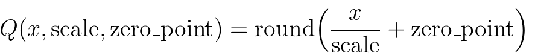

.. _quantization-doc:

Quantization
============

.. automodule:: torch.quantization
.. automodule:: torch.quantization.fx

.. warning ::
     Quantization is in beta and subject to change.

Introduction to Quantization
----------------------------

Quantization refers to techniques for performing computations and storing
tensors at lower bitwidths than floating point precision. A quantized model
executes some or all of the operations on tensors with reduced precision rather than
full precision (floating point) values. This allows for a more compact model representation and
the use of high performance vectorized operations on many hardware platforms.
PyTorch supports INT8 quantization compared to typical FP32 models allowing for
a 4x reduction in the model size and a 4x reduction in memory bandwidth
requirements. Hardware support for INT8 computations is typically 2 to 4
times faster compared to FP32 compute. Quantization is primarily a technique to
speed up inference and only the forward pass is supported for quantized
operators.

PyTorch supports multiple approaches to quantizing a deep learning model. In
most cases the model is trained in FP32 and then the model is converted to
INT8. In addition, PyTorch also supports quantization aware training, which
models quantization errors in both the forward and backward passes using
fake-quantization modules. Note that the entire computation is carried out in
floating point. At the end of quantization aware training, PyTorch provides
conversion functions to convert the trained model into lower precision.

At lower level, PyTorch provides a way to represent quantized tensors and
perform operations with them. They can be used to directly construct models
that perform all or part of the computation in lower precision. Higher-level
APIs are provided that incorporate typical workflows of converting FP32 model
to lower precision with minimal accuracy loss.

Quantization API Summary
-----------------------------

PyTorch provides two different modes of quantization: Eager Mode Quantization and FX Graph Mode Quantization.

Eager Mode Quantization is a beta feature. User needs to do fusion and specify where quantization and dequantization happens manually, also it only supports modules and not functionals.

FX Graph Mode Quantization is a new automated quantization framework in PyTorch, and currently it's a prototype feature. It improves upon Eager Mode Quantization by adding support for functionals and automating the quantization process, although people might need to refactor the model to make the model compatible with FX Graph Mode Quantization (symbolically traceable with ``torch.fx``). Note that FX Graph Mode Quantization is not expected to work on arbitrary models since the model might not be symbolically traceable, we will integrate it into domain libraries like torchvision and users will be able to quantize models similar to the ones in supported domain libraries with FX Graph Mode Quantization. For arbitrary models we'll provide general guidelines, but to actually make it work, users might need to be familiar with ``torch.fx``, especially on how to make a model symbolically traceable.

New users of quantization are encouraged to try out FX Graph Mode Quantization first, if it does not work, user may try to follow the guideline of `using FX Graph Mode Quantization <https://pytorch.org/tutorials/prototype/fx_graph_mode_quant_guide.html>`_ or fall back to eager mode quantization.

The following table compares the differences between Eager Mode Quantization and FX Graph Mode Quantization:

+-----------------+-------------------+-------------------+
|                 |Eager Mode         |FX Graph           |
|                 |Quantization       |Mode               |
|                 |                   |Quantization       |
+-----------------+-------------------+-------------------+
|Release          |beta               |prototype          |
|Status           |                   |                   |
+-----------------+-------------------+-------------------+
|Operator         |Manual             |Automatic          |
|Fusion           |                   |                   |
+-----------------+-------------------+-------------------+
|Quant/DeQuant    |Manual             |Automatic          |
|Placement        |                   |                   |
+-----------------+-------------------+-------------------+
|Quantizing       |Supported          |Supported          |
|Modules          |                   |                   |
+-----------------+-------------------+-------------------+
|Quantizing       |Manual             |Automatic          |
|Functionals/Torch|                   |                   |
|Ops              |                   |                   |
+-----------------+-------------------+-------------------+
|Support for      |Limited Support    |Fully              |
|Customization    |                   |Supported          |
+-----------------+-------------------+-------------------+
|Quantization Mode|Post Training      |Post Training      |
|Support          |Quantization:      |Quantization:      |
|                 |Static, Dynamic,   |Static, Dynamic,   |
|                 |Weight Only        |Weight Only        |
|                 |                   |                   |
|                 |Quantiztion Aware  |Quantiztion Aware  |
|                 |Training:          |Training:          |
|                 |Static             |Static             |
+-----------------+-------------------+-------------------+
|Input/Output     |``torch.nn.Module``|``torch.nn.Module``|
|Model Type       |                   |(May need some     |
|                 |                   |refactors to make  |
|                 |                   |the model          |
|                 |                   |compatible with FX |
|                 |                   |Graph Mode         |
|                 |                   |Quantization)      |
+-----------------+-------------------+-------------------+

There are three types of quantization supported:

1. dynamic quantization (weights quantized with activations read/stored in
   floating point and quantized for compute)
2. static quantization (weights quantized, activations quantized, calibration
   required post training)
3. static quantization aware training (weights quantized, activations quantized,
   quantization numerics modeled during training)

Please see our `Introduction to Quantization on Pytorch
<https://pytorch.org/blog/introduction-to-quantization-on-pytorch/>`_ blog post
for a more comprehensive overview of the tradeoffs between these quantization
types.

Operator coverage varies between dynamic and static quantization and is captured in the table below.
Note that for FX quantization, the corresponding functionals are also supported.

+---------------------------+-------------------+--------------------+
|                           |Static             | Dynamic            |
|                           |Quantization       | Quantization       |
+---------------------------+-------------------+--------------------+
| | nn.Linear               | | Y               | | Y                |
| | nn.Conv1d/2d/3d         | | Y               | | N                |
+---------------------------+-------------------+--------------------+
| | nn.LSTM                 | | Y (through      | | Y                |
| |                         | | custom modules) | |                  |
| | nn.GRU                  | | N               | | Y                |
+---------------------------+-------------------+--------------------+
| | nn.RNNCell              | | N               | | Y                |
| | nn.GRUCell              | | N               | | Y                |
| | nn.LSTMCell             | | N               | | Y                |
+---------------------------+-------------------+--------------------+
|nn.EmbeddingBag            | Y (activations    |                    |
|                           | are in fp32)      | Y                  |
+---------------------------+-------------------+--------------------+
|nn.Embedding               | Y                 | N                  |
+---------------------------+-------------------+--------------------+
| nn.MultiheadAttention     | Y (through        | Not supported      |
|                           | custom modules)   |                    |
+---------------------------+-------------------+--------------------+
| Activations               | Broadly supported | Un-changed,        |
|                           |                   | computations       |
|                           |                   | stay in fp32       |
+---------------------------+-------------------+--------------------+

Eager Mode Quantization
^^^^^^^^^^^^^^^^^^^^^^^
For a general introduction to the quantization flow, including different types of quantization, please take a look at `General Quantization Flow`_.

Post Training Dynamic Quantization
~~~~~~~~~~~~~~~~~~~~~~~~~~~~~~~~~~

This is the simplest to apply form of quantization where the weights are
quantized ahead of time but the activations are dynamically quantized
during inference. This is used for situations where the model execution time
is dominated by loading weights from memory rather than computing the matrix
multiplications. This is true for LSTM and Transformer type models with
small batch size.

Diagram::

  # original model
  # all tensors and computations are in floating point
  previous_layer_fp32 -- linear_fp32 -- activation_fp32 -- next_layer_fp32
                   /
  linear_weight_fp32

  # dynamically quantized model
  # linear and LSTM weights are in int8
  previous_layer_fp32 -- linear_int8_w_fp32_inp -- activation_fp32 -- next_layer_fp32
                       /
     linear_weight_int8

PTDQ API Example::

  import torch

  # define a floating point model
  class M(torch.nn.Module):
      def __init__(self):
          super().__init__()
          self.fc = torch.nn.Linear(4, 4)

      def forward(self, x):
          x = self.fc(x)
          return x

  # create a model instance
  model_fp32 = M()
  # create a quantized model instance
  model_int8 = torch.quantization.quantize_dynamic(
      model_fp32,  # the original model
      {torch.nn.Linear},  # a set of layers to dynamically quantize
      dtype=torch.qint8)  # the target dtype for quantized weights

  # run the model
  input_fp32 = torch.randn(4, 4, 4, 4)
  res = model_int8(input_fp32)

To learn more about dynamic quantization please see our `dynamic quantization tutorial
<https://pytorch.org/tutorials/recipes/recipes/dynamic_quantization.html>`_.

Post Training Static Quantization
~~~~~~~~~~~~~~~~~~~~~~~~~~~~~~~~~

Post Training Static Quantization (PTQ static) quantizes the weights and activations of the model.  It
fuses activations into preceding layers where possible.  It requires
calibration with a representative dataset to determine optimal quantization
parameters for activations. Post Training Static Quantization is typically used when
both memory bandwidth and compute savings are important with CNNs being a
typical use case.

We may need to modify the model before applying post training static quantization. Please see `Model Preparation for Eager Mode Static Quantization`_.

Diagram::

    # original model
    # all tensors and computations are in floating point
    previous_layer_fp32 -- linear_fp32 -- activation_fp32 -- next_layer_fp32
                        /
        linear_weight_fp32

    # statically quantized model
    # weights and activations are in int8
    previous_layer_int8 -- linear_with_activation_int8 -- next_layer_int8
                        /
      linear_weight_int8

PTSQ API Example::

  import torch

  # define a floating point model where some layers could be statically quantized
  class M(torch.nn.Module):
      def __init__(self):
          super().__init__()
          # QuantStub converts tensors from floating point to quantized
          self.quant = torch.quantization.QuantStub()
          self.conv = torch.nn.Conv2d(1, 1, 1)
          self.relu = torch.nn.ReLU()
          # DeQuantStub converts tensors from quantized to floating point
          self.dequant = torch.quantization.DeQuantStub()

      def forward(self, x):
          # manually specify where tensors will be converted from floating
          # point to quantized in the quantized model
          x = self.quant(x)
          x = self.conv(x)
          x = self.relu(x)
          # manually specify where tensors will be converted from quantized
          # to floating point in the quantized model
          x = self.dequant(x)
          return x

  # create a model instance
  model_fp32 = M()

  # model must be set to eval mode for static quantization logic to work
  model_fp32.eval()

  # attach a global qconfig, which contains information about what kind
  # of observers to attach. Use 'fbgemm' for server inference and
  # 'qnnpack' for mobile inference. Other quantization configurations such
  # as selecting symmetric or assymetric quantization and MinMax or L2Norm
  # calibration techniques can be specified here.
  model_fp32.qconfig = torch.quantization.get_default_qconfig('fbgemm')

  # Fuse the activations to preceding layers, where applicable.
  # This needs to be done manually depending on the model architecture.
  # Common fusions include `conv + relu` and `conv + batchnorm + relu`
  model_fp32_fused = torch.quantization.fuse_modules(model_fp32, [['conv', 'relu']])

  # Prepare the model for static quantization. This inserts observers in
  # the model that will observe activation tensors during calibration.
  model_fp32_prepared = torch.quantization.prepare(model_fp32_fused)

  # calibrate the prepared model to determine quantization parameters for activations
  # in a real world setting, the calibration would be done with a representative dataset
  input_fp32 = torch.randn(4, 1, 4, 4)
  model_fp32_prepared(input_fp32)

  # Convert the observed model to a quantized model. This does several things:
  # quantizes the weights, computes and stores the scale and bias value to be
  # used with each activation tensor, and replaces key operators with quantized
  # implementations.
  model_int8 = torch.quantization.convert(model_fp32_prepared)

  # run the model, relevant calculations will happen in int8
  res = model_int8(input_fp32)

To learn more about static quantization, please see the `static quantization tutorial
<https://pytorch.org/tutorials/advanced/static_quantization_tutorial.html>`_.

Quantization Aware Training for Static Quantization
~~~~~~~~~~~~~~~~~~~~~~~~~~~~~~~~~~~~~~~~~~~~~~~~~~~

Quantization Aware Training (QAT) models the effects of quantization during training
allowing for higher accuracy compared to other quantization methods. We can do QAT for static, dynamic or weight only quantization.  During
training, all calculations are done in floating point, with fake_quant modules
modeling the effects of quantization by clamping and rounding to simulate the
effects of INT8.  After model conversion, weights and
activations are quantized, and activations are fused into the preceding layer
where possible.  It is commonly used with CNNs and yields a higher accuracy
compared to static quantization.

We may need to modify the model before applying post training static quantization. Please see `Model Preparation for Eager Mode Static Quantization`_.

Diagram::

  # original model
  # all tensors and computations are in floating point
  previous_layer_fp32 -- linear_fp32 -- activation_fp32 -- next_layer_fp32
                        /
      linear_weight_fp32

  # model with fake_quants for modeling quantization numerics during training
  previous_layer_fp32 -- fq -- linear_fp32 -- activation_fp32 -- fq -- next_layer_fp32
                             /
     linear_weight_fp32 -- fq

  # quantized model
  # weights and activations are in int8
  previous_layer_int8 -- linear_with_activation_int8 -- next_layer_int8
                       /
     linear_weight_int8

QAT API Example::

  import torch

  # define a floating point model where some layers could benefit from QAT
  class M(torch.nn.Module):
      def __init__(self):
          super().__init__()
          # QuantStub converts tensors from floating point to quantized
          self.quant = torch.quantization.QuantStub()
          self.conv = torch.nn.Conv2d(1, 1, 1)
          self.bn = torch.nn.BatchNorm2d(1)
          self.relu = torch.nn.ReLU()
          # DeQuantStub converts tensors from quantized to floating point
          self.dequant = torch.quantization.DeQuantStub()

      def forward(self, x):
          x = self.quant(x)
          x = self.conv(x)
          x = self.bn(x)
          x = self.relu(x)
          x = self.dequant(x)
          return x

  # create a model instance
  model_fp32 = M()

  # model must be set to eval for fusion to work
  model_fp32.eval()

  # attach a global qconfig, which contains information about what kind
  # of observers to attach. Use 'fbgemm' for server inference and
  # 'qnnpack' for mobile inference. Other quantization configurations such
  # as selecting symmetric or assymetric quantization and MinMax or L2Norm
  # calibration techniques can be specified here.
  model_fp32.qconfig = torch.quantization.get_default_qat_qconfig('fbgemm')

  # fuse the activations to preceding layers, where applicable
  # this needs to be done manually depending on the model architecture
  model_fp32_fused = torch.quantization.fuse_modules(model_fp32,
      [['conv', 'bn', 'relu']])

  # Prepare the model for QAT. This inserts observers and fake_quants in
  # the model needs to be set to train for QAT logic to work
  # the model that will observe weight and activation tensors during calibration.
  model_fp32_prepared = torch.quantization.prepare_qat(model_fp32_fused.train())

  # run the training loop (not shown)
  training_loop(model_fp32_prepared)

  # Convert the observed model to a quantized model. This does several things:
  # quantizes the weights, computes and stores the scale and bias value to be
  # used with each activation tensor, fuses modules where appropriate,
  # and replaces key operators with quantized implementations.
  model_fp32_prepared.eval()
  model_int8 = torch.quantization.convert(model_fp32_prepared)

  # run the model, relevant calculations will happen in int8
  res = model_int8(input_fp32)

To learn more about quantization aware training, please see the `QAT
tutorial
<https://pytorch.org/tutorials/advanced/static_quantization_tutorial.html>`_.

Model Preparation for Eager Mode Static Quantization
~~~~~~~~~~~~~~~~~~~~~~~~~~~~~~~~~~~~~~~~~~~~~~~~~~~~

It is necessary to currently make some modifications to the model definition
prior to Eager mode quantization. This is because currently quantization works on a module
by module basis. Specifically, for all quantization techniques, the user needs to:

1. Convert any operations that require output requantization (and thus have
   additional parameters) from functionals to module form (for example,
   using ``torch.nn.ReLU`` instead of ``torch.nn.functional.relu``).
2. Specify which parts of the model need to be quantized either by assigning
   ``.qconfig`` attributes on submodules or by specifying ``qconfig_mapping``.
   For example, setting ``model.conv1.qconfig = None`` means that the
   ``model.conv`` layer will not be quantized, and setting
   ``model.linear1.qconfig = custom_qconfig`` means that the quantization
   settings for ``model.linear1`` will be using ``custom_qconfig`` instead
   of the global qconfig.

For static quantization techniques which quantize activations, the user needs
to do the following in addition:

1. Specify where activations are quantized and de-quantized. This is done using
   :class:`~torch.ao.quantization.QuantStub` and
   :class:`~torch.ao.quantization.DeQuantStub` modules.
2. Use :class:`~torch.ao.nn.quantized.FloatFunctional` to wrap tensor operations
   that require special handling for quantization into modules. Examples
   are operations like ``add`` and ``cat`` which require special handling to
   determine output quantization parameters.
3. Fuse modules: combine operations/modules into a single module to obtain
   higher accuracy and performance. This is done using the
   :func:`~torch.ao.quantization.fuse_modules` API, which takes in lists of modules
   to be fused. We currently support the following fusions:
   [Conv, Relu], [Conv, BatchNorm], [Conv, BatchNorm, Relu], [Linear, Relu]

(Prototype) FX Graph Mode Quantization
^^^^^^^^^^^^^^^^^^^^^^^^^^^^^^^^^^^^^^

There are multiple quantization types in post training quantization (weight only, dynamic and static) and the configuration is done through `qconfig_mapping` (an argument of the `prepare_fx` function).

FXPTQ API Example::

  import torch
  from torch.ao.quantization import QConfigMapping
  import torch.quantization.quantize_fx as quantize_fx
  import copy

  model_fp = UserModel()

  #
  # post training dynamic/weight_only quantization
  #

  # we need to deepcopy if we still want to keep model_fp unchanged after quantization since quantization apis change the input model
  model_to_quantize = copy.deepcopy(model_fp)
  model_to_quantize.eval()
  qconfig_mapping = QConfigMapping().set_global(torch.quantization.default_dynamic_qconfig)
  # a tuple of one or more example inputs are needed to trace the model
  example_inputs = (input_fp32)
  # prepare
  model_prepared = quantize_fx.prepare_fx(model_to_quantize, qconfig_mapping, example_inputs)
  # no calibration needed when we only have dynamic/weight_only quantization
  # quantize
  model_quantized = quantize_fx.convert_fx(model_prepared)

  #
  # post training static quantization
  #

  model_to_quantize = copy.deepcopy(model_fp)
  qconfig_mapping = QConfigMapping().set_global(torch.quantization.get_default_qconfig('qnnpack'))
  model_to_quantize.eval()
  # prepare
  model_prepared = quantize_fx.prepare_fx(model_to_quantize, qconfig_mapping, example_inputs)
  # calibrate (not shown)
  # quantize
  model_quantized = quantize_fx.convert_fx(model_prepared)

  #
  # quantization aware training for static quantization
  #

  model_to_quantize = copy.deepcopy(model_fp)
  qconfig_mapping = QConfigMapping().set_global(torch.quantization.get_default_qat_qconfig('qnnpack'))
  model_to_quantize.train()
  # prepare
  model_prepared = quantize_fx.prepare_qat_fx(model_to_quantize, qconfig_mapping, example_inputs)
  # training loop (not shown)
  # quantize
  model_quantized = quantize_fx.convert_fx(model_prepared)

  #
  # fusion
  #
  model_to_quantize = copy.deepcopy(model_fp)
  model_fused = quantize_fx.fuse_fx(model_to_quantize)

Please see the following tutorials for more information about FX Graph Mode Quantization:

- `User Guide on Using FX Graph Mode Quantization <https://pytorch.org/tutorials/prototype/fx_graph_mode_quant_guide.html>`_
- `FX Graph Mode Post Training Static Quantization <https://pytorch.org/tutorials/prototype/fx_graph_mode_ptq_static.html>`_
- `FX Graph Mode Post Training Dynamic Quantization <https://pytorch.org/tutorials/prototype/fx_graph_mode_ptq_dynamic.html>`_

Quantization Stack
------------------------
Quantization is the process to convert a floating point model to a quantized model. So at high level the quantization stack can be split into two parts: 1). The building blocks or abstractions for a quantized model 2). The building blocks or abstractions for the quantization flow that converts a floating point model to a quantized model

Quantized Model
^^^^^^^^^^^^^^^^^^^^^^^
Quantized Tensor
~~~~~~~~~~~~~~~~~
In order to do quantization in PyTorch, we need to be able to represent
quantized data in Tensors. A Quantized Tensor allows for storing
quantized data (represented as int8/uint8/int32) along with quantization
parameters like scale and zero\_point. Quantized Tensors allow for many
useful operations making quantized arithmetic easy, in addition to
allowing for serialization of data in a quantized format.

PyTorch supports both per tensor and per channel symmetric and asymmetric quantization. Per tensor means that all the values within the tensor are quantized the same way with the same quantization parameters. Per channel means that for each dimension, typically the channel dimension of a tensor, the values in the tensor are quantized with different quantization parameters. This allows for less error in converting tensors to quantized values since outlier values would only impact the channel it was in, instead of the entire Tensor.

The mapping is performed by converting the floating point tensors using

Note that, we ensure that zero in floating point is represented with no error
after quantization, thereby ensuring that operations like padding do not cause
additional quantization error.

Here are a few key attributes for quantized Tensor:

* QScheme (torch.qscheme): a enum that specifies the way we quantize the Tensor

  * torch.per_tensor_affine
  * torch.per_tensor_symmetric
  * torch.per_channel_affine
  * torch.per_channel_symmetric

* dtype (torch.dtype): data type of the quantized Tensor

  * torch.quint8
  * torch.qint8
  * torch.qint32
  * torch.float16

* quantization parameters (varies based on QScheme): parameters for the chosen way of quantization

  * torch.per_tensor_affine would have quantization parameters of

    * scale (float)
    * zero_point (int)
  * torch.per_channel_affine would have quantization parameters of

    * per_channel_scales (list of float)
    * per_channel_zero_points (list of int)
    * axis (int)

Quantize and Dequantize
~~~~~~~~~~~~~~~~~~~~~~~
The input and output of a model are floating point Tensors, but activations in the quantized model are quantized, so we need operators to convert between floating point and quantized Tensors.

* Quantize (float -> quantized)

  * torch.quantize_per_tensor(x, scale, zero_point, dtype)
  * torch.quantize_per_channel(x, scales, zero_points, axis, dtype)
  * torch.quantize_per_tensor_dynamic(x, dtype, reduce_range)
  * to(torch.float16)

* Dequantize (quantized -> float)

  * quantized_tensor.dequantize() - calling dequantize on a torch.float16 Tensor will convert the Tensor back to torch.float
  * torch.dequantize(x)

Quantized Operators/Modules
~~~~~~~~~~~~~~~~~~~~~~~~~~~
* Quantized Operator are the operators that takes quantized Tensor as inputs, and outputs a quantized Tensor.
* Quantized Modules are PyTorch Modules that performs quantized operations. They are typically defined for weighted operations like linear and conv.

Quantized Engine
~~~~~~~~~~~~~~~~~~~~
When a quantized model is executed, the qengine (torch.backends.quantized.engine) specifies which backend is to be used for execution. It is important to ensure that the qengine is compatible with the quantized model in terms of value range of quantized activation and weights.

Quantization Flow
^^^^^^^^^^^^^^^^^^^^^^^

Observer and FakeQuantize
~~~~~~~~~~~~~~~~~~~~~~~~~~
* Observer are PyTorch Modules used to:

  * collect tensor statistics like min value and max value of the Tensor passing through the observer
  * and calculate quantization parameters based on the collected tensor statistics
* FakeQuantize are PyTorch Modules used to:

  * simulate quantization (performing quantize/dequantize) for a Tensor in the network
  * it can calculate quantization parameters based on the collected statistics from observer, or it can learn the quantization parameters as well

QConfig
~~~~~~~~~~~
* QConfig is a namedtuple of Observer or FakeQuantize Module class that can are configurable with qscheme, dtype etc. it is used to configure how an operator should be observed

  * Quantization configuration for an operator/module

    * different types of Observer/FakeQuantize
    * dtype
    * qscheme
    * quant_min/quant_max: can be used to simulate lower precision Tensors
  * Currently supports configuration for activation and weight
  * We insert input/weight/output observer based on the qconfig that is configured for a given operator or module

General Quantization Flow
~~~~~~~~~~~~~~~~~~~~~~~~~~~~~
In general, the flow is the following

* prepare

  * insert Observer/FakeQuantize modules based on user specified qconfig

* calibrate/train (depending on post training quantization or quantization aware training)

  * allow Observers to collect statistics or FakeQuantize modules to learn the quantization parameters

* convert

  * convert a calibrated/trained model to a quantized model

There are different modes of quantization, they can be classified in two ways:

In terms of where we apply the quantization flow, we have:

1. Post Training Quantization (apply quantization after training, quantization parameters are calculated based on sample calibration data)
2. Quantization Aware Training (simulate quantization during training so that the quantization parameters can be learned together with the model using training data)

And in terms of how we quantize the operators, we can have:

- Weight Only Quantization (only weight is statically quantized)
- Dynamic Quantization (weight is statically quantized, activation is dynamically quantized)
- Static Quantization (both weight and activations are statically quantized)

We can mix different ways of quantizing operators in the same quantization flow. For example, we can have post training quantization that has both statically and dynamically quantized operators.

Quantization Support Matrix
--------------------------------------
Quantization Mode Support
^^^^^^^^^^^^^^^^^^^^^^^^^^^
+-----------------------------+------------------------------------------------------+----------------+----------------+------------+-----------------+
|                             |Quantization                                          |Dataset         | Works Best For | Accuracy   |      Notes      |
|                             |Mode                                                  |Requirement     |                |            |                 |
+-----------------------------+---------------------------------+--------------------+----------------+----------------+------------+-----------------+
|Post Training Quantization   |Dyanmic/Weight Only Quantization |activation          |None            |LSTM, MLP,      |good        |Easy to use,     |
|                             |                                 |dynamically         |                |Embedding,      |            |close to static  |
|                             |                                 |quantized (fp16,    |                |Transformer     |            |quantization when|
|                             |                                 |int8) or not        |                |                |            |performance is   |
|                             |                                 |quantized, weight   |                |                |            |compute or memory|
|                             |                                 |statically quantized|                |                |            |bound due to     |
|                             |                                 |(fp16, int8, in4)   |                |                |            |weights          |
|                             +---------------------------------+--------------------+----------------+----------------+------------+-----------------+
|                             |Static Quantization              |acivation and       |calibration     |CNN             |good        |Provides best    |
|                             |                                 |weights statically  |dataset         |                |            |perf, may have   |
|                             |                                 |quantized (int8)    |                |                |            |big impact on    |
|                             |                                 |                    |                |                |            |accuracy, good   |
|                             |                                 |                    |                |                |            |for hardwares    |
|                             |                                 |                    |                |                |            |that only support|
|                             |                                 |                    |                |                |            |int8 computation |
+-----------------------------+---------------------------------+--------------------+----------------+----------------+------------+-----------------+
|                             |Dynamic Quantization             |activation and      |fine-tuning     |MLP, Embedding  |best        |Limited support  |
|                             |                                 |weight are fake     |dataset         |                |            |for now          |
|                             |                                 |quantized           |                |                |            |                 |
|                             +---------------------------------+--------------------+----------------+----------------+------------+-----------------+
|                             |Static Quantization              |activatio nand      |fine-tuning     |CNN, MLP,       |best        |Typically used   |
|                             |                                 |weight are fake     |dataset         |Embedding       |            |when static      |
|                             |                                 |quantized           |                |                |            |quantization     |
|                             |                                 |                    |                |                |            |leads to bad     |
|                             |                                 |                    |                |                |            |accuracy, and    |
|                             |                                 |                    |                |                |            |used to close the|
|                             |                                 |                    |                |                |            |accuracy gap     |
|Quantization Aware Training  |                                 |                    |                |                |            |                 |
+-----------------------------+---------------------------------+--------------------+----------------+----------------+------------+-----------------+

Please see our `Introduction to Quantization on Pytorch
<https://pytorch.org/blog/introduction-to-quantization-on-pytorch/>`_ blog post
for a more comprehensive overview of the tradeoffs between these quantization
types.

Quantization Flow Support
^^^^^^^^^^^^^^^^^^^^^^^^^^^
PyTorch provides two modes of quantization: Eager Mode Quantization and FX Graph Mode Quantization.

Eager Mode Quantization is a beta feature. User needs to do fusion and specify where quantization and dequantization happens manually, also it only supports modules and not functionals.

FX Graph Mode Quantization is an automated quantization framework in PyTorch, and currently it's a prototype feature. It improves upon Eager Mode Quantization by adding support for functionals and automating the quantization process, although people might need to refactor the model to make the model compatible with FX Graph Mode Quantization (symbolically traceable with ``torch.fx``). Note that FX Graph Mode Quantization is not expected to work on arbitrary models since the model might not be symbolically traceable, we will integrate it into domain libraries like torchvision and users will be able to quantize models similar to the ones in supported domain libraries with FX Graph Mode Quantization. For arbitrary models we'll provide general guidelines, but to actually make it work, users might need to be familiar with ``torch.fx``, especially on how to make a model symbolically traceable.

New users of quantization are encouraged to try out FX Graph Mode Quantization first, if it does not work, user may try to follow the guideline of `using FX Graph Mode Quantization <https://pytorch.org/tutorials/prototype/fx_graph_mode_quant_guide.html>`_ or fall back to eager mode quantization.

The following table compares the differences between Eager Mode Quantization and FX Graph Mode Quantization:

+-----------------+-------------------+-------------------+
|                 |Eager Mode         |FX Graph           |
|                 |Quantization       |Mode               |
|                 |                   |Quantization       |
+-----------------+-------------------+-------------------+
|Release          |beta               |prototype          |
|Status           |                   |                   |
+-----------------+-------------------+-------------------+
|Operator         |Manual             |Automatic          |
|Fusion           |                   |                   |
+-----------------+-------------------+-------------------+
|Quant/DeQuant    |Manual             |Automatic          |
|Placement        |                   |                   |
+-----------------+-------------------+-------------------+
|Quantizing       |Supported          |Supported          |
|Modules          |                   |                   |
+-----------------+-------------------+-------------------+
|Quantizing       |Manual             |Automatic          |
|Functionals/Torch|                   |                   |
|Ops              |                   |                   |
+-----------------+-------------------+-------------------+
|Support for      |Limited Support    |Fully              |
|Customization    |                   |Supported          |
+-----------------+-------------------+-------------------+
|Quantization Mode|Post Training      |Post Training      |
|Support          |Quantization:      |Quantization:      |
|                 |Static, Dynamic,   |Static, Dynamic,   |
|                 |Weight Only        |Weight Only        |
|                 |                   |                   |
|                 |Quantization Aware |Quantization Aware |
|                 |Training:          |Training:          |
|                 |Static             |Static             |
+-----------------+-------------------+-------------------+
|Input/Output     |``torch.nn.Module``|``torch.nn.Module``|
|Model Type       |                   |(May need some     |
|                 |                   |refactors to make  |
|                 |                   |the model          |
|                 |                   |compatible with FX |
|                 |                   |Graph Mode         |
|                 |                   |Quantization)      |
+-----------------+-------------------+-------------------+

Backend/Hardware Support
^^^^^^^^^^^^^^^^^^^^^^^^^^^
+-----------------+---------------+------------+------------+------------+
|Hardware         |Kernel Library |Eager Mode  |FX Graph    |Quantization|
|                 |               |Quantization|Mode        |Mode Support|
|                 |               |            |Quantization|            |
+-----------------+---------------+------------+------------+------------+
|server CPU       |fbgemm         |Supported                |All         |
|                 |               |                         |Supported   |
+-----------------+---------------+                         |            +
|mobile CPU       |qnnpack/xnnpack|                         |            |
|                 |               |                         |            |
+-----------------+---------------+------------+------------+------------+
|server GPU       |TensorRT (early|Not support |Supported   |Static      |
|                 |prototype)     |this it     |            |Quantization|
|                 |               |requries a  |            |            |
|                 |               |graph       |            |            |
+-----------------+---------------+------------+------------+------------+

Today, PyTorch supports the following backends for running quantized operators efficiently:

* x86 CPUs with AVX2 support or higher (without AVX2 some operations have inefficient implementations), via `fbgemm <https://github.com/pytorch/FBGEMM>`_
* ARM CPUs (typically found in mobile/embedded devices), via `qnnpack <https://github.com/pytorch/pytorch/tree/master/aten/src/ATen/native/quantized/cpu/qnnpack>`_
* (early prototype) support for NVidia GPU via `TensorRT <https://developer.nvidia.com/tensorrt>`_ through `fx2trt` (to be open sourced)

Note for native CPU backends
~~~~~~~~~~~~~~~~~~~~~~~~~~~~~~
We expose both `fbgemm` and `qnnpack` with the same native pytorch quantized operators, so we need additional flag to distinguish between them. The corresponding implementation of `fbgemm` and `qnnpack` is chosen automatically based on the PyTorch build mode, though users have the option to override this by setting `torch.backends.quantization.engine` to `fbgemm` or `qnnpack`.

When preparing a quantized model, it is necessary to ensure that qconfig
and the engine used for quantized computations match the backend on which
the model will be executed. The qconfig controls the type of observers used
during the quantization passes. The qengine controls whether `fbgemm` or
`qnnpack` specific packing function is used when packing weights for linear
and convolution functions and modules. For example:

Default settings for fbgemm::

    # set the qconfig for PTQ
    qconfig = torch.quantization.get_default_qconfig('fbgemm')
    # or, set the qconfig for QAT
    qconfig = torch.quantization.get_default_qat_qconfig('fbgemm')
    # set the qengine to control weight packing
    torch.backends.quantized.engine = 'fbgemm'

Default settings for qnnpack::

    # set the qconfig for PTQ
    qconfig = torch.quantization.get_default_qconfig('qnnpack')
    # or, set the qconfig for QAT
    qconfig = torch.quantization.get_default_qat_qconfig('qnnpack')
    # set the qengine to control weight packing
    torch.backends.quantized.engine = 'qnnpack'

Operator Support
^^^^^^^^^^^^^^^^^^^^

Operator coverage varies between dynamic and static quantization and is captured in the table below.
Note that for FX Graph Mode Quantization, the corresponding functionals are also supported.

+---------------------------+-------------------+--------------------+
|                           |Static             | Dynamic            |
|                           |Quantization       | Quantization       |
+---------------------------+-------------------+--------------------+
| | nn.Linear               | | Y               | | Y                |
| | nn.Conv1d/2d/3d         | | Y               | | N                |
+---------------------------+-------------------+--------------------+
| | nn.LSTM                 | | N               | | Y                |
| | nn.GRU                  | | N               | | Y                |
+---------------------------+-------------------+--------------------+
| | nn.RNNCell              | | N               | | Y                |
| | nn.GRUCell              | | N               | | Y                |
| | nn.LSTMCell             | | N               | | Y                |
+---------------------------+-------------------+--------------------+
|nn.EmbeddingBag            | Y (activations    |                    |
|                           | are in fp32)      | Y                  |
+---------------------------+-------------------+--------------------+
|nn.Embedding               | Y                 | N                  |
+---------------------------+-------------------+--------------------+
|nn.MultiheadAttention      |Not Supported      | Not supported      |
+---------------------------+-------------------+--------------------+
|Activations                |Broadly supported  | Un-changed,        |
|                           |                   | computations       |
|                           |                   | stay in fp32       |
+---------------------------+-------------------+--------------------+

Note: this will be updated with some information generated from native backend_config_dict soon.

Quantization API Reference
---------------------------

The :doc:`Quantization API Reference <quantization-support>` contains documentation
of quantization APIs, such as quantization passes, quantized tensor operations,
and supported quantized modules and functions.

.. toctree::
    :hidden:

    quantization-support

Quantization Backend Configuration
----------------------------------

The :doc:`Quantization Backend Configuration <quantization-backend-configuration>` contains documentation
on how to configure the quantization workflows for various backends.

.. toctree::
    :hidden:

    quantization-backend-configuration

Quantization Accuracy Debugging
-------------------------------

The :doc:`Quantization Accuracy Debugging <quantization-accuracy-debugging>` contains documentation
on how to debug quantization accuracy.

.. toctree::
    :hidden:

    quantization-accuracy-debugging

Quantization Customizations
---------------------------

While default implementations of observers to select the scale factor and bias
based on observed tensor data are provided, developers can provide their own
quantization functions. Quantization can be applied selectively to different
parts of the model or configured differently for different parts of the model.

We also provide support for per channel quantization for **conv1d()**, **conv2d()**,
**conv3d()** and **linear()**.

Quantization workflows work by adding (e.g. adding observers as
``.observer`` submodule) or replacing (e.g. converting ``nn.Conv2d`` to
``nn.quantized.Conv2d``) submodules in the model's module hierarchy. It
means that the model stays a regular ``nn.Module``-based instance throughout the
process and thus can work with the rest of PyTorch APIs.

Quantization Custom Module API
^^^^^^^^^^^^^^^^^^^^^^^^^^^^^^

Both Eager mode and FX graph mode quantization APIs provide a hook for the user
to specify module quantized in a custom way, with user defined logic for
observation and quantization. The user needs to specify:

1. The Python type of the source fp32 module (existing in the model)
2. The Python type of the observed module (provided by user). This module needs
   to define a `from_float` function which defines how the observed module is
   created from the original fp32 module.
3. The Python type of the quantized module (provided by user). This module needs
   to define a `from_observed` function which defines how the quantized module is
   created from the observed module.
4. A configuration describing (1), (2), (3) above, passed to the quantization APIs.

The framework will then do the following:

1. during the `prepare` module swaps, it will convert every module of type
   specified in (1) to the type specified in (2), using the `from_float` function of
   the class in (2).
2. during the `convert` module swaps, it will convert every module of type
   specified in (2) to the type specified in (3), using the `from_observed` function
   of the class in (3).

Currently, there is a requirement that `ObservedCustomModule` will have a single
Tensor output, and an observer will be added by the framework (not by the user)
on that output. The observer will be stored under the `activation_post_process` key
as an attribute of the custom module instance. Relaxing these restrictions may
be done at a future time.

Custom API Example::

  import torch
  import torch.nn.quantized as nnq
  from torch.ao.quantization import QConfigMapping
  import torch.ao.quantization.quantize_fx

  # original fp32 module to replace
  class CustomModule(torch.nn.Module):
      def __init__(self):
          super().__init__()
          self.linear = torch.nn.Linear(3, 3)

      def forward(self, x):
          return self.linear(x)

  # custom observed module, provided by user
  class ObservedCustomModule(torch.nn.Module):
      def __init__(self, linear):
          super().__init__()
          self.linear = linear

      def forward(self, x):
          return self.linear(x)

      @classmethod
      def from_float(cls, float_module):
          assert hasattr(float_module, 'qconfig')
          observed = cls(float_module.linear)
          observed.qconfig = float_module.qconfig
          return observed

  # custom quantized module, provided by user
  class StaticQuantCustomModule(torch.nn.Module):
      def __init__(self, linear):
          super().__init__()
          self.linear = linear

      def forward(self, x):
          return self.linear(x)

      @classmethod
      def from_observed(cls, observed_module):
          assert hasattr(observed_module, 'qconfig')
          assert hasattr(observed_module, 'activation_post_process')
          observed_module.linear.activation_post_process = \
              observed_module.activation_post_process
          quantized = cls(nnq.Linear.from_float(observed_module.linear))
          return quantized

  #
  # example API call (Eager mode quantization)
  #

  m = torch.nn.Sequential(CustomModule()).eval()
  prepare_custom_config_dict = {
      "float_to_observed_custom_module_class": {
          CustomModule: ObservedCustomModule
      }
  }
  convert_custom_config_dict = {
      "observed_to_quantized_custom_module_class": {
          ObservedCustomModule: StaticQuantCustomModule
      }
  }
  m.qconfig = torch.ao.quantization.default_qconfig
  mp = torch.ao.quantization.prepare(
      m, prepare_custom_config_dict=prepare_custom_config_dict)
  # calibration (not shown)
  mq = torch.ao.quantization.convert(
      mp, convert_custom_config_dict=convert_custom_config_dict)
  #
  # example API call (FX graph mode quantization)
  #
  m = torch.nn.Sequential(CustomModule()).eval()
  qconfig_mapping = QConfigMapping().set_global(torch.ao.quantization.default_qconfig)
  prepare_custom_config_dict = {
      "float_to_observed_custom_module_class": {
          "static": {
              CustomModule: ObservedCustomModule,
          }
      }
  }
  convert_custom_config_dict = {
      "observed_to_quantized_custom_module_class": {
          "static": {
              ObservedCustomModule: StaticQuantCustomModule,
          }
      }
  }
  mp = torch.ao.quantization.quantize_fx.prepare_fx(
      m, qconfig_mapping, torch.randn(3,3), prepare_custom_config=prepare_custom_config_dict)
  # calibration (not shown)
  mq = torch.ao.quantization.quantize_fx.convert_fx(
      mp, convert_custom_config=convert_custom_config_dict)

Best Practices
--------------

1. If you are using the ``fbgemm`` backend, we need to use 7 bits instead of 8 bits. Make sure you reduce the range for the ``quant\_min``, ``quant\_max``, e.g.
if ``dtype`` is ``torch.quint8``, make sure to set a custom ``quant_min`` to be ``0`` and ``quant_max`` to be ``127`` (``255`` / ``2``)
if ``dtype`` is ``torch.qint8``, make sure to set a custom ``quant_min`` to be ``-64`` (``-128`` / ``2``) and ``quant_max`` to be ``63`` (``127`` / ``2``), we already set this correctly if
you call the `torch.ao.quantization.get_default_qconfig(backend)` or `torch.ao.quantization.get_default_qat_qconfig(backend)` function to get the default ``qconfig`` for
``fbgemm`` or ``qnnpack`` backend

Common Errors
---------------------------------------

Passing a non-quantized Tensor into a quantized kernel
^^^^^^^^^^^^^^^^^^^^^^^^^^^^^^^^^^^^^^^^^^^^^^^^^^^^^^

If you see an error similar to::

  RuntimeError: Could not run 'quantized::some_operator' with arguments from the 'CPU' backend...

This means that you are trying to pass a non-quantized Tensor to a quantized
kernel. A common workaround is to use ``torch.quantization.QuantStub`` to
quantize the tensor.  This needs to be done manually in Eager mode quantization.
An e2e example::

  class M(torch.nn.Module):
      def __init__(self):
          super().__init__()
          self.quant = torch.quantization.QuantStub()
          self.conv = torch.nn.Conv2d(1, 1, 1)

      def forward(self, x):
          # during the convert step, this will be replaced with a
          # `quantize_per_tensor` call
          x = self.quant(x)
          x = self.conv(x)
          return x

Passing a quantized Tensor into a non-quantized kernel
^^^^^^^^^^^^^^^^^^^^^^^^^^^^^^^^^^^^^^^^^^^^^^^^^^^^^^

If you see an error similar to::

  RuntimeError: Could not run 'aten::thnn_conv2d_forward' with arguments from the 'QuantizedCPU' backend.

This means that you are trying to pass a quantized Tensor to a non-quantized
kernel. A common workaround is to use ``torch.quantization.DeQuantStub`` to
dequantize the tensor.  This needs to be done manually in Eager mode quantization.
An e2e example::

  class M(torch.nn.Module):
      def __init__(self):
          super().__init__()
          self.quant = torch.quantization.QuantStub()
          self.conv1 = torch.nn.Conv2d(1, 1, 1)
          # this module will not be quantized (see `qconfig = None` logic below)
          self.conv2 = torch.nn.Conv2d(1, 1, 1)
          self.dequant = torch.quantization.DeQuantStub()

      def forward(self, x):
          # during the convert step, this will be replaced with a
          # `quantize_per_tensor` call
          x = self.quant(x)
          x = self.conv1(x)
          # during the convert step, this will be replaced with a
          # `dequantize` call
          x = self.dequant(x)
          x = self.conv2(x)
          return x

  m = M()
  m.qconfig = some_qconfig
  # turn off quantization for conv2
  m.conv2.qconfig = None

Saving and Loading Quantized models
^^^^^^^^^^^^^^^^^^^^^^^^^^^^^^^^^^^

When calling ``torch.load`` on a quantized model, if you see an error like::

  AttributeError: 'LinearPackedParams' object has no attribute '_modules'

This is because directly saving and loading a quantized model using ``torch.save`` and ``torch.load``
is not supported. To save/load quantized models, the following ways can be used:

1. Saving/Loading the quantized model state_dict

An example::

  class M(torch.nn.Module):
      def __init__(self):
          super().__init__()
          self.linear = nn.Linear(5, 5)
          self.relu = nn.ReLU()

      def forward(self, x):
          x = self.linear(x)
          x = self.relu(x)
          return x

  m = M().eval()
  prepare_orig = prepare_fx(m, {'' : default_qconfig})
  prepare_orig(torch.rand(5, 5))
  quantized_orig = convert_fx(prepare_orig)

  # Save/load using state_dict
  b = io.BytesIO()
  torch.save(quantized_orig.state_dict(), b)

  m2 = M().eval()
  prepared = prepare_fx(m2, {'' : default_qconfig})
  quantized = convert_fx(prepared)
  b.seek(0)
  quantized.load_state_dict(torch.load(b))

2. Saving/Loading scripted quantized models using ``torch.jit.save`` and ``torch.jit.load``

An example::

  # Note: using the same model M from previous example
  m = M().eval()
  prepare_orig = prepare_fx(m, {'' : default_qconfig})
  prepare_orig(torch.rand(5, 5))
  quantized_orig = convert_fx(prepare_orig)

  # save/load using scripted model
  scripted = torch.jit.script(quantized_orig)
  b = io.BytesIO()
  torch.jit.save(scripted, b)
  b.seek(0)
  scripted_quantized = torch.jit.load(b)

Symbolic Trace Error when using FX Graph Mode Quantization
^^^^^^^^^^^^^^^^^^^^^^^^^^^^^^^^^^^^^^^^^^^^^^^^^^^^^^^^^^
Symbolic traceability is a requirement for `(Prototype) FX Graph Mode Quantization`_, so if you pass a PyTorch Model that is not symbolically traceable to `torch.ao.quantization.prepare_fx` or `torch.ao.quantization.prepare_qat_fx`, we might see an error like the following::

  torch.fx.proxy.TraceError: symbolically traced variables cannot be used as inputs to control flow

Please take a look at `Limitations of Symbolic Tracing <https://docs-preview.pytorch.org/76223/fx.html#limitations-of-symbolic-tracing>`_ and use - `User Guide on Using FX Graph Mode Quantization <https://pytorch.org/tutorials/prototype/fx_graph_mode_quant_guide.html>`_ to workaround the problem.

.. torch.ao is missing documentation. Since part of it is mentioned here, adding them here for now.
.. They are here for tracking purposes until they are more permanently fixed.
.. py:module:: torch.ao
.. py:module:: torch.ao.nn
.. py:module:: torch.ao.nn.quantizable
.. py:module:: torch.ao.nn.quantizable.modules
.. py:module:: torch.ao.nn.quantized
.. py:module:: torch.ao.nn.sparse
.. py:module:: torch.ao.nn.sparse.quantized
.. py:module:: torch.ao.nn.sparse.quantized.dynamic
.. py:module:: torch.ao.ns
.. py:module:: torch.ao.ns.fx
.. py:module:: torch.ao.quantization
.. py:module:: torch.ao.quantization.fx
.. py:module:: torch.ao.quantization.backend_config
.. py:module:: torch.ao.sparsity
.. py:module:: torch.ao.sparsity.scheduler
.. py:module:: torch.ao.sparsity.sparsifier

.. py:module:: torch.nn.quantized
.. py:module:: torch.nn.quantized.modules
.. py:module:: torch.nn.quantized.dynamic
.. py:module:: torch.nn.quantized.dynamic.modules
