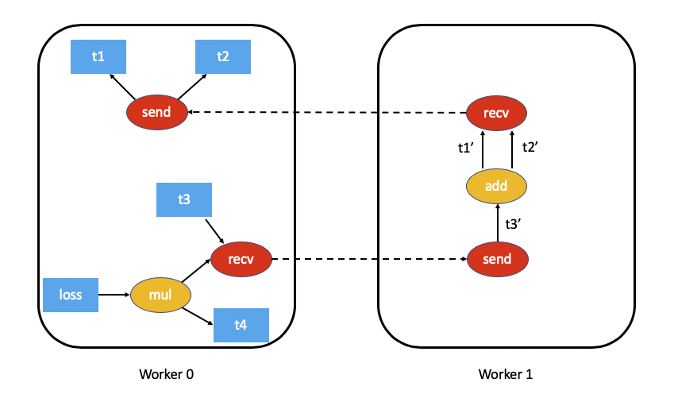
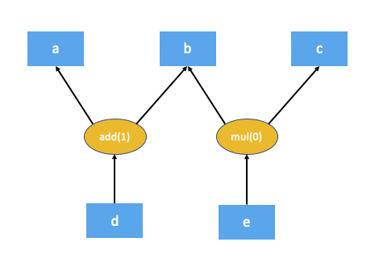
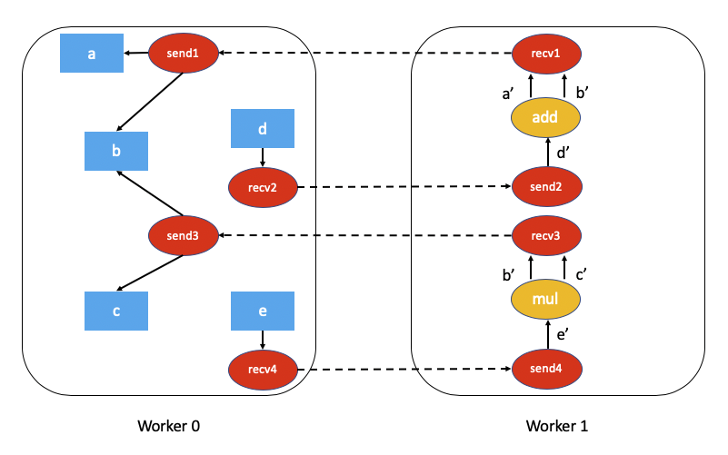
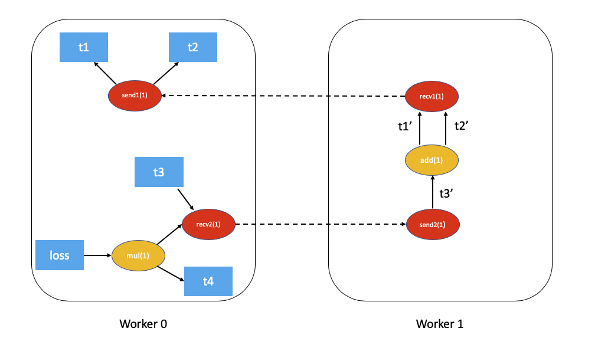

:orphan:

.. _distributed-autograd-design:

Distributed Autograd Design
===========================

This note will present the detailed design for distributed autograd and walk
through the internals of the same. Make sure you're familiar with
:ref:`autograd-mechanics` and the :ref:`distributed-rpc-framework` before
proceeding.

Background
^^^^^^^^^^

Let's say you have two nodes and a very simple model partitioned across two
nodes. This can be implemented using :mod:`torch.distributed.rpc` as follows:

.. code::

  import torch
  import torch.distributed.rpc as rpc

  def my_add(t1, t2):
    return torch.add(t1, t2)

  # On worker 0:
  t1 = torch.rand((3, 3), requires_grad=True)
  t2 = torch.rand((3, 3), requires_grad=True)

  # Perform some computation remotely.
  t3 = rpc.rpc_sync("worker1", my_add, args=(t1, t2))

  # Perform some computation locally based on remote result.
  t4 = torch.rand((3, 3), requires_grad=True)
  t5 = torch.mul(t3, t4)

  # Compute some loss.
  loss = t5.sum()

The main motivation behind distributed autograd is to enable running a backward
pass on such distributed models with the ``loss`` that we've computed and
record appropriate gradients for all tensors that require gradients.

.. attaching_send_recv_functions:

Autograd recording during the forward pass
^^^^^^^^^^^^^^^^^^^^^^^^^^^^^^^^^^^^^^^^^^

PyTorch builds the autograd graph during the forward pass and this graph is
used to execute the backward pass. For more details see
:ref:`how-autograd-encodes-history`.

For distributed autograd, we need to keep track of all RPCs during the forward
pass to ensure the backward pass is executed appropriately. For this purpose,
we attach ``send`` and ``recv`` functions to the autograd graph when we perform
an RPC.

- The ``send`` function is attached to the source of the RPC and its output
  edges point to the autograd function for the input tensors of the RPC.
  The input for this function during the backward pass is received from the
  destination as the output of the appropriate ``recv`` function.
- The ``recv`` function is attached to the destination of the RPC and its
  inputs are retrieved from operators executed on the destination using the
  input tensors. The output gradients of this function are sent to the source
  node to the appropriate ``send`` function during the backward pass.
- Each ``send-recv`` pair is assigned a globally unique ``autograd_message_id``
  to uniquely identify the pair. This is useful to lookup the corresponding
  function on a remote node during the backward pass.
- For :ref:`rref`, whenever we call :meth:`torch.distributed.rpc.RRef.to_here`
  we attach an appropriate ``send-recv`` pair for the tensors involved.

As an example, this is what the autograd graph for our example above would look
like (t5.sum() excluded for simplicity):

.. autograd_context:

Distributed Autograd Context
^^^^^^^^^^^^^^^^^^^^^^^^^^^^

Each forward and backward pass that uses distributed autograd is assigned a
unique :class:`torch.distributed.autograd.context` and this context has a
globally unique ``autograd_context_id``. This context is created on each node
as needed.

This context serves the following purpose:

1. Multiple nodes running distributed backward passes might accumulate
   gradients on the same tensor and as a result the ``.grad`` field of the
   tensor would have gradients from a variety of distributed backward passes
   before we have the opportunity to run the optimizer. This is similar to
   calling :meth:`torch.autograd.backward` multiple times locally. In order to
   provide a way of separating out the gradients for each backward pass, the
   gradients are accumulated in the :class:`torch.distributed.autograd.context`
   for each backward pass.
2. During the forward pass we store the ``send`` and ``recv`` functions for
   each autograd pass in this context. This ensures we hold references to the
   appropriate nodes in the autograd graph to keep it alive. In addition to
   this, it is easy to lookup the appropriate ``send`` and ``recv`` functions
   during the backward pass.
3. In general we also use this context to store some metadata for each
   distributed autograd pass.

|

From the user's perspective the autograd context is setup as follows:

.. code::

  import torch.distributed.autograd as dist_autograd
  with dist_autograd.context() as context_id:
    loss = model.forward()
    dist_autograd.backward(context_id, loss)

It is important to note that your model's forward pass must be invoked within
the distributed autograd context manager, as a valid context is needed in
order to ensure that all ``send`` and ``recv`` functions are stored properly
to run the backward pass across all participating nodes.

Distributed Backward Pass
^^^^^^^^^^^^^^^^^^^^^^^^^

In this section we outline the challenge of computing dependencies accurately
during a distributed backward pass and describe a couple of algorithms (with
tradeoffs) on how we can execute a distributed backward pass.

Computing dependencies
----------------------

Consider the following piece of code being run on a single machine

.. code::

  import torch
  a = torch.rand((3, 3), requires_grad=True)
  b = torch.rand((3, 3), requires_grad=True)
  c = torch.rand((3, 3), requires_grad=True)
  d = a + b
  e = b * c
  d.sum.().backward()

This is what the autograd graph for the code above would look like:

The first step the autograd engine performs as part of the backward pass is
computing the number of dependencies for each node in the autograd graph. This
helps the autograd engine know when a node in the graph is ready for execution.
The numbers in brackets for ``add(1)`` and ``mul(0)`` denote the number of
dependencies. As you can see, this means during the backward pass the ``add``
node needs 1 input and the ``mul`` node doesn't need any inputs (in other
words doesn't need to be executed). The local autograd engine computes these
dependencies by traversing the graph from the root nodes (``d`` in this case).

The fact that certain nodes in the autograd graph might not be executed in the
backward pass poses a challenge for distributed autograd. Consider this piece
of code which uses RPC.

.. code::

  import torch
  import torch.distributed.rpc as rpc

  a = torch.rand((3, 3), requires_grad=True)
  b = torch.rand((3, 3), requires_grad=True)
  c = torch.rand((3, 3), requires_grad=True)

  d = rpc.rpc_sync("worker1", torch.add, args=(a, b))
  e = rpc.rpc_sync("worker1", torch.mul, args=(b, c))
  loss = d.sum()

The associated autograd graph for the code above would be:

Computing dependencies of this distributed autograd graph is much more
challenging and requires some overhead (either in terms of computation or
network communication).

For performance sensitive applications we can avoid a
lot of overhead by assuming every ``send`` and ``recv`` function are valid as
part of the backward pass (most applications don't perform RPCs that aren't
used). This simplifies the distributed autograd algorithm and is much more
efficient, but at the cost that the application needs to be aware of the
limitations. This algorithm is called the `FAST mode algorithm`_ and is
described in detail below.

In the general case it might not be necessary that every ``send`` and ``recv``
function is valid as part of the backward pass. To address this, we have
proposed a `SMART mode algorithm`_ which is described in a later section.
Please note that currently, only the `FAST` mode algorithm is implemented.

.. _fast-mode-algorithm:

FAST mode algorithm
-------------------

The key assumption of this algorithm is that each ``send`` function has a
dependency of 1 when we run a backward pass. In other words, we assume we'll
receive a gradient over RPC from another node.

The algorithm is as follows:

1. We start from the worker which has the roots for the backward pass
   (all roots must be local).
2. Lookup all the ``send`` functions for the current
   `Distributed Autograd Context`_.
3. Compute dependencies locally starting from the provided roots and all the
   ``send`` functions we retrieved.
4. After computing dependencies, kick off the local autograd engine with the
   provided roots.
5. When the autograd engine executes the ``recv`` function, the ``recv``
   function sends the input gradients via RPC to the appropriate worker.
   Each ``recv`` function knows the destination worker id since it is recorded
   as part of the forward pass. The ``recv`` function also sends over the
   ``autograd_context_id`` and ``autograd_message_id`` to the remote host.
6. When this request is received on the remote host, we use the
   ``autograd_context_id`` and ``autograd_message_id`` to look up the
   appropriate ``send`` function.
7. If this is the first time a worker has received a request for the given
   ``autograd_context_id``, it will compute dependencies locally as described
   in points 1-3 above.
8. The ``send`` function retrieved in 6. is then enqueued for execution on the
   local autograd engine for that worker.
9. Finally, instead of accumulating the gradients on the ``.grad`` field of the
   Tensor, we accumulate the gradients separately per
   `Distributed Autograd Context`_. The gradients are stored in a
   ``Dict[Tensor, Tensor]``, which is basically a map from Tensor to its
   associated gradient and this map can be retrieved using the
   :meth:`~torch.distributed.autograd.get_gradients` API.

|

As an example the complete code with distributed autograd would be as follows:

.. code::

  import torch
  import torch.distributed.autograd as dist_autograd
  import torch.distributed.rpc as rpc

  def my_add(t1, t2):
    return torch.add(t1, t2)

  # On worker 0:

  # Setup the autograd context. Computations that take
  # part in the distributed backward pass must be within
  # the distributed autograd context manager.
  with dist_autograd.context() as context_id:
    t1 = torch.rand((3, 3), requires_grad=True)
    t2 = torch.rand((3, 3), requires_grad=True)

    # Perform some computation remotely.
    t3 = rpc.rpc_sync("worker1", my_add, args=(t1, t2))

    # Perform some computation locally based on remote result.
    t4 = torch.rand((3, 3), requires_grad=True)
    t5 = torch.mul(t3, t4)

    # Compute some loss.
    loss = t5.sum()

    # Run the backward pass.
    dist_autograd.backward(context_id, [loss])

    # Retrieve the gradients from the context.
    dist_autograd.get_gradients(context_id)

The distributed autograd graph with dependencies would be as follows (t5.sum() excluded for simplicity):

The `FAST mode algorithm`_ applied to the above example would be as follows:

1. On ``Worker 0`` we start from the roots ``loss`` and ``send1`` to compute
   dependencies. As a result ``send1`` is marked with a dependency of 1 and ``mul``
   on ``Worker 0`` is marked with a dependency of 1.
2. Now, we kickoff the local autograd engine on ``Worker 0``. We first execute
   the ``mul`` function, accumulate its output in the autograd context as the
   gradient for ``t4``. Then, we execute ``recv2`` which sends the gradients to
   ``Worker 1``.
3. Since this is the first time ``Worker 1`` has heard about this backward pass,
   it starts dependency computation and marks the dependencies for ``send2``,
   ``add`` and ``recv1`` appropriately.
4. Next, we enqueue ``send2`` on the local autograd engine of ``Worker 1``, which
   in turn executes ``add`` and ``recv1``.
5. When ``recv1`` is executed it sends the gradients over to ``Worker 0``.
6. Since ``Worker 0`` has already computed dependencies for this backward pass,
   it just enqueues and executes ``send1`` locally.
7. Finally, gradients for ``t1``, ``t2`` and ``t4`` are accumulated in the
   `Distributed Autograd Context`_.

SMART mode algorithm
--------------------
Full details of this algorithm are still in the works, but for the general idea
you can refer to **Distributed Autograd Algorithm Smart mode** section in the
`RFC`_.

Distributed Optimizer
^^^^^^^^^^^^^^^^^^^^^

The :class:`~torch.distributed.optim.DistributedOptimizer` operates as follows:

1. Takes a list of remote parameters (:class:`~torch.distributed.rpc.RRef`) to
   optimize. These could also be local parameters wrapped within a local
   ``RRef``.
2. Takes a :class:`~torch.optim.Optimizer` class as the local
   optimizer to run on all distinct ``RRef`` owners.
3. The distributed optimizer creates an instance of the local ``Optimizer`` on
   each of the worker nodes and holds an ``RRef`` to them.
4. When :meth:`torch.distributed.optim.DistributedOptimizer.step` is invoked,
   the distributed optimizer uses RPC to remotely execute all the local
   optimizers on the appropriate remote workers. A distributed autograd
   ``context_id`` must be provided as input to
   :meth:`torch.distributed.optim.DistributedOptimizer.step`. This is used
   by local optimizers to apply gradients stored in the corresponding
   context.
5. If multiple concurrent distributed optimizers are updating the same
   parameters on a worker, these updates are serialized via a lock.

Simple end to end example
^^^^^^^^^^^^^^^^^^^^^^^^^

Putting it all together, the following is a simple end to end example using
distributed autograd and the distributed optimizer. If the code is placed into a
file called "dist_autograd_simple.py", it can be run with the command
:code:`MASTER_ADDR="localhost" MASTER_PORT=29500 python dist_autograd_simple.py`:

.. code::

  import torch
  import torch.multiprocessing as mp
  import torch.distributed.autograd as dist_autograd
  from torch.distributed import rpc
  from torch import optim
  from torch.distributed.optim import DistributedOptimizer

  def random_tensor():
      return torch.rand((3, 3), requires_grad=True)

  def _run_process(rank, dst_rank, world_size):
      name = "worker{}".format(rank)
      dst_name = "worker{}".format(dst_rank)

      # Initialize RPC.
      rpc.init_rpc(
          name=name,
          rank=rank,
          world_size=world_size
      )

      # Use a distributed autograd context.
      with dist_autograd.context() as context_id:
          # Forward pass (create references on remote nodes).
          rref1 = rpc.remote(dst_name, random_tensor)
          rref2 = rpc.remote(dst_name, random_tensor)
          loss = rref1.to_here() + rref2.to_here()

          # Backward pass (run distributed autograd).
          dist_autograd.backward(context_id, [loss.sum()])

          # Build DistributedOptimizer.
          dist_optim = DistributedOptimizer(
          optim.SGD,
          [rref1, rref2],
          lr=0.05,
          )

          # Run the distributed optimizer step.
          dist_optim.step(context_id)

  def run_process(rank, world_size):
      dst_rank = (rank + 1) % world_size
      _run_process(rank, dst_rank, world_size)
      rpc.shutdown()

  if __name__ == '__main__':
    # Run world_size workers
    world_size = 2
    mp.spawn(run_process, args=(world_size,), nprocs=world_size)

.. _RFC: https://github.com/pytorch/pytorch/issues/23110
