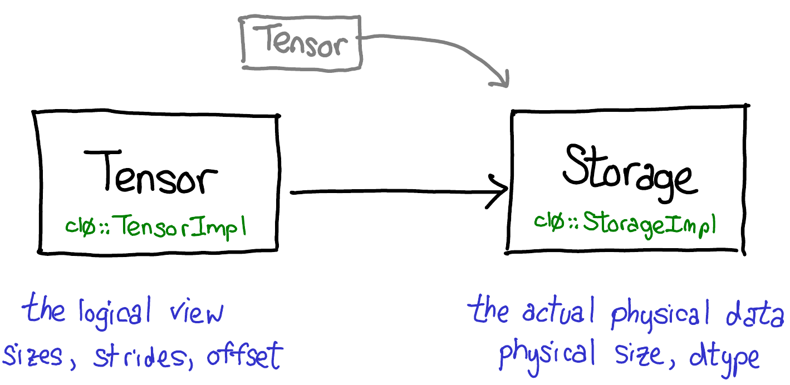
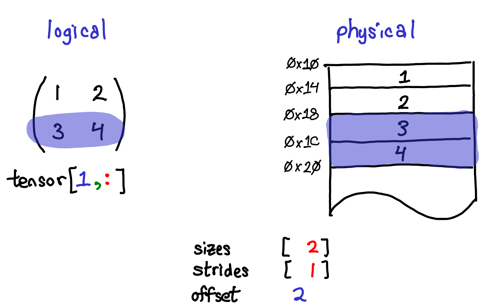

.. currentmodule:: torch

.. _tensor-view-doc:

Tensor Views
=================

PyTorch has decoupled notion of tensor and storage. Storage is the actual physical data, while tensor
defines the logical interpretation of storage. There's always a pair of tensor-storage, and
multiple tensors might share the same storage.

PyTorch also provides views of tensors, instead of creating a new tensor with new storage,
it just returns a tensor which is a different view on the underlying storage. Supporting views
allows we do fast and memory efficient reshaping, slicing and element-wise operations.

As shown in the example above, we can use `tensor[1, :]` to get the second row of `tensor` of size `[2, 2]`.
Instead of creating a copy of the storage, PyTorch just returns a tensor which is a view on the same storage of
values in the second row. It's much faster than creating copies.

Note that since views share underlying storage with the original tensor, if you edit the data
in the view, it will be reflected in the original tensor as well.

For a more detailed walk-through of Tensor/Storage, please refer to `this blogpost about PyTorch Internals <http://blog.ezyang.com/2019/05/pytorch-internals/>`.

For reference, here’s a list of all ops in PyTorch that return view of input tensors:

- :meth:`~torch.Tensor.transpose`
- :meth:`~torch.Tensor.as_strided`
- :meth:`~torch.Tensor.diagonal`
- :meth:`~torch.Tensor.expand`
- :meth:`~torch.Tensor.narrow`
- :meth:`~torch.Tensor.permute`
- :meth:`~torch.Tensor.select`
- :meth:`~torch.Tensor.squeeze`
- :meth:`~torch.Tensor.t`
- :meth:`~torch.Tensor.unfold`
- :meth:`~torch.Tensor.unsqueeze`
- :meth:`~torch.Tensor.indices`
- :meth:`~torch.Tensor.values`
- :meth:`~torch.Tensor.view`
- :meth:`~torch.Tensor.view_as`
- :meth:`~torch.Tensor.unbind`
- :meth:`~torch.Tensor.split`
- :meth:`~torch.Tensor.chunk`
- When accessing the contents of a tensor via indexing, PyTorch follows Numpy behaviors
  that basic indexing returns views, while advanced indexing returns a copy.
  Assignment with both basic and advanced indexing is in-place. See more examples in
  `Numpy indexing documentation <https://docs.scipy.org/doc/numpy/reference/arrays.indexing.html>`.

The following ops can return either a view of existing storage or new storage,
user code shouldn't rely on whether it's view or not.

- :meth:`~torch.Tensor.reshape`
- :meth:`~torch.Tensor.reshape_as`

It's also worth mentioning that :meth:`~torch.Tensor.contiguous` returns itself if the input
tensor is already contiguous, otherwise it returns a contiguous tensor with new storage.
