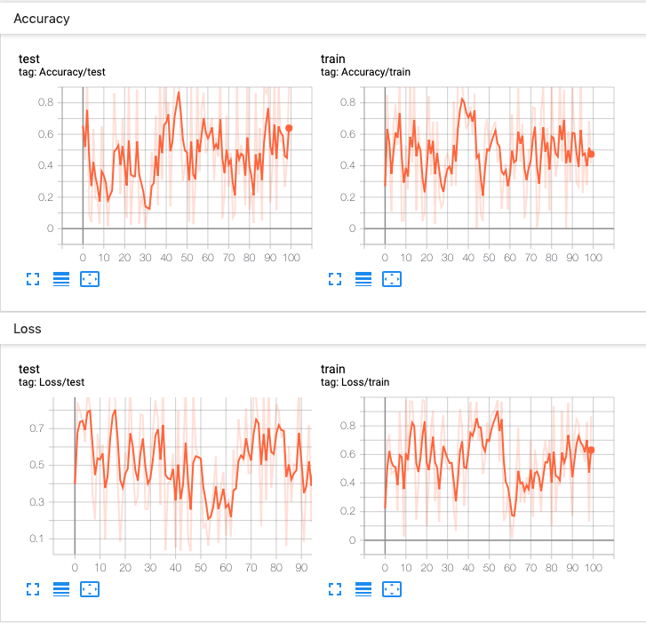

torch.utils.tensorboard
===================================

Before going further, more details on TensorBoard can be found at
https://www.tensorflow.org/tensorboard/

Once you've installed TensorBoard, these utilities let you log PyTorch models
and metrics into a directory for visualization within the TensorBoard UI.
Scalars, images, histograms, graphs, and embedding visualizations are all
supported for PyTorch models and tensors as well as Caffe2 nets and blobs.

The SummaryWriter class is your main entry to log data for consumption
and visualization by TensorBoard. For example:

.. code:: python

    import torch
    import torchvision
    from torch.utils.tensorboard import SummaryWriter
    from torchvision import datasets, transforms

    # Writer will output to ./runs/ directory by default
    writer = SummaryWriter()

    transform = transforms.Compose([transforms.ToTensor(), transforms.Normalize((0.5,), (0.5,))])
    trainset = datasets.MNIST('mnist_train', train=True, download=True, transform=transform)
    trainloader = torch.utils.data.DataLoader(trainset, batch_size=64, shuffle=True)
    model = torchvision.models.resnet50(False)
    # Have ResNet model take in grayscale rather than RGB
    model.conv1 = torch.nn.Conv2d(1, 64, kernel_size=7, stride=2, padding=3, bias=False)
    images, labels = next(iter(trainloader))

    grid = torchvision.utils.make_grid(images)
    writer.add_image('images', grid, 0)
    writer.add_graph(model, images)
    writer.close()

This can then be visualized with TensorBoard, which should be installable
and runnable with::

    pip install tensorboard
    tensorboard --logdir=runs

Lots of information can be logged for one experiment. To avoid cluttering
the UI and have better result clustering, we can group plots by naming them
hierarchically. For example, "Loss/train" and "Loss/test" will be grouped
together, while "Accuracy/train" and "Accuracy/test" will be grouped separately
in the TensorBoard interface.

.. code:: python

    from torch.utils.tensorboard import SummaryWriter
    import numpy as np

    writer = SummaryWriter()

    for n_iter in range(100):
        writer.add_scalar('Loss/train', np.random.random(), n_iter)
        writer.add_scalar('Loss/test', np.random.random(), n_iter)
        writer.add_scalar('Accuracy/train', np.random.random(), n_iter)
        writer.add_scalar('Accuracy/test', np.random.random(), n_iter)

Expected result:

|
|

.. currentmodule:: torch.utils.tensorboard.writer

.. autoclass:: SummaryWriter

   .. automethod:: __init__
   .. automethod:: add_scalar
   .. automethod:: add_scalars
   .. automethod:: add_histogram
   .. automethod:: add_image
   .. automethod:: add_images
   .. automethod:: add_figure
   .. automethod:: add_video
   .. automethod:: add_audio
   .. automethod:: add_text
   .. automethod:: add_graph
   .. automethod:: add_embedding
   .. automethod:: add_pr_curve
   .. automethod:: add_custom_scalars
   .. automethod:: add_mesh
   .. automethod:: add_hparams
   .. automethod:: flush
   .. automethod:: close
