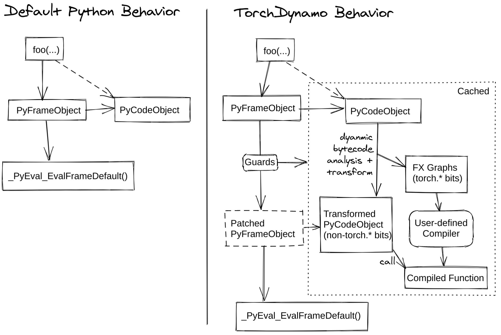

TorchDynamo Deep Dive
=====================

Before you read this section, read :ref:`torch.compiler_overview`.`

**TorchDynamo** is a Python-level Just-In-Time (JIT) compiler designed to make
unmodified PyTorch programs faster. TorchDynamo hooks into the frame evaluation
API in CPython (`PEP 523 <https://peps.python.org/pep-0523/>`__) to
dynamically modify Python bytecode right before it is executed. It
rewrites Python bytecode to extract sequences of PyTorch
operations into an `FX Graph <https://pytorch.org/docs/stable/fx.html>`__
which is then compiled with a customizable backend.
It creates this FX Graph through bytecode analysis and is designed to
mix Python execution with compiled backends to get the best of both
worlds — usability and performance.

TorchDynamo makes it easy to experiment with different compiler
backends to make PyTorch code faster with a single line decorator
``torch._dynamo.optimize()`` which is wrapped for convenience by ``torch.compile()``

The following diagram demonstrates how PyTorch works with ``torch.compile``
and without it:

`TorchInductor` is one of the backends
supported by `TorchDynamo Graph <https://pytorch.org/docs/stable/fx.html>`__
into `Triton <https://github.com/openai/triton>`__ for GPUs or
`C++/OpenMP <https://www.openmp.org/>`__ for CPUs. We have a
`training performance dashboard <https://github.com/pytorch/torchdynamo/issues/681#issuecomment-1233828468>`__
that provides performance comparison for different training backends. You can read
more in the `TorchInductor post on PyTorch
dev-discuss <https://dev-discuss.pytorch.org/t/torchinductor-a-pytorch-native-compiler-with-define-by-run-ir-and-symbolic-shapes/747>`__.

For an in-depth overview, read the sections below, watch the deep-dive video,
and check out the dev-discuss topics.

   * `TorchDynamo deep-dive video <https://www.youtube.com/watch?v=egZB5Uxki0I>`__
   * `dev-discuss topics <https://dev-discuss.pytorch.org/search?q=TorchDynamo%20order%3Alatest>`__

TorchDynamo Internals
~~~~~~~~~~~~~~~~~~~~~
**Author**: `Jason Ansel <https://github.com/jansel>`_

This section will go over some of the TorchDynamo internals and will
demonstrate how TorchDynamo works under the hood.

What is a guard?
----------------

TorchDynamo operates just-in-time and specializes graphs based on
dynamic properties. Below is a basic example of how to use TorchDynamo.
One can decorate a function or a method using ``torchdynamo.optimize`` to enable
TorchDynamo optimization:

.. code-block:: python

   from typing import List
   import torch
   from torch import _dynamo as torchdynamo
   def my_compiler(gm: torch.fx.GraphModule, example_inputs: List[torch.Tensor]):
       print("my_compiler() called with FX graph:")
       gm.graph.print_tabular()
       return gm.forward  # return a python callable

   @torchdynamo.optimize(my_compiler)
   def toy_example(a, b):
       x = a / (torch.abs(a) + 1)
       if b.sum() < 0:
           b = b * -1
       return x * b
   for _ in range(100):
       toy_example(torch.randn(10), torch.randn(10))

For example, the first graph above has the following
guards:

::

   GUARDS:
    - local 'a' TENSOR_MATCH
    - local 'b' TENSOR_MATCH
    - global 'torch' FUNCTION_MATCH

If any of those guards fail, the graph will be recaptured and
recompiled. The interesting guard type there is ``TENSOR_MATCH``, which
checks the following ``torch.Tensor`` properties:

- Python class of the tensor (tensor subclassing, etc)
- dtype
- device
- requires_grad
- dispatch_key (with thread-local includes/excludes applied)
- ndim
- sizes\*
- strides\*

The full specialization mode allows the backend compiler to assume an
entirely static graph. Unfortunately, most backends require this.
Operators which return dynamic shapes will trigger a graph break when
not in dynamic shape mode.

What is Dynamo doing?
---------------------

If you want to understand better what TorchDynamo is doing, you can set:

.. code-block:: python

   import torch._dynamo.config
   import logging

   torch._dynamo.config.log_level = logging.INFO
   torch._dynamo.config.output_code = True

This code triggers useful (but spammy) printouts.

For example, the printouts for the first graph in the ``toy_example``
are:

::

   __compiled_fn_0 <eval_with_key>.1
   opcode         name     target                                                  args              kwargs
   -------------  -------  ------------------------------------------------------  ----------------  --------
   placeholder    a        a                                                       ()                {}
   placeholder    b        b                                                       ()                {}
   call_function  abs_1    <built-in method abs of type object at 0x7f9ca082f8a0>  (a,)              {}
   call_function  add      <built-in function add>                                 (abs_1, 1)        {}
   call_function  truediv  <built-in function truediv>                             (a, add)          {}
   call_method    sum_1    sum                                                     (b,)              {}
   call_function  lt       <built-in function lt>                                  (sum_1, 0)        {}
   output         output   output                                                  ((truediv, lt),)  {}

   ORIGINAL BYTECODE toy_example example.py 9
    10           0 LOAD_FAST                0 (a)
                 2 LOAD_GLOBAL              0 (torch)
                 4 LOAD_METHOD              1 (abs)
                 6 LOAD_FAST                0 (a)
                 8 CALL_METHOD              1
                10 LOAD_CONST               1 (1)
                12 BINARY_ADD
                14 BINARY_TRUE_DIVIDE
                16 STORE_FAST               2 (x)

    11          18 LOAD_FAST                1 (b)
                20 LOAD_METHOD              2 (sum)
                22 CALL_METHOD              0
                24 LOAD_CONST               2 (0)
                26 COMPARE_OP               0 (<)
                28 POP_JUMP_IF_FALSE       38

    12          30 LOAD_FAST                1 (b)
                32 LOAD_CONST               3 (-1)
                34 BINARY_MULTIPLY
                36 STORE_FAST               1 (b)

    13     >>   38 LOAD_FAST                2 (x)
                40 LOAD_FAST                1 (b)
                42 BINARY_MULTIPLY
                44 RETURN_VALUE

   MODIFIED BYTECODE
     9           0 LOAD_GLOBAL              3 (__compiled_fn_0)
                 2 LOAD_FAST                0 (a)
                 4 LOAD_FAST                1 (b)
                 6 CALL_FUNCTION            2
                 8 UNPACK_SEQUENCE          2
                10 STORE_FAST               2 (x)
                12 POP_JUMP_IF_FALSE       24
                14 LOAD_GLOBAL              4 (__resume_at_30_1)
                16 LOAD_FAST                1 (b)
                18 LOAD_FAST                2 (x)
                20 CALL_FUNCTION            2
                22 RETURN_VALUE
           >>   24 LOAD_GLOBAL              5 (__resume_at_38_2)
                26 LOAD_FAST                1 (b)
                28 LOAD_FAST                2 (x)
                30 CALL_FUNCTION            2
                32 RETURN_VALUE

   GUARDS:
    - local 'a' TENSOR_MATCH
    - local 'b' TENSOR_MATCH
    - global 'torch' FUNCTION_MATCH

At the top you can see the FX graph.
Next, you see the original bytecode of the function, followed by the
modified bytecode generated by TorchDynamo. Finally, you see the guards
which we covered above.

In the modified bytecode, ``__compiled_fn_0`` is the return value of
``my_compiler()`` (the compiled graph). ``__resume_at_30_1`` and
``__resume_at_38_2`` are both generated continuation functions that pick
up execution after a graph break (at bytecode offsets 30 and 38). Each
of these functions take the form:

::

   __resume_at_<offset>:
       ... restore stack state if needed ...
       JUMP_ABSOLUTE <offset> into toy_example
       ... original bytecode of toy_example ...

By generating this `resume_at` function, we force the remainder of the
function to be executed in a new Python frame which recursively
triggers TorchDynamo to restart its capture once execution reaches that
point for the first time.
