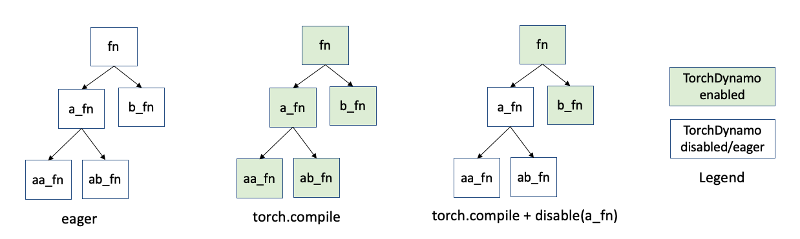

.. _torchdynamo_fine_grain_tracing:

TorchDynamo APIs for fine-grained tracing
=========================================

.. note:: In this document ``torch.compiler.compile`` and
   ``torch.compile`` are used interchangeably. Both versions
   will work in your code.

``torch.compile`` performs TorchDynamo tracing on the whole user model.
However, it is possible that a small part of the model code cannot be
handled by ``torch.compiler``. In this case, you might want to disable
the compiler on that particular portion, while running compilation on
the rest of the model. This section describe the existing APIs that
use to define parts of your code in which you want to skip compilation
and the relevant use cases.

The API that you can use to define portions of the code on which you can
disable compilation are listed in the following table:

.. csv-table:: TorchDynamo APIs to control fine-grained tracing
   :header: "API", "Description", "When to use?"
   :widths: auto

   "``torch.compiler.disable``", "Disables Dynamo on the decorated function as well as recursively invoked functions.", "Excellent for unblocking a user, if a small portion of the model cannot be handled with ``torch.compile``."
   "``torch._dynamo.disallow_in_graph``", "Disallows the marked op in the TorchDynamo graph. TorchDynamo causes graph break, and runs the op in the eager (no compile) mode.
   
   This is suitable for the ops, while ``torch.compiler.disable`` is suitable for decorating functions.", "This API is excellent for both debugging and unblocking if a custom op like ``torch.ops.fbgemm.*`` is causing issues with the ``torch.compile`` function."
   "``torch.compile.allow_in_graph``", "The annotated callable goes as is in the TorchDynamo graph. For example, a black-box for TorchDynamo Dynamo.
   
   Note that AOT Autograd will trace through it, so the ``allow_in_graph`` is only a Dynamo-level concept.", "This API is useful for portions of the model which have known TorchDynamo hard-to-support features, like hooks or ``autograd.Function``. However, each usage of ``allow_in_graph`` **must be carefully screened** (no graph breaks, no closures)."
   "``torch._dynamo.graph_break``", "Adds a graph break. The code before and after the graph break goes through TorchDynamo.", "**Rarely useful for deployment** - If you think you need this, most probably you need either ``disable`` or ``disallow_in_graph``."
   "``torch.compiler.is_compiling``", "Indicates whether a graph is executed/traced as part of torch.compile() or torch.export()."
   "``torch.compiler.is_dynamo_compiling``", "Indicates whether a graph is traced via TorchDynamo. It's stricter than torch.compiler.is_compiling() flag, as it would only be set to True when TorchDynamo is used."

``torch.compiler.disable``
~~~~~~~~~~~~~~~~~~~~~~~~~~

``torch.compiler.disable`` disables compilation on the decorated function frame and all the function frames recursively invoked from the decorated function frame.

TorchDynamo intercepts the execution of each Python function frame. So, suppose you have a code structure (image below) where the function ``fn`` calls functions ``a_fn`` and ``b_fn``. And ``a_fn`` calls ``aa_fn`` and ``ab_fn``. When you use the PyTorch eager mode rather than ``torch.compile``, these function frames run as is. With ``torch.compile``, TorchDynamo intercepts each of these function frames (indicated by the green color):

Let's imagine, that function ``a_fn`` is causing troubles with ``torch.compile``.
And this is a non-critical portion of the model. You can use ``compiler.disable``
on function ``a_fn``. As shown above, TorchDynamo will stop looking at frames
originating from the ``a_fn`` call (white color indicates original Python behavior).

To skip compilation, you can decorate the offending function with
``@torch.compiler.disable``.

You can also use the non-decorator syntax if you don’t want to change the source
code
However, we recommend that you avoid this style if possible. Here, you have to
take care that all users of the original function are now using the patched
version.

``torch._dynamo.disallow_in_graph``
~~~~~~~~~~~~~~~~~~~~~~~~~~~~~~~~~~~

``torch._dynamo.disallow_in_graph`` disallows an operator but not the function
to be present in the TorchDynamo extracted graph. Note that this is suitable
for operators and not general functions as in the case of ``_dynamo.disable``.

Let's imagine you compile your model with PyTorch. TorchDynamo is able to
extract a graph, but then you see the downstream compiler failing. For example,
the meta kernel is missing, or some Autograd dispatch key is set incorrectly
for a particular operator. Then you can mark that operator as
``disallow_in_graph``, and TorchDynamo will cause a graph break and run that
operator by using the PyTorch eager mode.

The catch is that you will have to find the corresponding Dynamo level operator,
and not the ATen level operator. See more in the Limitations section of the doc.

.. warning::
   ``torch._dynamo.disallow_in_graph`` is a global flag. If you are comparing
   different backend compilers, you might have to call ``allow_in_graph`` for
   the disallowed operator when switching to the other compiler.

``torch.compiler.allow_in_graph``
~~~~~~~~~~~~~~~~~~~~~~~~~~~~~~~~~

``torch.compiler.allow_in_graph`` is useful when the relevant function frame
has some known hard-to-support TorchDynamo feature, such as hooks and
``autograd.Function``, and you are confident that downstream PyTorch components
such as AOTAutograd can safely trace through the decorated function. When a
function is decorated with ``allow_in_graph``, TorchDynamo treats it as a
black-box and puts it as is in the generated graph.

.. warning::
   ``allow_in_graph`` skips TorchDynamo completely on the decorated function
   omitting all TorchDynamo safety checks, including graph breaks, handling
   closures, and others. Use `allow_in_graph` with caution. PyTorch downstream
   components, such as AOTAutograd rely on TorchDynamo to handle complex Python
   features, but ``allow_in_graph`` bypasses TorchDynamo. Using ``allow_in_graph``
   could lead to soundness and hard-to-debug issues.

Limitations
~~~~~~~~~~~

All the existing APIs are applied at the TorchDynamo level. Therefore, these
APIs have visibility to only what TorchDynamo sees. This can lead to confusing
scenarios.

For example, ``torch._dynamo.disallow_in_graph`` will not work for ATen operators
because they are visible to AOT Autograd. For example,
``torch._dynamo.disallow_in_graph(torch.ops.aten.add)`` will not work in the
above example.
