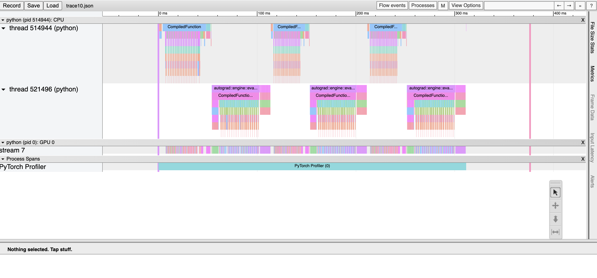
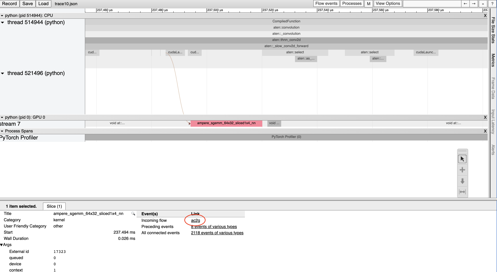
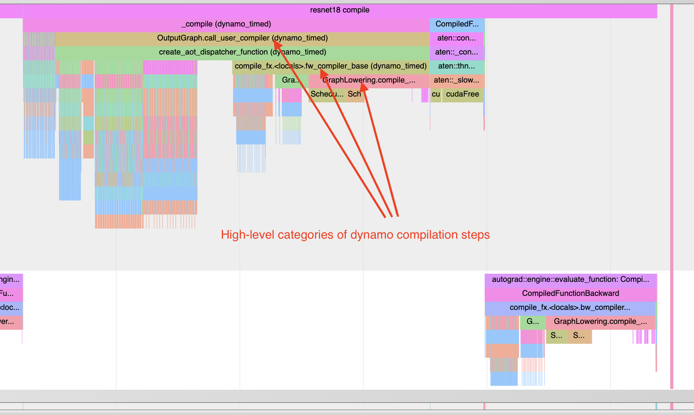
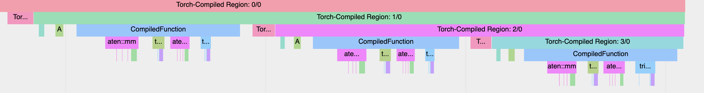
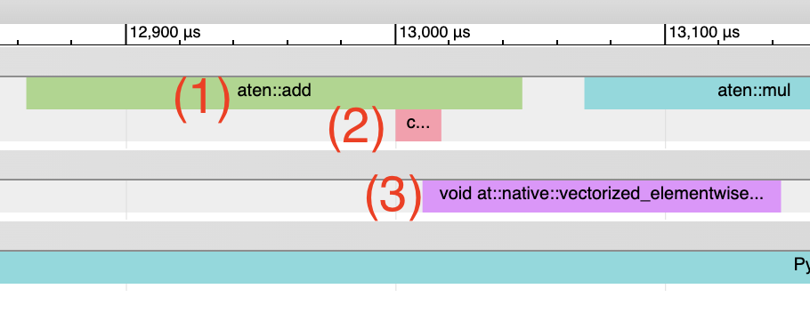
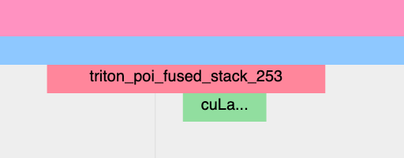
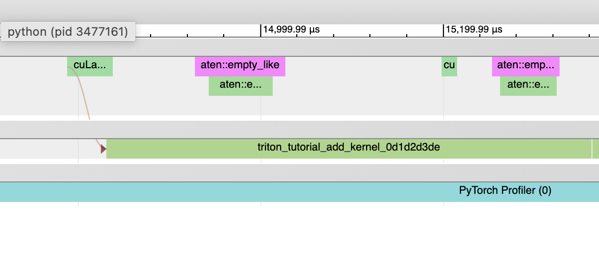
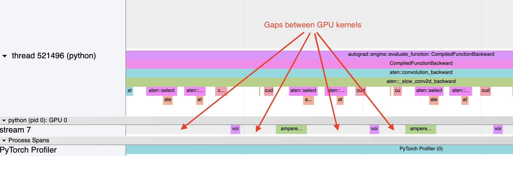

Profiling to understand torch.compile performance
=================================================

What to use torch.profiler for:
-------------------------------

torch.profiler is helpful for understanding the performance of your program at a kernel-level granularity - for example, it can show graph breaks and GPU utilization at the level of the program. The data provided by the profiler can often help users understand where to investigate further to understand model performance.

To understand kernel-level performance, other tools exist. NVIDIA's ncu tool can be used, or :ref:`inductor's profiling tools <torchinductor-gpu-profiling>`.

See also the `general pytorch profiler guide <https://pytorch.org/tutorials/recipes/recipes/profiler_recipe.html>`_.

Basics of using torch.profiler and viewing traces
-------------------------------------------------

**Example program**: We'll use this example of profiling resnet18. Notice the following parts of this example program:

* Include a warm-up run to wait for compilation to complete (this will warm up systems like the CUDA caching allocator)
* Use :code:`torch.profiler.profile()` context for profiling the section we are interested in
* Use :code:`prof.export_chrome_trace("trace.json")` to export the profiling artifact.

.. code-block:: python

    import torch
    from torchvision.models import resnet18

    model = resnet18().cuda()
    inputs = [torch.randn((5, 3, 224, 224), device='cuda') for _ in range(10)]

    model_c = torch.compile(model)

    def fwd_bwd(inp):
        out = model_c(inp)
        out.sum().backward()

    # warm up
    fwd_bwd(inputs[0])

    with torch.profiler.profile() as prof:
        for i in range(1, 4):
            fwd_bwd(inputs[i])
            prof.step()

    prof.export_chrome_trace("trace.json")

**Viewing chrome traces**: In the Chrome browser, open chrome://tracing and load the json file. Use the “w” and “s” keys to zoom in and out, and use “a” and “d” to scroll left and right. “?” will show a “help” screen with a list of shortcuts.

Here, we observe:
* CompiledFunction and CompiledFunctionBackward events, which correspond to the dynamo-compiled regions.
* CPU events at the top, and GPU events at the bottom.

**Flows between CPU and GPU events**

Every kernel on the GPU occurs after being launched by code running on the CPU. The profiler can draw connections (i.e. “flows”) between the GPU and CPU events to show which CPU event launched a GPU kernel. This is particularly helpful because, with a few exceptions, GPU kernels are launched asynchronously.

To view a flow connection, click on a GPU kernel and click “ac2g”:

Alternatively, turn on *all* flows with the “Flow events” dropdown at the top.

Working around CUDA Graph profiling issues
------------------------------------------

When CUDA graphs are enabled, some CUDA configurations (driver version under 525.85.12 or CUDA < 12)  can encounter issues between the profiling tools and CUDA graphs. To fix these issues, add an empty profiling context at the top of your program:

.. code-block:: python

    import torch

    torch.profiler._utils._init_for_cuda_graphs()

    # ... rest of program

Understanding compilation time
------------------------------

To understand why compilation is taking a long time, you can profile the first invocation of a torch.compile-ed program. Keep in mind that profile traces of compilations can be distorted more than typical profiling, because compilation workloads can be quite different from typical PyTorch workloads. In some cases, trace files may also be quite large. Traces > 1GB can be difficult to open with the chrome tracing tool.

Note: roughly the same information can also be obtained in non-graphical format with :code:`torch._dynamo.utils.compile_times()`. This utility won’t show when the compilation steps occur, but it will show the amount of time spent on each step - and times will not be affected by any profiling overhead.

See an example below:

.. code-block:: python

    import torch
    from torchvision.models import resnet18

    model = resnet18().cuda()
    inputs = [torch.randn((5, 3, 224, 224), device='cuda') for _ in range(10)]

    model_c = torch.compile(model)

    def fwd_bwd(inp):
        out = model_c(inp)
        out.sum().backward()

    def warmup_compile():
        def fn(x):
            return x.sin().relu()

        x = torch.rand((2, 2), device='cuda', requires_grad=True)
        fn_c = torch.compile(fn)
        out = fn_c(x)
        out.sum().backward()

    with torch.profiler.profile() as prof:
        with torch.profiler.record_function("warmup compile"):
            warmup_compile()

        with torch.profiler.record_function("resnet18 compile"):
            fwd_bwd(inputs[0])

    prof.export_chrome_trace("trace_compile.json")

Note a few things:

* The first invocation should occur *during* profiling in order to capture compilation
* Add a warm-up compilation in order to initialize any systems that need to be lazily initialized.

Finding graph breaks: "Torch-Compiled Region" and "CompiledFunction"
--------------------------------------------------------------------

Although there are logging tools for identifying graph breaks, the profiler provides a quick visual method of identifying :ref:`graph breaks <torch.compiler_graph_breaks>`. There are two profiler events to look for: **Torch-Compiled Region** and **CompiledFunction**.

**Torch-Compiled Region** - which was introduced in PyTorch 2.2 - is a profiler event that covers the entire compiled region. Graph breaks almost always look the same: nested “Torch-Compiled Region” events.

If you run two separate functions with torch.compile() applied independently on each of them, you should generally expect to see two adjacent (i.e NOT stacked/nested) Torch-Compiled regions. Meanwhile, if you encounter graph breaks (or disable()'ed/skipped regions), expect nested “Torch-Compiled Region” events.

**CompiledFunction** - introduced in PyTorch 2.0 - is a profiler event that appears when gradients are required for any inputs.  Each graph break will interrupt a CompiledFunction block, splitting it in two. CompiledFunction events only appear when Autograd is involved, i.e. some of the input tensors to the graph have requires_grad=True.

When a CompiledFunction appears in a trace, it is typically paired with a CompiledFunctionBackward event in the backward pass. A “fwd-bwd link” should appear in the trace connecting the two, if the backward function is called.

If your use case includes a graph that doesn't require grad and doesn't include "Torch-Compiled Region" events, it can be more difficult to identify whether torch.compile is being applied correctly. One clue can be the existence of Inductor-generated Triton kernels.

See the synthetic example below for a demonstration:

.. code-block:: python

    import torch
    import torch._dynamo

    class ModelWithBreaks(torch.nn.Module):
        def __init__(self):
            super().__init__()
            def create_sequential():
                return torch.nn.Sequential(
                    torch.nn.Linear(128, 128),
                    torch.nn.ReLU(),
                    torch.nn.Linear(128, 128),
                    torch.nn.ReLU(),
                )
            self.mod1 = create_sequential()
            self.mod2 = create_sequential()
            self.mod3 = create_sequential()
            self.mod4 = create_sequential()

        def forward(self, inp):
            mod1 = self.mod1(inp)
            torch._dynamo.graph_break()
            mod2 = self.mod2(mod1)
            torch._dynamo.graph_break()
            mod3 = self.mod3(mod2)
            torch._dynamo.graph_break()
            mod4 = self.mod4(mod3)
            return mod4

    model = ModelWithBreaks().cuda()
    inputs = [torch.randn((128, 128), device='cuda') for _ in range(10)]

    model_c = torch.compile(model)

    def fwd_bwd(inp):
        out = model_c(inp)
        out.sum().backward()

    # warm up
    fwd_bwd(inputs[0])

    with torch.profiler.profile() as prof:
        for i in range(1, 4):
            fwd_bwd(inputs[i])
            prof.step()

    prof.export_chrome_trace("trace_break.json")

Operator Kernels
----------------

When an operator is launched, we expect to see a few events:

1. CPU-side event
2. Kernel launch (if dealing with a GPU kernel)
3. GPU-side event

**Inductor-generated Triton kernels:**
1. The **CPU-side event** should appear as an event prefixed with "triton\_". The events currently have minimal information - the kernel name and a launch, but less information than typical aten kernel launches (which contain input shapes, types, etc.).
2. The **kernel launch** should appear as cuLaunchKernel instead of cudaLaunchKernel (cudaLaunchKernel is typical for aten ops)
3. The **GPU-side event** should appear, and how descriptive the name will be depends on the inductor config for unique_kernel_names

**Non-Inductor generated Triton kernels:**

1. The **CPU-side** event may not appear in traces; the machinery for automatically inserting a profiler event is currently implemented at the Inductor level, so Triton kernels that bypass Inductor may not appear in traces, unless users have annotated them manually
2. The **kernel launch** should appear s cuLaunchKernel instead of cudaLaunchKernel (cudaLaunchKernel is typical for aten ops)
3. The **GPU-side** event should appear, named similarly to the triton kernel that was authored.

**Inductor-generated CPU kernels:**

1. The **CPU-side event** will not appear in traces; we haven't added profiling for this yet.
2. The **kernel launch** and **GPU-side events** don't exist

**Non-Triton kernels** (i.e. aten kernels or custom ops) should also be expected to sometimes appear in traces. Sometimes, Inductor will fall back to the original op implementation, in which case you will see a call to the aten op.

Launch overhead
---------------

One common issue is bad GPU utilization. A quick way to identify this is if there are large gaps between kernels on the GPU:

This is often the result of CPU overhead, e.g. if the amount of time spent on the CPU between kernel launches is larger than the amount of time spent by the GPU to process the kernels. The issue is more common for small batch sizes.

When using inductor, enabling CUDA graphs can often help improve performance when launch overhead is a concern.
