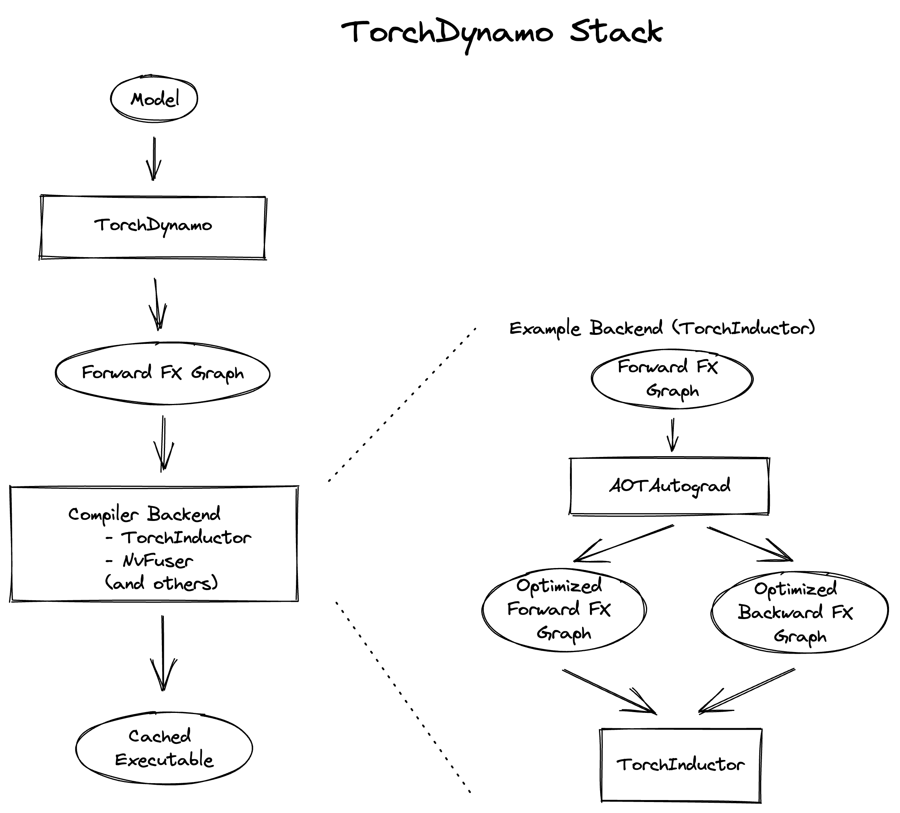

.. _torch.compiler_troubleshooting:

torch.compile Troubleshooting
=================================

You're trying to use ``torch.compile`` on your PyTorch model to enhance its performance
but it's not working as expected. Perhaps performance isn't improving, crashes are happening, or compilation time is too long. This article provides tips, workarounds, and debugging tools to help you overcome these challenges.

**Contents**

.. contents::
    :local:

Setting Expectations
~~~~~~~~~~~~~~~~~~~~

``torch.compile`` is designed as a general-purpose PyTorch compiler.
Unlike the previous compiler solution, TorchScript, ``torch.compile``
requires fewer code changes, meaning models typically don't need to be rewritten from scratch.
It also manages unsupported code more gracefully - unsupported code results in a lost optimization opportunity rather than a crash.

In the ideal world, one can simply apply ``torch.compile`` to any PyTorch model and enjoy automatic speedups.
However, in reality, code complexities can lead to one of three scenarios:

1. ``torch.compile`` works seamlessly, providing speedups.
2. Some code modifications are necessary. ``torch.compile`` doesn't crash or take too long,
   but you might not be seeing significant performance gains.
3. Extensive changes to your code are required.

We anticipate most code will fall under scenarios (1) and (2).
This document provides tips, arranged by level of involvement, to help address code issues in scenario (2).

Compile times
-------------

``torch.compile`` functions as a just-in-time compiler, so the initial one or two runs
of the compiled function are expected to be significantly slower. Recompilations, which can occur under certain conditions (detailed below),
will also make runs slower. Various ``torch.compile`` components cache results to
reduce compilation time for future invocations, even in different processes.
Cold-start (uncached) compilation time typically ranges from seconds to minutes for common or benchmarked models.
Larger models may take upwards of 30 minutes to a few hours.

Terminology
~~~~~~~~~~~

The following terms are relevant to troubleshooting ``torch.compile`` problems.

Graph break
-----------

``torch.compile`` traces your code and attempts to capture your PyTorch code into a
single computation graph of PyTorch operators (FX graph). However, this is not always possible.
When encountering code that can't be traced, a "graph break" occurs.
A graph break involves compiling the FX graph has been determined so far, running the unsupported code,
then resuming tracing after the unsupported code with a new FX graph.
Because the computation graph is broken up, we lose optimization opportunities,
so model code should avoid graph breaks whenever possible.
Graph breaks occur on things like:

- Data-dependent if-statements
- Many Python built-in functions
- C functions

Below is an example of a graph break due to the function ``copy.deepcopy`` from a Python builtin library
(exact output may differ).

.. code-block:: py

    import torch

    @torch.compile
    def fn(x):
        x = x + 1
        with open("test.txt", "r") as f:
            return x + len(f.read())

    fn(torch.ones(3, 3))

::

    $TORCH_LOGS="graph_breaks" python playground.py
    Graph break in user code at /data/users/williamwen/pytorch/playground.py:7
    Reason: Unsupported: builtin: open [<class 'torch._dynamo.variables.constant.ConstantVariable'>, <class 'torch._dynamo.variables.constant.ConstantVariable'>] False
    User code traceback:
    File "/data/users/williamwen/pytorch/playground.py", line 7, in fn
        with open("test.txt", "r") as f:
    Traceback (most recent call last):
    File "/data/users/williamwen/pytorch/torch/_dynamo/symbolic_convert.py", line 635, in wrapper
        return inner_fn(self, inst)
            ^^^^^^^^^^^^^^^^^^^^
    File "/data/users/williamwen/pytorch/torch/_dynamo/symbolic_convert.py", line 2414, in CALL
        self._call(inst)
    File "/data/users/williamwen/pytorch/torch/_dynamo/symbolic_convert.py", line 2408, in _call
        self.call_function(fn, args, kwargs)
    File "/data/users/williamwen/pytorch/torch/_dynamo/symbolic_convert.py", line 962, in call_function
        self.push(fn.call_function(self, args, kwargs))  # type: ignore[arg-type]
                ^^^^^^^^^^^^^^^^^^^^^^^^^^^^^^^^^^^^
    File "/data/users/williamwen/pytorch/torch/_dynamo/variables/builtin.py", line 997, in call_function
        return handler(tx, args, kwargs)
            ^^^^^^^^^^^^^^^^^^^^^^^^^
    File "/data/users/williamwen/pytorch/torch/_dynamo/variables/builtin.py", line 831, in <lambda>
        return lambda *args: unimplemented(error_msg)
                            ^^^^^^^^^^^^^^^^^^^^^^^^
    File "/data/users/williamwen/pytorch/torch/_dynamo/exc.py", line 313, in unimplemented
        raise Unsupported(msg, case_name=case_name)
    torch._dynamo.exc.Unsupported: builtin: open [<class 'torch._dynamo.variables.constant.ConstantVariable'>, <class 'torch._dynamo.variables.constant.ConstantVariable'>] False

Guards
------

``torch.compile`` makes some assumptions about runtime values as we trace through code.
During tracing, we generate "guards", which are runtime checks for these assumptions.
Guards are run in future calls to the compiled function to determine if we can reuse previously compiled code.
Examples of runtime checks are constant values, types, and object IDs.

Below is an example of generated guards. The ``TENSOR_MATCH`` guard checks for the input's type, device, dtype, shape, etc.

.. code-block:: py

    import torch

    @torch.compile
    def fn(x):
        return x + 1

    fn(torch.ones(3, 3))

::

    $ TORCH_LOGS="guards" python playground.py
    GUARDS:

    TREE_GUARD_MANAGER:
    +- RootGuardManager
    | +- DEFAULT_DEVICE: utils_device.CURRENT_DEVICE == None                           # _dynamo/output_graph.py:471 in init_ambient_guards
    | +- GLOBAL_STATE: ___check_global_state()
    | +- TORCH_FUNCTION_MODE_STACK: ___check_torch_function_mode_stack()
    | +- GuardManager: source=L['x'], accessed_by=DictGetItemGuardAccessor(x)
    | | +- TENSOR_MATCH: check_tensor(L['x'], Tensor, DispatchKeySet(CPU, BackendSelect, ADInplaceOrView, AutogradCPU), torch.float32, device=None, requires_grad=False, size=[3, 3], stride=[3, 1])  # return x + 1  # playground.py:6 in fn
    | | +- NO_HASATTR: hasattr(L['x'], '_dynamo_dynamic_indices') == False           # return x + 1  # playground.py:6 in fn

Recompilation
-------------

If the guards fail for every instance of previously compiled code,
then ``torch.compile`` must "recompile" the function, requiring the original code to be traced again.

In the example below, recompilation is necessary because the guard checking the tensor argument's shape failed.

.. code-block:: py

    import torch

    @torch.compile
    def fn(x):
        return x + 1

    fn(torch.ones(3, 3))
    fn(torch.ones(4, 4))

::

    $ TORCH_LOGS="recompiles" python playground.py
    Recompiling function fn in /data/users/williamwen/pytorch/playground.py:3
        triggered by the following guard failure(s):
        - 0/0: tensor 'L['x']' size mismatch at index 0. expected 3, actual 4

Dynamic Shapes
-------------------------
``torch.compile`` initially assumes tensor shapes are static/constant and guards based on these assumptions.
By using "dynamic shapes," we can get ``torch.compile`` to produce compiled code that can accept
tensor inputs with different shapes - we avoid recompiling every time shapes differ.
By default, automatic dynamic shapes are enabled ``torch.compile(dynamic=None)`` -
if compilation fails due to shape mismatch, recompilation is attempted with dynamic shapes.
Dynamic shapes can also be fully enabled ``dynamic=True`` or disabled ``dynamic=False``.

Below, we enable dynamic shapes and note that we no longer need to recompile.

.. code-block:: py

    import torch

    @torch.compile(dynamic=True)
    def fn(x):
        return x + 1

    fn(torch.ones(3, 3))
    fn(torch.ones(4, 4))

::

    $ TORCH_LOGS="dynamic,recompiles" python playground.py
    create_symbol s0 = 3 for L['x'].size()[0] [2, int_oo] at playground.py:5 in fn (_dynamo/variables/builder.py:2718 in <lambda>), for more info run with TORCHDYNAMO_EXTENDED_DEBUG_CREATE_SYMBOL="s0"
    produce_guards
    produce_guards

For more information on dynamic shapes, see `The dynamic shapes manual <https://docs.google.com/document/d/1GgvOe7C8_NVOMLOCwDaYV1mXXyHMXY7ExoewHqooxrs/edit#heading=h.fh8zzonyw8ng>`__.

Logging Tools
~~~~~~~~~~~~~

tlparse / TORCH_TRACE
-----------------------------

``tlparse`` / ``TORCH_TRACE`` are a pair of tools that produce compilation reports that look like this:
https://web.mit.edu/~ezyang/Public/bhack-20240609-tlparse/index.html.

Traces are very easy to collect. To collect a trace, run your reproduction command with

::

    TORCH_TRACE="/tmp/tracedir" python foo.py
    pip install tlparse
    tlparse /tmp/tracedir

This approach works even if you are running a distributed job, providing a trace for each rank.
It will open your browser with HTML similar to what's generated above.
If you are making a bug report for a complicated problem that you don't have a standalone reproduction for,
you can still greatly assist PyTorch developers by attaching the trace log generated in ``/tmp/tracedir``.

.. warning:: The trace log contains all of your model code.
   Do not share the trace log if the model you are working on is sensitive. The trace log does NOT contain weights.

.. raw:: html

    

.. role:: red

.. role:: green

.. role:: dark-green

The output of ``tlparse`` is primarily aimed for PyTorch developers,
and the log format is easy to upload and share on GitHub.
However,  as a non-PyTorch developer, you can still extract useful information from it.
We recommend starting with the inline help text in the report, which explains its contents.
Here are some insights you can gain from a ``tlparse``:

- What model code was compiled by looking at the stack trie?
  This is especially useful if you're not familiar with the codebase being compiled!
- How many graph breaks / distinct compilation regions are there?
  (Each distinct compile is its own color coded block like :dark-green:`[0/0]`).
  Frames that are potentially graph-broken are light green :green:`[2/4]`.
  If there are a lot of frames, that is suspicious, and suggests that you had some catastrophic graph breaks,
  or maybe your code isn't a good match for ``torch.compile``.
- How many times did I recompile a particular frame? Something that recompiled a lot will look like:
  :dark-green:`[10/0]` :dark-green:`[10/1]` :dark-green:`[10/2]`
  - if something is being recompiled a lot, that is very suspicious and worth looking into, even if it isn't the root cause of your problem.
- Was there a compilation error? Frames that errored will look like :red:`[0/1]`.
- What intermediate compiler products did I generate for a given frame?
  For example, you can look at the high-level generated FX graph or the generated Triton code.
- Is there relevant information for a particular frame? You can find these in ``compilation_metrics``.

TORCH_LOGS
--------------

You can use the ``TORCH_LOGS`` environment variable to selectively enable parts of the ``torch.compile`` stack to log.
``TORCH_LOGS`` is in fact the source of logs for ``tlparse``. The format of the ``TORCH_LOGS`` environment variable looks like this:

::

    TORCH_LOGS="<option1>,<option2>,..." python foo.py

Useful high-level options include:

- ``graph_breaks``: logs locations of graph breaks in user code and the reason for the graph break
- ``guards``: logs guards that are generated
- ``recompiles``: logs which function recompiled and the guards that failed, leading to the recompilation
- ``dynamic``: logs related to dynamic shapes

Also, you can programmatically set logging options using ``torch._logging.set_logs``:

.. code-block:: py

    import logging
    torch._logging.set_logs(graph_breaks=True)
    ...

More ``TORCH_LOGS`` options are :ref:`detailed below <troubleshooting_torch_logs_options>`.
For the full list of options, see `torch._logging <https://pytorch.org/docs/stable/logging.html>`__
and `torch._logging.set_logs <https://pytorch.org/docs/stable/generated/torch._logging.set_logs.html#torch._logging.set_logs>`__.

tlparse vs. TORCH_LOGS
----------------------

Generally, we suggest first using ``tlparse`` when encountering issues.
``tlparse`` is ideal for debugging large models and gaining a high-level overview of how your model was compiled.
On the other hand, ``TORCH_LOGS`` is preferred for small examples and fine-grained debugging detail,
when we already have an idea of which ``torch.compile`` component is causing the problem.

Simple Workarounds
~~~~~~~~~~~~~~~~~~

Here, we describe some workarounds to ``torch.compile`` issues involving small code modifications
or changing some ``torch.compile`` settings.

Where to apply torch.compile?
---------------------------------

We recommend applying ``torch.compile`` to the highest-level function that doesn't cause excessive problems.
Typically, it is your train or eval step with the optimizer but without the loop, your top-level ``nn.Module``,
or some sub-``nn.Module``s. ``torch.compile`` specifically doesn't handle distributed wrapper modules like
DDP or FSDP very well, so consider applying ``torch.compile`` to the inner module passed to the wrapper.

.. code-block:: py

    # inference
    model = ...
    opt_model = torch.compile(model)

    for _ in range(N_ITERS):
        inp = ...
        out = opt_model(inp)

.. code-block:: py

    # training
    model = ...
    opt = torch.optim.Adam(model.parameters())

    @torch.compile
    def train(mod, data):
        opt.zero_grad(True)
        pred = mod(data[0])
        loss = torch.nn.CrossEntropyLoss()(pred, data[1])
        loss.backward()
        opt.step()

    for _ in range(N_ITERS):
        inp = ...
        train(model, inp)

.. code-block:: py

    # DistributedDataParallel
    model = ...
    opt_model = torch.compile(model)
    model_ddp = DistributedDataParallel(opt_model, ...)

    for _ in range(N_ITERS):
        inp = ...
        out = model_ddp(inp)

Disabling and Suppressing Errors
---------------------------------

For some model architectures, there are portions of the model which are particularly difficult to compile
- either there are many graph breaks, or there are crashes. You may want to explicitly disable these
portions of the model which are problematic so that you can apply ``torch.compile`` to the parts that work.
You can do this by using the ``@torch.compiler.disable`` decorator. When ``torch.compile`` attempts to call a
disabled function, it breaks the graph and skips tracing the disabled function, resuming tracing after the call.
By default, all recursive calls made from a disabled function are also disabled. Use the ``recursive=False``
option to allow compilation for recursive calls.

.. code-block:: py

    def bad1_inner(...):
        # skipped

    @torch.compiler.disable
    def bad1_outer(...):
        # skipped
        bad1_inner(...)

    def bad2_inner(...)
        # traced

    @torch.compiler.disable(recursive=False)
    def bad2_outer(...):
        # skipped
        bad2_inner(...)

    @torch.compile
    def fn(...):
        # graph break
        bad1_outer(...)
        ...
        # graph break
        bad2_outer(...)

For example, we use ``torch.compiler.disable`` to disable ``torch.compile`` on sparse architecture in
recommendation models, as the sparse arch is difficult to compile. Preprocessing and logging functions
are other examples of functions that typically cause a lot of graph breaks and do not get value from being compiled.

If you are experiencing compiler crashes and you want to continue regardless, you can set
``torch._dynamo.config.suppress_errors = True``. When the compiler crashes, we will just skip tracing
the function and try again later. This is not best practice - it is better to eventually manually add
disable annotations as necessary.

Resolving graph breaks
----------------------

To maximize optimization opportunities, it's important to reduce the number of graph breaks.
Recall that you can see what graph breaks are happening using ``tlparse`` or ``TORCH_LOGS="graph_breaks"``.
In general, graph breaks are caused by one of the following:

1. You're trying to do something that fundamentally cannot be traced, such as data-dependent control flow.
2. You're trying to do something not yet supported. .
   For example, we currently have limited support for tracing code that uses the built-in Python ``inspect`` module.
3. Your code has an error in it. For example, you may have tried calling a function with an incorrect number of arguments.

Graph break logs will tell you the user code location and reason for the graph break.
Unfortunately, many graph breaks are not actionable without a deeper understanding of Dynamo.
It can even be challenging to determine which of the three causes was the true cause of your graph break.
We are working on making graph break messages more actionable.

Additionally, the impact of lost optimization opportunities differs between graph breaks.
For example, graph breaks that happen in the middle of your model's ``forward`` are likely to have a more negatie impact than
graph breaks in a preprocessing part at the beginning of the ``forward``. So it is not crucial to prevent *every single*
break, but rather to prevent the ones that cause significant performance hits.

If a graph break message doesn't suggest any action, you suspect that the cause of your graph break is (2),
and you believe that the graph break is causing performance hits,
then please report the graph break as an issue. If a function has many graph breaks,
consider disabling compilation on that function, as the overhead cost for the graph breaks may become prohibitive.

Below are some common graph breaks and some workarounds.

Data-dependent operations
^^^^^^^^^^^^^^^^^^^^^^^^^

``torch.compile`` graph breaks on data-dependent operations such as data-dependent control flow
(if-statements, loops with tensors) and direct tensor data accesses (``.item``, ``.data_ptr``).

.. code-block:: py

    import torch

    @torch.compile
    def fn(x):
        y = x.sum()
        if y > 0:
            return x + y.item()
        return x - y.item()

    fn(torch.ones(3, 3))

::

    $ TORCH_LOGS="graph_breaks" python playground.py
    Graph break in user code at /data/users/williamwen/pytorch/playground.py:6
    Reason: Data-dependent jump
    User code traceback:
    File "/data/users/williamwen/pytorch/playground.py", line 6, in fn
        if y > 0:

    Graph break in user code at /data/users/williamwen/pytorch/playground.py:7
    Reason: Unsupported: Tensor.item
    User code traceback:
    File "/data/users/williamwen/pytorch/playground.py", line 7, in torch_dynamo_resume_in_fn_at_6
        return x + y.item()
    Traceback (most recent call last):
    File "/data/users/williamwen/pytorch/torch/_dynamo/symbolic_convert.py", line 616, in wrapper
        return inner_fn(self, inst)
            ^^^^^^^^^^^^^^^^^^^^
    File "/data/users/williamwen/pytorch/torch/_dynamo/symbolic_convert.py", line 2288, in CALL
        self._call(inst)
    File "/data/users/williamwen/pytorch/torch/_dynamo/symbolic_convert.py", line 2282, in _call
        self.call_function(fn, args, kwargs)
    File "/data/users/williamwen/pytorch/torch/_dynamo/symbolic_convert.py", line 838, in call_function
        self.push(fn.call_function(self, args, kwargs))  # type: ignore[arg-type]
                ^^^^^^^^^^^^^^^^^^^^^^^^^^^^^^^^^^^^
    File "/data/users/williamwen/pytorch/torch/_dynamo/variables/misc.py", line 1038, in call_function
        return self.obj.call_method(tx, self.name, args, kwargs)
            ^^^^^^^^^^^^^^^^^^^^^^^^^^^^^^^^^^^^^^^^^^^^^^^^^
    File "/data/users/williamwen/pytorch/torch/_dynamo/variables/tensor.py", line 527, in call_method
        result = handler_method(*args, **kwargs)
                ^^^^^^^^^^^^^^^^^^^^^^^^^^^^^^^
    File "/data/users/williamwen/pytorch/torch/_dynamo/variables/tensor.py", line 773, in method_item
        unimplemented("Tensor.item")
    File "/data/users/williamwen/pytorch/torch/_dynamo/exc.py", line 304, in unimplemented
        raise Unsupported(msg, case_name=case_name)
    torch._dynamo.exc.Unsupported: Tensor.item

The general workaround for these graph breaks is to avoid doing data-dependent operations. Some specific workarounds are:

- If your control flow doesn't actually depend on data values, consider modifying your code to perform control flow on constants.

.. code-block:: py

    # old
    x = torch.randn(3, 3)
    @torch.compile
    def fn(y):
        if x.sum() > 0:
            return y + x
        else:
            return y - x

    # new
    x = torch.randn(3, 3)
    cond = (x.sum() > 0).item()
    @torch.compile
    def fn(y):
        if cond:
            return y + x
        else:
            return y - x

- Use higher-order ops like ``torch.cond`` (https://pytorch.org/docs/main/cond.html) in place of data-dependent control flow

.. code-block:: py

    # old
    @torch.compile
    def fn(x):
        if x.sum() > 0:
            return x + 1
        return x - 1

    # new
    @torch.compile
    def fn(x):
        return torch.cond(
            x.sum() > 0,
            lambda x: x + 1,
            lambda x: x - 1,
            (x,),
        )

- If you have a ``.item()`` call, try ``torch._dynamo.config.capture_scalar_outputs = True`` or ``TORCHDYNAMO_CAPTURE_SCALAR_OUTPUTS=1``
- Wrap problematic parts of the function in a custom op

Custom ops
^^^^^^^^^^

If you have code that ``torch.compile`` has trouble tracing through, either due to missing support or fundamental incompatibility,
you can consider wrapping the problematic code in a custom op.

Custom ops require a little bit of additional work to get them to be compatible with ``torch.compile``.
See https://pytorch.org/tutorials/advanced/custom_ops_landing_page.html for more details.

Printing
^^^^^^^^

Printing/logging/issuing warnings will result in a graph break. If you have a function that makes many logging calls,
for example, a function that logs data about a training iteration, consider applying ``torch.compiler.disable`` on it.

Alternatively, you can try using ``torch._dynamo.config.reorderable_logging_functions``.
This config is used to reorder logging functions so that they are called at the end of the traced function,
thus avoiding a graph break. However, the logged contents may differ if, for example, a mutation occurs.

.. code-block:: py

    import torch

    torch._dynamo.config.reorderable_logging_functions.add(print)

    @torch.compile
    def fn(x):
        x += 1
        print("log!")
        return torch.sin(x)

    fn(torch.ones(3, 3))

::

    $ TORCH_LOGS="graph_breaks" python playground.py
    log!

Incorrect code
^^^^^^^^^^^^^^

Your code may be wrong, or is otherwise encountering an error from outside ``torch.compile``.
In the code below, we made a typo in the ``torch.sin`` call by providing an extra argument.

.. code-block:: py

    import torch

    @torch.compile
    def fn(x):
        y = torch.sin(x, x)
        return y

    fn(torch.ones(3, 3))

::

    $ TORCH_LOGS="graph_breaks" python playground.py
    Graph break in user code at /data/users/williamwen/pytorch/playground.py:5
    Reason: Unsupported: TypeError <built-in method sin of type object at 0x7fd6fd764600>: sin() takes 1 positional argument but 2 were given
    User code traceback:
    File "/data/users/williamwen/pytorch/playground.py", line 5, in fn
        y = torch.sin(x, x)
    ...

It can be difficult to tell from the logs if the error is caused by your code or because of a ``torch.compile`` bug.
In order to differentiate, we recommend trying to run your code without ``torch.compile`` to see if you still get the error.

Dealing with recompilations
---------------------------

You can view recompilations and their reasons using ``tlparse`` or ``TORCH_LOGS=recompiles``.

Is dynamic shapes enabled?
^^^^^^^^^^^^^^^^^^^^^^^^^^

Recompilations due to mismatched shapes are in the form:

::

    tensor 'L['x']' size mismatch at index 0. expected 3, actual 4

Make sure that the ``dynamic`` option of ``torch.compile`` is not set to ``False``.
The default option, ``dynamic=None``, will only attempt dynamic shapes after the first compilation.
You can set ``dynamic=True`` to upfront compile as dynamic as possible.

For more information on dynamic shapes, see `The dynamic shapes manual <https://docs.google.com/document/d/1GgvOe7C8_NVOMLOCwDaYV1mXXyHMXY7ExoewHqooxrs/edit#heading=h.fh8zzonyw8ng>`__.

Changing the cache size limit
^^^^^^^^^^^^^^^^^^^^^^^^^^^^^

There is a limit to how many times a function can be recompiled, determined by ``torch._dynamo.config.cache_size_limit``
and ``torch._dynamo.config.accumulated_cache_size_limit``.
If either limit is exceeded, then we will not attempt to compile the function again and instead will run the function eagerly.
``torch.compile`` will also issue a warning containing the affected function and which limit was hit.
In the example below, each function call results in a recompile attempt.
When we hit the cache size limit (8), we stop attempting to recompile.

.. code-block:: py

    import torch

    @torch.compile(dynamic=False)
    def fn(x):
        return x + 1

    for i in range(1, 10):
        fn(torch.ones(i))

::

    $ python playground.py
    torch._dynamo hit config.cache_size_limit (8)
        function: 'fn' (/data/users/williamwen/pytorch/playground.py:5)
        last reason: 0/0: tensor 'L['x']' size mismatch at index 0. expected 1, actual 9

If you know that the number of recompilations has a reasonable constant upper bound, you can raise the cache size limit.
If the cost of recompilation outweighs the benefit of compilation, then you can consider lowering the cache size limit.

Wrapping constants with tensors
^^^^^^^^^^^^^^^^^^^^^^^^^^^^^^^

By default, ``int`` / ``float`` variables are treated as constants and are guarded as such.
In the below example, we have a recompilation for each function call.

.. code-block:: py

    import torch

    @torch.compile
    def fn(x, c):
        return x + c

    for i in range(1, 10):
        fn(torch.ones(i), 0.5 + i)

::

    $ TORCH_LOGS="recompiles" python playground.py
    Recompiling function fn in /data/users/williamwen/pytorch/playground.py:3
        triggered by the following guard failure(s):
        - 0/7: L['c'] == 8.5
        - 0/6: L['c'] == 7.5
        - 0/5: L['c'] == 6.5
        - 0/4: L['c'] == 5.5
        - 0/3: L['c'] == 4.5
        - 0/2: L['c'] == 3.5
        - 0/1: L['c'] == 2.5
        - 0/0: L['c'] == 1.5
    torch._dynamo hit config.cache_size_limit (8)
        function: 'fn' (/data/users/williamwen/pytorch/playground.py:3)
        last reason: 0/0: L['c'] == 1.5

In particular, for LR schedulers, initializing with a constant can lead to recompilations:

.. code-block:: py

    import torch

    mod = torch.nn.Linear(3, 3)
    opt = torch.optim.Adam(mod.parameters(), lr=0.01)
    sched = torch.optim.lr_scheduler.ExponentialLR(opt, 0.9)

    @torch.compile
    def fn(inp):
        opt.zero_grad(True)
        out = mod(inp).sum()
        out.backward()
        opt.step()
        sched.step()

    for i in range(1, 10):
        fn(torch.ones(3, 3))

::

    $ TORCH_LOGS="recompiles" python playground.py
    Recompiling function step in /data/users/williamwen/pytorch/torch/optim/adam.py:189
        triggered by the following guard failure(s):
        - 3/7: L['self'].param_groups[0]['lr'] == 0.004782969000000002
        - 3/6: L['self'].param_groups[0]['lr'] == 0.005314410000000002
        - 3/5: L['self'].param_groups[0]['lr'] == 0.005904900000000002
        - 3/4: L['self'].param_groups[0]['lr'] == 0.006561000000000002
        - 3/3: L['self'].param_groups[0]['lr'] == 0.007290000000000001
        - 3/2: L['self'].param_groups[0]['lr'] == 0.008100000000000001
        - 3/1: L['self'].param_groups[0]['lr'] == 0.009000000000000001
        - 3/0: L['self'].param_groups[0]['lr'] == 0.01
    torch._dynamo hit config.cache_size_limit (8)
        function: 'step' (/data/users/williamwen/pytorch/torch/optim/adam.py:189)
        last reason: 3/0: L['self'].param_groups[0]['lr'] == 0.01

In both examples, we can wrap float variables in tensors in order to prevent recompilations.

.. code-block:: py

    # first example
    for i in range(1, 10):
        fn(torch.ones(i), torch.tensor(0.5 + i))

    # second example
    opt = torch.optim.Adam(mod.parameters(), lr=torch.tensor(0.01))
    sched = torch.optim.lr_scheduler.ExponentialLR(opt, torch.tensor(0.9))

Reporting Issues
~~~~~~~~~~~~~~~~

If the workarounds provided above were not enough to get ``torch.compile`` working,
then you should consider reporting the issue to PyTorch.
But there are a few things that you can do to make our lives significantly easier.

Ablation
--------

Check which component of the ``torch.compile`` stack is the one causing the issue using the ``backend=`` option for ``torch.compile``.
In particular, try:

- ``torch.compile(fn, backend="eager")``, which only runs TorchDynamo, the graph capture component of ``torch.compile``.
- ``torch.compile(fn, backend="aot_eager")``, which runs TorchDynamo and AOTAutograd, which additionally generates the backward graph during compilation.
- ``torch.compile(fn, backend="aot_eager_decomp_partition")``, which runs TorchDynamo and AOTAutograd with operator decompositions/partitions.
- ``torch.compile(fn, backend="inductor")``, which runs TorchDynamo, AOTAutograd, and TorchInductor, the backend ML compiler that generates compiled kernels.

If you only fail with the Inductor backend, you can additionally test various Inductor modes:

- ``torch.compile(fn, backend="inductor", mode="default")``
- ``torch.compile(fn, backend="inductor", mode="reduce-overhead")``
- ``torch.compile(fn, backend="inductor", mode="max-autotune")``

You can also check if dynamic shapes is causing issues with any backend:

- ``torch.compile(fn, dynamic=True)`` (always use dynamic shapes)
- ``torch.compile(fn, dynamic=False)`` (never use dynamic shapes)
- ``torch.compile(fn, dynamic=None)`` (automatic dynamic shapes)

Bisecting
---------
Did you try on the latest nightly? Did something work in the past but now no longer works?
Can you bisect to determine the first nightly where your issue occurs?
Bisecting is especially helpful for performance, accuracy, or compile time regressions,
where it is not immediately obvious where the problem originates from.

Creating a reproducer
---------------------

Creating reproducers is a lot of work, and it is perfectly fine if you do not have the time to do it.
However, if you are a motivated user unfamiliar with the internals of ``torch.compile``,
creating a standalone reproducer can have a huge impact on our ability to fix the bug.
Without a reproducer, your bug report must contain enough information for us to identify the root cause of the problem and write a reproducer from scratch.

Here's a list of useful reproducers, ranked from most to least preferred:

1. **Self-contained, small reproducer:** A script with no external dependencies, under 100 lines of code, that reproduces the problem when run.
2. **Self-contained, large reproducer:** Even if it's large, being self-contained is a huge advantage!
3. **Non-self-contained reproducer with manageable dependencies:**
   For example, if you can reproduce the problem by running a script after ``pip install transformers``,
   that's manageable. We can likely run it and investigate.
4. **Non-self-contained reproducer requiring substantial setup:**  This might involve downloading datasets,
   multiple environment setup steps, or specific system library versions requiring a Docker image.
   The more complex the setup, the harder it is for us to recreate the environment.

   .. note::
       Docker simplifies setup but complicates changes to the environment, so it's not a perfect solution, though we'll use it if necessary.

Somewhat orthogonally, a reproducer that can be run in a single process is better than a reproducer
that requires multiprocess training (but once again, if you only have a multiprocess reproducer, we'll take it!).

Additionally, below is a non-exhaustive list of aspects to check in your
issue that you can attempt to replicate in your reproducer:

- **Autograd**. Did you have tensor inputs with ``requires_grad=True``? Did you call ``backward()`` on the output?
- **Dynamic shapes**. Did you set ``dynamic=True``? Or did you run the test code multiple times with varying shapes?
- **Custom operators**. Is there a custom operator involved in the real workflow?
  Can you replicate some of its important characteristics using the Python custom operator API?
- **Configuration**. Did you set all the same configuration?
  This includes ``torch._dynamo.config`` and ``torch._inductor.config`` settings,
  as well as arguments to ``torch.compile`` like ``backend`` / ``mode``.
- **Context managers**. Did you replicate any active context managers?
  This could be ``torch.no_grad``, automatic mixed precision, ``TorchFunctionMode`` / ``TorchDispatchMode``,
  activation checkpointing, compiled autograd etc.
- **Tensor subclasses**. Is there a tensor subclass involved?

Minifier
--------

The minifier is an early ``torch.compile`` tool that, given an FX graph that crashes when we attempt to run or compile it,
finds a subgraph that also crashes and outputs the code that performs that subgraph's operations.
Essentially, the minifier finds a minimal repro for a certain class of ``torch.compile``-related crashes.
This assumes that we were able to successfully trace through code.

Unfortunately, most of the time nowadays, the minifier doesn't work as expected, and alternative methods may be necessary.
This is likely because bugs that can be automatically reproduced in this manner are generally easier to fix
and have already been addressed, leaving more complex issues that do not reproduce easily.
However, it is straightforward to attempt using the minifier, so it is worth trying even if it may not succeed.

Instructions for operating the minifier can be found `here <https://pytorch.org/docs/stable/torch.compiler_troubleshooting_old.html>`__.
If the compiler is crashing, you can set ``TORCHDYNAMO_REPRO_AFTER="dynamo"`` or ``TORCHDYNAMO_REPRO_AFTER="aot"``
The ``aot`` option is more likely to succeed, although it may not identify the ``AOTAutograd`` issues.  This will generate the ``repro.py`` file which may help to diagnose the problem.
For accuracy-related issues, consider setting ``TORCHDYNAMO_REPRO_LEVEL=4``. Please note that this may not always successfully identify the problematic subgraph.

Debugging Deeper
~~~~~~~~~~~~~~~~

This section provides tools and techniques for independently debugging ``torch.compile`` issues
or for gaining a deeper understanding of the ``torch.compile`` stack.
These methods are more involved than those presented above and are used by PyTorch developers regularly
to debug real ``torch.compile`` issues.

Below is a high-level overview of the stack:

The stack comprises three main components: TorchDynamo, AOTAutograd, and Inductor.
Our debugging strategy involves first identifying the component in which the error occurs
and then individually debugging the component. To determine the component responsible for the issue,
see the `Ablation` section under `Reporting Issues` above. For guidance on debugging a specific component, consult the sections below.

TorchDynamo
-----------

Logging what Dynamo is tracing
^^^^^^^^^^^^^^^^^^^^^^^^^^^^^^

The ``TORCH_LOGS=trace_bytecode`` option enables you to view the precise bytecode instructions that Dynamo is tracing,
as well as a symbolic representation of the Python interpreter stack. When encountering a graph break or crash,
it is advisable to inspect the last few bytecode instructions traced.

You can also use ``TORCH_LOGS=trace_source`` to see which lines of source code Dynamo is tracing through.
This is useful in combination with ``trace_bytecode`` to see the line of source code each traced bytecode instruction corresponds to.

Finally, you can use ``TORCH_LOGS=graph_code`` to see the Python code representing the FX graph that Dynamo traced.
You can view this code to double check that the correct ops are being traced.

.. code-block:: py

    import torch

    def g(x, y):
        return x + y

    @torch.compile(backend="eager")
    def f(x):
        x = torch.sin(x)
        x = g(x, x)
        return x

    f(torch.ones(3, 3))

::

    $ TORCH_LOGS="trace_bytecode,trace_source,graph_code" python playground.py
    TRACE starts_line /data/users/williamwen/pytorch/playground.py:6 in f ()
        @torch.compile(backend="eager")
    TRACE RESUME 0 []
    TRACE starts_line /data/users/williamwen/pytorch/playground.py:8 in f (f)
            x = torch.sin(x)
    TRACE LOAD_GLOBAL torch []
    TRACE LOAD_ATTR sin [NullVariable(), PythonModuleVariable(<module 'torch' from '/data/users/williamwen/pytorch/torch/__init__.py'>)]
    TRACE LOAD_FAST x [NullVariable(), TorchInGraphFunctionVariable(<built-in method sin of type object at 0x7f00f6964600>)]
    TRACE CALL 1 [NullVariable(), TorchInGraphFunctionVariable(<built-in method sin of type object at 0x7f00f6964600>), LazyVariableTracker()]
    TRACE STORE_FAST x [TensorVariable()]
    TRACE starts_line /data/users/williamwen/pytorch/playground.py:9 in f (f)
            x = g(x, x)
    TRACE LOAD_GLOBAL g []
    TRACE LOAD_FAST x [NullVariable(), UserFunctionVariable()]
    TRACE LOAD_FAST x [NullVariable(), UserFunctionVariable(), TensorVariable()]
    TRACE CALL 2 [NullVariable(), UserFunctionVariable(), TensorVariable(), TensorVariable()]
    TRACE starts_line /data/users/williamwen/pytorch/playground.py:3 in g (g) (inline depth: 1)
        def g(x, y):
    TRACE RESUME 0 []
    TRACE starts_line /data/users/williamwen/pytorch/playground.py:4 in g (g) (inline depth: 1)
            return x + y
    TRACE LOAD_FAST x []
    TRACE LOAD_FAST y [TensorVariable()]
    TRACE BINARY_OP 0 [TensorVariable(), TensorVariable()]
    TRACE RETURN_VALUE None [TensorVariable()]
    TRACE STORE_FAST x [TensorVariable()]
    TRACE starts_line /data/users/williamwen/pytorch/playground.py:10 in f (f)
            return x
    TRACE LOAD_FAST x []
    TRACE RETURN_VALUE None [TensorVariable()]
    TRACED GRAPH
    ===== __compiled_fn_1 =====
    /data/users/williamwen/pytorch/torch/fx/_lazy_graph_module.py class GraphModule(torch.nn.Module):
        def forward(self, L_x_: "f32[3, 3][3, 1]cpu"):
            l_x_ = L_x_

            # File: /data/users/williamwen/pytorch/playground.py:8 in f, code: x = torch.sin(x)
            x: "f32[3, 3][3, 1]cpu" = torch.sin(l_x_);  l_x_ = None

            # File: /data/users/williamwen/pytorch/playground.py:4 in g, code: return x + y
            x_1: "f32[3, 3][3, 1]cpu" = x + x;  x = None
            return (x_1,)

Breakpointing Dynamo tracing
^^^^^^^^^^^^^^^^^^^^^^^^^^^^

Inserting a breakpoint in Dynamo/user code is helpful at times to see what the state of Dynamo is when tracing through user code.
Unfortunately, inserting a breakpoint in the normal Python fashion will result in a graph break in TorchDynamo,
so we will not be able to view the state of Dynamo at the point where we intended to breakpoint.

The first method for setting a breakpoint is to insert it within the Dynamo source code. Three recommended locations to place a breakpoint are:

- In ``torch/_dynamo/symbolic_convert.py``, breakpoint at functions that are named after the problematic bytecode instruction,
  such as ``def CALL_FUNCTION`` and ``def STORE_ATTR``. You can conditionally breakpoint depending on inputs,
  for example, the ``argval`` of the instruction, or the name of the object at the top of the stack since some bytecode opcodes are frequently used.
- Breakpoint where the graph break or error originates from. Typically, graph breaks are emitted from a call to ``unimplemented(...)``.
- Breakpoint in ``torch/_dynamo/variables/builder.py, function:_wrap``. You will likely have to conditionally breakpoint on the input.
  This function determines how to symbolically represent a given value. Consider breakpointing here if you suspect that a value is represented incorrectly.

The second way to insert a breakpoint is to use ``torch._dynamo.comptime.comptime.breakpoint``:

.. code-block:: py

    from torch._dynamo.comptime import comptime

    @torch.compile
    def f(...):
        ...
        comptime.breakpoint()
        ...

A comptime breakpoint is convenient as it enables you to inspect the Dynamo state at a specific location within the user code being traced.
It does not require you to insert a breakpoint in the Dynamo source or to conditionally breakpoint based on variables.

When a comptime breakpoint is triggered, you can do the following:

- ``ctx.print_bt()`` to print the user stack trace
- ``ctx.print_locals()`` to print all current locals
- ``ctx.print_graph()`` to print the currently traced graph
- ``ctx.disas()`` to print the currently traced function's bytecode
- Use standard ``pdb`` commands, such as ``bt/u/d/n/s/r``, - you can go up the ``pdb`` stack to inspect more Dynamo internals

.. code-block:: py

    import torch
    from torch._dynamo.comptime import comptime

    @torch.compile(backend="eager")
    def f(x):
        y = x + 1
        comptime.breakpoint()
        y = y + 1
        return y

    f(torch.ones(3, 3))

::

    $ python playground.py
    --Return--
    > /data/users/williamwen/pytorch/torch/_dynamo/comptime.py(392)inner()->None
    -> builtins.breakpoint()
    (Pdb) ctx.print_bt()
    File "/data/users/williamwen/pytorch/playground.py", line 7, in f
        comptime.breakpoint()

    (Pdb) ctx.print_locals()
    x = FakeTensor(..., size=(3, 3))
    y = FakeTensor(..., size=(3, 3))
    (Pdb) bt
    ...
    /data/users/williamwen/pytorch/torch/_dynamo/symbolic_convert.py(826)call_function()
    -> self.push(fn.call_function(self, args, kwargs))  # type: ignore[arg-type]
    /data/users/williamwen/pytorch/torch/_dynamo/variables/misc.py(331)call_function()
    -> func(ComptimeContext(tx))
    > /data/users/williamwen/pytorch/torch/_dynamo/comptime.py(392)inner()->None
    -> builtins.breakpoint()
    (Pdb) ctx.print_graph()

    def forward(self, L_x_: "f32[3, 3]"):
        l_x_ = L_x_

        # File: /data/users/williamwen/pytorch/playground.py:6 in f, code: y = x + 1
        y: "f32[3, 3]" = l_x_ + 1;  l_x_ = y = None

..
    TODO(uncomment/update once we improve this API)
    Debugging large models
    ^^^^^^^^^^^^^^^^^^^^^^

    Debugging TorchDynamo on large models can be tricky, mainly because Dynamo traces through large amounts of code.
    It can be difficult to find the problematic function, or to determine where to place a breakpoint.
    Even if we've found the problematic function, we don't want to deal with logging spam.
    Fortunately, you can use ``TORCHDYNAMO_DEBUG_FUNCTION=<function name>``, which limits dynamo tracing to only functions with a specific name
    (exact match). This will allow you to filter all of the functions in the model to the function(s) of interest.
    Use this in combination with the above debugging strategies.

Bytecode generation errors
^^^^^^^^^^^^^^^^^^^^^^^^^^

Although uncommon, Dynamo may generate incorrect bytecode. This may occur if you determine the following:

- Ablation reveals the error is happening at the TorchDynamo level
- The error is not being emitted from TorchDynamo stack frames
- The error looks more like a user error rather than a Dynamo error, or is a segmentation fault
- The error does not occur without ``torch.compile``

Bytecode generation bugs are generally tricky to fix and we recommend submitting an issue instead of trying to fix those yourself.
If you are interested in seeing the bytecode that Dynamo generates, you can use ``TORCH_LOGS=bytecode``.
You can see a high-level overview on what bytecode Dynamo generates `here <https://docs.google.com/presentation/d/1tMZOoAoNKF32CAm1C-WfzdVVgoEvJ3lp/edit?usp=sharing&ouid=114922067987692817315&rtpof=true&sd=true>`__.

AOTAutograd
-----------

AOTAutograd errors are typically difficult to debug - we recommend just submitting an issue.
AOTAutograd logging output is primarily helpful to see what the input to Inductor is.

..
    TODO
    TorchInductor
    -------------

.. TODO

.. _troubleshooting_torch_logs_options:

Summary of TORCH_LOGS options
---------------------------------

A summary of helpful ``TORCH_LOGS`` options is:

.. list-table::
    :widths: 25 50
    :header-rows: 1

    * - Option
      - Description
    * - +all
      - Output debug logs from all ``torch.compile`` components
    * - +dynamo
      - Output debug logs from TorchDynamo
    * - +aot
      - Output debug logs from AOTAutograd
    * - +inductor
      - Output debug logs from TorchInductor
    * - dynamic
      - Output logs from dynamic shapes
    * - graph_code
      - Output the Python code for the FX graph that Dynamo generated
    * - graph_sizes
      - Output the tensor sizes of the FX graph that Dynamo generated
    * - trace_bytecode
      - Output the bytecode instructions that Dynamo is tracing through and the symbolic interpreter stack Dynamo is keeping track of
    * - trace_source
      - Output the line of code in the original source that Dynamo is currently tracing through
    * - bytecode
      - Output Dynamo-generated bytecode
    * - guards
      - Output generated guards
    * - recompiles
      - Output recompilation reasons (only the first guard check that fails)
    * - recompiles_verbose
      - Output all guard checks that fail when a recompilation occurs
    * - aot_graphs
      - Output graph generated by AOTAutograd
    * - aot_joint_graphs
      - Output the joint forward-backward graph generated by AOTAutograd
    * - output_code
      - Output code generated by Inductor
    * - kernel_code
      - Output code generated by Inductor on a per-kernel basis
    * - schedule
      - Output Inductor scheduling logs
    * - perf_hints
      - Output Inductor perf hint logs
    * - fusion
      - Output Inductor fusion logs

For the full list of options, see `torch._logging <https://pytorch.org/docs/stable/logging.html>`__
and `torch._logging.set_logs <https://pytorch.org/docs/stable/generated/torch._logging.set_logs.html#torch._logging.set_logs>`__.

Related Articles
~~~~~~~~~~~~~~~~

- `torch.compile tutorial <https://pytorch.org/tutorials/intermediate/torch_compile_tutorial.html>`__
- `torch.compile fine-grained APIs <https://pytorch.org/docs/stable/torch.compiler_fine_grain_apis.html>`__
- `torch.compile FAQ <https://pytorch.org/docs/stable/torch.compiler_faq.html>`__
- `torch.compiler namespace overview <https://pytorch.org/docs/stable/torch.compiler.html#torch-compiler-overview>`__
- `torch.compiler API reference <https://pytorch.org/docs/stable/torch.compiler_api.html>`__
- `Profiling torch.compile <https://pytorch.org/docs/stable/torch.compiler_profiling_torch_compile.html>`__
- `torch.compile missing manual <https://docs.google.com/document/d/1y5CRfMLdwEoF1nTk9q8qEu1mgMUuUtvhklPKJ2emLU8/edit?usp=sharing>`__
- `The dynamic shapes manual <https://docs.google.com/document/d/1GgvOe7C8_NVOMLOCwDaYV1mXXyHMXY7ExoewHqooxrs/edit#heading=h.fh8zzonyw8ng>`__
- `TorchInductor caching tutorial <https://pytorch.org/tutorials/recipes/torch_compile_caching_tutorial.html>`__
