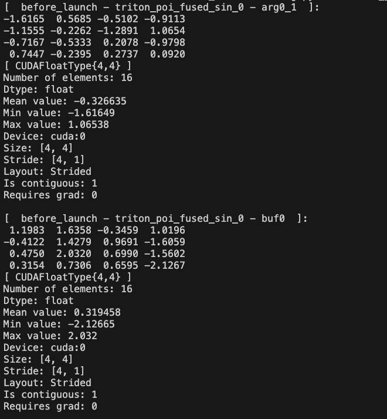
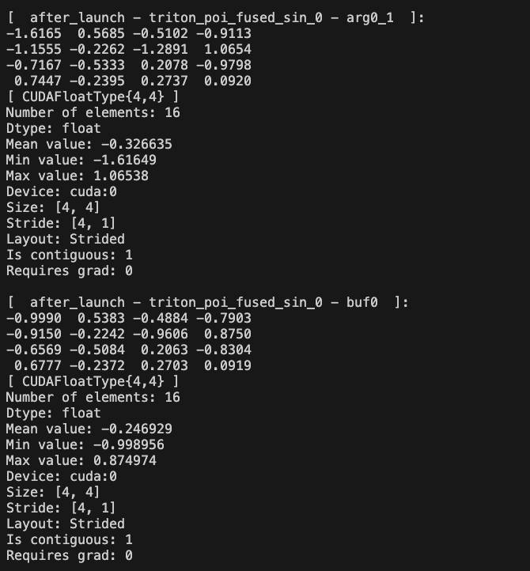

```{eval-rst}
:orphan:
```

# AOTInductor Intermediate Value Debug Printer

This is a user manual on how to use AOT Inductor Intermediate Value Debug Printer tool which is a utility tool that can help pinpoint CUDA IMA kernels / numerical discrepancies when uses AOT Inductor to compile a PyTorch model.

The main functionality of this tool is to automatically print out / or dump the value info of all intermediate tensor arguments before and after each kernel launch call in AOT Inductor.

## How to use

The debug printer can be configured via environment variable. The following flags are both supported to run with internal fbcode buck commands and OSS.

All configurations are defined here: [torch/_inductor/config.py](https://github.com/pytorch/pytorch/blob/768361e67f0eb36491d7b763ef38d7c928ebefe6/torch/_inductor/config.py#L1493-L1505)


```
    # options for debug printing/saving for intermediate tensor values for aot inductor

    0: disable debug dumping
    1: enable saving intermediate tensor values
    2: enable printing intermediate tensor values
    3: enable printing kernel names only (useful for pinpointing troublesome kernels)
```


1. To enable **default** mode debug printing:

    - Add flag `AOT_INDUCTOR_DEBUG_INTERMEDIATE_VALUE_PRINTER=2` (PRINT_ONLY mode) for default printing all supported kernel tensor arg values.

    - Add flag `AOT_INDUCTOR_FILTERED_KERNELS_TO_PRINT={kernel_name_1, kernel_name_2,...}` for selectively printing tensor values associated with the specified kernels. (suggest to do a run with generating full printing logs first)

    Sample command:

    ```
    AOT_INDUCTOR_FILTERED_KERNELS_TO_PRINT="aoti_torch_cuda_addmm_out" AOT_INDUCTOR_DEBUG_INTERMEDIATE_VALUE_PRINTER=2 TORCH_LOGS="+inductor, output_code" python test/inductor/test_aot_inductor.py -k test_addmm_cuda
    ```


2. To enable **pinpoint** the problematic kernel name only: (Especially useful in CUDA IMA debugging)

   - Add flag `AOT_INDUCTOR_DEBUG_INTERMEDIATE_VALUE_PRINTER=3` (PRINT_KERNEL_NAME_ONLY mode) no tensor numerical values will be dumped.

   Sample command:

   ```
   AOT_INDUCTOR_DEBUG_INTERMEDIATE_VALUE_PRINTER=3 TORCH_LOGS="+inductor, output_code" python test/inductor/test_aot_inductor.py -k test_addmm_cuda
   ```

3. To enable **save** the intermediate tensor values:

    - Useful when you want to repro the error in a standalone kernel debugging repro. The saved intermediate tensor values can be used as debugging inputs to the problematic kernel.
    - Set `AOT_INDUCTOR_DEBUG_INTERMEDIATE_VALUE_PRINTER=1` (SAVE_ONLY mode)  for default saving all supported kernel tensor arg values to `.pt` in a tmp folder.
    - Similarly, add `AOT_INDUCTOR_FILTERED_KERNELS_TO_PRINT={kernel_name_1, kernel_name_2,...}` for selectively saving tensor values associated with the specified kernels.

    Sample command:
    ```
    AOT_INDUCTOR_FILTERED_KERNELS_TO_PRINT="triton_poi_fused_0" AOT_INDUCTOR_DEBUG_INTERMEDIATE_VALUE_PRINTER=1 TORCH_LOGS="+inductor, output_code" python test/inductor/test_aot_inductor.py -k test_addmm_cuda
    ```

    The saved tensor values will be dumped in a format:  `<before/after_launch>_<kernel_name>_<arg_name>_<device>.pt`

    The dumped `.pt` tensors can be further loaded and used like this:
    ```
        def _load_tensor(path):
            return torch.load(path, weights_only=True)
        tensor = _load_tensor("../tmp/aoti_torch/before_launch_aoti_torch_cuda_addmm_out_buf1_cuda:0.pt")

        # Simply print tensor to view the full value
        print(tensor)
    ```

## Example Outputs

Before launch tensor stats:




After launch tensor stats:


