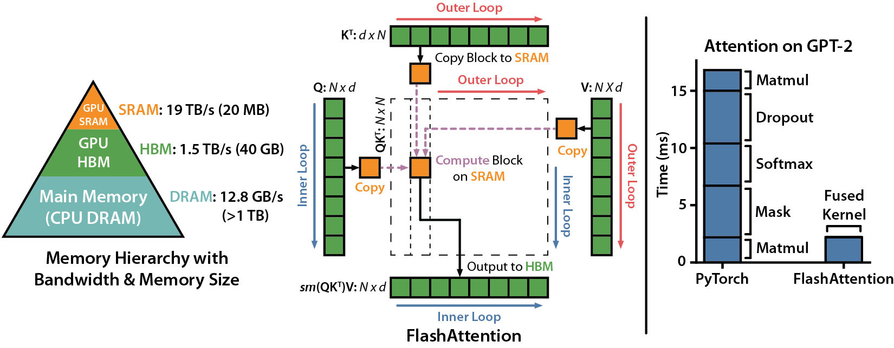
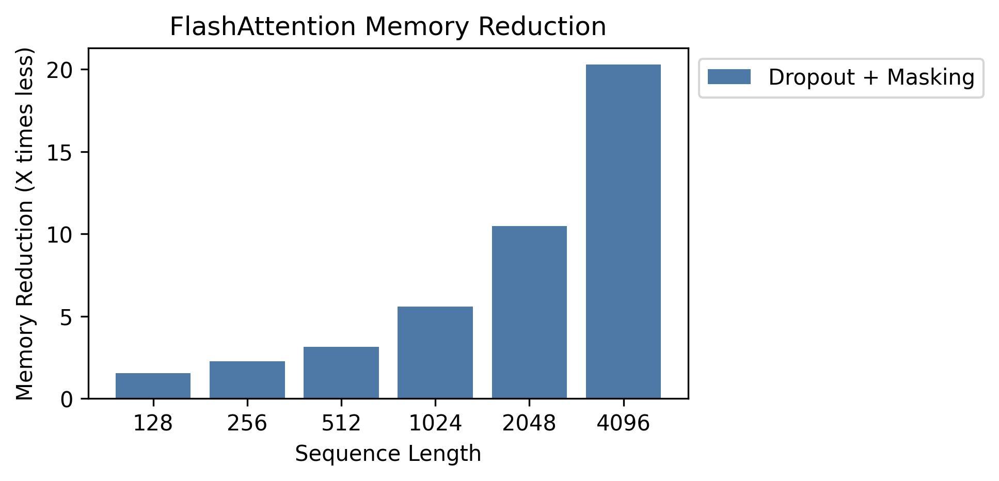
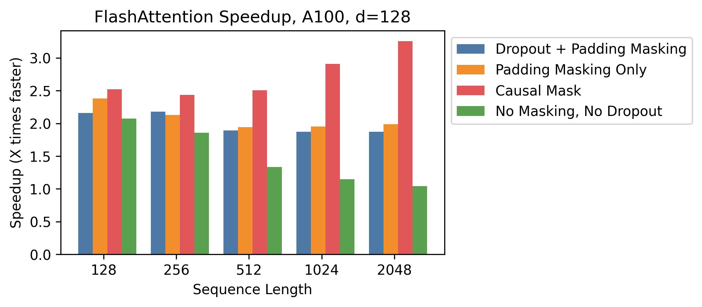
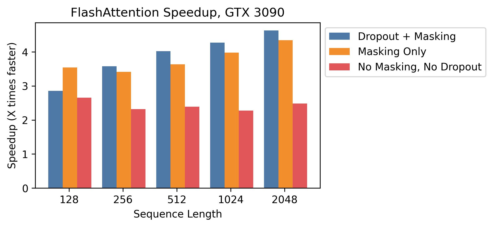
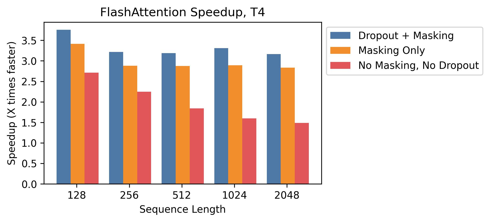
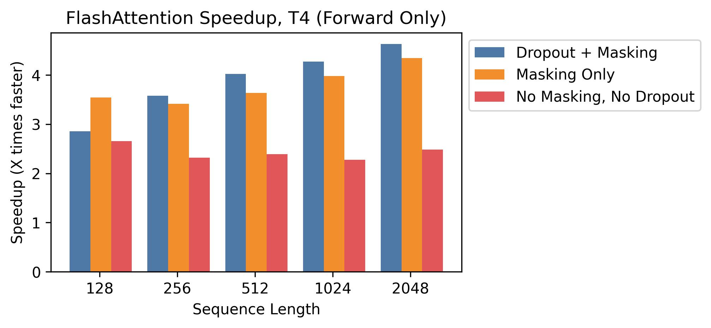

# FlashAttention
This repository provides the official implementation of FlashAttention from the
following paper.

**FlashAttention: Fast and Memory-Efficient Exact Attention with IO-Awareness**  
Tri Dao, Daniel Y. Fu, Stefano Ermon, Atri Rudra, Christopher Ré  
Paper: https://arxiv.org/abs/2205.14135  
IEEE Spectrum [article](https://spectrum.ieee.org/mlperf-rankings-2022) about our submission to the MLPerf 2.0 benchmark using FlashAttention.


#### Triton implementation of FlashAttention

Phil Tillet (OpenAI) has an experimental implementation of FlashAttention in Triton:
https://github.com/openai/triton/blob/master/python/tutorials/06-fused-attention.py  

As Triton is a higher-level language than CUDA, it might be easier to understand
and experiment with. The notations in the Triton implementation are also closer
to what's used in our paper.

## Cutlass Rewrite

This branch contains the rewrite of FlashAttention forward pass to use Cutlass.
This simplifies the code and supports more head dimensions. We support head
dimensions that are multiples of 8 up to 128 (previously we supported head
dimensions 16, 32, 64, 128).

## Alpha release (0.1).

To compile (requiring CUDA 11, NVCC, and an Turing or Ampere GPU):
```
python setup.py install
```

Interface: `src/flash_attention.py`

To run the benchmark against PyTorch standard attention: 
```
PYTHONPATH=$PWD python benchmarks/benchmark_flash_attention.py
```

FlashAttention currently supports:
1. Turing or Ampere GPUs (e.g., A100, RTX 3090, T4, RTX 2080).
2. fp16 and bf16 (bf16 requires Ampere GPUs).
3. Head dimensions 16, 32, 64, 128 (head dim 128 backward requires A100).

Our tentative roadmap:
1. [Jun 2022] Make package pip-installable.
2. ~~[Jun 2022] Support SM86 GPUs (e.g., RTX 3080, 3090)~~[Done].
3. ~~[Jun 2022] Refactor forward pass to use Cutlass~~[Done].
4. ~~[Jun 2022] Support SM75 GPUs (e.g. T4)~~[Done].
5. ~~[Jun 2022] Support bf16~~[Done].
6. ~~[Jul 2022] Implement cross-attention~~[Done].
7. ~~[Jul 2022] Support head dimension 128~~[Done].
8. [Oct 2022] Rewrite backward pass to use Cutlass.
9. [Oct 2022] Support SM70 GPUs (V100).
10. [Oct 2022] Fuse rotary embedding.
11. [Nov 2022] Support attention bias (e.g. ALiBi, relative positional encoding).

## Speedup and Memory Savings

We present expected speedup (combined forward + backward pass) and memory savings from using FlashAttention against PyTorch standard attention, depending on sequence length, on different GPUs (speedup depends on memory bandwidth - we see more speedup on slower GPU memory).

We currently have benchmarks for these GPUs:
* [A100](#a100)
* [RTX 3090](#rtx-3090)
* [T4](#t4)

### A100

We display FlashAttention speedup using these parameters (similar to BERT-base):
* Batch size 8
* Head dimension 64
* 12 attention heads

Our graphs show sequence lengths between 128 and 4096 (when standard attention runs out of memory on an A100), but FlashAttention can scale up to sequence length 64K.

#### Speedup


We generally see 2-4X speedup at sequence lengths between 128 and 4K, and we see more speedup when using dropout and masking, since we fuse the kernels.
At sequence lengths that are popular with language models like 512 and 1K, we see speedups up to 4X when using dropout and masking.

#### Memory



We show memory savings in this graph (note that memory footprint is the same no matter if you use dropout or masking).
Memory savings are proportional to sequence length -- since standard attention has memory quadratic in sequence length, whereas FlashAttention has memory linear in sequence length.
We see 10X memory savings at sequence length 2K, and 20X at 4K.
As a result, FlashAttention can scale to much longer sequence lengths.

#### Head Dimension 128



We show speedup with head dimension 128.
Here we show batch size 16 with 12 heads.
Speedup is less than with the smaller head sizes, since we have to make the block size smaller in the tiling.
But speedup is still significant, especially with a causal mask.

### RTX 3090

For the RTX 3090, we use batch size 12 with 12 attention heads.
Memory savings are the same as on an A100, so we'll only show speedup here.



We see slightly higher speedups (between 2.5-4.5x) on the GTX 3090, since memory bandwidth on the GDDR6X is lower than A100 HBM (~900 GB/s vs. ~1.5 TB/s).

### T4

We again use batch size 12 with 12 attention heads.



T4 SRAM is smaller than the newer GPUs (64 KB), so we see less speedup (we need to make the block sizes smaller, so we end up doing more R/W).
This matches the IO complexity analysis from section 3.2 of [our paper](https://arxiv.org/abs/2205.14135).

T4 GPUs are commonly used for inference, so we also measure speedup on the forward pass only (note that these are not directly comparable to the graphs above):



We see speedups between 2.5x-4.5x on the forward pass.

## Tests
We test that FlashAttention produces the same output and gradient as a reference
implementation, up to some numerical tolerance. In particular, we check that the
maximum numerical error of FlashAttention is at most twice the numerical error
of a baseline implementation in Pytorch (for different head dimensions, input
dtype, sequence length, causal / non-causal).

To run the tests:
```
pytest -q -s tests/test_flash_attn.py
```
## When you encounter issues

This alpha release of FlashAttention contains code written for a research
project to validate ideas on speeding up attention. 
We have tested it on several models (BERT, GPT2, ViT). 
However, there might still be bugs in the implementation that we hope to iron
out in the next few months.

If you encounter any of these bugs, please open a respective GitHub Issue!

## Acknowledgments
Our implementation uses Apex's
[FMHA](https://github.com/NVIDIA/apex/tree/master/apex/contrib/csrc/fmha) code
as a starting point.

We thank [Young-Jun Ko](https://yjk21.github.io/) for the in-depth explanation of his FMHA implementation
and for his thoughtful answers to our questions about CUDA.

## Citation
If you use this codebase, or otherwise found our work valuable, please cite:
```
@article{dao2022flashattention,
  title={FlashAttention: Fast and Memory-Efficient Exact Attention with IO-Awareness},
  author={Dao, Tri and Fu, Daniel Y. and Ermon, Stefano and Rudra, Atri and R{\'e}, Christopher},
  journal={arXiv preprint arXiv:2205.14135},
  year={2022}
}
```
