# Auto PR Triage

Auto PR Triage processes pull requests admitted by the `open source` label. Intake
decides whether a pull request takes no action, is marked as missing an
actionable issue, or is routed to reviewers; ownership analysis combines deterministic codepath rules with
LLM-suggested semantic owners; planning turns both into one plan, which live
mode applies. The code and its docstrings describe how each stage works. This
file keeps only what the code cannot show: goals, accepted tradeoffs, the
reasons behind some rules, and operating notes.

The editable source is [`overview.mmd`](overview.mmd).

## Goals and non-goals

The design aims to:

- apply a deterministic intake policy;
- preserve codepath ownership as the review baseline while adding semantic
  ownership;
- select configured reviewers while reusing review coverage that already
  exists;
- produce an exact, inspectable plan in the read-only job, whether or not live
  mode applies it; and
- run the same code in different repositories using their checked-in
  configuration.

It does not aim to:

- judge whether a pull request is correct, useful, or ready to merge;
- eliminate human triage when ownership is missing or uncertain;
- provide a transactional view of GitHub state or automatically reconcile every
  change that occurs after analysis;
- guarantee perfect semantic assignments or a perfectly even reviewer load; or
- create required labels or ownership configuration automatically.

## Design principles

- **Separate intake from ownership.** Repository policy determines whether a
  pull request proceeds to routing; ownership analysis determines who should
  review it.
- **Keep ownership additive.** Semantic ownership supplements rather than
  replaces codepath ownership.
- **Plan once, then apply.** Analyze reads pull-request, ownership, and reviewer
  state once and plans the exact effects; apply only executes a validated plan.
- **Leave uncertainty for people.** Missing information cannot mark a PR as
  missing an actionable issue, and incomplete routing is reported for human
  follow-up.
- **Keep writes out of shadow.** Shadow and live compute the same plan; shadow
  never runs a job that can write to GitHub.

## Accepted stale-result risk

Auto PR Triage intentionally does not close races by re-reading mutable GitHub
state. Intake, ownership analysis, and planning each read once, and apply
executes the plan without further reads, so separate calls can observe
different moments and later changes are ignored for that run.

This is a deliberate complexity and availability tradeoff, not a missing
security check. A run can make a stale but bounded mutation: request a
configured reviewer, or add one of the bot's own labels, such as marking a PR
as missing an actionable issue after it gained one. These effects are accepted
because maintainers can remove review requests and labels or rerun the
workflow, and the labels and artifacts make every action visible. Security
review should judge whether the mutation set stays bounded rather than expect
transactional consistency across jobs. Do not "fix" the staleness by adding
uncoordinated race-closing reads to apply.

## Security model

- `pull_request_target` runs only workflow and action code from the trusted
  base commit, and the PR head is fetched as data, never checked out or run.
- The LLM has no GitHub token and no file, shell, web, MCP, plugin, or subagent
  capability; its Bedrock session can only invoke the model.
- The write-capable job runs only in live mode and receives only the bounded
  `ActionPlan`. Rationale and diff evidence stay in the analyze job as log
  provenance and never choose reviewers, labels, or effects.
- User-controlled text never becomes a shell argument, label, or comment.
  Issue numbers and logins parsed from the PR body reach read-only API paths
  and the supporter request only after pattern validation.
- New reviewer requests come from trusted configuration, a verified supporter
  claim, or the actor who applied `actionable` to an admitting issue; the last
  two must have current triage-or-higher access.
- LLM output can keep a PR from being marked as missing an actionable issue,
  through a bypass match, but can never cause the mark. A prompt injection in the PR text can at worst keep a PR open and route it to
  a team that configured `bypass_intake_criteria`, bounded to that team's
  roster. Bypass claims need the same verified diff evidence as any owner, and
  only teams that opt in are exposed.
- Structural checks cannot prove the LLM's judgment correct: an LLM error or
  injection can omit a legitimate additional owner or suggest an unnecessary
  configured one. Live effects stay bounded to configured reviewers and the
  bot's labels; no plan can close a PR or post a comment.

## Why some rules are the way they are

- **Linked issue timelines do not count as maintainer activity.** Maintainers
  label and comment on most issues during triage, so that activity would admit
  any PR that merely mentions a triaged issue. Only the PR's own timeline is
  read.
- **Deployments are passive timeline events.** GitHub attributes a deployment
  to whoever triggered the workflow run, including this workflow's own
  environment-gated job, so it says nothing about deliberate maintainer action.
- **Codepath and semantic owners are not handoff reviewers.** A path match can
  come from an incidental edit and says nothing about an uncovered concern. A
  team whose bypass intake matched does count, because it asked for these PRs.
- **The `open source` label is the authorization, not the ready event.** A
  ready-for-review event is normally sent by the PR author and is only a
  wake-up signal. Once a run is admitted, removing the label does not cancel it
  or make it a no-op.

## Codepath owners come from CODEOWNERS

GitHub requests codepath owners itself, through the repository's `CODEOWNERS`
file; Auto PR Triage never requests them. It parses the same file to tell the
LLM which changed files are already owned and, in planning, to skip a roster
pick for a team whose member is a codepath owner and to explain each codepath
owner. GitHub can legitimately fail to send a request: the file can be invalid
or over GitHub's size limit, an owner can no longer exist or lack repository
access, or GitHub's processing can be delayed. So the explanation reports what
the reviewer state showed for each codepath owner (a pending request, a review,
neither, or unreadable state), and "neither" flags a request that GitHub may
not have sent or that someone removed. Like GitHub, the parser skips
`CODEOWNERS` lines it cannot read, such as an email owner, and the ownership
input step logs each skipped line; a skipped line's owners get no provenance.

## Operating notes

- **Prerequisites.** The base branch needs the workflow and composite action,
  root `CODEOWNERS`, the two files in `.github/auto-pr-triage/`, and the
  `open source`, `actionable`, `triaged`, `bot-triaged`, `bot-triage-error`,
  and `missing actionable issue` labels. The workflow does not create labels.
- **Shadow mode leaves no outcome label,** so a later eligible event analyzes
  the PR again. Labels such as `bot-shadow-close` and `bot-shadow-triaged` from
  earlier shadow runs are not handled state.
- **Rerunning.** Later PR activity never triggers another run. To reevaluate a
  PR, remove its outcome labels (`triaged` and `bot-triaged`, with `missing
  actionable issue` if present, or `bot-triage-error`), then remove and re-add
  `open source`. Every `open source` label event starts a new run; while an
  outcome label is present, the run is a no-op. Rerunning all jobs of an
  earlier run also works, but rerunning only the apply job is rejected because
  its plan may be stale. A rerun never marks a PR as missing an actionable
  issue: only the first attempt of a run can, and a rerun leaves an unadmitted
  PR for a human.
- **Opting out.** A PR labeled `no automated triage` is left as is: a run that
  starts while the label is present is a no-op and the PR stays in the manual
  triage queue. Adding the label mid-run does not cancel that run. To triage
  the PR later, remove the label and follow the rerunning steps above.
- **Failures in shadow mode** are visible only as a failed workflow run and its
  artifacts. In live mode the error-reporting job adds `bot-triage-error` on a
  best-effort basis.
