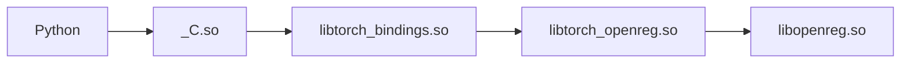

# PyTorch OpenReg

## Background

The third-party device integration mechanism based on PrivateUse1 has become the official mainstream method for new backends to integrate with PyTorch. Ensuring the availability of this mechanism is crucial for enriching PyTorch's hardware ecosystem.

**Note:**

The goal of `torch_openreg` is **not to implement a fully functional, high-performance PyTorch backend**, but to serve as a **minimalist reference implementation for mechanism verification**.

### Purpose

- **Test Backend**: To serve as an in-tree test backend for PrivateUse1, ensuring quality stability through CI/CD.
- **Integration Example**: To serve as a reference example for new backend integration.
- **Integration Documentation**: To provide module-level integration documentation that corresponds with the code.

### Design Principles

- **Minimality Principle**: The fundamental goal is to enable/verify all integration paths/mechanisms for a new backend to integrate to PyTorch. All functions follow a "just right" strategy to ensure the correctness of relevant integration capabilities.
- **Authenticity Principle**: To complete the OpenReg integration in the same way a real accelerator backend would integrate with PyTorch.

## Directory Structure

```shell
torch_openreg/
├── CMakeLists.txt
├── csrc
│   ├── amp
│   │   └── autocast_mode.cpp
│   ├── aten
│   │   ├── native
│   │   │   ├── Extra.cpp
│   │   │   ├── Minimal.cpp
│   │   │   └── ...
│   │   ├── OpenRegExtra.cpp
│   │   └── OpenRegMinimal.cpp
│   ├── CMakeLists.txt
│   └── runtime
│       ├── OpenRegDeviceAllocator.cpp
│       ├── OpenRegDeviceAllocator.h
│       ├── OpenRegFunctions.cpp
│       ├── OpenRegFunctions.h
│       ├── OpenRegGenerator.cpp
│       ├── OpenRegGenerator.h
│       ├── OpenRegGuard.cpp
│       ├── OpenRegGuard.h
│       ├── OpenRegHooks.cpp
│       ├── OpenRegHooks.h
│       ├── OpenRegHostAllocator.cpp
│       ├── OpenRegHostAllocator.h
│       └── ...
├── pyproject.toml
├── README.md
├── setup.py
├── third_party
│   └── openreg
└── torch_openreg
    ├── csrc
    │   ├── CMakeLists.txt
    │   ├── Module.cpp
    │   └── stub.c
    ├── __init__.py
    └── openreg
        ├── amp
        │   └── __init__.py
        ├── __init__.py
        ├── meta.py
        └── random.py
```

**Dependencies**:



There are 4 DSOs in torch_openreg, and the dependencies between them are as follows:

- `_C.so`:
  - **sources**: torch_openreg/csrc/stub.c
  - **description**: Python C module entry point.
- `libtorch_bindings.so`: The bridging code between Python and C++ should go here.
  - **sources**: torch_openreg/csrc
  - **description**: A thin glue layer between Python and C++.
- `libtorch_openreg.so`: All core implementations should go here.
  - **sources**: csrc
  - **description**: All core functionality, such as device runtime, operators, etc.
- `libopenreg.so`: A DSO that uses the CPU to emulate a CUDA-like device, you can ignore it.
  - **sources**: third_party/openreg
  - **description**: Provides low-level device functionality similar to libcudart.so.

**Key Directories**:

- `csrc/`: Core device implementation, including operator registration, runtime, etc.
  - `csrc/amp/`: AMP(Automatic Mixed Precision)
  - `csrc/aten/`: Operator registration
    - `csrc/aten/native/`: Specific operator implementations for the OpenReg device.
      - `csrc/aten/native/OpenRegMinimal.cpp`: The most minimal set of operator implementations (allowing for the creation of Tensors and related operations upon completion).
      - `csrc/aten/native/OpenRegExtra.cpp`: Implementations for other types of operators.
  - `csrc/runtime/`: Implementations for Host memory, device memory, Guard, Hooks, etc.
- `third_party/`: A C++ library that simulates a CUDA-like device using the CPU.
- `torch_openreg/`: Python interface implementation (Python code and C++ Bindings).
  - `torch_openreg/csrc/`: Python C++ binding code.
  - `torch_openreg/openreg/`: Python API.

## Currently Implemented Features

### Operator Registration

- Operator Implementation

  - Register for builtin PyTorch Operators
    - `TORCH_LIBRARY_IMPL` form: See `empty.memory_format
    - `STUB` form: See `abs_stub`
  - Register for custom operators
    - Schema Registration: See `custom_abs`
    - Kernel Registration: See `custom_abs`
    - Fallback Registration for `AutogradPriavateUse1`: See `custom_abs`
    - Meta Registration: See `custom_abs`
    - `torch.autograd.Function`: See `custom_autograd_fn_aliasing`
  - Register for fallback
    - Per-operator Fallback: See `sub.Tensor`
    - Global Fallback: See `wrapper_cpu_fallback`

### Autoload

When `import torch`, installed accelerators (such as `torch_openreg`) will be automatically loaded, achieving the same experience as the built-in backends.

- Register the backend with Python `entry points`: See `setup` in `setup.py`
- Add a callable function for backend initialization: See `_autoload` in `torch_openreg/__init__.py`
- Dynamically loading the backend without explicit imports: See [Usage Example](#usage-example)

### AMP(Automatic Mixed Precision)

`AMP` provides convenience methods for mixed precision, where some operations use the `torch.float32` datatype and other operations use `lower precision` floating point datatype: `torch.float16` or `torch.bfloat16`.

- Register specific operator conversion rules: See `autocat_mode.cpp` in `csrc/amp`.
- Add support for new data types for different accelerators: See `get_amp_supported_dtype` in `torch_openreg/openreg/amp/__init__.py`

## Installation and Usage

### Installation

```python
python -m pip install --no-build-isolation -e . # for develop
python -m pip install --no-build-isolation . # for install
```

### Usage Example

After installation, you can use the `openreg` device in Python just like any other regular device.

```python
import torch

if not torch.openreg.is_available():
    print("OpenReg backend is not available in this build.")
    exit()

print("OpenReg backend is available!")

device = torch.device("openreg")

x = torch.tensor([[1., 2.], [3., 4.]], device=device)
y = x + 2
print("Result y:\n", y)
print(f"Device of y: {y.device}")

z = y.cpu()
print("Result z:\n", z)
print(f"Device of z: {z.device}")
```

## Documentation

Please refer to [this](https://docs.pytorch.org/docs/main/accelerator/index.html) for a series of documents on integrating new accelerators into PyTorch, which will be kept in sync with the `OpenReg` codebase as well.

## Future Plans

- **Enhance Features**:
  - Device-agnostic APIs
  - Memory Management
  - Generator
  - Distributed
  - Custom Tensor&Storage
  - ...
- **Improve Tests**: Add more test cases related to the integration mechanism.
