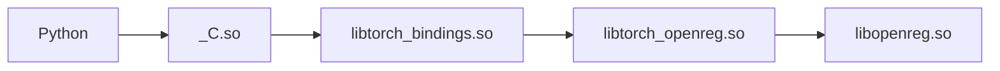

# PyTorch OpenReg

## Background

The third-party device integration mechanism based on PrivateUse1 has become the official mainstream method for new backends to integrate with PyTorch. Ensuring the availability of this mechanism is crucial for enriching PyTorch's hardware ecosystem.

**Note:**

The goal of `OpenReg` codebase is **not to implement a fully functional, high-performance PyTorch backend**, but to serve as a **minimalist reference implementation for mechanism verification**.

### Purpose

- **Interface Guardian**: An in-tree testing carrier that guards all basic interfaces for new device access and blocks breaking changes through CI/CD.
- **STUB Implementation Reference**: Provides STUB registration examples demonstrating how each PyTorch module integration point works in practice.
- **Documentation**: Provides module-level integration documentation for hardware vendors, explaining the design and usage of the STUB sample code.

### Design Principles

- **Minimality Principle**: The fundamental goal is to enable/verify all integration paths/mechanisms for a new backend to integrate to PyTorch. All functions follow a "just right" strategy to ensure the correctness of relevant integration capabilities.
- **Authenticity Principle**: To complete the `OpenReg` integration in the same way a real accelerator backend would integrate with PyTorch.
- **Integration-over-Simulation Principle**: OpenReg focuses on demonstrating *how* a vendor backend integrates into each PyTorch module, **not** on simulating the underlying device capabilities themselves. Implementations should be STUB-level — exposing the correct APIs and returning the expected structures, rather than providing fully functional behavior.

## Directory Structure

```shell
torch_openreg/
├── CMakeLists.txt
├── csrc
│   ├── amp
│   │   └── autocast_mode.cpp
│   ├── aten
│   │   ├── native
│   │   │   ├── Extra.cpp
│   │   │   ├── Minimal.cpp
│   │   │   └── ...
│   │   ├── OpenRegExtra.cpp
│   │   └── OpenRegMinimal.cpp
│   ├── CMakeLists.txt
│   ├── distributed
│   │   └── c10d
│   │       ├── ProcessGroupOCCL.cpp
│   │       └── ProcessGroupOCCL.hpp
│   ├── profiler
│   │   └── stubs
│   │       └── openreg.cpp
│   └── runtime
│       ├── OpenRegDeviceAllocator.cpp
│       ├── OpenRegDeviceAllocator.h
│       ├── OpenRegEvent.h
│       ├── OpenRegException.cpp
│       ├── OpenRegException.h
│       ├── OpenRegFunctions.cpp
│       ├── OpenRegFunctions.h
│       ├── OpenRegGenerator.cpp
│       ├── OpenRegGenerator.h
│       ├── OpenRegGuard.cpp
│       ├── OpenRegGuard.h
│       ├── OpenRegHooks.cpp
│       ├── OpenRegHooks.h
│       ├── OpenRegHostAllocator.cpp
│       ├── OpenRegHostAllocator.h
│       ├── OpenRegSerialization.cpp
│       ├── OpenRegSerialization.h
│       ├── OpenRegStream.cpp
│       ├── OpenRegStream.h
│       └── ...
├── pyproject.toml
├── README.md
├── setup.py
├── tests
├── third_party
│   └── openreg
└── torch_openreg
    ├── _utils.py
    ├── compiler.py
    ├── csrc
    │   ├── CMakeLists.txt
    │   ├── distributed
    │   │   ├── init.cpp
    │   │   └── init.hpp
    │   ├── Module.cpp
    │   └── stub.c
    ├── __init__.py
    └── openreg
        ├── amp
        │   └── __init__.py
        ├── __init__.py
        ├── meta.py
        └── random.py
```

**Dependencies**:


```mermaid
graph LR
    A[Python]
    B[_C.so]
    C[libtorch_bindings.so]
    D[libtorch_openreg.so]
    E[libopenreg.so]

    A --> B --> C --> D --> E
```

There are 4 DSOs in torch_openreg, and the dependencies between them are as follows:

- `_C.so`:
  - **sources**: torch_openreg/csrc/stub.c
  - **description**: Python C module entry point.
- `libtorch_bindings.so`: The bridging code between Python and C++ should go here.
  - **sources**: torch_openreg/csrc
  - **description**: A thin glue layer between Python and C++.
- `libtorch_openreg.so`: All core implementations should go here.
  - **sources**: csrc
  - **description**: All core functionality, such as device runtime, operators, etc.
- `libopenreg.so`: A DSO that uses the CPU to emulate a CUDA-like device, you can ignore it.
  - **sources**: third_party/openreg
  - **description**: Provides low-level device functionality similar to libcudart.so.

**Key Directories**:

- `csrc/`: Core device implementation, including operator registration, runtime, etc.
  - `csrc/amp/`: AMP(Automatic Mixed Precision)
  - `csrc/aten/`: Operator registration
    - `csrc/aten/native/`: Specific operator implementations for the `openreg` device.
      - `csrc/aten/native/Minimal.cpp`: The most minimal set of operator implementations (allowing for the creation of Tensors and related operations upon completion).
      - `csrc/aten/native/Extra.cpp`: Implementations for other types of operators.
  - `csrc/distributed/`: Distributed communication backend (ProcessGroupOCCL).
  - `csrc/profiler/`: Profiler integration stubs for device-side profiling.
  - `csrc/runtime/`: Implementations for Host memory, device memory, Guard, Hooks, Streams, Events, Serialization, etc.
- `tests/`: Test cases covering device, ops, streams, events, distributed, profiler, compile, and more.
- `third_party/`: A C++ library that simulates a CUDA-like device using the CPU.
- `torch_openreg/`: Python interface implementation (Python code and C++ Bindings).
  - `torch_openreg/compiler.py`: torch.compile backend and DeviceInterface registration.
  - `torch_openreg/csrc/`: Python C++ binding code.
  - `torch_openreg/openreg/`: Python API.

## Currently Implemented Features

### Operator Registration

- Operator Implementation

  - Register for builtin PyTorch Operators
    - `TORCH_LIBRARY_IMPL` form: See `empty.memory_format`
    - `STUB` form: See `abs_stub`
  - Register for custom operators
    - Schema Registration: See `custom_abs`
    - Kernel Registration: See `custom_abs`
    - Fallback Registration for `AutogradPrivateUse1`: See `custom_abs`
    - Meta Registration: See `custom_abs`
    - `torch.autograd.Function`: See `custom_autograd_fn_aliasing`
  - Register for fallback
    - Per-operator Fallback: See `sub.Tensor`
    - Global Fallback: See `wrapper_cpu_fallback`

### Autoload

When `import torch`, installed accelerators (such as `openreg`) will be automatically loaded, achieving the same experience as the built-in backends.

- Register the backend with Python `entry points`: See `setup` in `setup.py`
- Add a callable function for backend initialization: See `_autoload` in `torch_openreg/__init__.py`
- Dynamically loading the backend without explicit imports: See [Usage Example](#usage-example)

### AMP(Automatic Mixed Precision)

`AMP` provides convenience methods for mixed precision, where some operations use the `torch.float32` datatype and other operations use `lower precision` floating point datatype: `torch.float16` or `torch.bfloat16`.

- Register specific operator conversion rules: See `autocast_mode.cpp` in `csrc/amp`.
- Add support for new data types for different accelerators: See `get_amp_supported_dtype` in `torch_openreg/openreg/amp/__init__.py`

### Streams and Events

Stream and Event management for asynchronous execution on the device.

- Stream pool management with priority support: See `OpenRegStream` in `csrc/runtime/OpenRegStream.cpp`
- Event creation, recording, synchronization, and elapsed time measurement: See `OpenRegEvent.h` in `csrc/runtime/`

### Distributed

Distributed communication backend based on ProcessGroup, enabling multi-process collective operations.

- Custom ProcessGroup implementation (OCCL): See `ProcessGroupOCCL.cpp` in `csrc/distributed/c10d/`
- Backend registration with `torch.distributed`: See `__init__.py` in `torch_openreg/`

### Profiler

Integration with PyTorch's profiler infrastructure for device-side performance profiling.

- ProfilerStubs implementation for event recording and elapsed time measurement: See `openreg.cpp` in `csrc/profiler/stubs/`

### torch.compile

Support for `torch.compile` with a custom backend and DeviceInterface.

- Custom compiler backend registration: See `compiler.py` in `torch_openreg/`
- DeviceInterface implementation for device management: See `OpenRegInterface` in `torch_openreg/compiler.py`

### Serialization

Custom serialization support for saving and loading tensors on the device.

- Device tensor serialization and deserialization: See `OpenRegSerialization.cpp` in `csrc/runtime/`

## Installation and Usage

### Installation

```python
python -m pip install --no-build-isolation -e . # for develop
python -m pip install --no-build-isolation . # for install
```

### Usage Example

After installation, you can use the `openreg` device in Python just like any other regular device.

```python
import torch

if not torch.openreg.is_available():
    print("OpenReg backend is not available in this build.")
    exit()

print("OpenReg backend is available!")

device = torch.device("openreg")

x = torch.tensor([[1., 2.], [3., 4.]], device=device)
y = x + 2
print("Result y:\n", y)
print(f"Device of y: {y.device}")

z = y.cpu()
print("Result z:\n", z)
print(f"Device of z: {z.device}")
```

## Documentation

Please refer to [this](https://docs.pytorch.org/docs/main/accelerator/index.html) for a series of documents on integrating new accelerators into PyTorch, which will be kept in sync with the `OpenReg` codebase as well.
