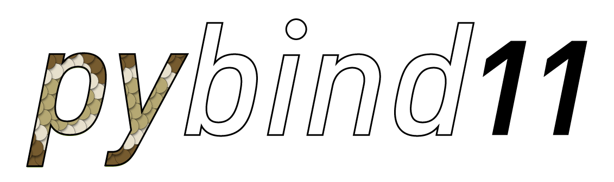

About this project
==================
**pybind11** is a lightweight header-only library that exposes C++ types in Python
and vice versa, mainly to create Python bindings of existing C++ code. Its
goals and syntax are similar to the excellent `Boost.Python`_ library by David
Abrahams: to minimize boilerplate code in traditional extension modules by
inferring type information using compile-time introspection.

.. _Boost.Python: http://www.boost.org/doc/libs/release/libs/python/doc/index.html

The main issue with Boost.Python—and the reason for creating such a similar
project—is Boost. Boost is an enormously large and complex suite of utility
libraries that works with almost every C++ compiler in existence. This
compatibility has its cost: arcane template tricks and workarounds are
necessary to support the oldest and buggiest of compiler specimens. Now that
C++11-compatible compilers are widely available, this heavy machinery has
become an excessively large and unnecessary dependency.
Think of this library as a tiny self-contained version of Boost.Python with
everything stripped away that isn't relevant for binding generation. Without
comments, the core header files only require ~4K lines of code and depend on
Python (2.7 or 3.x, or PyPy2.7 >= 5.7) and the C++ standard library. This
compact implementation was possible thanks to some of the new C++11 language
features (specifically: tuples, lambda functions and variadic templates). Since
its creation, this library has grown beyond Boost.Python in many ways, leading
to dramatically simpler binding code in many common situations.

Core features
*************
The following core C++ features can be mapped to Python

- Functions accepting and returning custom data structures per value, reference, or pointer
- Instance methods and static methods
- Overloaded functions
- Instance attributes and static attributes
- Arbitrary exception types
- Enumerations
- Callbacks
- Iterators and ranges
- Custom operators
- Single and multiple inheritance
- STL data structures
- Smart pointers with reference counting like ``std::shared_ptr``
- Internal references with correct reference counting
- C++ classes with virtual (and pure virtual) methods can be extended in Python

Goodies
*******
In addition to the core functionality, pybind11 provides some extra goodies:

- Python 2.7, 3.x, and PyPy (PyPy2.7 >= 5.7) are supported with an
  implementation-agnostic interface.

- It is possible to bind C++11 lambda functions with captured variables. The
  lambda capture data is stored inside the resulting Python function object.

- pybind11 uses C++11 move constructors and move assignment operators whenever
  possible to efficiently transfer custom data types.

- It's easy to expose the internal storage of custom data types through
  Pythons' buffer protocols. This is handy e.g. for fast conversion between
  C++ matrix classes like Eigen and NumPy without expensive copy operations.

- pybind11 can automatically vectorize functions so that they are transparently
  applied to all entries of one or more NumPy array arguments.

- Python's slice-based access and assignment operations can be supported with
  just a few lines of code.

- Everything is contained in just a few header files; there is no need to link
  against any additional libraries.

- Binaries are generally smaller by a factor of at least 2 compared to
  equivalent bindings generated by Boost.Python. A recent pybind11 conversion
  of `PyRosetta`_, an enormous Boost.Python binding project, reported a binary
  size reduction of **5.4x** and compile time reduction by **5.8x**.

- Function signatures are precomputed at compile time (using ``constexpr``),
  leading to smaller binaries.

- With little extra effort, C++ types can be pickled and unpickled similar to
  regular Python objects.

.. _PyRosetta: http://graylab.jhu.edu/RosettaCon2016/PyRosetta-4.pdf

Supported compilers
*******************

1. Clang/LLVM (any non-ancient version with C++11 support)
2. GCC 4.8 or newer
3. Microsoft Visual Studio 2015 or newer
4. Intel C++ compiler v17 or newer (v16 with pybind11 v2.0 and v15 with pybind11 v2.0 and a `workaround <https://github.com/pybind/pybind11/issues/276>`_ )
