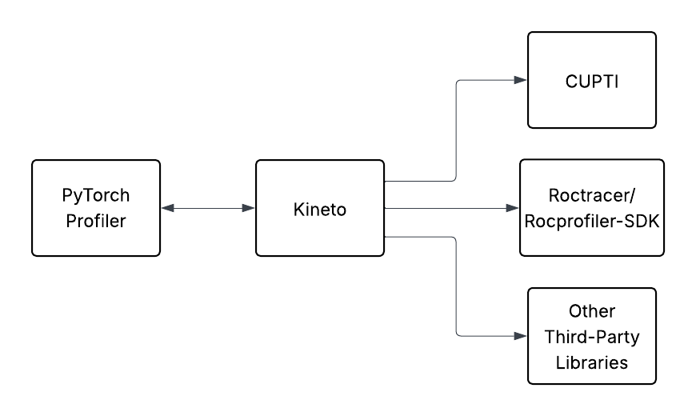

# Libkineto

Libkineto is an in-process profiling library, part of the Kineto performance
tools project.

The library provides a way to collect GPU traces and metrics from the host
process, either via the library public API or by sending a signal, if enabled. It also
provides subroutines to output traces into various formats, including a JSON which
can be used to visualize the traces in Perfetto/Chrome Trace Viewer.

Currently, tracing on NVIDIA and AMD GPUs are supported as well as XPU and HPU.

## Build Notes
Libkineto is built with PyTorch and linked statically into `libtorch_cpu`. It is
on by default; set `USE_KINETO=0` to turn it off.

The backend follows the PyTorch build: CUPTI for CUDA, rocprofiler-sdk for
ROCm, XPUPTI for XPU (when `XPU_ENABLE_KINETO` is set), and CPU-only otherwise.
Its dependencies (fmt, googletest, nlohmann_json) come from PyTorch's
`third_party`. See the Kineto section of `cmake/Dependencies.cmake` for details.

## How Libkineto works

### Hardware Abstraction

Libkineto is a C++ library designed to collect GPU traces and metrics. It serves as an abstraction layer between the application and the underlying GPU tracing libraries, providing a simple API for executing tracing and collecting metrics. Depending on the platform and build options, it can utilize different libraries to gather traces and metrics. For instance, on NVIDIA GPUs, it uses CUPTI to retrieve GPU telemetry, while on AMD GPUs, it employs AMD's Roctracer/Rocprofiler-sdk. The set of enabled activities during profiling can be observed in the `<Platform>ActivityApi.cpp` files. These activities are enabled upon the `prepare` call to effectively "warm up" and avoid profile distortion caused by module initialization when collection begins. In the context of the PyTorch Profiler and Kineto, `prepare` is equivalent to `warmup`, and `collect` is equivalent to `start`.

### On-Demand Profiling

Libkineto can be used to collect Kineto + PyTorch Profiler events on-demand, allowing users to decide when to start and stop profiling asynchronously based on a time duration. Users can also specify several other options, such as the output format, the activities to be collected, and the output file path, among others.

Unlike auto-trace, which is initiated via the profiler.py in the PyTorch Profiler, on-demand profiling is directly invoked through libkineto, which is part of the C++ backend. This signal is created via [Dynolog](https://github.com/facebookincubator/dynolog). Once Kineto receives the signal, it creates a session via the `ActivityProfilerController` instance and then initializes a finite state machine that steps through the following states: `WaitForRequest`, `Warmup`, `CollectTrace`, and `ProcessTrace`. This finite state machine is used for all subsequent profiling requests. The logic for `WaitForRequest` is defined in `ActivityProfilerController` whereas the other states are defined in  `CuptiActivityProfiler::performRunLoopStep`.

To collect PyTorch Profiler events (torch ops, Python stack, etc.), Kineto has an instance of the PyTorch Profiler in the form of a `ClientInterface` pointer. This pointer is passed to the `CuptiActivityProfiler`, which is then called in the finite state machine when collection is to begin. Once collection has ended, the Profiler sends its events to Kineto so that the total trace can be outputted to a JSON file. In this way, on-demand profiling has an inverted relationship between Kineto and the PyTorch Profiler. In auto-trace, the PyTorch Profiler is the entry point, and Kineto is invoked as a result of the `ProfilerStep` call. In on-demand profiling, Kineto is the entry point, and the PyTorch Profiler is invoked as a result of the `CuptiActivityProfiler` instance.

For more information on how to run on-demand profiling, please refer to the Dynolog tutorial [here](https://github.com/facebookincubator/dynolog/blob/main/docs/pytorch_profiler.md#running-the-pytorch-program).

### Trace Output

The default trace output is a JSON file that can be visualized in Chrome Trace Viewer or Perfetto. The trace output is generated by the `ChromeTraceLogger` instance. The `ChromeTraceLogger` writes to a JSON file using `std::ofstream` in `output_json.cpp` to maximize performance during export. This instance is created by the `ActivityProfilerController` and is stored in the `ActivityLoggerFactory` alongside its protocol. Using this schema, Kineto supports multiple trace output formats. There is a public API extension for registering a user defined Logger with a protocol via `libkineto::registerLoggerFactory`. When calling `ActivityTrace::save` with `protocol://file`, the Logger registered against the protocol will be used to save the events traced.

## License
Libkineto is BSD licensed, as detailed in the [LICENSE](../LICENSE) file.
