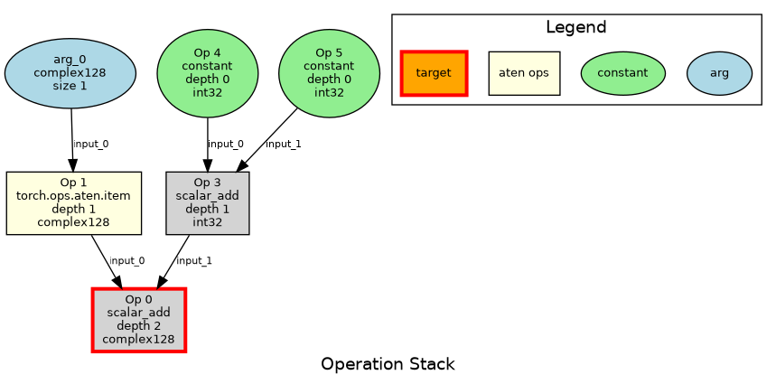

# TorchFuzz - Torch Compile e2e Fuzz Testing Tool

TorchFuzz is an experimental fuzzing framework for testing PyTorch operations. It generates
random operation graphs, converts them to executable Python code, and tests them with both eager
mode and different configurations of `torch.compile()`

## Overview

TorchFuzz works by:
1. **Generating random tensor/scalar specifications** with various shapes, strides, and dtypes
2. **Creating operation graphs** that produce the target specification, by recursively fuzzing operations with proper dependency tracking. Each operation node specifies its inputs and outputs, forming a Directed Acyclic Graph (DAG) of PyTorch operations.
3. **Converting operation graphs to executable Python code** using topological ordering to ensure dependencies are executed before dependents
4. **Testing both eager and compiled execution** The generated code includes multiple torch.compile configurations

### Example Walkthrough

Here's a concrete example of how TorchFuzz generates a test:

**Target Spec Generated:** `TensorSpec(size=(2, 3), stride=(3, 1), dtype=torch.float32)`

**Operation Graph Created:**
```
OperationGraph (root: node_0, target: TensorSpec(size=(2, 3), stride=(3, 1), dtype=torch.float32))
  node_2: arg_0 -> TensorSpec(size=(2, 3), stride=(3, 1), dtype=torch.float32) (depth 0)
  node_3: arg_1 -> TensorSpec(size=(2, 3), stride=(3, 1), dtype=torch.float32) (depth 0)
  node_0: torch.ops.aten.add -> TensorSpec(size=(2, 3), stride=(3, 1), dtype=torch.float32) (depth 2) <- ['node_2', 'node_3']
```

**Generated Python Code:**
```python
import torch
import sys
import os
# Add fuzzer directory to path so we can import tensor_fuzzer
fuzzer_dir = r'/home/lsakka/pytorch/tools/experimental/dynamic_shapes/torchfuzz'
if fuzzer_dir not in sys.path:
    sys.path.insert(0, fuzzer_dir)
from tensor_fuzzer import fuzz_scalar, fuzz_tensor_simple, ScalarSpec, TensorSpec

# Generated fuzzed program code (topological order from operation graph)
# Graph has 3 nodes

def fuzzed_program(arg_0, arg_1):
    # Node node_2: arg_0 (depth 0)
    var_node_2 = arg_0

    # Node node_3: arg_1 (depth 0)
    var_node_3 = arg_1

    # Node node_0: torch.ops.aten.add (depth 2)
    var_node_0 = torch.ops.aten.add(var_node_2, var_node_3)

    # Final result from root node
    return var_node_0

# Create arguments for the fuzzed program
arg_0 = fuzz_tensor_simple((2, 3), (3, 1), torch.float32, seed=10000)
arg_1 = fuzz_tensor_simple((2, 3), (3, 1), torch.float32, seed=10001)

# Execute the fuzzed program both normally and with torch.compile
# (execution code omitted for brevity)
```

## Graph Visualization


## Quick Start

### Single Test Run

```bash
cd tools/experimental/dynamic_shapes/torchfuzz
python fuzzer.py --single --seed 42
```
Note: Given a seed, the fuzzer is guanteed to generate the same program. (on the same gh commit).

### Continuous Fuzzing

```bash
python fuzzer.py --test --seed 1000 --max-depth 5
```

### With Debug Output

```bash
python fuzzer.py --single --log-level DEBUG --seed 42
```

## Command Line Options

| Option | Description |
|--------|-------------|
| `--single` | Run a single fuzz test (default: run continuous loop) |
| `--test` | Run continuous fuzzing loop |
| `--seed INT` | Set random seed for reproducible tests |
| `--max-depth INT` | Maximum operation stack depth (1-20) |
| `--log-level LEVEL` | Set logging level (DEBUG, INFO, WARNING, ERROR) |


### Core Components

1. **`tensor_fuzzer.py`** - Generates random tensor specifications (shapes, strides, dtypes)
2. **`ops_fuzzer.py`** - Creates operation graphs with type-aware operations and dependency tracking
3. **`codegen.py`** - Converts operation graphs to executable Python code using topological ordering
4. **`fuzzer.py`** - Main orchestrator and CLI interface
5. **`visualize_graph.py`** - Creates visual diagrams of operation graphs and dependency structures

### Operation Types

**Tensor Operations:**
Write now the supported ops are very limited, its should be easy to extend that.
The fuzzer already very simple was able to cartch three bugs already.

- `torch.ops.aten.add` - Element-wise tensor addition
- `torch.ops.aten.mul` - Element-wise tensor multiplication
- `arg` - Function arguments (input tensors)

**Scalar Operations:**
- `scalar_add` - Python scalar addition
- `scalar_multiply` - Python scalar multiplication
- `torch.ops.aten.item` - Extract scalar from 1-element tensor
- `constant` - Generate constant values

## Example Output

```
Using seed: 42
Using max_depth: 3
⏱️  Step 1: Generating target spec...
   Completed in 0.001s - TensorSpec(size=(2, 3), stride=(3, 1), dtype=torch.float32)
⏱️  Step 2: Generating operation stack...
   Completed in 0.002s - 5 operations
⏱️  Step 3: Converting to Python code...
   Completed in 0.003s - 1247 chars
⏱️  Step 4: Executing Python code...
📄 Generated code written to: /tmp/tmpXXXXX_generated.py
🚀 Executing: python /tmp/tmpXXXXX_generated.py (timeout: 300s)
=== Executing Original Program ===
✅ Original execution successful
=== Executing Compiled Program fullgraph=False ===
✅ Compiled execution successful
=== Executing Compiled Program dynamic=True ===
✅ Compiled execution successful
✅ SUCCESS - artifacts saved to: /tmp/fuzzing_seed_42_1695123456789_success
```


## Known Issues Handling

TorchFuzz automatically skips known PyTorch issues or previously found, you should add them to the list known_issues.

```python
known_issues = {
    "RuntimeError: self.stride(-1) must be 1 to view ComplexDouble as":
        "https://github.com/pytorch/pytorch/issues/162561",
    "BooleanAtom not allowed in this context":
        "https://github.com/pytorch/pytorch/issues/160726",
}
```

## API Usage

### Programmatic Interface

```python
from fuzzer import fuzz_and_execute
from ops_fuzzer import fuzz_operation_graph, fuzz_spec
from codegen import convert_graph_to_python_code

# Generate and execute a single test
seed, success, error = fuzz_and_execute(seed=42, max_depth=3)

# Generate operation graph only
target_spec = fuzz_spec()
operation_graph = fuzz_operation_graph(target_spec, max_depth=3, seed=42)

# Generate code without executing
python_code = convert_graph_to_python_code(operation_graph, seed=42)

# Explore graph structure
print(f"Graph has {len(operation_graph.nodes)} nodes")
print(f"Root node: {operation_graph.root_node_id}")
print(f"Topological order: {operation_graph.get_topological_order()}")
print(f"Leaf nodes: {operation_graph.get_leaf_nodes()}")
```


## Contributing

### Adding New Operations

1. **Define operation in `ops_fuzzer.py`**:
   ```python
   def _get_new_op_args_specs(target_spec):
       return "new_op_name", [input_spec1, input_spec2]
   ```

2. **Add code generation in `codegen.py`**:
   ```python
   elif op_name == "new_op_name":
       return [f"{output_var} = torch.ops.aten.new_op({input_vars[0]}, {input_vars[1]})"]
   ```


3. **Update operation selection in `fuzz_op()`**
TODO: link an example PR that adds an operation.
