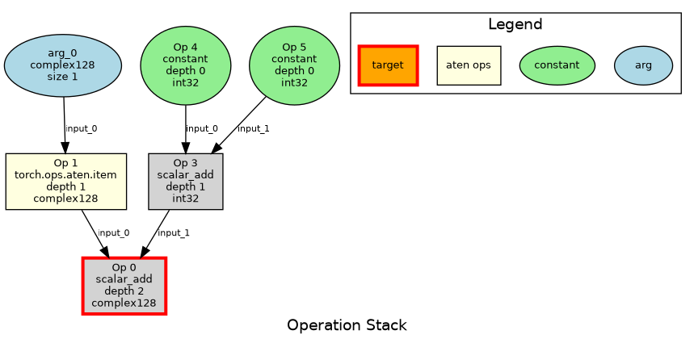

# TorchFuzz - Torch Compile e2e Fuzz Testing Tool

TorchFuzz is an experimental fuzzing framework for testing PyTorch operations. It generates
random operation stacks, converts them to executable Python code, and tests them with both eager
mode and different configurations of `torch.compile()`

## Overview

TorchFuzz works by:
1. **Generating random tensor/scalar specifications** with various shapes, strides, and dtypes
2. **Creating operation stacks** that produce the target specification, by recursively fuzzing an op given a type spec
and fuzzing a valid type specs for the arguments. The operation is then repeated for each arg recursively, until a leaf
arg is reached (argument, constant, TODO(add reuse of existing variable)).
The result is a stack of pytorch operations to execute (TODO make it a graph instead of a stack).
3. **Converting operations stack to executable Python code**
4. **Testing both eager and compiled execution** The codegened code already have both eager and compiled versions

### Example Walkthrough

Here's a concrete example of how TorchFuzz generates a test:

**Target Spec Generated:** `TensorSpec(size=(1, ), stride=(1,) , dtype=torch.complex128`

**Operation Stack Created:**
```
Operation stack (in reverse order - dependencies first):
        5: constant -> ScalarSpec(dtype=torch.int32, constant=None) (depth 0)
        4: constant -> ScalarSpec(dtype=torch.int32, constant=None) (depth 0)
    3: scalar_add -> ScalarSpec(dtype=torch.int32, constant=None) (depth 1)
        2: arg_0 -> TensorSpec(size=(1,), stride=(1,), dtype=torch.complex128) (depth 0)
    1: torch.ops.aten.item -> ScalarSpec(dtype=torch.complex128, constant=None) (depth 1)
  0: scalar_add -> ScalarSpec(dtype=torch.complex128, constant=None) (depth 2)
```

**Generated Python Code:**
```import torch
import sys
import os
# Add fuzzer directory to path so we can import tensor_fuzzer
fuzzer_dir = r'/home/lsakka/pytorch/tools/experimental/dynamic_shapes/torchfuzz'
if fuzzer_dir not in sys.path:
    sys.path.insert(0, fuzzer_dir)
from tensor_fuzzer import fuzz_scalar, fuzz_tensor_simple, ScalarSpec, TensorSpec

# Generated fuzzed program code (backward recursion from stack top)
# Stack has 6 operations

def fuzzed_program(arg_0):
    # Operation 2: arg_0 (stack position 2)
    tmp_2 = arg_0

    # Operation 1: torch.ops.aten.item (stack position 1)
    tmp_1 = tmp_2.item()

    # Operation 4: constant (stack position 4)
    tmp_4 = 5

    # Operation 5: constant (stack position 5)
    tmp_5 = 7

    # Operation 3: scalar_add (stack position 3)
    tmp_3 = tmp_4 + tmp_5

    # Operation 0: scalar_add (stack position 0)
    tmp_0 = tmp_1 + tmp_3

    # Final result from top of stack (operation 0)
    return tmp_0

# Create arguments for the fuzzed program
arg_0 = fuzz_tensor_simple((1,), (1,), torch.complex128, seed=10042)

# Execute the fuzzed program both normally and with torch.compile
import torch
import tempfile
import os
import sys
import contextlib
from io import StringIO

# Create arguments
args = (arg_0,)

# Execute original version
print('=== Executing Original Program ===')
try:
    result_original = fuzzed_program(*args)
    print('✅ Original execution successful')
except Exception as e:
    print(f'❌ Original execution failed: {e}')
    raise

# Execute compiled version
print('\n=== Executing Compiled Program  fullgraph=False')
try:
    compiled_program = torch.compile(fuzzed_program, fullgraph=False)
    result_compiled = compiled_program(*args)
    print('✅ Compiled execution successful')
    print(f'Compiled result type: {type(result_compiled)}')
except Exception as e:
    print(f'❌ Compiled execution failed: {e}')
    # Exit with non-zero code to signal compile failure
    import sys
    sys.exit(1)

# Execute compiled version 2
print('\n=== Executing Compiled Program  fullgraph=False dynamic=True')
try:
    compiled_program = torch.compile(fuzzed_program, fullgraph=False, dynamic=True)
    result_compiled = compiled_program(*args)
    print('✅ Compiled execution successful')
    print(f'Compiled result type: {type(result_compiled)}')
except Exception as e:
    print(f'❌ Compiled execution failed: {e}')
    # Exit with non-zero code to signal compile failure
    import sys
    sys.exit(1)

# Execute compiled version 3
print('\n=== Executing Compiled Program  fullgraph=True dynamic=True')
try:
    with torch._dynamo.config.patch(capture_scalar_outputs=True):
       compiled_program = torch.compile(fuzzed_program, fullgraph=False, dynamic=True)
       result_compiled = compiled_program(*args)
       print('✅ Compiled execution successful')
       print(f'Compiled result type: {type(result_compiled)}')
except Exception as e:
    print(f'❌ Compiled execution failed: {e}')
    # Exit with non-zero code to signal compile failure
    import sys
    sys.exit(1)
```
## diagram representation.


## Quick Start

### Single Test Run

```bash
cd tools/experimental/dynamic_shapes/torchfuzz
python fuzzer.py --single --seed 42
```
Note: Given a seed, the fuzzer is guanteed to generate the same program. (on the same gh commit).

### Continuous Fuzzing

```bash
python fuzzer.py --test --seed 1000 --max-depth 5
```

### With Debug Output

```bash
python fuzzer.py --single --log-level DEBUG --seed 42
```

## Command Line Options

| Option | Description |
|--------|-------------|
| `--single` | Run a single fuzz test (default: run continuous loop) |
| `--test` | Run continuous fuzzing loop |
| `--seed INT` | Set random seed for reproducible tests |
| `--max-depth INT` | Maximum operation stack depth (1-20) |
| `--log-level LEVEL` | Set logging level (DEBUG, INFO, WARNING, ERROR) |


### Core Components

1. **`tensor_fuzzer.py`** - Generates random tensor specifications (shapes, strides, dtypes)
2. **`ops_fuzzer.py`** - Creates operation stacks with type-aware operations
3. **`codegen.py`** - Converts operation stacks to executable Python code
4. **`fuzzer.py`** - Main orchestrator and CLI interface
5. **`visualize_stack.py`** - Creates visual diagrams of operation stacks

### Operation Types

**Tensor Operations:**
Write now the supported ops are very limited, its should be easy to extend that.
The fuzzer already very simple was able to cartch three bugs already.

- `torch.ops.aten.add` - Element-wise tensor addition
- `torch.ops.aten.mul` - Element-wise tensor multiplication
- `arg` - Function arguments (input tensors)

**Scalar Operations:**
- `scalar_add` - Python scalar addition
- `scalar_multiply` - Python scalar multiplication
- `torch.ops.aten.item` - Extract scalar from 1-element tensor
- `constant` - Generate constant values

## Example Output

```
Using seed: 42
Using max_depth: 3
⏱️  Step 1: Generating target spec...
   Completed in 0.001s - TensorSpec(size=(2, 3), stride=(3, 1), dtype=torch.float32)
⏱️  Step 2: Generating operation stack...
   Completed in 0.002s - 5 operations
⏱️  Step 3: Converting to Python code...
   Completed in 0.003s - 1247 chars
⏱️  Step 4: Executing Python code...
📄 Generated code written to: /tmp/tmpXXXXX_generated.py
🚀 Executing: python /tmp/tmpXXXXX_generated.py (timeout: 300s)
=== Executing Original Program ===
✅ Original execution successful
=== Executing Compiled Program fullgraph=False ===
✅ Compiled execution successful
=== Executing Compiled Program dynamic=True ===
✅ Compiled execution successful
✅ SUCCESS - artifacts saved to: /tmp/fuzzing_seed_42_1695123456789_success
```

## Generated Artifacts

Each test run creates artifacts in `/tmp/fuzzing_seed_{seed}_{timestamp}_{status}/`:

- **`summary.txt`** - Test run metadata
- **`operation_stack.txt`** - Human-readable operation sequence
- **`generated_code.py`** - Executable Python code
- **`operation_stack_diagram.png`** - Visual operation stack diagram

### Known Issues Handling

TorchFuzz automatically skips known PyTorch issues or previously found, you should add them to the list known_issues.

```python
known_issues = {
    "RuntimeError: self.stride(-1) must be 1 to view ComplexDouble as":
        "https://github.com/pytorch/pytorch/issues/162561",
    "BooleanAtom not allowed in this context":
        "https://github.com/pytorch/pytorch/issues/160726",
}
```

## API Usage

### Programmatic Interface

```python
from fuzzer import fuzz_and_execute
from ops_fuzzer import fuzz_operation_stack, fuzz_spec
from codegen import convert_stack_to_python_code

# Generate and execute a single test
seed, success, error = fuzz_and_execute(seed=42, max_depth=3)

# Generate operation stack only
target_spec = fuzz_spec()
operation_stack = fuzz_operation_stack(target_spec, max_depth=3, seed=42)

# Generate code without executing
python_code = convert_stack_to_python_code(operation_stack, target_spec, seed=42)
```

## Testing Strategies

### Systematic Testing

```bash
# Test specific seed range
for i in {1000..1100}; do
    python fuzzer.py --single --seed $i --max-depth 5
done
```

### Continuous Integration

```bash
# Run 100 tests with timeout
timeout 300 python fuzzer.py --test --seed 42 --max-depth 3
```

### Regression Testing

```bash
# Test known problematic seeds
python fuzzer.py --single --seed 12345  # Known to trigger specific issue
```

## Contributing

### Adding New Operations

1. **Define operation in `ops_fuzzer.py`**:
   ```python
   def _get_new_op_args_specs(target_spec):
       return "new_op_name", [input_spec1, input_spec2]
   ```

2. **Add code generation in `codegen.py`**:
   ```python
   elif op_name == "new_op_name":
       return [f"{output_var} = torch.ops.aten.new_op({input_vars[0]}, {input_vars[1]})"]
   ```


3. **Update operation selection in `fuzz_op()`**
TODO: link an example PR that adds an operation.
