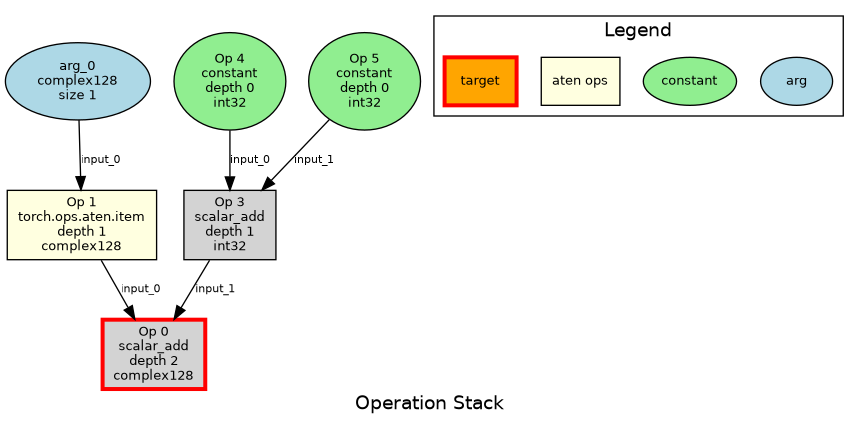

# TorchFuzz - PyTorch Compile End-to-End Fuzz Testing Framework

TorchFuzz is a comprehensive fuzzing framework for testing PyTorch operations. It generates random operation graphs, converts them to executable Python code, and validates correctness across eager execution and various `torch.compile()` configurations.

## Overview

TorchFuzz employs a sophisticated four-stage fuzzing pipeline:

1. **Random Specification Generation** - Creates target tensor/scalar specifications with varied shapes, strides, and dtypes
2. **Operation Graph Construction** - Builds Directed Acyclic Graphs (DAGs) of PyTorch operations through recursive decomposition with dependency tracking
3. **Code Generation** - Converts operation graphs to executable Python code using topological ordering
4. **Validation** - Executes generated programs in both eager and compiled modes, comparing outputs for correctness

### How It Works: Example Walkthrough

**Step 1: Target Specification**
```python
TensorSpec(size=(2, 3), stride=(3, 1), dtype=torch.float32)
```

**Step 2: Operation Graph Construction**
```
OperationGraph (root: node_0, target: TensorSpec(size=(2, 3), stride=(3, 1), dtype=torch.float32))
  node_2: arg_0 -> TensorSpec(size=(2, 3), stride=(3, 1), dtype=torch.float32) (depth 0)
  node_3: arg_1 -> TensorSpec(size=(2, 3), stride=(3, 1), dtype=torch.float32) (depth 0)
  node_0: torch.add -> TensorSpec(size=(2, 3), stride=(3, 1), dtype=torch.float32) (depth 2) <- ['node_2', 'node_3']
```

**Step 3: Generated Python Code**
```python
import torch
torch._dynamo.config.capture_scalar_outputs = True
torch.manual_seed(42)

def fuzzed_program(arg_0, arg_1, sentinel):
    var_node_2 = arg_0  # TensorSpec(size=(2, 3), stride=(3, 1), dtype=torch.float32)
    var_node_3 = arg_1  # TensorSpec(size=(2, 3), stride=(3, 1), dtype=torch.float32)
    var_node_0 = torch.add(var_node_2, var_node_3)  # TensorSpec(...)
    result = var_node_0 * sentinel
    return result

sentinel = torch.tensor(1.0, requires_grad=True)
arg_0 = torch.randn((2, 3), dtype=torch.float32)
arg_1 = torch.randn((2, 3), dtype=torch.float32)
args = (arg_0, arg_1)

# Run eager and compiled versions
out_eager = fuzzed_program(*args, sentinel)
out_eager.sum().backward()
print('Eager Success! ✅')

compiled_program = torch.compile(fuzzed_program, fullgraph=True, dynamic=True)
out_compiled = compiled_program(*args, sentinel)
out_compiled.sum().backward()
print('Compile Success! ✅')
```

## Graph Visualization


## Quick Start

### Single Seed Execution

```bash
cd tools/experimental/dynamic_shapes/torchfuzz
python fuzzer.py --seed 42
```

The fuzzer is deterministic: given the same seed and Git commit, it will generate identical programs.

### Multi-Process Fuzzing

Run multiple seeds in parallel across CPU cores:

```bash
# Run seeds 0-999 with 8 worker processes
python fuzzer.py --start 0 --count 1000 -p 8

# Run seeds 1000-1099 with verbose output
python fuzzer.py --start 1000 --count 100 --verbose
```

### Template-Based Fuzzing

Use specialized templates for different testing scenarios:

```bash
# Default template: neural network operations with numerics checks
python fuzzer.py --seed 42 --template default

# DTensor template: distributed tensor operations
python fuzzer.py --seed 42 --template dtensor

# Unbacked template: data-dependent operations (nonzero, unique, etc.)
python fuzzer.py --seed 42 --template unbacked
```

### Debug Mode

```bash
python fuzzer.py --seed 42 --log-level DEBUG --max-depth 5
```

## Command Line Reference

### Single Seed Execution

| Option | Description | Example |
|--------|-------------|---------|
| `--seed INT` | Random seed for reproducible tests | `--seed 42` |
| `--max-depth INT` | Maximum operation graph depth (1-20) | `--max-depth 5` |
| `--template NAME` | Template to use (default, dtensor, unbacked) | `--template unbacked` |
| `--log-level LEVEL` | Logging verbosity (DEBUG, INFO, WARNING, ERROR) | `--log-level DEBUG` |

### Multi-Process Fuzzing

| Option | Description | Example |
|--------|-------------|---------|
| `--start INT` | Starting seed value (inclusive) | `--start 0` |
| `--count INT` | Number of seeds to run | `--count 1000` |
| `--processes INT` | Number of worker processes (default: 75% of CPU cores) | `-p 16` |
| `--verbose` | Print detailed output for all runs | `--verbose` |
| `--template NAME` | Template to use for all runs | `--template default` |

## Restricting supported ops and weighting examples

You can restrict the fuzzer to a specific set of fully-qualified torch ops and optionally weight them to bias sampling.

- Restrict to only torch.add and torch.matmul (equal likelihood):

```bash
python fuzzer.py --seed 42 \
  --supported-ops "torch.add,torch.matmul"
```

- Restrict to only torch.add and torch.matmul, and make matmul 5x more likely than add:

```bash
python fuzzer.py --seed 42 \
  --supported-ops "torch.add,torch.matmul=5"
```

Notes:
- Use fully-qualified torch op names (e.g., torch.matmul, torch.nn.functional.rms_norm).
- Weights must be > 0. If both --supported-ops and --op-weights specify a weight for the same op, the value from --supported-ops takes precedence.

## Architecture

### Core Components

| Component | Responsibility |
|-----------|----------------|
| `fuzzer.py` | Main CLI orchestrator, coordinates fuzzing workflow |
| `tensor_fuzzer.py` | Generates random tensor/scalar specifications |
| `ops_fuzzer.py` | Builds operation graphs via recursive decomposition |
| `codegen.py` | Converts operation graphs to executable Python code |
| `runner.py` | Executes generated programs and reports results |
| `multi_process_fuzzer.py` | Parallel fuzzing across multiple processes |
| `visualize_graph.py` | Creates visual diagrams of operation graphs |
| `checks.py` | Defines validation strategies (eager vs compiled) |
| `operators/` | Modular operator implementations |

### Operator System

TorchFuzz uses a plugin-based operator system where each operation is a class implementing the `Operator` interface:

```python
class Operator(ABC):
    def can_produce(self, output_spec: Spec) -> bool:
        """Check if operator can produce the target specification."""

    def fuzz_inputs_specs(self, output_spec: Spec) -> list[Spec]:
        """Generate input specifications via decomposition."""

    def codegen(self, output_name: str, input_names: list[str], output_spec: Spec) -> str:
        """Generate executable code for this operation."""
```

### Supported Operations

#### Pointwise Operations
- **Tensor-Tensor**: `torch.add`, `torch.sub`, `torch.mul`, `torch.div`
- **Scalar-Tensor**: Scalar versions of above operations

#### Shape Operations
- `torch.Tensor.view`, `torch.reshape`, `torch.flatten`
- `torch.squeeze`, `torch.unsqueeze`

#### Matrix Operations
- `torch.mm` - Matrix multiplication
- `torch.addmm` - Additive matrix multiplication
- `torch.bmm` - Batch matrix multiplication
- `torch.matmul` - General matrix multiplication

#### Neural Network Operations
- **Layers**: `F.embedding`, `F.linear`
- **Activations**: `F.relu`, `F.leaky_relu`, `F.elu`, `F.gelu`, `F.silu`, `torch.sigmoid`, `torch.tanh`, `F.softmax`
- **Normalization**: `F.layer_norm`, `F.rms_norm`, `F.batch_norm`, `F.group_norm`
- **Regularization**: `F.dropout`

#### Data-Dependent Operations
- `torch.ops.aten.nonzero` - Find non-zero elements
- `torch.ops.aten.masked_select` - Select elements by mask
- `torch.ops.aten.unique` - Find unique elements
- `torch.ops.aten.item` - Extract scalar from tensor

#### Input Operations
- `arg` - Function arguments
- `constant` - Constant scalar values

## Templates

Templates define specialized fuzzing strategies with custom operator sets, checks, and argument generation.

### Default Template

**Focus**: Neural network operations with numerical validation

**Operators**: All operations except data-dependent ones

**Check**: Compares eager vs compiled outputs with numerical tolerance (5% relative + 1.0 absolute difference)

**Use Case**: General PyTorch compilation testing

```bash
python fuzzer.py --seed 42 --template default
```

### DTensor Template

**Focus**: Distributed tensor operations

**Operators**: Basic arithmetic and matrix operations

**Check**: Validates compilation correctness (no numerical comparison)

**Special Features**:
- Initializes fake distributed process group
- Creates 2D device mesh
- Wraps all tensors as DTensors with Replicate placement

**Use Case**: Testing torch.compile with distributed tensors

```bash
python fuzzer.py --seed 42 --template dtensor
```

### Unbacked Template

**Focus**: Data-dependent operations that produce unbacked SymInts

**Operators**: `nonzero`, `masked_select`, `unique`, `item`, plus basic arithmetic

**Check**: Validates compilation correctness

**Special Features**:
- 50/50 tensor/scalar distribution
- Integer/float dtypes only (no bool)
- Custom tensor initialization for meaningful data-dependent results

**Use Case**: Testing dynamic shape handling and unbacked SymInt scenarios

```bash
python fuzzer.py --seed 42 --template unbacked
```

## Multi-Process Fuzzing

The multi-process fuzzer distributes seeds across worker processes for high-throughput testing:

### Features

- **Parallel Execution**: Automatically uses 75% of available CPU cores (configurable)
- **Progress Tracking**: Real-time progress bars with throughput statistics (requires `tqdm`)
- **Failure Detection**: Immediately reports failing seeds with full output
- **Known Issue Filtering**: Automatically skips known bugs based on regex patterns
- **Operation Statistics**: Aggregates operation distribution across all runs
- **Graceful Interruption**: Ctrl+C shows partial summary

### Output Example

```
🚀 Starting multi-process fuzzer with 12 processes
📊 Processing seeds 0 to 999 (1000 total)
🔧 Command template: python fuzzer.py --seed {seed} --template default
============================================================
Processing seeds |████████████████████| 1000/1000 [05:23<00:00] ✅/❌/❓=947/45/8 | throughput: 185.61 seeds/hr
============================================================
📈 SUMMARY
============================================================
✅ Successful: 947/1000 (94.7%)
❌ Failed:     45/1000 (4.5%)
⏱️  Total time: 323.45s
⚡ Throughput: 185.61 seeds/hr

❌ Failed seeds: [23, 47, 89, ...]
✅ Successful seeds: [0, 1, 2, ...]

🚫 Ignored seeds: [12, 56, 78, ...]

📊 OPERATION DISTRIBUTION
============================================================
Total operations executed: 15847
  torch.add                      3421 times ( 21.6%)
  torch.mul                      2890 times ( 18.2%)
  torch.nn.functional.relu       1567 times (  9.9%)
  ...
```

### Known Issue Filtering

Edit `multi_process_fuzzer.py` to add regex patterns for known bugs:

```python
IGNORE_PATTERNS: list[re.Pattern] = [
    re.compile(r"RuntimeError: self\.stride\(-1\) must be 1 to view ComplexDouble as"),
    re.compile(r"BooleanAtom not allowed in this context"),
    re.compile(r"Your custom error pattern here"),
]
```

Ignored failures are tracked separately and don't count as failures in the summary.

## Custom Checks

Checks define how generated programs are validated. Create custom checks by subclassing `Check`:

```python
from torchfuzz.checks import Check

class MyCustomCheck(Check):
    def codegen(self, args_tuple: str) -> list[str]:
        """Generate validation code."""
        return [
            f"args = {args_tuple}",
            "result = fuzzed_program(*args)",
            "# Add your validation logic here",
            "assert result.sum() > 0, 'Custom validation failed'",
        ]
```

### Built-in Checks

#### EagerVsFullGraphDynamicCompileCheck

Validates that eager and compiled execution both succeed (no output comparison).

#### EagerVsFullGraphDynamicCompileWithNumericsCheck

Validates that eager and compiled outputs match within tolerance:
- **Relative tolerance**: 5%
- **Absolute tolerance**: 1.0

Includes backward pass validation.

## API Usage

### Programmatic Interface

```python
from torchfuzz.fuzzer import fuzz_and_execute
from torchfuzz.ops_fuzzer import fuzz_operation_graph, fuzz_spec
from torchfuzz.codegen import convert_graph_to_python_code

# Generate and execute a single test
fuzz_and_execute(seed=42, max_depth=5, template="default")

# Generate operation graph only
target_spec = fuzz_spec("default")
operation_graph = fuzz_operation_graph(target_spec, max_depth=5, seed=42, template="default")

# Generate code without executing
python_code = convert_graph_to_python_code(operation_graph, seed=42, template="default")
print(python_code)

# Explore graph structure
print(f"Graph has {len(operation_graph.nodes)} nodes")
print(f"Root node: {operation_graph.root_node_id}")
print(f"Topological order: {operation_graph.get_topological_order()}")
print(f"Leaf nodes: {operation_graph.get_leaf_nodes()}")
```

## Adding New Operations

TorchFuzz uses a modular operator system. To add a new operation:

### Step 1: Create Operator Class

Create a new file in `operators/` (e.g., `operators/my_op.py`):

```python
from torchfuzz.operators.base import Operator
from torchfuzz.tensor_fuzzer import TensorSpec

class MyOperator(Operator):
    def __init__(self):
        super().__init__("my_op")

    @property
    def torch_op_name(self):
        return "torch.my_op"

    def can_produce(self, output_spec):
        """Check if this operator can produce the output specification."""
        if not isinstance(output_spec, TensorSpec):
            return False
        # Add your constraints here
        return True

    def fuzz_inputs_specs(self, output_spec):
        """Generate input specifications via decomposition."""
        # Decompose output spec into input specs
        return [
            TensorSpec(size=output_spec.size, stride=output_spec.stride, dtype=output_spec.dtype),
            TensorSpec(size=output_spec.size, stride=output_spec.stride, dtype=output_spec.dtype),
        ]

    def codegen(self, output_name, input_names, output_spec):
        """Generate code for this operation."""
        return f"{output_name} = torch.my_op({', '.join(input_names)})"
```

### Step 2: Register Operator

Add your operator to `operators/registry.py`:

```python
from torchfuzz.operators.my_op import MyOperator

class OperatorRegistry:
    def _register_default_operators(self):
        # ... existing registrations ...
        self.register(MyOperator())
```

### Step 3: Add to Template (Optional)

If you want the operator in specific templates, add its torch_op_name to the template's `supported_ops` list in `codegen.py`:

```python
class DefaultFuzzTemplate(FuzzTemplate):
    def __init__(self):
        super().__init__(
            supported_ops=[
                # ... existing ops ...
                "torch.my_op",
            ],
            check=EagerVsFullGraphDynamicCompileWithNumericsCheck(),
        )
```

### Step 4: Test Your Operator

```bash
python fuzzer.py --seed 42 --template default
```

## Artifacts and Debugging

### Generated Artifacts

Each fuzzing run creates artifacts in `/tmp/fuzzing_seed_{seed}_{timestamp}_{status}/`:

- `summary.txt` - Seed, depth, success status, target spec, operation count
- `operation_stack.txt` - Detailed operation graph with dependencies
- `operation_graph.png` - Visual diagram of the operation graph (if GraphViz installed)

### Debugging Failed Seeds

```bash
# Reproduce a failed seed
python fuzzer.py --seed 12345 --log-level DEBUG

# View generated program
ls /tmp/torchfuzz/fuzz_*.py

# Run generated program directly
python /tmp/torchfuzz/fuzz_<hash>.py
```

## Best Practices

### For Continuous Fuzzing

1. **Start with small seed ranges**: Test with `--count 10` first
2. **Monitor the first few failures**: Check if they're legitimate bugs or known issues
3. **Add known issues to ignore list**: Update `IGNORE_PATTERNS` in `multi_process_fuzzer.py`
4. **Use appropriate templates**: Match template to your testing goals
5. **Save successful seeds**: Track seeds that find bugs for regression testing

### For Operation Development

1. **Start simple**: Test with `--max-depth 2` initially
2. **Verify determinism**: Run the same seed multiple times
3. **Check operator coverage**: Use `--verbose` to see operation statistics
4. **Test edge cases**: Create targeted specs
