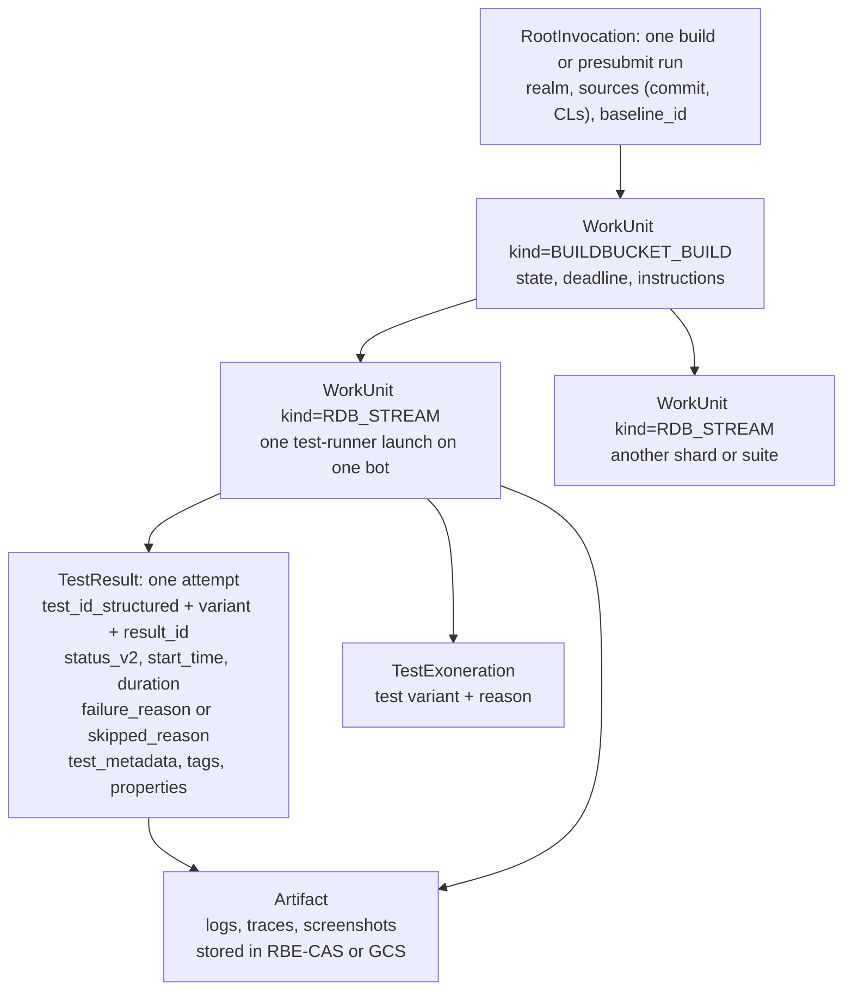
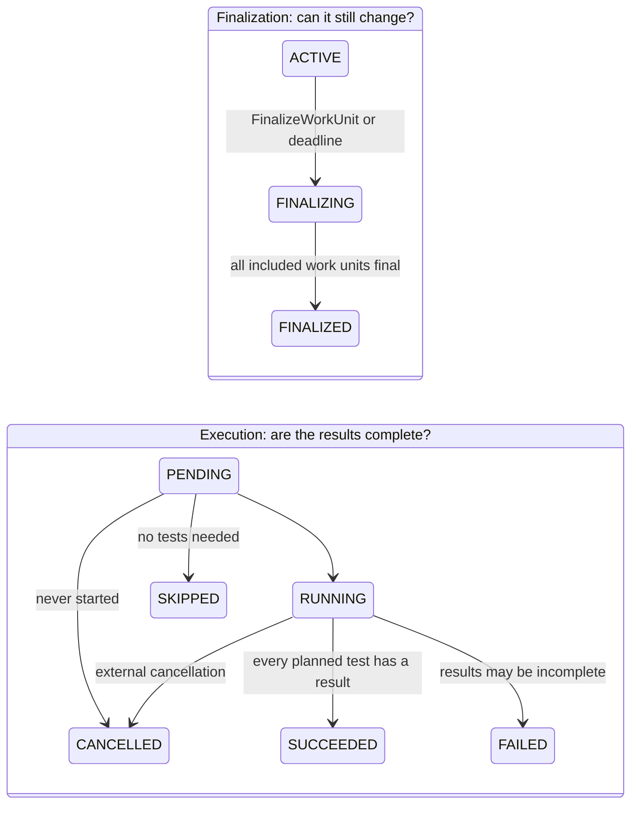
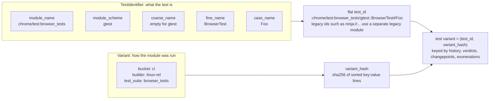
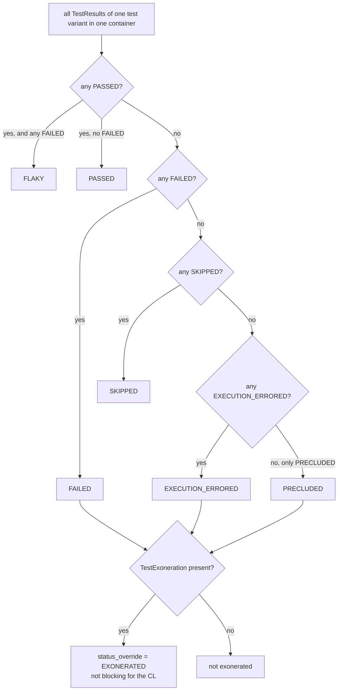
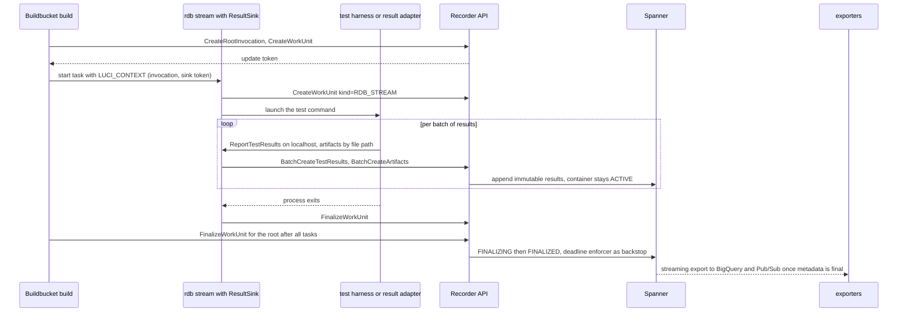
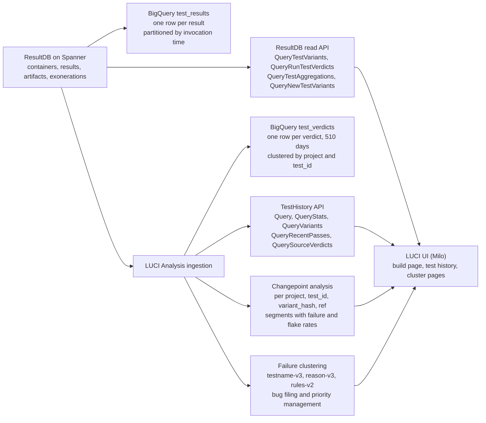
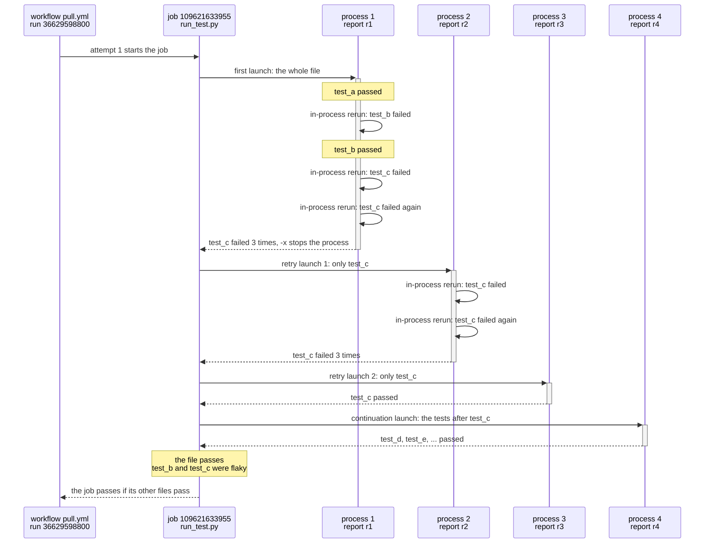
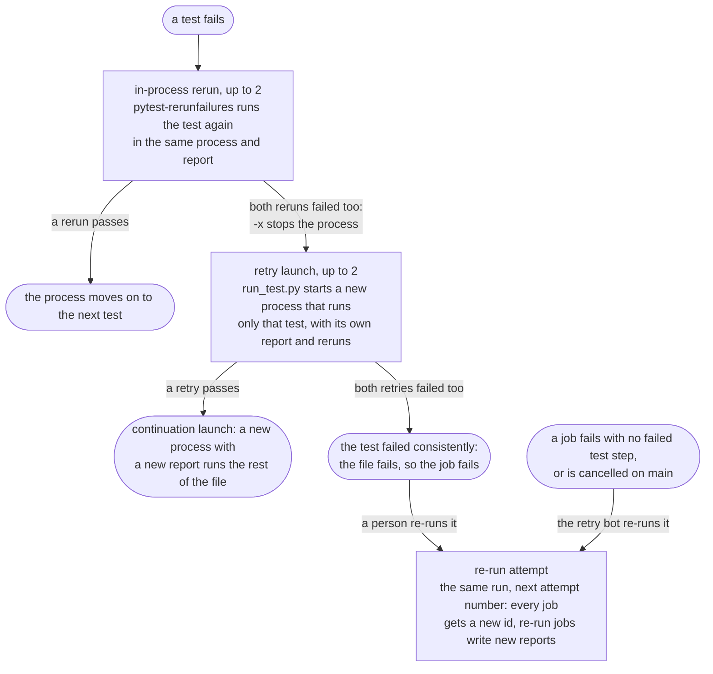

# Test tables proposal: `tests.tests`, `tests.environments`, `tests.runs`

Status: draft for discussion. Date: 2026-09-27. Drafted with AI assistance,
pending author review. Context: pytorch/test-infra issue
[#8849](https://github.com/pytorch/test-infra/issues/8849) and the
"test_tables revamp" design doc.

## 1. Summary

Replace `tests.all_test_runs` with three tables and two rollups:

| Table | One row per | Key |
|---|---|---|
| `tests.tests` | test case in a launched test file | `id = sipHash64(repo, file, suite, case)` |
| `tests.environments` | distinct way of running tests, measured inside the test process | `id = sipHash64(os, ..., flags)` |
| `tests.runs` | one attempt of one test in one environment in one CI job | `(test_id, env_id, started_at, job, rerun)` |
| `tests.health_daily` | (day, test, env) counts, fed by a materialized view | derived |
| `tests.health` | (test, env, trunk or PR, window) verdict metrics, recomputed on a schedule | derived |

Section 3 compares this design with the two alternatives on the table and
with other systems: section 3.3 is the one-page trade-off matrix, section 8
lists the trade-offs accepted, and section 3.6 explains why there is no
per-report ledger.

The three design rules:

1. A test's code identity and the way it was run are two keys, never fused.
   `test_id` changes only when the test is renamed or moves to another launched file; `env_id` changes only
   when the build, runtime, hardware or harness flags change. History for a
   test survives an environment change, and a per-environment disable is
   still expressible.
2. The environment is what the process observed, not what CI called it.
   `build_environment` and `TEST_CONFIG` are recorded in the report
   properties, not stored as identity or attributes. Harness flags come from `TestEnvironment.repro_env_vars`,
   the same list printed in every repro command, instead of a hand-kept
   "mode" registry.
3. `tests.runs` is a compact fact table for aggregation: one row per attempt,
   ids instead of names, nothing that a key on the row already implies,
   timestamps instead of durations, ids that locate the report in S3 instead
   of messages or captured output.

Jobs stay in `default.workflow_job`. Disable, unstable and slow policy stays
in `misc.disabled_tests_historical` and `test/slow_tests.json` until a policy
table earns its place. Owners come from `tests.owners`, a small append-only
history of each test file's `# Owner(s):` header (section 4.2).

## 2. Requirements

The hub (see the "Test Insights" prototype, test-infra PR 8660) must answer,
for any test and for lists of tests:

- Where does it run: every workflow, environment and hardware it runs on,
  and where it is skipped, and why.
- Did my change cause this: whether the test was already failing or flaky on
  trunk in this environment, since which commit, and who owns it.
- How do I fix it: the failing attempts, their job, logs, failure type and
  the exact flags to reproduce.
- What state should it be in: disabled or unstable, scoped to a platform,
  with reason and history.
- What does it cost: time by test file, owner and hardware, so budgets can be
  enforced and bots can act.

Issue #8849 adds the data-quality floor: a real execution timestamp, identity
emitted by the producer instead of regex, the trigger on the row so trunk
runs need no join, no job_id 0 rows, no doubled rows, no silent loss, a
retention policy, and a sort key that serves per-test history without a
second full copy of the table (a per-job projection is the accepted
exception, section 4.4). This proposal departs from one item: the trigger
is a one-line join on the job's branch instead of a column (section 4.4).
Every number in this document is sourced in appendix D.

Non-goals for this proposal: the hub UI (only the URLs that address runs are
set here, section 4.4), the policy engine, and log storage.

Terms used in this document:

| Term | Meaning here |
|---|---|
| test | one test case, (repo, file, suite, case_name), where `file` is the file `run_test.py` launches; `tests.tests.id`, `test_id` in the tables that reference it |
| environment | one distinct way of running tests, measured inside the test process; `tests.environments.id`, `env_id` in the tables that reference it |
| test variant | one (test, environment) pair; the unit of history and health |
| process | one launch of a test runner (pytest, unittest or gtest) that produces one report; a test's `rerun_number` restarts at 0 in each |
| attempt | one execution of one test in one process; one row in `tests.runs` |
| rerun | an in-process re-execution by pytest-rerunfailures; `rerun_number > 0` |
| retry | a new process that `run_test.py` starts for a failing test; in the data, a test's process that follows one where it failed |
| continuation | a new process that runs the rest of a file after the test that stopped the last one; the first process for the tests in it |
| re-run (GitHub) | a new job id for the same workflow run; `run_attempt` on `workflow_job` |
| failing attempt | outcome `failed`, `error`, `crashed` or `timed_out` |
| verdict | the outcome of the last attempt of one test variant in one job |
| flaky (in a job) | a failing attempt followed by a passing last attempt in the same job |
| config, mode | CI names (`TEST_CONFIG`, the design doc's mode registry); never identity here |
| invocation | in ResultDB a container of results; in the one-pager a process record; section 3.6 |

Appendix E shows how these levels nest in CI, which existing tables store
each one, and every place a test can run more than once.

## 3. Options and trade-offs

### 3.1 The three candidate designs

| | Entities | Test identity | Environment | Attempts |
|---|---|---|---|---|
| A. Design doc, one-pager tab | `jobs`, `invocations`, `test_runs`, derived `tests`, `environments` | hash(repo, file, suite, case) | probe: Environment x Device x Mode, fused into `identity_id` | `attempt_ordinal` plus invocation parent links |
| B. Design doc, main tab and follow-up paste | `tests`, `runs`, `job_runs`, `health`, `policy`, derived `test_environments` | hash(repo, file, suite, case, params) | `build_env` and `config` strings on the run | `run_attempt`, `report_idx`, `rerun_idx`, `is_final` |
| C. This proposal | `tests`, `environments`, `runs`, derived `health_daily`, `health` | hash(repo, file, suite, case) | runtime-captured fields plus `repro_env_vars`, own table, own key | one row per attempt with `rerun_number`, order by time |

### 3.2 What other systems do

| System | Test identity | Variant / environment | Attempts | Batch context | Derived state |
|---|---|---|---|---|---|
| Chromium LUCI [ResultDB](https://github.com/luci/luci-go/blob/main/resultdb/proto/v1/test_result.proto) (section 3.7) | `test_id` string | `variant` map with `variant_hash`, separate from `test_id` | `result_id` per attempt, verdict computed | invocation graph with sources (commit, CL) | [LUCI Analysis](https://github.com/luci/luci-go/blob/main/analysis/proto/v1/test_variant_branches.proto) segments per (test, variant, branch) |
| Bazel [Build Event Protocol](https://github.com/bazelbuild/bazel/blob/master/src/main/java/com/google/devtools/build/lib/buildeventstream/proto/build_event_stream.proto) | label | `Configuration` id | `run` x `shard` x `attempt` | invocation | `TestSummary` |
| Google [ResultStore](https://github.com/googleapis/googleapis/tree/master/google/devtools/resultstore/v2) | (class, case) | `ConfiguredTarget` under a `Configuration` | `retry_number`, `repeat_number` | Invocation, Target, Action | status attributes |
| Kubernetes [TestGrid](https://github.com/GoogleCloudPlatform/testgrid/blob/master/pb/state/state.proto) | row id | one grid per configuration | one cell per build | column = build | alerts per row |
| GitLab [unit tests](https://gitlab.com/gitlab-org/gitlab/-/blob/master/app/models/ci/unit_test.rb) | `key_hash(suite_name, name)` | none | failures only, 14-day window | `build_id` | recent failure counts |
| Buildkite [Test Engine](https://buildkite.com/docs/test-engine/importing-json) | scope + name (+ location) | tags on the execution | one execution row with a `history` span | `run_env` (branch, commit, job) | vendor analytics |
| [OpenTelemetry](https://opentelemetry.io/docs/specs/semconv/registry/attributes/test/) test conventions | `test.case.name` | attributes | `test.case.result.status` | `test.suite.run.status` (success, failure, skipped, aborted, timed_out) | none |
| Meta TestX | surrogate id for (framework, name, config map) | folded into the config map; other facts are typed per-result dimensions | one row per attempt with `is_final` and a retry count | a mandatory run with purpose, revision, tags | separate materialized state tables computed from trunk runs only |

Findings the proposal follows:

- Every system in the table except TestX and GitLab separates what the test
  is from how it was run, and keys results on both. ResultDB and Bazel keep two keys. TestX fuses them,
  and its own guidance is to treat (name, config) as the durable key because
  a rename or a new config key starts a new history. A composite
  (`test_id`, `env_id`) decomposes when an environment changes; a fused hash
  cannot tell "same test, new environment" from "new test".
- Every system stores one row per attempt and either computes the verdict
  (ResultDB) or stores a final flag (TestX). None uses an array of
  retries inside a single row as its only store, which is what
  `all_test_runs` does today.
- Batch context (commit, branch, trigger, job) is either its own table or
  denormalized onto the result. PyTorch already has the job table
  (`default.workflow_job`: name, labels, runner, run_attempt, head_sha,
  workflow_event, conclusion, timing), so a `tests.jobs` copy only adds drift.
- Derived state (flake rate, trunk state, coverage) is always a separate,
  materialized table computed from trunk runs only.
- ResultDB's guidance for the variant key is the right rule for `env_id`: it
  MUST contain any dimension whose pass would otherwise hide another's
  failure, and MUST NOT contain anything whose routine change would reset
  history.

### 3.3 Trade-offs at a glance

The three candidate designs of section 3.1, compared on the properties that
decide the hub's questions. The reasoning behind each cell is in sections
3.4 to 3.6 and in the schema sections; section 8 lists the trade-offs this
proposal accepts.

| Property | A. One-pager (jobs, invocations, test_runs) | B. build_env and config strings | C. This proposal |
|---|---|---|---|
| Test identity | hash of (repo, file, suite, case) | same | same |
| Environment identity | probe per job plus `mode` and `device_count` per invocation, fused with the test into `identity_id` | `build_environment` and `TEST_CONFIG` strings on every row | measured per process and hashed into `env_id`; two keys, never fused |
| Environment correctness | depends on classifying each fact as job-level or process-level in advance; the doc's own audit misfiled three | names describe intent, not what ran: no version for ROCm and XPU, 16% of test jobs without a prefix, a `py3.11` job testing on Python 3.10 | what the process observed; no classification at capture time, but identity moves whenever a `def_flag` changes |
| History across an environment change | `identity_id` cannot decompose; `env_family_id` precomputed on every row | stable until a job is renamed | (`test_id`, `env_id`) decomposes; a version bump starts a new `env_id`, so hub views group by environment columns |
| Attempts and retries | `attempt_ordinal` restarts per invocation; lineage through `parent_invocation_id` | `run_attempt`, `report_idx`, `rerun_idx`, `is_final` | one row per attempt with `rerun_number`, order by time; retries and verdict computed |
| "Did not run" versus "lost" | invocation rows with `termination` | `job_runs` manifest columns | not covered; the job conclusion and the log classifier report it (section 3.6) |
| Write path | launcher writes invocation rows at launch and exit, plus reports | reports plus a job table | reports only; testsuite properties carry the environment |
| Row cost | seven id-like columns and ten copied environment columns per attempt | two strings per row | three ids, an outcome, a rerun number, two timestamps |
| Hub per-test reads | projection over a job-ordered table | job-ordered table; per-test history from `health` only | primary key is (test, env, time); per-job reads use a projection |
| Rollout | needs the probe and the launcher protocol before any row is correct | works on existing reports today | needs the producer change; reports from branches without it are not ingested |
| Main risk | mislabeled environments and unfinished invocation rows | opaque names that cannot be filtered or reconciled with hardware | environment fragmentation on version bumps and unregistered flags |

### 3.4 Decision: what is adopted and dropped

Section 3.5 argues why the one-pager design as a whole is the worse choice
for the hub; appendix C maps each of its elements to this design. Design B
is addressed at the end of this section.

| From the design doc | Decision | Why |
|---|---|---|
| hash-derived `test_id` from (repo, file, suite, case) | adopted | no surrogate key can be minted transactionally in ClickHouse |
| one row per attempt | adopted | user and doc agree; see attempt model |
| environment as its own entity with decomposed, queryable fields, captured at runtime | adopted | "all linux tests built with clang" must be a predicate; CI names are not queryable |
| Environment vs Device split, "behavior test" for key fields | adopted as column groups in one table | one key is simpler; the rollups group by any subset of columns |
| synthetic `crashed` / `timed_out` / `not_run` outcomes | `crashed` and `timed_out` adopted, `not_run` dropped | `run_test.py` already knows the in-flight test via stepcurrent; a test that never started needs a plan to compare against, and there is no manifest |
| `tests.health` separate from raw runs | adopted | different writer, cadence and truth condition |
| `tests.jobs` | dropped | duplicates `default.workflow_job`; static probe facts belong to `environments`; `runs` carries the job id and joins the rest |
| `tests.invocations` | dropped, including the container role (section 3.6) | the process environment is `env_id`; lineage is `rerun_number` and time order; crash accounting is a synthetic row; the rest of a process is in its report |
| fused `identity_id = hash(test, mode, env)` | dropped | composite (`test_id`, `env_id`) instead; see findings |
| "mode" registry resolved from `test.sh` | dropped | `TestEnvironment.repro_env_vars` already is that registry, maintained where the flags are defined |
| `build_env` / `config` in identity | dropped | CI naming; recorded in the report properties only; see the note on design B below |
| stored `duration` / `elapsed_us` | dropped | `started_at` and `ended_at`; duration is a subtraction |
| `is_final` | dropped | the verdict is the latest attempt; storing a flag invites disagreement with the rows |
| `outcome_summary` / message text | dropped | the fact table aggregates; details are in the report in S3, found through the job id and the test's file |
| per-report manifest table | dropped | nothing the hub asks needs it once process deaths are rows on `runs`; section 3.6 |
| copies of test and job fields on the fact table (`repo`, `file`, `head_sha`, `head_branch`, workflow id, run attempt) | dropped | derivable from `test_id` and `github_workflow_job_id`; nothing about the job is stamped on the row |
| environment attribute columns (memory, driver, patch versions, runner labels, CI names) | dropped | derivable from the job row or the device model, and not tied to a run as environment-level values; the full per-process capture is in the report properties |

**Why not design B.** Keying the environment on `build_environment` and
`TEST_CONFIG` has real strengths: the names are stable, people already
think in them, and they exist for every historical report. They lose on one
point that matters more: they describe what CI intended, not what ran. About 16% of
test jobs in a 7-day sample carry no build-environment prefix at all, ROCm
and XPU names omit versions, a probe found the CUDA `py3.11` build testing
on a Python 3.10 venv, and the `x86iavx2` runners that `inductor_avx2`
uses are Sapphire Rapids machines with AVX-512 and AMX. Fixing the names in workflow YAML
would fix the hygiene cases but not the last two, and it would tie test
identity to the naming discipline of every workflow author. Measuring in
the process gives the same stability for the fields that are stable (os,
CPU architecture, accelerator, Python, compiler) and adds the ones the names cannot
carry. The names stay available as report properties for anyone who wants
to reconcile the two views.

### 3.5 Why the one-pager design is worse for the hub

The one-pager tab of the design doc proposes three fact tables and two
derived catalogs. `tests.jobs` is one build on one machine, with the probed
job environment and a `job_key` that is stable across re-runs.
`tests.invocations` is one test-runner process tree, with `mode`,
`device_count`, an `env_id` of job environment plus device count, an
`env_family_id`, a `dependencies` map, start and end, exit code, a
`termination` enum, the test in flight at death, and a
`parent_invocation_id` for retry lineage. `tests.test_runs` is one attempt,
with `attempt_ordinal`, a fused `identity_id = hash(test_id, mode, env_id)`,
the environment columns copied onto the row "for join-free filters", a
`source` of report or synthetic, `duration_ms` and the first 256 bytes of the
failure message, ordered by (job, invocation, test, attempt) with a
projection for per-test reads. Identity is Test x Mode x Environment, where
Mode is resolved by a `TEST_MODES` registry added to the harness.

Several of its choices are right and are kept here: the hash-derived
`test_id`, one row per attempt, an environment entity with decomposed
fields, runtime capture instead of name parsing, synthetic outcomes for
crashes and timeouts, the behavior test for identity fields, and catalogs
derived from ingest, never edited by hand. The verdict is about
the structure, and it rests on five reasons.

**1. Its correctness depends on a human classification that has already
been wrong.** The one-pager fixes the environment per job and lets only
`mode`, `device_count` and an attribute-only `dependencies` map vary per
process. Every fact therefore has to be classified in advance: job-level,
process-level identity, or process-level attribute. Whatever is classified
wrong is silently mislabeled at job granularity, and the doc's own audit
shows the first pass was already wrong in three places: `no_meta_ref` and
`LTC_TS_CUDA` were not in the mode registry (two runs of
`lazy/test_ts_opinfo.py` in one job collide), and slow-gradcheck was filed
as a build flavor although it is a runtime flag. Its risk list marks probe
placement a blocker for the same reason. This
proposal has no such step at capture time: everything is captured in the
process that runs the tests and hashed into one `env_id` per process, so a
fact cannot be filed at the wrong level. The static part is cached per job
for cost, not for identity. The classification that remains is which
settings are registered as flags, and that lives in the harness registry
that also prints repro commands (reason 4), with the collision query in
section 8 as its detector. What is left for a process-level entity is the
container role, which section 3.6 takes up.

**2. It needs a live write path from every runner into the database, where
this proposal stays on the artifact path.** Invocation rows need a write
at launch and a second write at exit (the table is versioned by
`updated_ts` for this),
the in-flight test at death, and parent links across retries. Nothing in
the JUnit XML, the uploader or the S3 lambda carries any of it, the direct
gtest launches in `.ci/pytorch/test.sh` cannot take part, and a job that is
cancelled or loses its runner never sends the exit write, so `termination`
is `unknown` exactly when it matters. The existing single path already
drops whole objects under part-rejection bursts (about 7M rows in the week of
2026-09-06, appendix D); a second path from every runner into the database
multiplies the ways rows and their context can disagree. This proposal
also adds producer work (timestamps, synthetic rows), but all of it rides
the existing artifact path: `<testsuite><properties>` through
pytest's `add_global_property` and xmlrunner's `properties`, per-testcase
attributes the uploader already preserves, and one insert per report.

**3. It stores the same facts three times and pays for it on every row.**
An attempt row in the one-pager carries `test_id`, `env_id`,
`env_family_id`, a 16-byte `identity_id`, `job_key`, an invocation UUID,
and ten environment columns plus `mode` copied from the invocation. The
hashes that vary per row (`test_id`, `identity_id`) are random values and
should not compress, so an attempt row carries roughly 24 bytes more id
data than here, where the two ids lead the sort key and compress to almost
nothing. At 1.7B rows a day and 180 days of retention that is an
uncompressed upper bound on the order of 7 TB before either design's
projection, for columns that are derivable from two ids; the real figure
needs a measurement on both layouts. The larger cost is
ownership: the meaning of an environment then lives on billions of fact
rows, so a change to a non-identity attribute rewrites the fact table or
leaves it inconsistent, whereas here it touches a few hundred rows in
`tests.environments`. (A change to an identity field re-keys `env_id` in
both designs; that is the version-bump trade-off in section 8.) And because the fused `identity_id` is the
handle offered for "stable" runtime and health attribution, anything keyed
on it cannot tell "same test, new environment" from "new test" when an
environment changes; the composite (`test_id`, `env_id`) decomposes.

**4. Its identity registry is a second source of truth that drifts from the
harness.** Mode comes from a new `TEST_MODES` dictionary with hand-written
rules such as "inductor implies dynamo; report only the backend". The
harness already has that registry. `def_flag` records every flag set to a
non-default value in `TestEnvironment.repro_env_vars`, and
`TEST_WITH_TORCHDYNAMO` is declared with `implied_by_fn` on inductor and
aot_eager, so implied flags are left out: an inductor process records
`PYTORCH_TEST_WITH_INDUCTOR=1` and nothing else, which is the one-pager's
rule, implemented where the flag is defined. The registry has edges of its
own: flags declared with `include_in_repro=False` never enter identity,
implied flags are left out even when they change what runs, and an edit to
a `def_flag` default moves identity silently, with no schema change. Those are
listed as risks in section 8; they are at least visible in code review of
the harness, which a schema-side registry is not. A gap in `repro_env_vars` is
also a gap in the repro command engineers see, so it is found and fixed for
its own sake; a gap in a schema-only registry is found by the next audit,
and reason 1 shows how the first audit went.

**5. It keeps job facts in two tables with two writers.** `tests.jobs`
repeats what `default.workflow_job` already holds for every job (name,
labels, runner, run attempt, head sha, branch, event, conclusion, timing),
with `github_run_attempt` "stamped by the job, not the uploader" as a second
opinion on a value the webhook also delivers. Its only additions are the
probed job environment, which under reason 1 belongs to
`tests.environments`, and `job_key`, which is computable from
`workflow_job`. Two tables for one job drift the first time a webhook is
retried, a backfill runs, or a column is added to one of them.

Net effect: three tables plus two rollups instead of five, three id columns
per attempt row instead of seven, one write path instead of two, no launcher
writes to the database, no parallel registry, and every hub question
answerable from `runs` plus one small dimension table.

#### What the one-pager does better, and why it does not change the verdict

- A process that dies before starting any test (an import or collection
  failure) has an invocation row with `termination` set. Here it has no row
  in the tests database; the job conclusion and the log classifier report
  it, and `run_test.py` already prints the classifier lines. Section 3.6
  explains why no report ledger was added for it.
- Process wall time and overhead outside test calls are recorded, and so is
  which tests shared a process. Here neither is on `runs`; the report in S3
  has both.
- Retry lineage links each retry to its parent process
  (`parent_invocation_id`). Here it is inferred: a test's processes in a job
  split where `rerun_number` restarts at 0, and a process that follows
  one where the test failed is a retry of it.
- `job_key` is precomputed. Here it is `hash(run_id, name)` over
  `workflow_job` when a query needs to line up re-runs.

Appendix C maps each one-pager element and each invocation field to its
counterpart here.

### 3.6 Invocations: ResultDB's container versus the one-pager's process record

Both ResultDB and the one-pager have an entity called an invocation, and
this proposal has no table by that name. The two entities are not the same
thing, and the proposal kept one of them.

**What ResultDB's invocation is.** A container, not a process record. An
`Invocation` or `WorkUnit` is the unit a producer creates, uploads results
into, and finalizes. It carries the sources under test, ACLs, and the
completeness state: `SUCCEEDED` means every planned test produced a result,
`FAILED` means results may be missing. It does not carry the environment;
that lives on each result as the variant. Its purpose is to make "did not
run" distinguishable from "lost", and to give the write API something to
finalize.

**What the one-pager's invocation is.** A process record that mixes three
roles: per-process environment (`mode`, `device_count`, `dependencies`),
lifecycle (start, end, exit code, termination, in-flight test), and retry
lineage (`parent_invocation_id`), written twice by the launcher.

**What this proposal did with each role.**

- Environment per process: kept, folded into `env_id`, computed per
  process. That is closer to ResultDB than the one-pager is, since ResultDB
  also puts the variant on the result rather than on the container.
- Lineage: kept on every attempt as `rerun_number`; one test's attempts
  in a job split into processes where it restarts at 0, and a process that
  follows a failed one is a retry.
- Container with completeness semantics: not kept. The GitHub job in
  `default.workflow_job` is the container for sources and conclusion, but
  nothing records what a process planned to run against what it reported.
  That is the per-report manifest that was declined, and it is the row the
  mapping table in section 3.7 marks "no equivalent".

**Why there is no report ledger.** Dropping a separate table for the
environment and lineage roles is principled: those facts add nothing once
`env_id` is per process and every attempt carries `rerun_number`. A
ledger in ResultDB's shape, one row per report with a
state of `completed`, `crashed`, `timed_out` or `missing`, was considered
for the container role and dropped:

- Every state but `completed` describes a report that was never written,
  and only real reports are stored. A ledger of real reports would say
  `completed` on every row, and its only addition would be reports with no
  tests.
- A process that dies with a test in flight is recorded on that test:
  `run_test.py`'s synthetic `crashed` or `timed_out` row names the test
  (section 5.2). A per-file state could not name the test.
- "Did not run" versus "lost" needs a plan to compare against, which is the
  manifest declined above. A process that dies before its first test, and
  the files that never started because `run_test.py` stopped early or the
  job was cancelled, are reported only through the job conclusion and the
  log classifier. There is no `not_run` outcome, since nothing could
  produce it.
- The job, file, environment and retry lineage are all on `runs`. What a
  ledger would add is the per-process view: which tests shared a process,
  and the process's own start and end, including import and collection
  time. The report in S3 has both, and nothing in this proposal needs them.

### 3.7 Chromium's ResultDB in depth

ResultDB is the test-results service inside LUCI, the CI platform behind
Chromium, ChromeOS and Fuchsia; the work-unit kinds it reserves show it is
also fed by Android's Tradefed and Google-internal Bazel. It is the closest
existing system to what the hub needs, so this section describes it from
its protocol buffers under
[resultdb/proto/v1](https://github.com/luci/luci-go/tree/main/resultdb/proto/v1).
Message and field names below are quoted from those files.

Figure 1 shows how the pieces nest. A root invocation is a build; work
units are the process steps inside it; results, artifacts and exonerations
hang off work units.



#### The data model

ResultDB models four things: containers, tests, variants and results, with
verdicts computed on top.

**Containers.** The legacy container is the `Invocation` in
[invocation.proto](https://github.com/luci/luci-go/blob/main/resultdb/proto/v1/invocation.proto): a DAG through
`included_invocations`, where a build includes one invocation per Swarming
task, which includes one per test-runner launch, and "results of an
invocation" means the transitive closure. The current model makes the tree
explicit: a `RootInvocation` ([root_invocation.proto](https://github.com/luci/luci-go/blob/main/resultdb/proto/v1/root_invocation.proto))
for a build or presubmit run contains `WorkUnit`s
([work_unit.proto](https://github.com/luci/luci-go/blob/main/resultdb/proto/v1/work_unit.proto)) for process steps, each tagged
with a `kind` such as `RDB_STREAM`, `BUILDBUCKET_BUILD` or `G3_TEST_TARGET`.
Two properties carry most of the design. Containers are immutable once
finalized (`ACTIVE`, `FINALIZING`, `FINALIZED`; a work unit's `deadline`
force-finalizes stragglers). And a work unit's execution `State` has
completeness semantics: `SUCCEEDED` is documented as "all tests to be run
(or skipped) were identified" and "test results were successfully uploaded
for each such test", while `FAILED` means results may be incomplete and
must accompany any `PRECLUDED` results. That is how ResultDB tells "did not
run" from "lost". Containers also carry `Sources` (a gitiles commit with a
monotonic `position`, applied changelists, `is_dirty`), a `realm` for ACLs,
tags, JSON `properties`, a `baseline_id` such as `try:linux-rel` used to
detect new tests, and, on work units, repro `Instructions` in markdown
with `LOCAL`,
`REMOTE` and `PREBUILT` targets ([instruction.proto](https://github.com/luci/luci-go/blob/main/resultdb/proto/v1/instruction.proto)).

Figure 2 separates the two state machines a container carries: whether it
can still change, and whether its results are complete.



**Tests.** A test has a flat `test_id` string; Chromium's legacy ids look
like `ninja://chrome/test:browser_tests/MyTest.Case`. The structured form
is `TestIdentifier` in [common.proto](https://github.com/luci/luci-go/blob/main/resultdb/proto/v1/common.proto): `module_name` (a
unit of build, "such as a bazel test target"), `module_scheme`,
`module_variant`, `coarse_name`, `fine_name` and `case_name`, encoded flat
as `:{module_name}!{module_scheme}:{coarse_name}:{fine_name}#{case_name}`
with the encoding declared an implementation detail (helpers live in
[resultdb/pbutil](https://github.com/luci/luci-go/tree/main/resultdb/pbutil)).
A `Scheme` ([schema.proto](https://github.com/luci/luci-go/blob/main/resultdb/proto/v1/schema.proto)) is deployment configuration
that names and validates each level, for example Package, Class and Method
for `junit`, or Suite and Case for `gtest`. The flat id is limited to 512
bytes. Renames are first-class: `TestMetadata.previous_test_id`
([test_metadata.proto](https://github.com/luci/luci-go/blob/main/resultdb/proto/v1/test_metadata.proto)) records the old id, next
to the original harness name, the source location (`repo`, `file_name`,
`line`) and a bug component.

**Variants.** `Variant` in common.proto is a string map describing "one
specific way of running the tests in a module", hashed to `variant_hash`
as sha256 of sorted `key:value` lines. The comment records Chromium's keys,
`bucket`, `builder` and `test_suite`, and the design rule: a key MUST exist
for any dimension where a pass would otherwise hide another dimension's
failure, and MUST NOT include anything whose change would reset history,
with GN args as the anti-example. Per-case variation belongs in the test
name, not the variant. A (`test_id`, `variant`) pair is a "test variant",
the unit every downstream system is keyed on.

Figure 3 shows how a test variant, the unit of all history, is composed.



**Results.** `TestResult` in [test_result.proto](https://github.com/luci/luci-go/blob/main/resultdb/proto/v1/test_result.proto) is
one attempt, named
`rootinvocations/{id}/workunits/{id}/tests/{test_id}/results/{result_id}`.
Its `status_v2` is `PASSED`, `FAILED`, `SKIPPED`, `EXECUTION_ERRORED`
(infrastructure broke the test, "should be ignored when calculating the
flake and failure rates") or `PRECLUDED` (a higher-level error stopped it).
A failure must carry a `FailureReason`
([failure_reason.proto](https://github.com/luci/luci-go/blob/main/resultdb/proto/v1/failure_reason.proto)) with `kind` `ORDINARY`,
`CRASH` or `TIMEOUT` and a list of errors, each message at most 1,024 bytes
and trace 4,096, 16,384 in total, fatal errors first; the first message
drives clustering. A skip must carry a `SkippedReason`
([skipped_reason.proto](https://github.com/luci/luci-go/blob/main/resultdb/proto/v1/skipped_reason.proto)) with `kind`
`DISABLED_AT_DECLARATION`, `SKIPPED_BY_TEST_BODY`, `DEMOTED` or `OTHER`; a
message is required for the last two. A result also has `start_time`, `duration`, tags (16 KB), JSON
`properties` (8 KB) and a 4,096-byte `summary_html`. Logs and traces are
`Artifact`s ([artifact.proto](https://github.com/luci/luci-go/blob/main/resultdb/proto/v1/artifact.proto)) stored in RBE-CAS or GCS
and served by a short-lived `fetch_url`; only the 4,096-byte trace excerpt
in `FailureReason` is inline.

**Verdicts and exonerations.** A `TestVerdict`
([test_verdict.proto](https://github.com/luci/luci-go/blob/main/resultdb/proto/v1/test_verdict.proto)) is "the outcome of a test
variant in an invocation", computed from its results: `FAILED`,
`EXECUTION_ERRORED`, `PRECLUDED`, `FLAKY` ("both passing and failing
results"), `SKIPPED`, `PASSED`. A `TestExoneration`
([test_exoneration.proto](https://github.com/luci/luci-go/blob/main/resultdb/proto/v1/test_exoneration.proto)) is a separate record
whose presence makes the verdict's `status_override` `EXONERATED`, with a
reason: `OCCURS_ON_MAINLINE`,
`OCCURS_ON_OTHER_CLS`, `NOT_CRITICAL` or `UNEXPECTED_PASS`. This is how
presubmit stops blaming a CL for a test already broken on main, and the
decision is stored as data. `TestAggregation`
([test_aggregation.proto](https://github.com/luci/luci-go/blob/main/resultdb/proto/v1/test_aggregation.proto)) rolls verdict counts
up the module, coarse and fine levels for the UI.

Figure 4 is the verdict rule from `test_verdict.proto`, applied to the
attempts of one test variant in one container, followed by the exoneration
override.



#### How results get in and out

Producers never write to the database.
`rdb stream -new -realm chromium:public -module-name ... -var os=... ./browser_tests`
([cmd_stream.go](https://github.com/luci/luci-go/blob/main/resultdb/cli/cmd_stream.go))
starts a local ResultSink server, runs the command, and publishes an auth
token through LUCI_CONTEXT. The harness, or an adapter for gtest JSON and
JUnit, posts `ReportTestResults` batches to localhost
([sink.proto](https://github.com/luci/luci-go/blob/main/resultdb/sink/proto/v1/sink.proto), sink-side
[test_result.proto](https://github.com/luci/luci-go/blob/main/resultdb/sink/proto/v1/test_result.proto)) with artifacts referenced by
file path. The sink forwards them through the `Recorder` write API
([recorder.proto](https://github.com/luci/luci-go/blob/main/resultdb/proto/v1/recorder.proto): `BatchCreateTestResults`,
`BatchCreateArtifacts`, `FinalizeWorkUnit`), which requires the update
token issued at creation and prescribes exponential retry, six attempts
over 63 seconds. The store is Spanner; reads go through the `ResultDB` API
([resultdb.proto](https://github.com/luci/luci-go/blob/main/resultdb/proto/v1/resultdb.proto): `QueryTestVariants`,
`QueryRunTestVerdicts`, `QueryTestAggregations`, `QueryNewTestVariants`)
with `TestResultPredicate` filters such as
`VARIANTS_WITH_UNEXPECTED_RESULTS` ([predicate.proto](https://github.com/luci/luci-go/blob/main/resultdb/proto/v1/predicate.proto)).

Figure 5 is the write path for one test-runner launch inside a build.



Analysis is a separate service, LUCI Analysis. ResultDB exports
[TestResultRow](https://github.com/luci/luci-go/blob/main/resultdb/proto/bq/test_result_row.proto)
to BigQuery with the exporting and parent invocation, `sources`,
`failure_reason` and JSON properties, partitioned by invocation creation
time. LUCI Analysis exports
[TestVerdictRow](https://github.com/luci/luci-go/blob/main/analysis/proto/bq/test_verdict_row.proto),
partitioned by day, retained 510 days, clustered by project and `test_id`,
with the variant as JSON so queries pay only for the keys they read. On top
of that it offers a test-history API
([test_history.proto](https://github.com/luci/luci-go/blob/main/analysis/proto/v1/test_history.proto): `Query`, `QueryStats`,
`QueryVariants`, `QueryRecentPasses`, `QuerySourceVerdicts`), changepoint
analysis per (project, test id, variant hash, branch) that segments history
into periods of statistically different failure and flake rate with
confidence bounds on the changepoint
([test_variant_branches.proto](https://github.com/luci/luci-go/blob/main/analysis/proto/v1/test_variant_branches.proto), deleted
after 90 days without results), and failure clustering with the
`testname-v3`, `reason-v3` and `rules-v2` algorithms
([clusters.proto](https://github.com/luci/luci-go/blob/main/analysis/proto/v1/clusters.proto)), where a `Rule` such as
`reason LIKE "Some error: %"` associates a cluster with a bug whose priority
the service then manages ([rules.proto](https://github.com/luci/luci-go/blob/main/analysis/proto/v1/rules.proto)).

Figure 6 is the read side: the online API, the warehouse exports and the
derived analyses that sit on top.



#### What this proposal takes from it

| ResultDB | This proposal |
|---|---|
| `TestIdentifier`, flat `test_id` | `tests.tests`, `id` |
| `Variant`, `variant_hash` | `tests.environments`, `id` (runtime facts instead of builder names) |
| `TestResult`, one per attempt | one row in `tests.runs` |
| `WorkUnit` of kind `RDB_STREAM` | the process's report in S3 |
| `RootInvocation` with `Sources` | `github_workflow_job_id`; commit and branch from `workflow_job` |
| `TestVerdict` computed per container | verdict computed per (job, test, env) in `tests.health` |
| `FailureReason.kind`, `SkippedReason.kind` | not stored; the messages stay in the report (a `skip_kind` enum is an open decision) |
| `TestExoneration` | not stored today; Dr. CI decides per PR (candidate) |
| `Artifact` | the S3 report, found through the job id and the test's file |
| `TestVariantBranch` segments | `tests.health` windows and `consecutive_failing_jobs` |
| Baselines, `QueryNewTestVariants` | `min(day)` per test in `tests.health_daily` |
| `Instructions` | `environments.flags`, the repro env vars |
| Work-unit `SUCCEEDED` completeness | no equivalent; section 3.6 explains why |

The shape matches: `test_id` is `tests.tests`, the variant is
`tests.environments`, a `TestResult` is a row in `tests.runs`, a verdict is
computed and materialized in `tests.health`, and the changepoint segments
are a rigorous version of "failing since when". Their variant rule is the
rule applied to `env_id` in section 4.1. Three pieces are candidates to
borrow (open decision in section 8):

- The `SkippedReason.kind` vocabulary as a `skip_kind` enum set at ingest,
  so skips can be counted by cause without storing the message, and
  `EXECUTION_ERRORED` versus `PRECLUDED` as the split to use if a not-run
  outcome is ever added. `FailureReason.kind` is partly covered by the
  `crashed` and `timed_out` outcomes; the rest stays in the report.
- `TestMetadata.previous_test_id` is a cheap answer to the "test moved
  files" gap left open in section 8.
- Exonerations as data. Dr. CI decides "flaky" or "broken trunk" per PR and
  stores nothing; a small record keyed by (test, env, job) with a reason
  enum would make that decision queryable.

Two differences to keep in view. ResultDB is an online service with
immutable containers and a local sink, so its completeness guarantees come
from the work-unit state, which this proposal does not have (section 3.6);
this proposal is a batch pipeline from JUnit XML into ClickHouse.
And their variant is deliberately coarse and stable, builder names, where
ours is finer runtime facts; the finer key answers "all cuda 13.2 on H100"
but makes fragmentation our problem rather than theirs. Adopting ResultDB
itself would mean running a LUCI deployment with realms, auth and Spanner,
a much larger decision than adopting its schema.

| Concept | Message | File |
|---|---|---|
| Legacy container graph | `Invocation`, `included_invocations`, `Sources`, `baseline_id` | [invocation.proto](https://github.com/luci/luci-go/blob/main/resultdb/proto/v1/invocation.proto) |
| Current containers | `RootInvocation`, `WorkUnit` | [root_invocation.proto](https://github.com/luci/luci-go/blob/main/resultdb/proto/v1/root_invocation.proto), [work_unit.proto](https://github.com/luci/luci-go/blob/main/resultdb/proto/v1/work_unit.proto) |
| Test identity, variant, sources | `TestIdentifier`, `Variant`, `StringPair`, `GitilesCommit` | [common.proto](https://github.com/luci/luci-go/blob/main/resultdb/proto/v1/common.proto) |
| Hierarchy levels per test type | `Scheme` | [schema.proto](https://github.com/luci/luci-go/blob/main/resultdb/proto/v1/schema.proto) |
| One attempt | `TestResult`, `TestResult.Status` | [test_result.proto](https://github.com/luci/luci-go/blob/main/resultdb/proto/v1/test_result.proto) |
| Why it failed or was skipped | `FailureReason`, `SkippedReason` | [failure_reason.proto](https://github.com/luci/luci-go/blob/main/resultdb/proto/v1/failure_reason.proto), [skipped_reason.proto](https://github.com/luci/luci-go/blob/main/resultdb/proto/v1/skipped_reason.proto) |
| Test metadata and renames | `TestMetadata`, `TestLocation`, `previous_test_id` | [test_metadata.proto](https://github.com/luci/luci-go/blob/main/resultdb/proto/v1/test_metadata.proto) |
| Verdict per test variant | `TestVerdict`, `TestVariant` | [test_verdict.proto](https://github.com/luci/luci-go/blob/main/resultdb/proto/v1/test_verdict.proto), [test_variant.proto](https://github.com/luci/luci-go/blob/main/resultdb/proto/v1/test_variant.proto) |
| Blame override | `TestExoneration`, `ExonerationReason` | [test_exoneration.proto](https://github.com/luci/luci-go/blob/main/resultdb/proto/v1/test_exoneration.proto) |
| Logs and traces | `Artifact` | [artifact.proto](https://github.com/luci/luci-go/blob/main/resultdb/proto/v1/artifact.proto) |
| Repro instructions | `Instruction`, `TargetedInstruction` | [instruction.proto](https://github.com/luci/luci-go/blob/main/resultdb/proto/v1/instruction.proto) |
| Rollups by hierarchy | `TestAggregation` | [test_aggregation.proto](https://github.com/luci/luci-go/blob/main/resultdb/proto/v1/test_aggregation.proto) |
| Write and read APIs | `Recorder`, `ResultDB`, `TestResultPredicate` | [recorder.proto](https://github.com/luci/luci-go/blob/main/resultdb/proto/v1/recorder.proto), [resultdb.proto](https://github.com/luci/luci-go/blob/main/resultdb/proto/v1/resultdb.proto), [predicate.proto](https://github.com/luci/luci-go/blob/main/resultdb/proto/v1/predicate.proto) |
| Local upload protocol | `Sink`, sink `TestResult`, `Artifact` | [sink.proto](https://github.com/luci/luci-go/blob/main/resultdb/sink/proto/v1/sink.proto), [sink test_result.proto](https://github.com/luci/luci-go/blob/main/resultdb/sink/proto/v1/test_result.proto), [cmd_stream.go](https://github.com/luci/luci-go/blob/main/resultdb/cli/cmd_stream.go) |
| Warehouse rows | `TestResultRow`, `TestVerdictRow` | [test_result_row.proto](https://github.com/luci/luci-go/blob/main/resultdb/proto/bq/test_result_row.proto), [test_verdict_row.proto](https://github.com/luci/luci-go/blob/main/analysis/proto/bq/test_verdict_row.proto) |
| History, changepoints, clustering | `TestHistory`, `TestVariantBranch`, `Clusters`, `Rule` | [test_history.proto](https://github.com/luci/luci-go/blob/main/analysis/proto/v1/test_history.proto), [test_variant_branches.proto](https://github.com/luci/luci-go/blob/main/analysis/proto/v1/test_variant_branches.proto), [clusters.proto](https://github.com/luci/luci-go/blob/main/analysis/proto/v1/clusters.proto), [rules.proto](https://github.com/luci/luci-go/blob/main/analysis/proto/v1/rules.proto) |

## 4. Schema

### 4.1 Identity rules

**Test.** `test_id = sipHash64(concat(repo, '\0', file, '\0', suite, '\0', case_name))`.

- `repo`: `GITHUB_REPOSITORY`, e.g. `pytorch/pytorch`.
- `file`: repo-relative path of the file `run_test.py` launched, as in the
  pytest node id (`test/test_torch.py`, and `test/test_jit.py` for the
  classes it imports from `test/jit/`), or the C++ test binary as
  `run_test.py` names it (`cpp/test_api`). The launched file is the one that
  runs: 110 files under `test/`, such as `test/jit/test_tracer.py`, refuse to
  run directly and name their wrapper. A class that `test_jit.py` and
  `test_jit_legacy.py` both import is therefore two tests, one per wrapper,
  and they run under different executors.
- `suite`: test class or gtest suite; empty for module-level functions. For
  pytest this is the last dotted component of the nodeid's class path, never
  the module-qualified `test.test_meta.TestMetaCPU` form.
- `case_name`: the test name exactly as the runner selects it, including
  the parametrization suffix (`test_add_cpu_float32`, `test_foo[1-2]`,
  `AccessWithAt`). Parameters stay inside the name; a separate parameter map is a
  future column, once generators emit one, and is never part of the key.

The producer emits these four values; nothing is reconstructed from the
JUnit `classname` by regex.

**Environment.** `env_id` is a hash of the identity fields themselves,
computed by the ingester:

```sql
sipHash64(os, os_version, cpu_architecture, cpu_capability, python_version,
          cc_compiler, cc_compiler_version, accelerator, accelerator_version,
          device_name, device_count, mapSort(flags))
```

Rules: values are cast to the column types before hashing, because integer
width changes the hash (`device_count` is a `UInt8`; `LowCardinality` makes
no difference); `flags` is sorted, because maps hash in order; `flags` is
`TestEnvironment.repro_env_vars` unchanged, so sanitizer and debug builds
appear there as `PYTORCH_TEST_WITH_ASAN`, `_UBSAN`, `_TSAN` and
`_DEBUG_BUILD`, and ROCm jobs also carry `PYTORCH_TEST_WITH_ROCM`, which CI
sets for every ROCm build. Changing
the expression, including adding an identity field, gives every environment
a new id, because every argument changes the hash, even an empty one; that
is a deliberate, documented re-key. No serialized key is stored: every
identity field is a column of `tests.environments`, so any `env_id` can be
recomputed from its row in SQL. Reports without a captured environment
are not ingested (section 6).

| Identity field | Values | Why it is identity |
|---|---|---|
| `os` | linux, macos, windows | different binaries and code paths |
| `os_version` | 22.04, 14.7, 15.6 (major.minor) | `MACOS_VERSION` gates in tests; constant per image on Linux |
| `cpu_architecture` | x86_64, aarch64, s390x, ppc64le | kernels and numerics |
| `cpu_capability` | default, avx2, avx512, amx, sve128, sve256, vsx, zvector | selects ATen and inductor CPU kernels; includes the `ATEN_CPU_CAPABILITY` override of the `nogpu_*` configs; `amx` separates AMX machines, where ATen also reports `avx512`; separates Graviton3 (`sve256`) from Graviton4 (`sve128`) |
| `python_version` | 3.10 .. 3.14, with `t` when free-threaded (`3.14t`) | version gates; free-threaded builds run beside normal ones |
| `cc_compiler`, `cc_compiler_version` | gcc 11, clang 21, msvc 19 (major) | concurrent distinct builds; patch versions are attributes |
| `accelerator`, `accelerator_version` | cpu, cuda 13.2, rocm 7.1, xpu, mps, tpu | what torch was built for; a CUDA build on a CPU runner (`nogpu_*`) is still `cuda` with `device_count = 0`; split so `accelerator = 'cuda'` is a predicate |
| `device_name`, `device_count` | a10g, l4, h100, b200, mi300x, mi350x, m1, m2; count visible to the process | model implies memory, SM count and per-model gates; count drives multi-GPU and distributed paths |
| `flags` | `repro_env_vars` | the harness's own definition of "settings that change what a test does", including sanitizer and debug builds |

Nothing else is stored on the environment. The runner label and host size,
the CI names (`build_environment`, `TEST_CONFIG`), GPU memory, the driver and
the patch-level compiler, accelerator and OS versions are captured and
written into the report's testsuite properties, but they are derivable from
the job row or the device model, and as environment-level values they could
not be tied to a specific run. Host size is the concrete case: last week the
same job definition ran on 41 GB and 113 GB L4 hosts, so keying on it would
split history on every capacity fallback, while storing it as a set would
not say which host a failing run had. Because memory is not recorded,
`device_name` normalization must separate hardware variants that share a
marketing name, such as a partitioned MI350X (144 GB) and a full card.

Why runtime capture rather than CI names: about 16% of test jobs in a
7-day sample carry no build-environment prefix in their name, ROCm and XPU
names omit versions, a probe round found the CUDA `py3.11` build testing on
a Python 3.10 venv, and the `x86iavx2` runners are Sapphire Rapids
machines, so `inductor_avx2` runs AVX-512 and AMX code, not AVX2 (nothing
sets `ATEN_CPU_CAPABILITY` for it). Only the process knows what it ran on.

Why `flags` instead of a mode registry: `def_flag` and `def_setting` in
`torch/testing/_internal/common_utils.py` already record every registered
setting that differs from its default (`TEST_WITH_TORCHDYNAMO`,
`TEST_WITH_TORCHINDUCTOR`, `TEST_WITH_AOT_EAGER`, `TEST_WITH_CROSSREF`,
`TEST_WITH_SLOW_GRADCHECK`, `TEST_CUDA_MEM_LEAK_CHECK`, `TEST_WITH_SLOW`,
`OPINFO_RESTRICT_TO_DSL`, ...). Settings that matter but are read with a bare
`os.getenv` today are registered, which also fixes their repro commands:
`TORCHINDUCTOR_CPP_WRAPPER`, `TORCHINDUCTOR_LITE_MODE`,
`TORCHINDUCTOR_MAX_AUTOTUNE`, `TORCH_DISABLE_FUNCTIONALIZATION_META_REFERENCE`,
`PYTORCH_TEST_RERUN_DISABLED_TESTS`, `PYTORCH_TEST_WITH_TV`, the `--jit-executor`
setting, and the distributed `BACKEND` / init method that
`TEST_REPORT_SOURCE_OVERRIDE` encodes today. Debug builds get a new flag,
`PYTORCH_TEST_WITH_DEBUG_BUILD`, which `.ci/pytorch/test.sh` exports in its
existing `*-debug*` branch, since nothing else tells the harness about a
debug build. Selection-only gates
(`TEST_WITH_SLOW`, `TEST_WITH_PERIODIC`) split environments too; that is
accepted now and can be revisited later, at the cost of a re-key.

The platform tokens used by disable issues (`linux`, `mac`, `win`, `rocm`,
`xpu`, `asan`, `dynamo`, `inductor`, `slow`) all map to environment columns
or flag keys, so a platform-scoped disable becomes a predicate over
`tests.environments` (appendix A).

**Attempt.** An attempt is one execution of one test in one process. Its
lineage is on the row or follows from it; appendix E shows every level of it:

- GitHub re-runs of a workflow create a new job id; `run_attempt` on
  `default.workflow_job` tells them apart.
- `rerun_number`: 0 for the first execution of the test in its process,
  then 1, 2, ... for each execution after it: the pytest-rerunfailures
  reruns (up to `PYTORCH_NUM_PYTEST_RERUNS = 2`), or flakefinder repeats in
  rerun-disabled-tests mode, which has its own flag.
  In a report, the `<rerun>` elements are the earlier failed executions and
  the `<testcase>` element is the last one.
- Process retries are inferred, not stored. One test's attempts in a job
  (same environment), in time order, split into processes
  where `rerun_number` restarts at 0, and a process that starts right
  after one where the test's last attempt failed is a retry. A process that
  follows a passing one is a repeat launch, which the collision query in
  section 8 flags. The rule would misread only a deliberate relaunch right
  after a consistent failure, and `test.sh` runs under `set -e`, so a
  failing `run_test.py` ends the job first.
- The sequence for one (job, test, env) is
  `ORDER BY started_at, rerun_number`. The verdict is the latest attempt;
  a job is "flaky" for a test when a failing attempt (`failed`, `error`,
  `crashed` or `timed_out`) is followed by a passing last attempt. Both are
  computed, so no `is_final`.

### 4.2 `tests.tests`

Schema: [`tests.tests.sql`](tests.tests.sql).

**Why the catalog has no last-seen column.** ClickHouse has no in-place
update. A `last_seen` column would be maintained by inserting a new row for
the same `id` on every attempt and letting merges keep the maximum.
Concurrent inserts do not conflict, but readers must use `FINAL` or `max()`
until merges catch up, and the catalog would receive about 1.5B rows a day
carrying the name strings before merges collapse them, which is the write
amplification this design exists to avoid. So the catalog is insert-only.
Per batch the ingester runs
`INSERT INTO tests.tests SELECT ... WHERE id NOT IN (SELECT id FROM tests.tests)`;
two batches that race on the same new test insert two identical rows,
`ReplacingMergeTree` collapses them, and until it does both rows say the
same thing. Because a row is written only when its test is first seen,
`first_seen_at` needs no maintenance; last seen and last passed are derived
instead, as columns of `tests.health`. Owners are joined from
`tests.owners`, not frozen, because the `# Owner(s):` header changes
independently of runs. About 1M rows; a full scan for name search takes
milliseconds.

Three fields from earlier drafts are gone on purpose: a `params` map (empty
for almost every test today because PyTorch bakes parameters into names; it
can be added when generators emit them), `harness` (pytest, unittest or
gtest is a property of the report, not of the test), and `last_seen`
(derived, as above).

**Owners.** Ownership is per file, set by the `# Owner(s):` header that the
TESTOWNERS linter enforces. `tests.owners`
([`tests.owners.sql`](tests.owners.sql)) is an append-only history of that
header: a job parses the headers on main and appends a row for each file
whose owners differ from its newest row, so re-runs append nothing. It is
keyed by `repo` and `file`, not `test_id`, so a header edit is one row
instead of one per test in the file, and a new test inherits its file's
owners through the join. `repo` is part of the key for the same reason it is
part of `test_id`: the same path can exist in more than one repository.
A query takes a test's current owners from its file's newest row, and
its owners at a past time from the newest row at or before that time. It
replaces `tests.test_owner_labels`, which was loaded once from S3 on
2025-08-22, has not been refreshed since, and stores paths relative to
`test/`, so it never matched `tests.tests.file`.

### 4.3 `tests.environments`

Schema: [`tests.environments.sql`](tests.environments.sql).

Rows are inserted only for unseen ids, the same `NOT IN` pattern as the
catalog, so the table holds a few hundred to a few thousand rows (7 days of
pytorch/pytorch CI have 349 distinct `build_environment` x `TEST_CONFIG`
pairs, 410 once the runner hardware class is added, 545 with the raw runner
label) and sees a handful of inserts a day; read it with `FINAL`. As in the
catalog, `first_seen_at` is the insert time; the rest of the activity per
environment (last seen, attempts) is a query over
`tests.health_daily`. Nothing else is stored on the
row. Facts that vary per run but are not identity are derivable or already
kept elsewhere: the runner label and its host size come from the job row,
GPU memory follows from `device_name`, and the driver and the patch-level
compiler, accelerator and OS versions are written into every report's
testsuite properties, in the report file. An environment-level set of
observed values would not say which value a given run had, so it explains
nothing that the report does not explain better.

### 4.4 `tests.runs`

Schema: [`tests.runs.sql`](tests.runs.sql).

Design notes:

- What is on the row. A column is on `runs` only if it is a fact about the
  attempt, is needed by the materialized view at insert time, or cannot be
  derived from a key already on the row. `repo`, `file`, `suite` and
  `case_name` follow from `test_id`; the commit, branch, workflow id and
  GitHub run attempt follow from `github_workflow_job_id` through
  `default.workflow_job`, and the workflow's path and name through its run
  id in `default.workflow_run`. None of them is stored here.
- No run id. A column that only names the row would cost about 8 bytes a
  row, because a random or hashed 64-bit value does not compress: 2.3 TiB
  over a 180-day TTL at 1.7B rows a day, before the `by_job` projection
  doubles it. It would not find a run faster either, because a lookup by it
  reads the whole column unless it gets a sort order of its own. And a
  random id cannot be reproduced from the report, so re-ingesting a job
  would give its runs new ids and break saved links; a hash of the key is
  reproducible but derivable from the row. The job, the test and the
  attempt number address a run instead ("Addressing a run" below).
- Test-first order. The hub's per-test page is a prefix read on
  (`test_id`, `env_id`), and the attempts of one test in one environment are
  ordered by time; per-job locality comes from the projection. A per-file question over raw rows is
  `test_id IN (SELECT id FROM tests.tests WHERE file = ...)`; it uses
  the primary index but touches most granules of the window because ids are
  hashes. Per-file cost and timing questions are served by `health_daily`.
- `rerun_number` ends the sort key. The reruns of a test in one process
  share its test, environment and job, and can share a millisecond
  `started_at`; without the rerun number `ReplacingMergeTree` would merge
  them into one row.
- No version column. The insert token makes re-reading a zip a no-op, so
  `ReplacingMergeTree` only ever collapses identical rows, and the ingester
  reports ingestion lag per zip instead of stamping it on every row.
- Per-job and per-commit reads (HUD test views, auto-revert signal
  extraction, Dr. CI) use the `by_job` projection; the jobs of a commit come
  from `workflow_job` by `head_sha`. The projection roughly doubles the
  storage of a table that is many times smaller than today's; a bloom-filter
  skip index on `github_workflow_job_id` is the cheaper alternative to
  measure first. On servers that support it, a `_part_offset` projection
  costs a fraction of a full copy. On ClickHouse 24.8 or later a projection
  on `ReplacingMergeTree` requires `deduplicate_merge_projection_mode` set
  to `rebuild` or `drop`; since deduplication comes from the insert token,
  plain `MergeTree` is the simpler choice if that setting is unwelcome.
- `PARTITION BY toDate(started_at)`, not insert time, so late uploads land
  in the day they ran.
- No text. Failure and skip messages, stack traces and captured output
  stay in the report file, found through the job id and the test's file;
  the hub reads them only for the few attempts a page shows. Two skip causes
  need no report at all: disable issues and the slow list are in
  `misc.disabled_tests_historical` and `test/slow_tests.json`. Today `name`
  strings are 59% of 3.2 TiB, skip message bodies 11%, and the repeated S3
  key 10%; this table stores ids and enums.
- Duration is `ended_at - started_at`; nothing is stored twice.
- Trunk versus PR is a join on the job's branch, not a column. A
  `head_branch` of `main` or `trunk/<sha>` is trunk, `ciflow/*` is PR code,
  `release/*` a release, and anything else a PR. Every test job with
  `head_branch = 'main'` in the week to 2026-09-30 came from a push, a
  schedule or a manual dispatch, never a pull request, so the branch alone
  decides. Trunk-only queries keep the rows whose job is on a trunk branch
  (section 7, `tests.health.sql`). `health_daily` counts every trigger
  together, because a materialized view that joined at insert time would
  misfile the jobs whose webhook row arrives late.
- TTL 180 days is a placeholder to decide; the rollups keep the long tail.

#### Addressing a run

The hub links to runs with three nested URLs. The run and job segments
follow the GitHub job page,
`github.com/<org>/<repo>/actions/runs/<run_id>/job/<job_id>`:

```text
/tests/<org>/<repo>/runs/<run_id>/job/<job_id>
/tests/<org>/<repo>/runs/<run_id>/job/<job_id>/<test_id>
/tests/<org>/<repo>/runs/<run_id>/job/<job_id>/<test_id>/<attempt>
```

| URL ends in | Page | Rows read from `runs` |
|---|---|---|
| `/job/<job_id>` | every test the job ran, with its number of attempts and its verdict | the job's rows, a prefix read of `by_job` |
| `/job/<job_id>/<test_id>` | the test's attempts in the job, numbered from 1 | the (job, test) prefix of `by_job`: one row for most tests, up to nine with retries, 50 with flakefinder repeats |
| `/job/<job_id>/<test_id>/<attempt>` | one attempt: outcome, times, environment and flags, and the failure message from the report | the same rows; the one at position `<attempt>` |

For the run and job in appendix E, the job page is
`/tests/pytorch/pytorch/runs/36629598800/job/109621633955`.

`<attempt>` counts all of the test's attempts in the job, across
processes, in the order of section 4.1 (`ORDER BY started_at,
rerun_number`), starting at 1. It cannot be `rerun_number`, which restarts
at 0 in every process. For `test_c` in Figure 7:

| `<attempt>` | Process | `rerun_number` | Outcome |
|---|---|---|---|
| 1 | 1 | 0 | failed |
| 2 | 1 | 1 | failed |
| 3 | 1 | 2 | failed |
| 4 | 2 | 0 | failed |
| 5 | 2 | 1 | failed |
| 6 | 2 | 2 | failed |
| 7 | 3 | 0 | passed |

A retry process starts after the previous one ends, so its attempts sort
after that process's; `rerun_number` only breaks ties between executions
in one process that share a millisecond. A new attempt sorts last, so an
attempt keeps its number once it is ingested. The process column is
derived, the count of attempts with `rerun_number = 0` up to and including
the row, so the page shows it without storing it. Section 7 has the
queries.

- The page looks up by job id alone, which determines the repository and
  the run; a URL whose repository or run does not match the job redirects
  to the canonical one.
- `<test_id>` is `tests.tests.id` in decimal, the same id as the test's own
  page. It exceeds JavaScript's 2^53 safe integers, so HUD keeps it a
  string and passes it to ClickHouse as a `UInt64` parameter.
- A process and a rerun number (`.../<test_id>/3/0`) would name the process
  explicitly and need no column either; one number is shorter and matches
  the numbered list on the test's page for the job.

### 4.5 `tests.health_daily`

Schema: [`tests.health_daily.sql`](tests.health_daily.sql), with the materialized view that feeds it.

The materialized view writes one row per distinct key per insert block and
`AggregatingMergeTree` merges them in the background; queries aggregate
again (`sum`, `max`, `uniqCombinedMerge`), so they are correct before merges
complete. Nothing updates a row in place.

This answers "where does it run" at the environment level, skip share, and
cost by file, owner, accelerator or device, joining `tests.tests` for the
file and `tests.environments` for the hardware, without touching `runs`. The
workflows a test runs in come from its rows in `runs` joined to the job
(section 7). A test's file is the file `run_test.py` launches, so per-file
timings for target determination group by `tests.tests.file`. Expected
volume is the number of distinct (test, env) pairs per day, at most on the
order of 10M rows/day; it has no TTL, or a long one.

### 4.6 `tests.health`

Schema: [`tests.health.sql`](tests.health.sql).

Recomputed hourly for the 7-day window and daily for 30 days by a scheduled
job (a lambda or a ClickHouse refreshable materialized view). The verdict
query it runs follows the table in the same file.

Job time is not commit order on trunk: reruns and periodic jobs run later
than the commits they test. `first_failing_sha` should be ordered by the
commit's push time from `default.push` once that join is added; this is an
open decision in section 8.

This table is what the hub's list and search pages read and sort on. It is
the analogue of the materialized state tables that TestX and LUCI Analysis
keep beside their raw results.

### 4.7 Sizing

Today: 1.7B rows/day, 15.7 compressed bytes per row, 44% of rows are skips,
about 12% of reports are ingested twice. The new `runs` row has three 8-byte
ids, a handful of enum and low-cardinality columns, two timestamps and no
free text, so it should land under 10 bytes per row compressed before the
projection; with
the projection and a 180-day TTL the table stays well under today's 3.2 TiB
while carrying six times the 30-day window that `tests.health` reads.

## 5. Producer changes (pytorch/pytorch)

### 5.1 Runtime environment capture

Two layers, both inside the test container:

- Once per job (cached in a JSON file under `$RUNNER_TEMP`, path passed in an
  env var, written by the first process that needs it): the static facts.
- Once per test process, at startup: the cheap facts and everything that can
  differ between processes in one job.

| Field | Source | Layer | Cost |
|---|---|---|---|
| `os`, `os_version` (full version to the report only) | `platform.system()`, `platform.freedesktop_os_release()`, `platform.mac_ver()`, `platform.win32_ver()` | job | ms |
| `cpu_architecture` | `platform.machine()` (`arm64` normalized to `aarch64`) | job | ms |
| `python_version` | `sys.version_info`, plus `t` when `sysconfig.get_config_var("Py_GIL_DISABLED")` is set | process | ms |
| `cc_compiler`, `cc_compiler_version` (full version to the report only) | `torch.__config__.show()` (the `CXX compiler` line) | job | ms |
| `accelerator`, `accelerator_version` (full version to the report only) | `torch.version.cuda` / `torch.version.hip` / `torch.version.xpu`, `torch.backends.mps.is_built()`, TPU from the harness env | job | ms |
| `cpu_capability` | `torch.backends.cpu.get_cpu_capability()`, lower-cased; `avx512` becomes `amx` when `torch.cpu._is_amx_tile_supported()`; honors `ATEN_CPU_CAPABILITY` | process | ms |
| `device_count` | `torch.accelerator.device_count()` (NVML or amdsmi, no CUDA context) | process | ms |
| `device_name` (device arch, GPU memory and driver to the report only) | `nvidia-smi --query-gpu=name,memory.total,compute_cap,driver_version`, `amd-smi static`, `sysctl` on macOS, in a subprocess; normalized by a small versioned map, raw string kept | job | about 1 s |
| host memory (report only) | cgroup v2 `memory.max`, else `os.sysconf` | job | ms |
| `flags` | `TestEnvironment.repro_env_vars` after `common_utils` import | process | free |
| `runner_label`, `build_environment`, `github_actions_config` (report only) | new `RUNNER_LABEL` env (from `matrix.runner`), existing `BUILD_ENVIRONMENT`, `TEST_CONFIG` | job | free |

Identity fields feed `env_id`. The rows marked report only are written to
the report's testsuite properties for debugging and never reach
`tests.environments`.

`torch.utils.collect_env.get_env_info()` already gathers most of the
job-level facts; the once-per-job capture reuses it and adds the missing
fields. Never call `torch.cuda.get_device_name()` in the test process
before tests fork: it creates a CUDA context. The `runtime_probe.py` draft
in pytorch PR 198586 is the starting point for the job layer.

The process writes every field as `<testsuite><properties>` and the ingester
hashes them into `env_id`:
pytest through `LogXML.add_global_property()` in the `LogXMLReruns` plugin
in `test/conftest.py`, unittest through the `properties` argument of
`xmlrunner.XMLTestRunner` in `common_utils.run_tests`. For gtest binaries
launched by `test/run_test.py --cpp`, `run_test.py` writes the same JSON as
a sidecar next to the XML. C++ binaries in CI run through
`run_test.py --cpp`; `.ci/pytorch/test.sh` launched `test_api` directly on
ASAN and slow-gradcheck builds and now runs it through `run_test.py` too.

### 5.2 Per-testcase data

- `started_at`, `ended_at`: pytest `TestReport.start` and `TestReport.stop`
  (present in the pinned pytest 7.3.2), written as `start` / `stop`
  attributes on `<testcase>` and on each `<rerun>` by `LogXMLReruns`; gtest
  already emits `timestamp` and `time`. The uploader keeps every attribute,
  so the JSON side changes only in the ingester.
- `file`, `suite`, `case_name`: from `item.nodeid`, whose file part is the
  launched file even for a class defined in another module (`item.location`
  would give that module instead). C++ tests run through pytest the same
  way; their file is the test binary, normalized to `run_test.py`'s name for
  it (`cpp/test_api`).
- `rerun_number`: the ingester numbers the executions of each test in a
  report in document order, from 0: the `<rerun>` elements, then the
  `<testcase>`.
- Synthetic rows: when a process exits non-zero or times out (exit code 124)
  `run_test_retries` already knows the in-flight test from stepcurrent; it
  writes a one-row report with `outcome = crashed` or `timed_out`. The
  `made_failing_xml` cache flag it already consults becomes the guard.
  Timeouts need a fix first: at the deadline, `wait_for_process` in
  `common_utils.py` sends SIGINT so pytest can write its XML, and if pytest
  exits within 5 seconds, `retry_shell` returns its exit code 2 instead of
  124. Then neither the synthetic row nor
  the "Command took" line that the log classifier matches is written, and
  the test that hung has no entry in the partial report; `retry_shell` has
  to report that the deadline passed.
- Run context: `JOB_ID` is already exported to the test step in
  `.github/workflows/_linux-test.yml`; the process writes it as a testsuite
  property, and the ingester keeps it as `github_workflow_job_id`.
  Everything else about the job, including its branch and workflow, is read
  from `default.workflow_job` and `default.workflow_run` by id. `job_id` is
  never reconstructed from an artifact name and never 0. The new ingester
  reads the XML reports straight from the job's zip, where report-level
  properties survive, so no uploader change is needed
  (`tools/stats/upload_test_stats.py`, which keeps only `<testcase>`
  elements, is not in the path).

### 5.3 Reports that never reach the table

Tests launched from the repo root or a subdirectory write XML outside
`test/test-reports` and are never uploaded (tsan, quantization,
libtorch_agnostic, aoti cross-compile, custom ops and backend) and openreg
writes no XML. `test_vec256` runs nothing at all: it looks for
`vec256_test*` binaries, which were renamed `vec_test_all_types_*` in 2021
(#58438). These are producer bugs independent of the schema;
fixing them is part of the rollout so the catalog is complete.

## 6. Ingestion (pytorch/test-infra)

### 6.1 What writes the artifacts today

GitHub Actions jobs populate `s3://gha-artifacts/pytorch/pytorch/` through
direct S3 uploads and follow-up workflows that copy selected GitHub-hosted
artifacts. The bucket contains both test reports and build outputs:

```text
pytorch/pytorch/<run_id>/<attempt>/artifact/<filename>
pytorch/pytorch/<run_id>/<build-environment>/artifacts.zip
```

`run_id` is the GitHub Actions run id, and `attempt` is its retry number.
Test artifact filenames generally include the job configuration and job id.
`build-environment` identifies the build configuration, such as OS, Python,
compiler and CUDA version.

| | `<run_id>/<attempt>/artifact/<filename>` | `<run_id>/<build-environment>/artifacts.zip` |
|---|---|---|
| Contents | Test reports, logs, diagnostics and sccache statistics | Built PyTorch packages and other build outputs |
| Consumers | HUD, test-stat ingestion and developers investigating failures | Downstream test jobs that install and test the build |
| Grouping | Run attempt; filenames distinguish jobs and shards | Build configuration; multiple test jobs and shards share the archive |
| Retries | Each run attempt gets a separate prefix | No attempt in the key; rebuilding the same configuration in the same run can replace the object |

The typical flow is:

```text
Build job
  -> <run_id>/<build-environment>/artifacts.zip
      -> downloaded by multiple test jobs/shards
          -> <run_id>/<attempt>/artifact/test-reports-<job-and-shard>.zip
          -> <run_id>/<attempt>/artifact/logs-<job-and-shard>.zip
```

The test upload action explicitly supplies the run/attempt prefix. The
build upload action supplies the build name and uses the uploader's default
`<repository>/<run_id>/<name>/` prefix. The
[test workflow](../../../.github/workflows/_linux-test.yml) downloads the
archive by build-environment name before running tests.

| Writer | When and what it uploads | Source |
|---|---|---|
| Test job's final upload action | After tests, uploads report XML/CSV, JSONs, logs, debug files, profiler traces and tlparse output as ZIPs using `seemethere/upload-artifact-s3@v5` | [upload-test-artifacts/action.yml](../../../.github/actions/upload-test-artifacts/action.yml) |
| Python test runner | During testing, uploads intermediate archives with boto3 after a failure or when 20 minutes have elapsed since the last upload; requires the run id, attempt and artifact suffix | [tools/testing/upload_artifacts.py](../upload_artifacts.py) |
| Build job's upload action | Uploads `artifacts.zip` with `seemethere/upload-artifact-s3`, commonly under the build-environment prefix above | [upload-build-artifacts/action.yml](../../../.github/actions/upload-build-artifacts/action.yml) |
| sccache upload action | Uploads `sccache-stats-*.json` under the run/attempt's `artifact/` prefix | [upload-sccache-stats/action.yml](../../../.github/actions/upload-sccache-stats/action.yml) |
| Follow-up stats workflows | After supported CI workflows complete, download selected GitHub-hosted artifacts and upload them to the run/attempt's `artifact/` prefix | [upload-test-stats.yml](../../../.github/workflows/upload-test-stats.yml), [tools/stats/upload_artifacts.py](../../stats/upload_artifacts.py) |

The final test action falls back to `actions/upload-artifact@v4` when its
S3 test-report upload fails or `skip-s3` is set.
[ROCm test jobs](../../../.github/workflows/_rocm-test.yml) explicitly set
`skip-s3: true`. The "Upload test stats" workflow then copies artifacts
whose names start with `sccache-stats`, `test-jsons`, `test-reports` or
`usage-log` to S3, removing `-runattemptN` from their filenames because the
attempt is already in the prefix. This is a selective copy, not a mirror
of every GitHub artifact. The
[Dynamo performance stats workflow](../../../.github/workflows/upload-torch-dynamo-perf-stats.yml)
uses the same copy script for its supported performance workflows.

The copy workflows assume
`arn:aws:iam::308535385114:role/gha_workflow_upload-torch-test-stats`.
Direct Linux build and test jobs initially assume `arc` in the same account;
the [Linux test workflow](../../../.github/workflows/_linux-test.yml)
attempts to switch to `gha_workflow_upload-benchmark-results` before the
final artifact upload. The effective writer therefore depends on which
credential step succeeded.

The similarly named
[`gha-artifacts` Lambda](https://github.com/pytorch/test-infra/blob/53d083ca1bce082863c541bb8d6189d9aed6a943/aws/lambda/gha-artifacts/lambda_function.py)
lists objects and returns their URLs and sizes for HUD; it does not upload
them. The test runner also writes `test_jsons_while_running/`, `temp_logs/`
and `workflows_failing_pending_upload/` in the bucket, outside the
`pytorch/pytorch/` prefix used here.

### 6.2 Proposed ingestion

Intermediate test archives reuse the final archive's object key. The
once-per-job ingestion below must select the final upload, including the
follow-up copy when needed, before applying key-based deduplication.
Ingesting the first object seen at that key would suppress later reports
from the completed job. The signal for final artifact availability is an
open decision.

- One ingestion per job. Each test job uploads all of its reports as one
  zip:
  `s3://gha-artifacts/<org>/<repo>/<workflow_run_id>/<run_attempt>/artifact/test-reports-test-<config>-<shard>-<num_shards>-<runner>_<job_id>.zip`.
  The ingester reads it once and inserts its reports together, instead of
  one insert per tiny object, which is what causes the "too many parts"
  rejections. The insert sets `insert_deduplication_token` to the zip's
  object key, so reading the same zip twice is a no-op and
  `ReplacingMergeTree` is only a safety net.
- Finding a report needs no stored location: the job id gives the
  repository, run id and attempt in `default.workflow_job`, and so the
  job's zip in that attempt's `artifact/` folder. The test's file names the
  report's directory inside it, which holds one to a few reports to search
  for the test.
- The same batch feeds the two catalogs insert-only: `INSERT INTO
  tests.tests SELECT ... WHERE id NOT IN (SELECT id FROM tests.tests)`,
  and the same for `tests.environments` by `id`. Two concurrent batches
  can insert the same new row twice; `ReplacingMergeTree` collapses the
  duplicates and nothing reads them differently in the meantime. Neither
  catalog is updated in place; activity comes from the rollups.
- A failed insert is retried and then dead-lettered with the object key; it
  is never logged as success.
- `test_id` and `env_id` are computed in the `INSERT ... SELECT` with
  `sipHash64`, so producers never need a portable hash.
- Rollout order: the producer change ships first; the current ingester
  skips the new JSON fields (ClickHouse's `input_format_skip_unknown_fields`
  is on), so nothing changes for it. The new ingester ships second, so trunk
  rows in the new tables carry measured environments from the start. There
  is no backfill: the new tables start empty, and history before the
  cut-over stays in the old tables. Reports without a captured
  environment, from release branches and PRs based on a main that
  predates the producer change, are not ingested until those branches pick
  the change up; their results stay in the old tables during the overlap,
  the ingester counts them so nothing disappears silently, and nothing is
  guessed from CI names. The cut-over criterion is the share of trunk test
  jobs whose reports carry it.
- The old tables keep ingesting during an overlap window, get a TTL, and are
  dropped once the consumers below are moved.

## 7. Queries

Where does it run (per test, last 30 days):

```sql
WITH attempts AS (
    SELECT env_id, github_workflow_job_id AS job, outcome, started_at
    FROM tests.runs
    WHERE test_id = {test_id: UInt64} AND started_at >= now() - INTERVAL 30 DAY
),
jobs AS (
    SELECT id, run_id FROM default.workflow_job
    WHERE id IN (SELECT job FROM attempts)
    LIMIT 1 BY id
),
workflow_runs AS (
    SELECT id, path, name FROM default.workflow_run
    WHERE id IN (SELECT run_id FROM jobs)
    LIMIT 1 BY id
)
SELECT e.os, e.accelerator, e.accelerator_version, e.device_name, e.flags,
       w.path AS workflow_path, any(w.name) AS workflow_name,
       count() AS attempts, countIf(a.outcome = 'skipped') / count() AS skip_share,
       max(a.started_at) AS last_run
FROM attempts AS a
LEFT JOIN jobs AS j ON j.id = a.job
LEFT JOIN workflow_runs AS w ON w.id = j.run_id
JOIN tests.environments AS e FINAL ON e.id = a.env_id
GROUP BY e.os, e.accelerator, e.accelerator_version, e.device_name, e.flags, workflow_path
ORDER BY attempts DESC;
```

The workflow's path is the stable key: its name is the YAML `name:` field and
can change while the file stays the same. `LIMIT 1 BY id` drops webhook rows
that have not merged yet, which would otherwise count an attempt twice.

Did my change cause this (trunk verdicts for one test in one environment):

```sql
WITH verdicts AS (
    SELECT github_workflow_job_id AS job, min(started_at) AS at,
           argMax(outcome, (started_at, rerun_number)) AS verdict,
           countIf(outcome IN ('failed', 'error', 'crashed', 'timed_out')) > 0
               AND argMax(outcome, (started_at, rerun_number)) = 'passed' AS flaky
    FROM tests.runs
    WHERE test_id = {test_id: UInt64} AND env_id = {env_id: UInt64}
      AND started_at >= now() - INTERVAL 14 DAY
      AND github_workflow_job_id IN (
          SELECT id FROM default.workflow_job
          WHERE started_at >= now() - INTERVAL 15 DAY
            AND (head_branch = 'main' OR head_branch LIKE 'trunk/%'))
    GROUP BY job
)
SELECT v.at, v.verdict, v.flaky, j.head_sha, j.html_url
FROM verdicts AS v
LEFT JOIN (SELECT id, head_sha, html_url FROM default.workflow_job
           WHERE started_at >= now() - INTERVAL 15 DAY) AS j ON j.id = v.job
ORDER BY v.at DESC;
```

How do I fix it (latest failing attempts with the repro flags):

```sql
SELECT r.started_at, r.outcome, r.rerun_number,
       j.run_id, j.run_attempt, j.html_url, j.head_sha,
       e.os, e.accelerator, e.device_name, e.flags
FROM tests.runs AS r
JOIN (SELECT id, run_id, run_attempt, head_sha, html_url FROM default.workflow_job
      WHERE started_at >= now() - INTERVAL 8 DAY) AS j ON j.id = r.github_workflow_job_id
JOIN tests.environments AS e FINAL ON e.id = r.env_id
WHERE r.test_id = {test_id: UInt64}
  AND r.outcome IN ('failed', 'error', 'crashed', 'timed_out')
  AND r.started_at >= now() - INTERVAL 7 DAY
ORDER BY r.started_at DESC
LIMIT 20;
```

The failure message, exception class and stack trace come from each
attempt's report: the job id gives the zip and the test's file the
directory inside it (section 6).

What state should it be in (active disable issues mapped to environments):

```sql
SELECT d.issueNumber, d.platforms, e.id AS env_id, e.os, e.accelerator, e.device_name, e.flags
FROM misc.disabled_tests_historical AS d
JOIN tests.tests AS t ON d.name = concat(t.case_name, ' (__main__.', t.suite, ')')
CROSS JOIN tests.environments AS e FINAL
WHERE d.day = today() AND t.id = {test_id: UInt64}
  AND (empty(d.platforms) OR arrayExists(p -> matchesPlatform(p, e), d.platforms));
```

`matchesPlatform` is the predicate in appendix A, inlined or as a SQL UDF.

What does it cost (call seconds by owner and accelerator, last 14 days):

```sql
SELECT o.owners[1] AS owner, e.accelerator, e.device_name,
       sum(h.call_seconds) / 3600 AS hours
FROM tests.health_daily AS h
JOIN tests.tests AS t ON t.id = h.test_id
JOIN tests.environments AS e FINAL ON e.id = h.env_id
LEFT JOIN (SELECT repo, file, owners FROM tests.owners
           ORDER BY repo, file, created_at DESC LIMIT 1 BY repo, file) AS o
  ON o.repo = t.repo AND o.file = t.file
WHERE h.day >= today() - 14
GROUP BY owner, e.accelerator, e.device_name
ORDER BY hours DESC;
```

The run pages of section 4.4. A job's tests, with attempts and verdicts
(names come from `tests.tests` by id):

```sql
SELECT test_id, count() AS attempts,
       argMax(outcome, (started_at, rerun_number)) AS verdict,
       countIf(outcome IN ('failed', 'error', 'crashed', 'timed_out')) > 0
           AND verdict = 'passed' AS flaky
FROM tests.runs
WHERE github_workflow_job_id = {job_id: Int64}
GROUP BY test_id;
```

One test's attempts in that job, numbered; the attempt page adds
`QUALIFY attempt = {attempt: UInt32}`:

```sql
SELECT row_number() OVER w AS attempt,
       countIf(rerun_number = 0) OVER w AS process_number,
       rerun_number, outcome, started_at, ended_at, env_id
FROM tests.runs
WHERE github_workflow_job_id = {job_id: Int64} AND test_id = {test_id: UInt64}
WINDOW w AS (ORDER BY started_at, rerun_number
             ROWS BETWEEN UNBOUNDED PRECEDING AND CURRENT ROW)
ORDER BY attempt;
```

Consumers that move (from a code search of pytorch/test-infra):

| Consumer | Today | With this schema |
|---|---|---|
| HUD `tests/test_on_commit`, `test_counts_on_commit`, `test_statuses_on_commit`, `test_status_counts_on_commits_by_file`, `test_stats_per_commit` | `all_test_runs` by `workflow_id` | job ids from `workflow_job` by `head_sha`, then `runs` through the `by_job` projection, names from `tests` |
| `flaky_tests/*`, `fetchFlakyTests.ts`, flaky bot | `test_run_s3` rerun arrays, 3-day window | `runs` grouped per job: a failing attempt followed by a passing last attempt |
| `testStats3d`, `testStatsSearch`, `testStatsDistinctCount`, test search pages | `test_run_s3`, `distinct_names` | `tests` for search, `health` for metrics |
| `test_times/per_file*`, `per_class*`, TD tools under `tools/torchci/td/` | `test_run_summary` by job | `health_daily` joined to `tests` (file, suite) and `environments` |
| auto-revert `signal_extraction*.py` | `all_test_runs` by workflow and job | `by_job` projection; verdict per job |
| test-cost skill | `all_test_runs` join `workflow_job` | `health_daily` joined to `tests` and `environments` |

## 8. Trade-offs accepted, risks and open decisions

Trade-offs accepted:

- Finer environment identity over stable names. Measuring the environment
  in the process answers "all cuda 13.2 on H100" and survives fleet moves,
  at the price that a CUDA, Python or image bump starts a new `env_id` and
  a new history for that environment. The hub's default views therefore
  group by environment columns (os, cpu_architecture, accelerator, device) rather than
  by `env_id`; a family grouping on `tests.environments` is the first thing
  to add if that is not enough.
- Identity follows the harness registry. Whatever `def_flag` records is
  identity; edits to defaults, implied flags and `include_in_repro` move it
  without a schema change. The gain is one registry with a feedback loop;
  the cost is that identity changes arrive through code review of the
  harness, not of the schema.
- No completeness ledger. Process deaths before the first test, and "did
  not run" versus "lost", are not answerable from the tests database; the
  job conclusion and the log classifier report them (section 3.6).
- Per-test primary key over per-job locality. The hub reads a prefix; HUD
  and auto-revert read through a projection that roughly doubles storage
  unless the bloom-filter index proves enough.
- Ids over names on the fact table. Every query that shows a test or a
  commit joins a small table; nothing on `runs` is derivable from a key it
  already carries.
- Run links carry three keys. A run has no id of its own, so its URL names
  the job, the test and the attempt number (section 4.4) rather than one
  short token; the saving is an incompressible 8-byte column and the index
  it would need.
- Job facts as joins. Issue #8849 asked for the trigger on the row; here
  the trigger and the workflow are joins on the job id (the branch in
  `default.workflow_job`, the path and name in `default.workflow_run`), so
  the producer writes only the job id. The cost is that `health_daily`
  splits neither trunk from PR nor one workflow from another.
- No failure or skip text on `runs`. Skip bodies alone were 11% of today's
  storage; the trade is that "why does it fail or skip" is a read of the
  report, and counting skips by cause across the suite waits for the
  `skip_kind` decision below.
- Dependency versions are not part of the environment, for now. Two CI
  configs swap them within one build: `test_einops` runs the einops tests
  once for each of five einops versions in one job, and `numpy_2_x` runs
  nine test files with NumPy 2.0.2 on the Python 3.10 build whose `default`
  config runs them with 1.23.2. Their results merge into the base
  environment, so a version-specific failure looks flaky or intermittent
  there; the job name still shows the config. If that starts to matter, the
  fix needs no registry: record the packages whose versions differ from a
  snapshot taken at the start of the job.

Risks:

- Capture inside the process. The static layer costs about a second once
  per job; the per-process layer is milliseconds. Reading the GPU name in
  the test process would initialize CUDA, so it runs in a subprocess. The
  old background probe was removed on OSDC because it ran outside the
  container; this capture runs where the tests run.
- Direct gtest launches bypass `run_test.py` and get job-level values only.
  Their share of rows should be measured; it is small.
- Unregistered settings collide silently. A test that runs in another
  process in the same job, with the same `env_id`, after its last attempt
  passed means a missing flag registration, or a known gap such as the
  einops versions; a daily query alarms on it.
- Registry edges. Flags declared with `include_in_repro=False` never enter
  identity, implied flags are excluded, and settings that are not env vars
  (the `--jit-executor` option) need a registration path, for example
  `def_setting` on a synthetic env var that `run_test.py` exports.
- Flag fragmentation. Selection gates in `flags` split environments (slow,
  periodic). The environments table stays small either way; if the hub's
  history views suffer, a re-key can demote the gate to an attribute at the
  cost of one history split.
- Re-keying. Changing the `env_id` expression, including adding an identity
  field, gives every environment a new id and splits per-environment
  history at that point; it is a documented event.
- Moving a test to another launched file starts a new `test_id`; moving it
  between modules that one wrapper imports does not. A lineage table (old
  id, new id) can be added later; not needed now.
- Mixing trunk and PR runs. Trunk filters join the job's branch, and
  `health_daily` counts every trigger together, so trunk-only numbers come
  from `runs` and `tests.health`; hub defaults filter to trunk.
- Projection storage roughly doubles `runs`; measure the bloom-filter index
  first, and decide the TTL with the size in hand.

Open decisions:

- TTL for `tests.runs` (proposal: 180 days) and for `health_daily` (none).
- Whether parametrized generators should emit `params` as properties so
  that "all float32 tests" is a query; today parameters live in the name.
- Whether `github_actions_config` should be stored anywhere beyond the
  report properties during the transition.
- Whether `device_name` normalization should encode memory variants of one
  model (partitioned versus full MI350X, 80 GB versus 94 GB H100). Memory
  itself is not recorded; large-tensor tests that skip on small hosts show
  as skips inside one history, which is the intended reading.
- Which ResultDB pieces from section 3.7 to adopt at launch: a `skip_kind`
  column with the `SkippedReason` kinds, a `previous_test_id` column on
  `tests.tests`, and an exoneration record for Dr. CI's verdicts.
- How to order trunk verdicts by commit rather than by job time for
  `first_failing_sha`: push time from `default.push`, or a commit-position
  table.
- Per-file scans over raw `runs` are window scans because `file` is not a
  clustering column; reintroduce it as a leading sort key only if a real
  query outgrows the rollup.

## Appendix A. Disable-issue platform tokens as environment predicates

| Token | Predicate over `tests.environments` |
|---|---|
| `linux`, `mac` / `macos`, `win` / `windows` | `os = 'linux'`, `os = 'macos'`, `os = 'windows'` |
| `rocm`, `xpu` | `accelerator = 'rocm'`, `accelerator = 'xpu'` |
| `asan` | `flags['PYTORCH_TEST_WITH_ASAN'] = '1'` |
| `dynamo`, `dynamo_wrapped` | `flags['PYTORCH_TEST_WITH_DYNAMO'] = '1'` |
| `inductor` | `flags['PYTORCH_TEST_WITH_INDUCTOR'] = '1'` |
| `slow` | `flags['PYTORCH_TEST_WITH_SLOW'] = '1'` |

These are the twelve keys `check_if_enable` in `common_utils.py` accepts
today, so the mapping is exhaustive until a new token is added.

## Appendix B. Outcome vocabulary

| Outcome | Source |
|---|---|
| `passed` | testcase without failure, error or skipped children |
| `failed`, `error` | `<failure>` / `<error>`; the exception class and message stay in the report |
| `skipped`, `xfailed`, `xpassed` | `<skipped>` with its `type` (`pytest.skip`, `pytest.xfail`) |
| `crashed`, `timed_out` | synthetic row from `run_test.py` for the in-flight test |

`rerun` is not an outcome: a `<rerun>` element is an earlier attempt with
its real outcome (`failed` or `error`). The executions of a test in one
process are numbered by `rerun_number`, the `<rerun>` elements first and
the final `<testcase>` last.

## Appendix C. One-pager elements mapped to this design

Reference for section 3.5: each element of the one-pager and each field of
its invocation table, with its counterpart in this proposal.

| One-pager element | Here | Reason |
|---|---|---|
| `tests.jobs` | `default.workflow_job` | reason 5 |
| `tests.invocations` | `rerun_number` on the attempt, one `env_id` per process, synthetic rows for deaths | reasons 1 and 2; mapping below |
| `identity_id = hash(test, mode, env)` | composite (`test_id`, `env_id`) | reason 3; two coordinates instead of three because `flags` fold into the environment |
| `TEST_MODES` registry | `repro_env_vars` as `flags` | reason 4 |
| environment columns copied onto `test_runs` | ids only; see section 4.4 | reason 3 |
| `env_family_id` on every row | `GROUP BY` over `tests.environments` | one grouping precomputed onto billions of rows locks that definition in |
| `backend` = name plus version (`cuda13.2`) | `accelerator`, `accelerator_version` | "all cuda" must be a predicate, not a `LIKE` |
| `dependencies` map as attribute | not captured for now | an accepted gap, section 8 |
| order by (job, invocation, test, attempt), per-test projection | order by (test, env, time), per-job projection | the hub is the reason for the redesign; per-job consumers are bulk and migrate in the same change |
| `duration_ms`, 256 bytes of failure message | `ended_at`; the message stays in the report | the fact table aggregates; details are one object away in S3 |

Where each invocation field lands:

| Invocation field | Where it lives here |
|---|---|
| `mode`, `device_count`, `env_id`, `dependencies` | one `env_id` per process; dependencies are not captured for now (section 8) |
| `invocation_id`, `parent_invocation_id` | inferred: a test's processes split where `rerun_number` restarts, in `started_at` order, and one that follows a failed one is a retry |
| `in_flight_test_id`, `termination`, `exit_code` | the synthetic `crashed` or `timed_out` row for that test |
| `start_ts`, `end_ts` | not stored; the report in S3 has the process's span |


## Appendix D. Measurements and provenance

ClickHouse figures are read-only queries against the PyTorch CI ClickHouse
(the Grafana datasource), run on the dates given. Issue figures are quoted
from pytorch/test-infra#8849.

| Figure in the text | Value | Source and window |
|---|---|---|
| Size of `tests.all_test_runs` | 219.6B rows, 3.22 TiB | `system.tables`, 2026-09-27 |
| Compressed bytes per row | 15.7 | 3.22 TiB divided by 219.6B rows |
| Storage share by column (`name` 59%, `time` 12%, `skipped` 11%, `meta` 10%) | as listed | `system.columns` compressed bytes, 2026-09-27 |
| Rows per day | about 1.7B | full day 2026-09-19, 1,738,151,696 rows (design-doc measurement, 2026-09-22) |
| Skip share, job_id 0 rows, ROCm and Windows doubling, median ingestion lag, zero-row main jobs | 44.5%, about 1.4M/day, about 9.5% of daily volume, 8 minutes, 17% | issue #8849 |
| Lost inserts | about 24K objects across 3,710 jobs, about 7M rows, week of 2026-09-06; 22K objects week of 2026-08-09 | issue #8849 |
| Reports ingested twice | 12% of 6.35M reports, 7% of rows | full 2026-09-14 test-job set, measured 2026-09-18 |
| Distinct tests | about 1.04M (file, classname, name) per day; about 615k on main over 7 days | full day 2026-09-19; main branch, 7 days, August 2026 |
| Test jobs, names, environments in 7 days | 639k test jobs, 2,717 job names, 141 build environments, 135 configs, 70 runner labels; 349 (build_env, config) pairs, 410 with a hardware class, 545 with the raw label | `default.workflow_job`, pytorch/pytorch, names matching `/ test (`, 7 days ending 2026-09-27 |
| Test jobs without a build-environment prefix | 15.9% of 658k | same table, names matching `test(-osdc)? (`, 7 days ending 2026-09-27 |
| Same job definition on two host sizes | `linux-jammy-cuda13.2-py3.10-gcc11 / default` on `mt-l-x86aavx2-11-41-l4` (41 GB) and `mt-l-x86aavx2-29-113-l4` (113 GB), 129 and 17,191 jobs | `default.workflow_job`, 7 days ending 2026-09-28 |
| Pinned test tooling | pytest 7.3.2, unittest-xml-reporting up to 3.2.0, pytest-rerunfailures 10.3 or later | `.ci/docker/requirements-ci.txt` |
| Dependency swaps within one build | `test_einops` installs einops 0.5.0, 0.6.1, 0.7.0, 0.8.1 and 0.8.2 and reruns its tests after each; `numpy_2_x` installs NumPy 2.0.2 and runs nine test files; the Python 3.10 image pins NumPy 1.23.2; `numpy_2_x` and `default` share one build job in `pull.yml` | `.ci/pytorch/test.sh`, `.ci/docker/requirements-ci.txt`, `.github/workflows/pull.yml`, 2026-09-29 |
| Hardware behind the `x86iavx2` label | `m7i.12xlarge` (Sapphire Rapids) for both `l-x86iavx2-8-32` and `l-x86iavx2-40-160`; no `ATEN_CPU_CAPABILITY` in `.ci/pytorch/test.sh` for `inductor_avx2` | pytorch/ci-infra `osdc/modules/arc-runners/defs`, 2026-09-29 |
| Owner labels and disable snapshots | 975 files in `tests.test_owner_labels`, all loaded at 2025-08-22 18:50 UTC (the S3 source object has the same Last-Modified) with paths relative to `test/`; one row per (day, test) in `misc.disabled_tests_historical` | `SHOW CREATE TABLE`, 2026-09-27; read-only queries and an S3 HEAD request, 2026-09-29 |
| CI hierarchy example in appendix E | `pull.yml` has workflow id 16521569; run 36629598800 (run number 521283, attempt 1) has job 109621633955, whose `test-reports` zip holds 31 reports | GitHub REST API; `s3://gha-artifacts/pytorch/pytorch/36629598800/1/artifact/`, read-only, 2026-09-29 |
| Artifact writers in section 6.1 | Direct CI uploads and selective copies from GitHub-hosted artifacts; configured IAM roles, not verified object-writer identities | Local source trace, 2026-09-30; test-infra at `53d083ca1bce082863c541bb8d6189d9aed6a943`. `cloud aws get-credentials fbossci --role SSOViewOnly` succeeded, but the session's network filter blocked AWS API access, so live bucket policy and writer identities were not checked. |

## Appendix E. CI hierarchy and where tests are retried

Reference for the terms in section 2 and the attempt model in section 4.1:
how the levels of a CI run nest, where each one is stored today, and every
place a test can run more than once. The example is one test job of the
`pull` workflow.

```
workflow         pull.yml                     workflow id 16521569
 `- run          commit 74c343b               run id 36629598800 (run number 521283)
     `- attempt                               run attempt 1
         `- job  linux-jammy-py3.14t-clang21 / test (default, 1, 11, ...)
                                              job id 109621633955
             `- test process                  one XML report, e.g. test_torch-7fd7bc056dcbb60e.xml
                                              (31 reports in this job)
                 `- test result               test_add_cpu_float32 passed
```

| Level | Assigned by | Stored today | In this proposal |
|---|---|---|---|
| workflow | GitHub | `default.workflow_run.workflow_id`, `.name`, `.path`; `default.workflow_job.workflow_name` | through the job: `default.workflow_run.path` by run id |
| run | GitHub | `default.workflow_run.id`, one row per run; `default.workflow_job.run_id`; `tests.all_test_runs.workflow_id` | through the job |
| attempt | GitHub | `default.workflow_job.run_attempt`; `default.workflow_run.run_attempt`, latest attempt only; `tests.all_test_runs.workflow_run_attempt` | through the job |
| job | GitHub | `default.workflow_job.id`, one row per job of every attempt; `tests.all_test_runs.job_id` | `github_workflow_job_id` |
| test process | no id | the report object is `tests.all_test_runs.meta` | no id; `rerun_number` restarts at 0 in each process |
| test result | the test | `tests.all_test_runs`, reruns packed into arrays | `tests.runs`, one row per attempt, numbered by `rerun_number` |

Two naming traps. `default.workflow_run.workflow_id` is GitHub's workflow
id, but the `workflow_id` column of `tests.all_test_runs` and
`default.test_run_summary` holds the run id. And `default.workflow_run` is
replaced by run id, so after a re-run only the latest attempt's row remains;
`default.workflow_job` keeps the jobs of every attempt.

Where a test can run more than once:

| Level | Mechanism | Triggered by | What it creates | In this proposal |
|---|---|---|---|---|
| run | a new workflow run | a new push or ciflow tag | a new run id and new job ids | a different `github_workflow_job_id` |
| attempt | re-run of failed or all jobs | a person, or test-infra's retry bot (`torchci/lib/bot/retryBot.ts`) when a run finishes | the same run id, `run_attempt` plus one, new job ids | a different `github_workflow_job_id` |
| process | `run_test_retries` in `test/run_test.py` | a failing test | a new process and a new report | `rerun_number` restarts at 0 right after a failed process |
| process, `--subprocess` files | `retry_shell` in `common_utils.run_tests`, once | a failing test in a file that runs each test in its own process | a new process and a new report | `rerun_number` restarts at 0 right after a failed process |
| in process | pytest-rerunfailures, `--reruns=2` (`PYTORCH_NUM_PYTEST_RERUNS`) | a failing test; off for distributed tests | `<rerun>` elements in the same report | the same process; `rerun_number > 0` |
| repeats | pytest-flakefinder, `--flake-runs=50` (15 under ASAN) | rerun-disabled-tests mode (`PYTORCH_TEST_RERUN_DISABLED_TESTS=1`) | one `<testcase>` per repeat in the same report | the same process; `rerun_number > 0`; the mode's flag tells repeats from reruns |
| inside a test | `retry` and `retry_on_connect_failures` in `common_utils.py` | the test body raising a listed exception | nothing visible | a single result |

The retry bot re-runs failed jobs that look like infrastructure failures,
jobs cancelled on main, and a few always-retry jobs; it skips `unstable`
jobs and runs with more than five failed jobs. `run_test_retries` runs a
file with `-x`, so the process stops at the first failure, then starts a new
process that runs only the failed test (`--rs`), up to
`PYTORCH_NUM_PROCESS_RETRIES = 2` more times. If a rerun passes, the rest of
the file continues in another new process (`--scs`); if it keeps failing,
`run_test.py` reports the file as failed, or, with continue-through-error,
skips the test and continues. Each of those processes also applies the two
pytest reruns, so a consistently failing test runs up to nine times in one
job: three processes of three executions each. Files that run each test in
its own process (`--subprocess`) skip `run_test_retries`;
`common_utils.run_tests` retries a failing test's process once instead.

Retry types, from the outermost in:

| Type | Done by | What happens | How it shows in the data |
|---|---|---|---|
| new run | GitHub | a new push or ciflow tag starts another run of the workflow | a new run id and new job ids; the same commit through `head_sha` |
| re-run attempt | GitHub | a person or the retry bot re-runs jobs of the same run | the same run id, a higher `run_attempt`, new job ids; the same job across attempts is (`run_id`, job name) |
| first launch | `run_test.py` | a test file's first process (`--sc`) | each test's first process in the job |
| retry launch | `run_test.py` | a new process that runs only the failed test (`--rs`), up to `PYTORCH_NUM_PROCESS_RETRIES = 2` more times; for `--subprocess` files, `common_utils.run_tests` retries a failing test's process once | a process that follows one where the test failed; `rerun_number` restarts at 0 |
| continuation launch | `run_test.py` | a new process that runs the rest of the file after the failed test (`--scs`) | the first process for each test in it; not a retry of any of them |
| in-process rerun | pytest-rerunfailures | the failed test runs again in the same process, up to `PYTORCH_NUM_PYTEST_RERUNS = 2` more times | `rerun_number > 0`; the earlier failures are `<rerun>` entries, which get start and end times from the producer change |
| repeat | pytest-flakefinder | in rerun-disabled-tests mode, every selected test runs 50 times (15 under ASAN) whatever the outcome | `rerun_number > 0`; one `<testcase>` per repeat |
| in-test retry | `retry` decorator | the test body runs again on a listed exception | nothing; one result |

What the data can infer and what it cannot:

- Several executions of one test in one report are in-process reruns, or
  repeats when the environment's flags show rerun-disabled-tests mode;
  `rerun_number = 0` is the original run. The ingester numbers them in
  the order of the entries in the report, because today's `<rerun>` entries
  carry no timestamps.
- One test in several reports of the same job is not necessarily a retry.
  `test_einops` runs the same tests in five first launches, one per einops
  version, and `test_distributed_spawn` runs once per distributed backend.
  A later process of the same test is a retry when it follows one where the
  test failed; one that follows a pass is a repeat launch, which a missing
  flag registration or an unrecorded dependency version (einops) explains.

Figure 7 follows one test file through one job. The columns go from the
outermost level to the innermost: the workflow run, the job, then one test
process per column, each writing its own report. Time runs downward. Solid
arrows start work, dashed arrows are a process exiting with its result, and
an arrow that loops back to the same process is an in-process rerun,
labeled with the failure that caused it. The run and job are the ones at
the top of this appendix; the four processes and the test names are
illustrative.



Both `test_b` and `test_c` were flaky in this job. Had retry launch 2 also
failed, `test_c` would have failed consistently and `run_test.py` would
report the file as failed; with continue-through-error it first runs the
rest of the file in a continuation launch, and the file still fails.

Figure 8 is the general rule: what happens after a test fails, from the
innermost retry outward, and who acts at each step. Rectangles are retries,
rounded boxes are events. It is the default path; distributed tests, for
example, have no in-process reruns.



The retry bot acts only when attempt 1 of an allow-listed workflow, such as
`pull` or `trunk`, finishes. Figure 8 leaves out three things. A new run is
not a response to a failure: something triggers the workflow again, such as
a push, a ciflow tag, a schedule or a manual dispatch, and the new run
brings its own attempts, jobs and reports. Flakefinder repeats are not
either: in rerun-disabled-tests mode every selected test runs 50 times in
one report, without `-x`, whatever the outcome. And a `retry` decorator
reruns a test body inside a single execution, which leaves one result.
