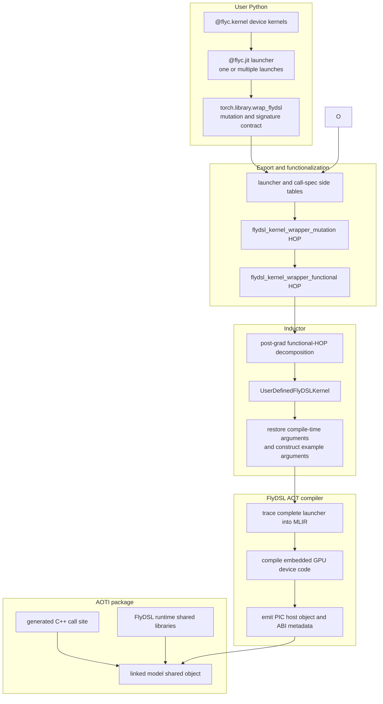
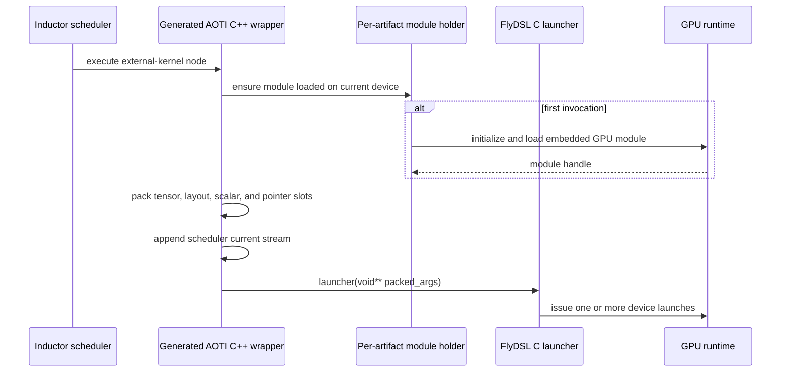

# FlyDSL launchers in AOTInductor

This document describes how to use a user-authored FlyDSL launcher with
AOTInductor (AOTI), and how PyTorch captures, compiles, packages, and invokes
that launcher. This is the FlyDSL counterpart of wrapping a user-defined Triton
kernel: the user writes FlyDSL Python and a Python call site, while Inductor
generates the C++ invocation and packages the compiled artifacts.

## User contract

A user defines one or more `@flyc.kernel` device kernels and calls them from an
`@flyc.jit` launcher. The launcher can contain any launch logic that FlyDSL can
trace successfully, including multiple kernel launches such as a split-K GEMM
followed by a workspace reduction.

For capture and AOTI packaging:

- The launcher returns `None` and writes results to explicit tensor arguments.
- Output and workspace tensors are allocated by PyTorch code and passed to the
  launcher. This lets Export and Inductor model their lifetimes and mutations.
- Mutated tensors are declared through `mutates_args`. If it is omitted, every
  runtime tensor argument is conservatively treated as mutated.
- `Constexpr` and FlyDSL type parameters are normal launcher arguments, but are
  captured as specialization values and omitted from the runtime ABI.
- Runtime arguments must be graphable PyTorch values. The supported AOT ABI
  covers tensors, pointers, numeric scalars, and an implicit stream.
- The launcher must not declare a FlyDSL `Stream` parameter. AOTI supplies the
  scheduler's current stream when invoking the compiled launcher.

`torch.library.wrap_flydsl()` creates a traceable launcher:

```python
@flyc.jit
def split_k_launcher(
    out: fx.Tensor,
    workspace: fx.Tensor,
    lhs: fx.Tensor,
    rhs: fx.Tensor,
    rows: fx.Int32,
    block_size: fx.Constexpr[int],
):
    split_k_kernel(...).launch(...)
    reduce_workspace_kernel(...).launch(...)


captured_split_k = torch.library.wrap_flydsl(
    split_k_launcher,
    mutates_args={"out", "workspace"},
)
```

The model allocates the mutated tensors and invokes the captured launcher:

```python
def split_k(lhs: torch.Tensor, rhs: torch.Tensor) -> torch.Tensor:
    out = torch.empty((lhs.shape[0], rhs.shape[0]), device=lhs.device)
    workspace = torch.empty(..., device=lhs.device)
    captured_split_k(out, workspace, lhs, rhs, lhs.shape[0], 256)
    return out
```

## End-to-end flow



## Capture and graph representation

`wrap_flydsl()` validates that the input is a FlyDSL `JitFunction`, resolves
its signature, and records:

- The launcher and an optional bound `self` object.
- Which tensor arguments may be mutated.
- Which argument positions are `Constexpr` or type parameters.
- The FlyDSL helpers used to identify streams and preconstructed JIT arguments.

Runtime tensor and scalar values become FX operands. Compile-time values are
stored in a call-spec side table and represented in the graph by an integer ID.
Registrations and equivalent call specifications are deduplicated within the
process.

The FX graph contains `flydsl_kernel_wrapper_mutation`. Functionalization
rewrites it to `flydsl_kernel_wrapper_functional`, cloning only the mutated
tensors that require functional outputs. Aliased arguments that would make
independent cloning incorrect are rejected. Inductor's post-grad pass later
decomposes the functional form back into a mutation-aware node for lowering.

The two FlyDSL higher-order operators are deliberately non-cacheable. Their
launcher and call-spec IDs refer to process-local side tables, so persistent FX
or AOTAutograd cache reuse would otherwise restore invalid IDs.

## Inductor lowering

`lower_flydsl_kernel()` creates a `UserDefinedFlyDSLKernel`, an Inductor
`ExternKernel` that owns:

- Realized tensor inputs and runtime scalar or symbolic arguments.
- Mutation outputs for the declared mutated tensors.
- The launcher ID and compile-time call-spec ID.
- Representative meta-tensor arguments used to specialize compilation.
- The selected device and scheduler stream.

The same IR node supports two wrapper modes:

- A Python wrapper creates a cached `FlyDSLPythonLauncher`, restores the
  compile-time arguments, and invokes FlyDSL through Python.
- An AOTI C++ wrapper compiles the launcher to an object, registers it with the
  AOT link, and emits a packed C ABI call.

The post-grad detection and decomposition pass is guarded by the presence of a
FlyDSL HOP, including HOPs in nested subgraphs. Graphs without captured FlyDSL
launchers do not construct or run the FlyDSL-specific pass.

## FlyDSL AOT compilation

`compile_aot()` follows FlyDSL's normal JIT argument conversion instead of
reimplementing kernel semantics in PyTorch:

1. Bind positional, keyword-only, bound-method, `Constexpr`, and type
   arguments using the FlyDSL launcher signature.
2. Convert runtime values through FlyDSL's JIT argument protocol.
3. Add an implicit stream argument when the launcher does not declare one.
4. Construct the MLIR function arguments and invoke the original launcher body
   under FlyDSL's tracing context.
5. Compile the resulting MLIR module using FlyDSL's configured backend.
6. Derive declarative ABI metadata from the converted JIT arguments.

The complete `@flyc.jit` body is traced into one exported C entry point. A
launcher containing multiple device launches therefore remains one Inductor
external-kernel node and one AOTI call, while the generated launcher performs
the individual device launches internally.

`CompiledAOTLauncher.export_to_c()` then:

- Gives every exported definition and GPU module loader a unique symbol.
- Emits a position-independent object through FlyDSL's MLIR execution engine.
- Renames the generic module initialization and load symbols with `objcopy`.
- Discovers and copies FlyDSL-owned runtime-library dependencies.

This resembles Triton's packaged-kernel flow at the user and Inductor levels,
but the artifact is different. The current FlyDSL backend produces a
relocatable host object containing the C launcher and GPU module-loading
interface, with the compiled device image embedded in that object; it is not
only a standalone cubin or HSACO file.

## Runtime ABI and invocation



The generated wrapper packs slots in FlyDSL's declared C ABI order:

| FlyDSL argument | Runtime ABI |
| --- | --- |
| Tensor or memref | Data pointer, followed by dynamic shape and stride bytes when required |
| Pointer | `void*` |
| Integer or Boolean scalar | Fixed-width signed or unsigned value |
| FP16 or BF16 scalar | Raw 16-bit representation |
| FP32 or FP64 scalar | `float` or `double` |
| `Constexpr` or type parameter | No runtime slot; restored from the call spec before compilation |
| Stream | One implicit current-stream pointer |

For a scheduled auxiliary stream, the generated call uses that scheduler
stream. Otherwise it queries the current PyTorch device stream. No Python
stream object crosses Export or the packaged-model boundary.

Each compiled launcher has a DSO-static module holder guarded by
`std::once_flag`. The holder loads the embedded GPU module once, remembers the
device that owns it, and unloads it when the model shared object is destroyed.
An invocation on another device is rejected rather than silently using a
module loaded for the wrong GPU.

## Linking and package relocation

The generated object is registered in `ROCmCodeCache.aot_kernels_o` for the
normal AOTI link. FlyDSL runtime libraries are added through the wrapper's
graph-local `external_kernel_libs` and `additional_files` collections. The
package uses an `$ORIGIN` runtime search path so the copied libraries remain
loadable after moving the `.pt2` package away from the compilation cache.

Runtime-library publication is atomic and rejects a same-name collision when
the existing file has different contents. Dependencies are limited to shared
libraries located within the FlyDSL distribution instead of copying arbitrary
system libraries.

## Current limitations

- FlyDSL is an optional dependency. Common PyTorch and Inductor imports do not
  import it; availability is checked only when FlyDSL is selected or wrapped.
- Captured-launcher AOT requires FlyDSL 0.2.3 or newer, a ROCm-enabled PyTorch
  build, and at least one tensor launcher argument.
- The launcher must return `None`; outputs and workspaces must be explicit
  tensor arguments.
- Explicit FlyDSL stream parameters are unsupported. Eager calls through a
  wrapped launcher currently require the default stream, while AOTI calls use
  the scheduler's current stream.
- Mutated tensor aliases that require independent functionalization clones are
  unsupported.
- Custom or composite FlyDSL JIT arguments without a declarative ABI are
  unsupported.
- Python post-load processors and extern-linked launchers combined with
  FlyDSL's external binary codegen are unsupported.
- `aot_inductor.package_cpp_only=True` is unsupported because the generated
  object and runtime libraries must be linked and packaged.
- A loaded artifact is owned by one GPU device for the lifetime of its AOTI
  model instance.
