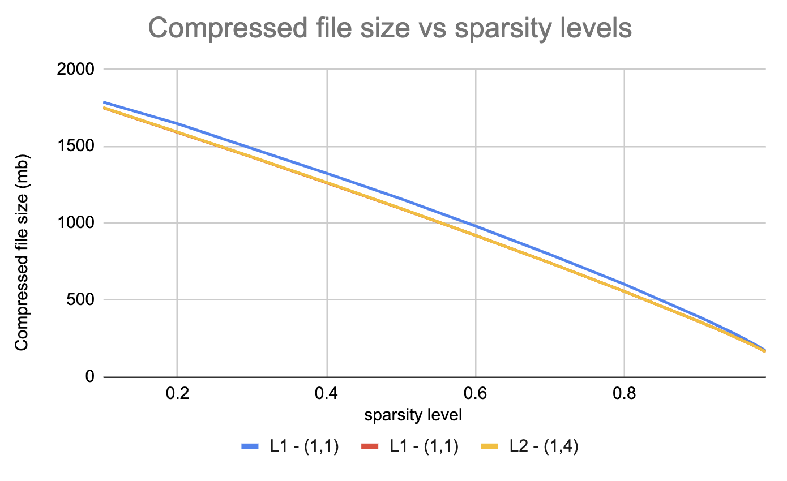
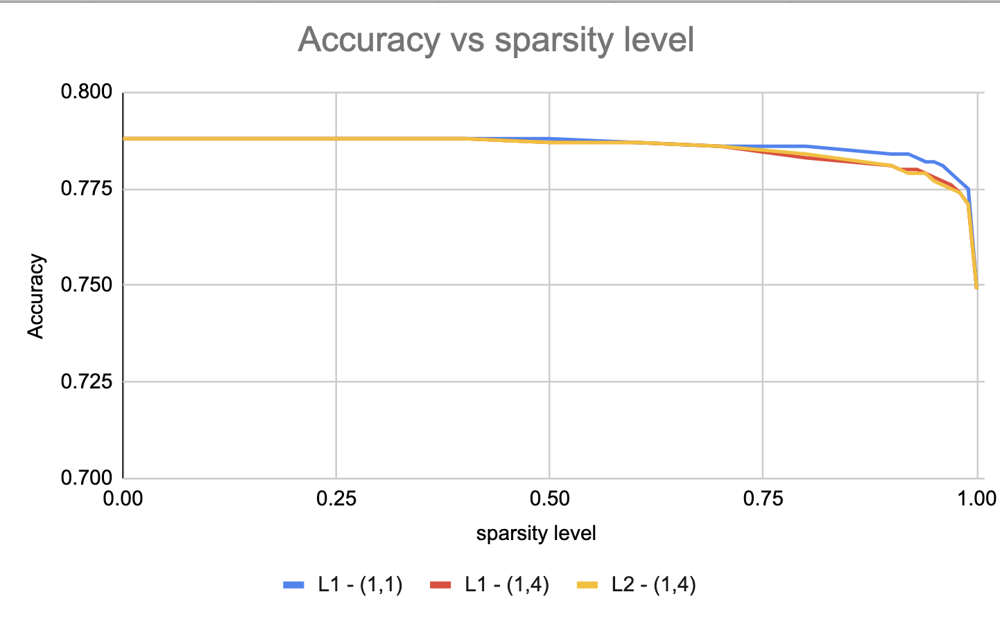

# Data Sparsifier Benchmarking using the DLRM Model

## Introduction
The objective of this exercise is to use the data sparsifier to prune the embedding bags of the [DLRM Model](https://github.com/facebookresearch/dlrm) and observe the following -

1. **Disk usage savings**: Savings in model size after pruning.
2. **Model Quality**: How and by how much does performance deteriorate after pruning the embedding bags?
3. **Model forward time**: Can we speed up the model forward time by utilizing the sparsity? Specifically, can we introduce torch.sparse interim to reduce number of computations.

## Scope
The [DataNormSparsifier](https://github.com/pytorch/pytorch/blob/master/torch/ao/sparsity/_experimental/data_sparsifier/data_norm_sparsifier.py) is used to sparsify the embeddings of the DLRM model. The model is sparsified for all the combinations of -
1. Sparsity Levels: [0.0, 0.1, 0.2, ... 0.9, 0.91, 0.92, ... 0.99, 1.0]
2. Sparse Block shapes: (1,1) and (1,4)
3. Norm: L1 and L2

## Dataset
The benchmarks are created for the dlrm model on the Kaggle CriteoDataset which can be downloaded from [here](https://ailab.criteo.com/ressources/) or [here](https://figshare.com/articles/dataset/Kaggle_Display_Advertising_Challenge_dataset/5732310/1).

## Results
1. **Disk Usage**: Introducing sparsity in the embeddings reduces file size after compression. The compressed model size goes down from 1.9 GB to 150 MB after 100% sparsity.




2. **Model Quality**: The model accuracy decreases slowly with sparsity levels. Even at 90% sparsity levels, the model accuracy decreases only by 2%.


3. **Model forward time**: Sparse coo tensors are introduced on the features before feeding into the top layer of the dlrm model. Post that, we perform a sparse ```torch.mm``` with the first linear weight of the top layer.
The takeaway is that the dlrm model with sparse coo tensor is slower (roughly 2x). This is because even though the sparsity levels are high in the embedding weights, the interaction step between the dense and sparse features increases the sparsity levels. Hence, creating sparse coo tensor on this not so sparse features actually slows down the model.


## Setup
The benchmark codes depend on the [DLRM codebase](https://github.com/facebookresearch/dlrm).
1. Clone the dlrm git repository
2. Download the dataset from [here](https://ailab.criteo.com/ressources/) or [here](https://figshare.com/articles/dataset/Kaggle_Display_Advertising_Challenge_dataset/5732310/1)
3. The DLRM model can be trained using the following script
```
# Make sure you go into the file and make sure that the path to dataset is correct.

./bench/dlrm_s_criteo_kaggle.sh --save-model=./models/criteo_model.ckpt [--use-gpu]

# This should also dump kaggleAdDisplayChallenge_processed.npz in the path where data is present
```

4. Copy the scripts data sparsifier benchmark scripts into to the dlrm directory.

## Scripts to run each experiment.

### **Disk savings**
```
python evaluate_disk_savings.py --model_path=<path_to_model_checkpoint> --sparsified_model_dump_path=<path_to_dump_sparsified_models>
```

Running this script should dump
* sparsified model checkpoints: model is sparsified for all the
    combinations of sparsity levels, block shapes and norms and dumped.

* ```sparse_model_metadata.csv```: This contains the compressed file size and path info for all the sparsified models. This file will be used for other experiments


### **Model Quality**
```
python evaluate_model_metrics.py --raw_data_file=<path_to_raw_data_txt_file> --processed_data_file=<path_to_kaggleAdDisplayChallenge_processed.npz> --sparse_model_metadata=<path_to_sparse_model_metadata_csv>
```
Running this script should dump ```sparse_model_metrics.csv``` that contains evaluation metrics for all sparsified models.

### **Model forward time**:
```
python evaluate_forward_time.py --raw_data_file=<path_to_raw_data_txt_file> --processed_data_file=<path_to_kaggleAdDisplayChallenge_processed.npz> --sparse_model_metadata=<path_to_sparse_model_metadata_csv>
```
Running this script should dump ```dlrm_forward_time_info.csv``` that contains forward time for all sparsified models with and without torch.sparse in the forward pass.

## Requirements
pytorch (latest)

scikit-learn

numpy

pandas

## Machine specs to create benchmark
AI AWS was used to run everything i.e. training the dlrm model and running data sparsifier benchmarks.

Machine: AI AWS

Instance Type: p4d.24xlarge

GPU: A100


## Future work
1. **Evaluate memory savings**: The idea is to use torch.sparse tensors to store weights of the embedding bags so that the model memory consumption improves. This will be possible once the embedding bags starts supporting torch.sparse backend.

2. **Sparsifying activations**: Use activation sparsifier to sparsify the activations of the dlrm model. The idea is to sparsify the features before feeding to the top dense layer (sparsify ```z``` [here](https://github.com/facebookresearch/dlrm/blob/11afc52120c5baaf0bfe418c610bc5cccb9c5777/dlrm_s_pytorch.py#L595)).
