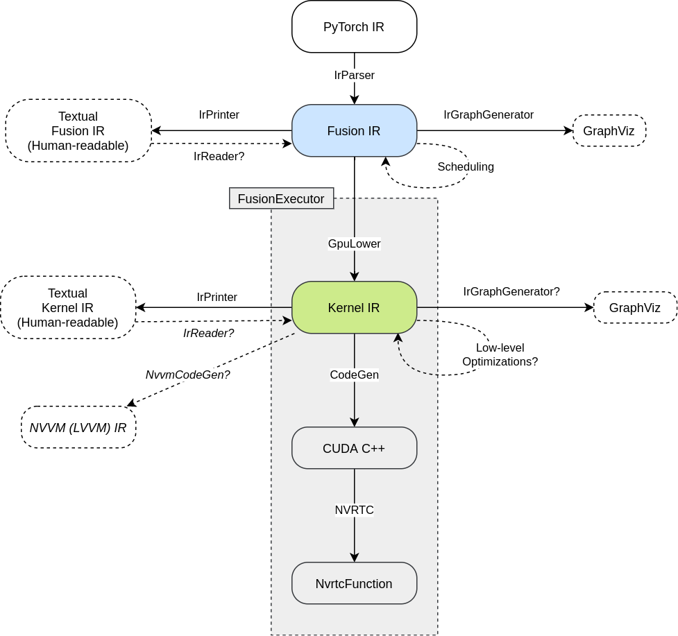

This is the implementation reference for the CUDA PyTorch JIT Fuser

- [PyTorch GitHub Page](https://github.com/pytorch/pytorch)
- [Fuser Source Tree](https://github.com/pytorch/pytorch/tree/master/torch/csrc/jit/codegen/cuda)
- Main documentation indexes: [Namespaces](namespaces.html) and [Classes](annotated.html)

