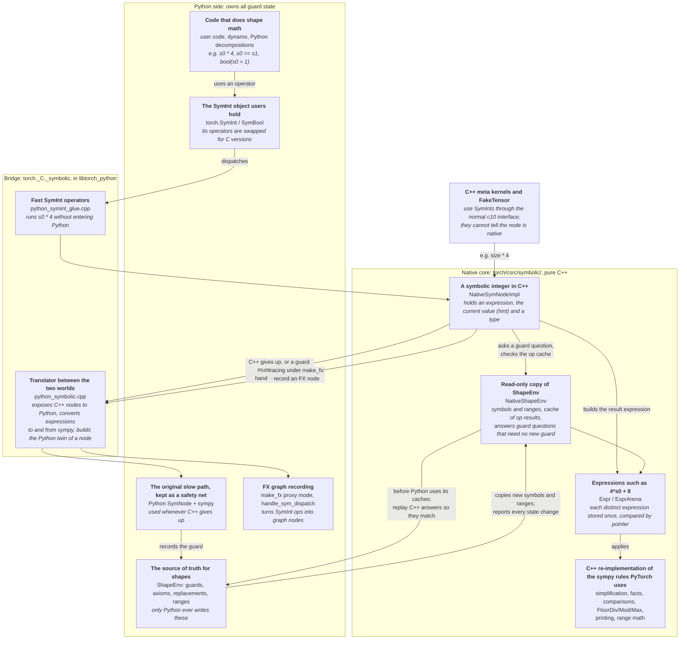
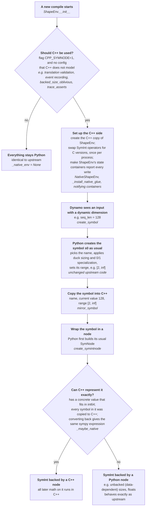
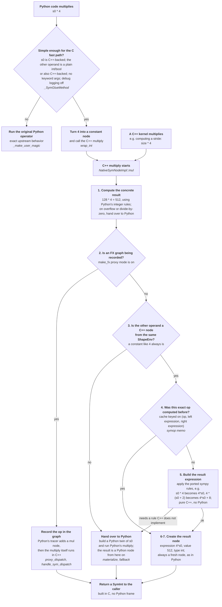
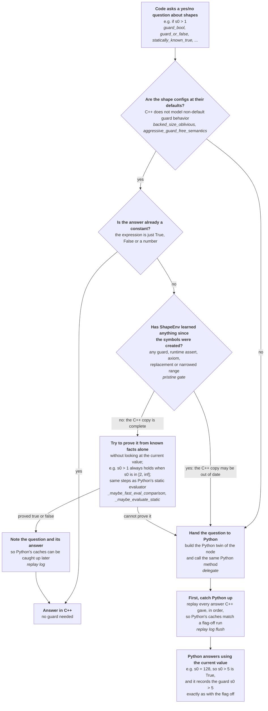

# Native C++ SymNode: architecture

Flag: `CPP_SYMNODE=1`, which sets `torch._dynamo.config.use_cpp_symnode` (default off).

## 1. Problem

With dynamic shapes, every SymInt operation made during tracing (by meta kernels, decompositions,
dynamo, or user code) goes through Python:

```
C++ kernel: a.sym_size(0) * 4
  -> PythonSymNodeImpl::mul                 (GIL, pybind)
  -> SymNode.mul -> binary_magic_impl        (sym_node.py)
       hint math, get_proxy_mode(), _symop_cache lookup,
       sympy Mul(...) (lru_cached), pytype rules, new SymNode(...)
  -> back to C++ as a new PythonSymNodeImpl
```

On Qwen3-8B dynamic prefill that is about 8.6M node-level Python SymNode calls per compile. The
profile showed that sympy itself was cheap (3.7% of self-time, thanks to `lru_cache`). The cost
was the Python plumbing around each op: 26% in the SymNode layer, 5% in ShapeEnv, and 1-2% in the
`torch.SymInt` dunder wrappers. The goal was to make this whole per-op layer native, while
leaving Python fully authoritative for anything that records guards.

## 2. Design principles

1. **Python stays authoritative for every ShapeEnv mutation.** C++ never appends a guard, runtime
   assert, axiom, replacement or range refinement. When C++ cannot give a definite answer that
   Python would also give without mutating state, it delegates to Python.
2. **Native answers match Python's exactly.** The evaluator is a line-by-line port of Python's
   static evaluation (`_maybe_evaluate_static`). It only runs while Python's caches cannot be
   stale (the pristine gate, section 6).
3. **Native expressions are structurally identical to sympy's.** Every construction rule is
   ported line by line and differential-tested, so `to_sympy(native) == python_result` and
   `str()` matches byte for byte.
4. **Flag off is byte-identical.** Every edit outside `torch/csrc/symbolic/` sits behind
   `shape_env._native_env is not None` or `isinstance(x, _NativeSymNode)`.
5. **Unsupported means fallback, not approximation.** A step that needs machinery the port lacks
   throws `NativeUnsupported`. The op then reruns in Python and gives the exact Python result.

## 3. Component map

How to read this chart: boxes are grouped by where they live (Python, the bridge module, or
pure C++). Each box says what the piece is for, then its code name. The arrows show every way the
layers talk to each other. Most traffic stays inside the C++ core. Python is reached only through
the three labeled exits: handing an op or question to Python, recording an FX node, and replaying
C++ answers into Python's caches.



### Files (about 12.6K lines of C++)

| layer | file | role |
|---|---|---|
| expressions | `Expr.h/.cpp` | `Expr` kinds, the hash-consing `ExprArena`, Integer/Rational/Float/oo/int_oo numbers, Symbol, Add/Mul/Pow construction |
| | `Assumptions.cpp` | three-valued facts (`is_integer`, `is_positive`, `is_nonnegative`, ...) per kind, ported from sympy's `_eval_is_*` |
| | `Relational.cpp` | Eq/Ne/Lt/Le/Gt/Ge evaluation, And/Or/Not, `canonicalize_bool_expr` |
| | `Functions.cpp` | every class in `torch/utils/_sympy/functions.py` (FloorDiv, Mod, PythonMod, Max, Min, CeilDiv, PowByNatural, ModularIndexing, Where, OpaqueUnaryFn_*, ...) |
| | `Expand.cpp`, `ExprTools.cpp`, `Sorting.cpp` | `safe_expand`, xreplace/free symbols/gcd, sympy `sort_key`/`ordered` |
| | `Printer.cpp` | sympy StrPrinter port, so `str(node)` needs no sympy |
| | `ValueRanges.h/.cpp` | `ValueRanges` and the `bound_sympy` handlers |
| state | `NativeShapeEnv.h/.cpp` | mirrored ShapeEnv state, symop memo, static evaluator, pristine gate, replay log |
| node | `NativeSymNodeImpl.h/.cpp` | the `c10::SymNodeImpl` subclass (about 57 overridden virtuals) |
| bridge | `PyFallback.h` | declarations of the only ways the core reaches Python: `materialize`, `python_impl`, `proxy_dispatch`, `proxy_mode`, `live_nodes_changed`, `native_config_is_default` |
| bindings | `python_symbolic.cpp` | `torch._C._symbolic` module: `_NativeSymNode`, `NativeShapeEnv`, `_Arena`, conversion, `PyFallback` definitions, stats and test hooks |
| | `python_symint_glue.cpp` | `_SymGlueMethod`: C implementations of the `torch.SymInt`/`SymBool` dunders for native nodes |

The core is compiled into libtorch_python (`build_variables.bzl`) so that incremental rebuilds
relink the smaller library and slow paths can call Python directly. The core includes no Python
headers, so moving it to libtorch_cpu is a bzl move. C++ kernels never link against the concrete
class; they only call `c10::SymNodeImpl` virtuals. No c10 headers were edited.

## 4. Lifecycle: how native nodes come into existence

How to read this chart: it follows one dynamic dimension (for example `seq_len = 128`) from the
start of a compile to the `SymInt` that dynamo hands to the rest of tracing. Python still does
all symbol creation; C++ only receives a copy and then decides whether it can take over the node.
Every "no" branch ends in exactly the upstream behavior.



What stays Python by design: symbol creation, unbacked symbols (`create_unbacked_*`), SymFloat
creation, and every guard write. Because unbacked symbols never go native, data-dependent errors
always come from Python.

## 5. Hot path: one SymInt operation

Example: `s0 * 4`, called either from Python (`SymInt.__mul__`) or from a C++ kernel
(`SymInt::operator*` -> `SymNodeImpl::mul`).

How to read this chart: it follows `s0 * 4` (with `s0 = 128`) from either entry point, a Python
operator on the left or a C++ kernel on the right, through the numbered steps of the C++ multiply.
The straight path down the middle never touches Python, and it is the path almost every op takes.
Each branch to "Hand over to Python" is a case where C++ cannot guarantee the same result as
Python, so Python does the op instead.



Key points:
- **Expressions are interned.** Each `NativeShapeEnv` owns an `ExprArena`. Structurally equal
  expressions are the same `const Expr*`, so equality is a pointer compare and memo keys are pointer
  triples.
- **Nodes are immutable and freshly allocated,** matching Python's identity semantics.
  `clone()` returns `this`.
- **Locking:** one `std::mutex` per env guards the arena, memo and mirror. No Python call is made
  while it is held, to avoid a GIL/mutex deadlock.
- **Proxy dispatch runs before any fallback decision,** so the SymInts reaching
  `handle_sym_dispatch` carry the original native nodes and proxy-slot lookups hit.
- **Mixed native/Python operands** produce Python results, and the result stays Python.

## 6. Guard queries: static evaluation and delegation

Examples: `bool(s0 > 1)`, `guard_or_false(...)`, `statically_known_true(...)`.

How to read this chart: it follows a yes/no question about shapes, such as `if s0 > 1:`. C++
answers only when the answer can be proved from facts ShapeEnv already has, which means no new
guard is needed. Every other question goes to Python, which answers it using the current value
and records a guard. Before Python answers, it is caught up on the answers C++ already gave, so
its caches look exactly as if Python had answered everything itself.



### The pristine gate

The native evaluator answers only while the ShapeEnv is **pristine**: no guards, deferred runtime
asserts, axioms, divisibility facts or replacements, and no range updates after symbol creation.
In that state a fresh native evaluation provably equals what Python computes, because Python's
version-keyed caches can only hold entries computed in the same state.

Python writes this state from many places, some of which bypass ShapeEnv methods (for example
`var_to_range[k] &= ...` in export). So, under a native env only, the seven state containers are
replaced by `list`/`dict`/`set` subclasses whose mutators call a pre-mutation hook
(`mark_not_pristine` or `mark_replacements`). After the first mutation:
- evaluation always delegates to Python (correct, but slow);
- arithmetic stays native while replacements are empty, because `expr == _expr` then;
- native `mod` answers only from the memo, since choosing Mod vs PythonMod reads ranges.

On Qwen the env stays pristine for the whole compile.

### The replay log

Native answers skip Python's LRU caches, and those caches do not key on guards or ranges. Left
alone, the flag-off path could later return a stale cached `None` (and guard) where flag-on
computed fresh. To prevent this, each env logs every distinct native query in last-use order.
**Before Python performs any evaluation or mutation on any env**, the logs of all live native envs
are replayed through the real Python methods, oldest first. The flush points are the
`evaluate_expr` entry, the `_lru_cache` wrapper, `guard_or_defer_runtime_assert`, the notifying
containers, `add_backed_var_to_val` and GraphPickler unpickle. Python's caches then end up with
exactly the flag-off entries in the flag-off order. An empty flush is one C call.

## 7. Materialization and fallback

`PyFallback::materialize(node)` builds a Python
`SymNode(expr=to_sympy(expr), shape_env, pytype, hint, constant, ...)` once per native node, with
the GIL held, and caches it on the binding side. The cache entry is erased in the node's destructor
if the node was ever materialized.
- `to_sympy` is cached per `Expr` id. Conversion is pure, so the cache never goes stale.
- Delegated ops call the Python method on the materialized node(s), and the result is a Python
  node.
- Every materialization and delegation is counted by reason (`torch._C._symbolic._stats()`).

About 180 `NativeUnsupported` sites exist. The main causes are eval steps needing general
`sympy.gcd`/`simplify`, `zoo`/`nan`/complex results, int64 overflow, non-53-bit Floats and sort-key
ties.

## 8. Python integration

- **`_NativeSymNode`** is the pybind class for `NativeSymNodeImpl`, registered as a subclass of
  `_SymNode`. It exposes the full Python `SymNode` surface: `expr` (lazy `to_sympy`), `hint`,
  `pytype`, `shape_env`, `constant`, `fx_node`, `free_symbols()`, every op method, `wrap_*`, the
  guard methods, `__reduce__`/`__deepcopy__` (which materialize) and `__repr__`. pybind's instance
  table keeps `symint.node` identity-stable while a Python reference exists, which `_SymNodeDict`
  proxy slots rely on.
- **`SymNodeTypes = (SymNode, _NativeSymNode)`** in `sym_node.py` replaces
  `isinstance(x, SymNode)` checks in sym_node, symbolic_shapes, proxy_tensor, partitioners,
  runtime_assert, sizevars, `_fake_tensor_utils` and `_graph_pickler`. A test forbids new plain
  `isinstance(..., SymNode)` checks.
- **Module-level helpers** in `symbolic_shapes.py` (`_guard_or`, `statically_known_true`,
  `expect_true`, `guard_bool/int`, `has_hint`, `free_symbols`, `has_free_symbols`,
  `guarding_hint_or_throw`, ...) dispatch straight into C++ for native nodes.
- **SymInt glue (`python_symint_glue.cpp`).** At the first native `ShapeEnv`, the hot attributes
  on `torch.SymInt`/`SymBool` (arithmetic, comparisons, `__bool__`, `__index__`, `__hash__`,
  `hint`, `sym_ite`, ...) are replaced by C `_SymGlueMethod` descriptors. Inside the fast-path
  domain they run the entire `_make_user_magic` logic in C++ and build the result object with
  `make_sym_object` (no Python frame). Outside it they vectorcall the saved original. This is what
  removed the roughly 1.9M `_make_user_magic` calls.
- **Casters.** `utils/pybind.cpp` and `utils/python_symnode.{h,cpp}` accept native nodes as
  operands and build `SymBool`/`SymInt` objects for them.
- **Lifetime.** Native nodes hold an `intrusive_ptr<NativeShapeEnv>`, so the arena outlives
  every node. The binding keeps a strong reference to the Python `ShapeEnv` only while live native
  nodes exist; an atomic count toggles it on the 0 <-> 1 transitions. A permanent reference would
  create an uncollectable cycle through `_native_env`.

## 9. Verification strategy

- **`test/test_native_symnode.py`** (about 5.7K lines, 19 classes). For every construction rule,
  fact, relational, function, printer case and value-range handler, the test builds the
  expression natively and in sympy, then asserts `to_sympy(native) == sympy` and
  `str(native) == str(sympy)`. Inputs include the 320-op Qwen corpus and seeded random expression
  trees.
- **Node level:** native vs Python `SymNode` for every virtual (hint, pytype, result expr, guard
  results, no extra guards recorded, overflow fallback, mixed operands), plus make_fx traces that
  must give identical graphs.
- **Evaluator:** the same query stream goes to both evaluators, in pristine and non-pristine
  states. The native answer must equal Python's or delegate, never differ.
- **Glue:** twin native ShapeEnvs run identical random op sequences through the descriptors and
  through the saved originals, comparing results, guards and replay logs.
- Each C++ semantic change was also cross-checked by a separate reviewer agent running its own
  differential fuzzers (often 0.5-1M checks per item).
- **Debug mode:** `TORCH_NATIVE_SYMNODE_CHECK=1` asserts at every flush that the mirror matches
  Python and that replayed results equal the native ones.
- **Crossing accounting** (Qwen harness, not checked in): a `sys.monitoring` hook
  attributes every Python SymNode, sympy and glue call during the compile to an allow-listed bucket
  or to NOT ALLOWED, and the harness fails unless NOT ALLOWED is empty.

## 10. Results (measured with C++ FakeTensor)

Qwen3-8B dynamic prefill, crossings during the compiled call:

| bucket | flag off | flag on |
|---|---|---|
| Python SymNode (node level) | 8,608,756 | 4 |
| SymInt wrappers (`_make_user_magic`) | 1,894,508 | 4 |
| sympy package | 3,066,423 | 146,528 |
| ShapeEnv (symbolic_shapes.py) | 1,890,516 | 765,913 |
| NOT ALLOWED | n/a | 0 |

What remains runs once per input, per produced size or per finished graph, not per op: symbol
creation, final guard production, post-trace passes and FX proxy bookkeeping.

Timing (aot_eager, first call / AOT-only, seconds):

| config | first call | aot_only |
|---|---|---|
| Python FakeTensor (with dispatch cache) | 13.25 | 6.22 |
| C++ FakeTensor | 14.37 | 7.08 |
| C++ FakeTensor + native SymNode | 10.39 | 4.29 |

Numerics were exact, the dynamo/AOT graphs and `shape_env` goldens were byte-identical to flag
off, and test_dynamic_shapes, test_sympy_utils, test_fake_tensor and test_proxy_tensor showed no new
failures with the flag on or off.

## 11. Known gaps

- **Pristine gate.** A workload that guards early (specialization, `torch._check`, recompiles)
  delegates every evaluation to Python after the first guard. Lifting this needs a port of
  ShapeEnv `simplify`/replacements, axioms and `_maybe_guard_rel`.
- **Unbacked symbols and SymFloat creation** stay Python. `guard_size_oblivious` delegates.
- **make_fx graph construction** (`handle_sym_dispatch`, `set_proxy_slot`) is Python by nature.
- **Location.** The core lives in libtorch_python, so C++ without Python loaded cannot create
  native nodes.
- **Python FakeTensor.** All numbers above were measured with C++ FakeTensor. Native SymNode
  under Python FakeTensor has not been tested yet.
