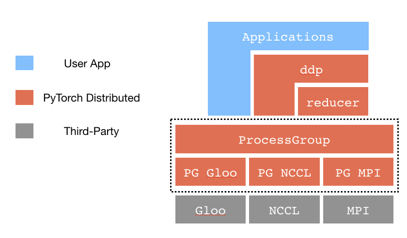
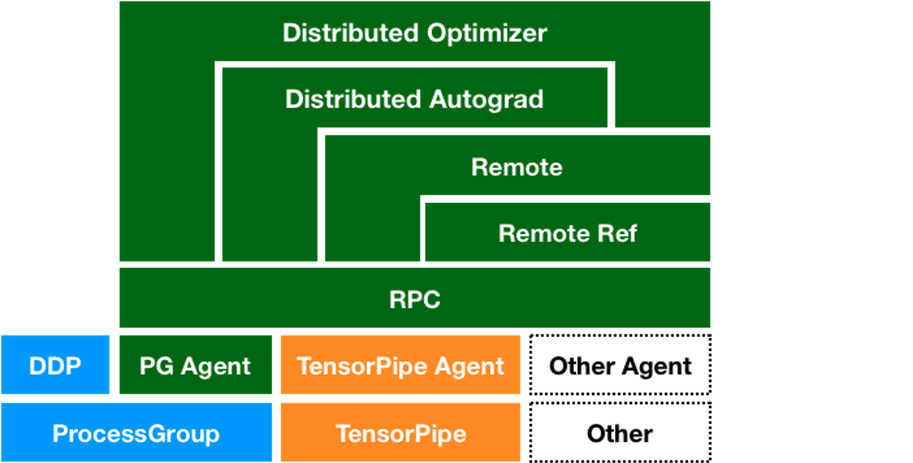

# Contributing to PyTorch Distributed

Please go through PyTorch's top level [Contributing Guide](../../CONTRIBUTING.md) before proceeding with this guide.

[PyTorch Distributed Overview](https://pytorch.org/tutorials//beginner/dist_overview.html) is a great starting point with a lot of tutorials, documentation and design docs covering PyTorch Distributed. We would highly recommend going through some of that material before you start working on PyTorch Distributed.

In this document, we mostly focus on some of the code structure for PyTorch distributed and implementation details.

## C10D and DistributedDataParallel

The figure below demonstrates building blocks of the c10d and DDP package and shows how typically an application is layered on top. Most parts of the distributed package are implemented in C++ and then bound to the Python frontend (see [c10d/init.cpp](../csrc/distributed/c10d/init.cpp)).



### Process Groups

Process groups (PG) take care of communications across processes. It is up to users to decide how to place processes, e.g., on the same machine or across machines. PG exposes a set of communication APIs, e.g., send, recv, broadcast, allgather, allreduce, etc.

Source Code: [ProcessGroup.cpp](../lib/c10d/ProcessGroup.cpp) and  [ProcessGroup.hpp](../lib/c10d/ProcessGroup.hpp)

#### Process Group Backends

We currently offer three backends for Process Groups: [ProcessGroupGloo.hpp](../lib/c10d/ProcessGroupGloo.hpp), [ProcessGroupMPI.hpp](../lib/c10d/ProcessGroupMPI.hpp) and [ProcessGroupNCCL.hpp](../torch/lib/c10d/ProcessGroupNCCL.hpp)

#### Store

Processes discover each other through a rendezvous process on a common Store (See [Store.hpp](../torch/lib/c10d/Store.hpp) for the interface and [FileStore.hpp](../torch/lib/c10d/FileStore.hpp), [TCPStore.hpp](../torch/lib/c10d/TCPStore.hpp) and [PrefixStore.hpp](../torch/lib/c10d/PrefixStore.hpp) for implementations.)

### Distributed Data Parallel

DDP is implemented as a module in [distributed.py](../nn/parallel/distributed.py) with some of the core functions implemented in [reducer.cpp](../lib/c10d/reducer.cpp) and [comm.cpp](../lib/c10d/reducer.cpp). Gradients synchronizations occur in backward pass, triggered as autograd hooks.

### Onboarding Tasks

A list of onboarding tasks can be found [here](https://github.com/pytorch/pytorch/issues?q=is%3Aopen+is%3Aissue+label%3A%22module%3A+distributed%22+label%3A%22topic%3A+bootcamp%22) and [here](https://github.com/pytorch/pytorch/issues?q=is%3Aopen+is%3Aissue+label%3A%22module%3A+distributed%22+label%3Apt_distributed_rampup).

## RPC Framework

The figure below demonstrates the overall architecture of the RPC framework.



The top level APIs for the RPC framework can found in [rpc/api.py](rpc/api.py) and majority of the code is actually written in C++. The pybind entrypoints can be found in [rpc/init.cpp](../csrc/distributed/rpc/init.cpp).

The RPC framework consists of several additional components:

### RPC Agents

The core C++ interface of the RPC framework can be found in [rpc_agent.h](../csrc/distributed/rpc/rpc_agent.h) and the TensorPipe and ProcessGroupGloo implementations can be found at [process_group_agent.h](../csrc/distributed/rpc/process_group_agent.h) and [tensorpipe_agent.h](../csrc/distributed/rpc/tensorpipe_agent.h) respectively.

[request_callback.h](../csrc/distributed/rpc/request_callback.h) and [request_callback_impl.h](../csrc/distributed/rpc/request_callback_impl.h) deal with how to handle RPC calls on remote servers.

### Remote Reference (RRef)

Most of the APIs for RRefs can be found in [rpc/api.py](rpc/api.py). The C++ interface can be found in [rref_interface.h](../../aten/src/ATen/core/rref_interface.h) and implementations in [rref_impl.h](../torch/csrc/distributed/rpc/rref_impl.h) and [rref_context.h](../torch/csrc/distributed/rpc/rref_context.h).

### Distributed Autograd

The top level APIs for distributed autograd can be found in [distributed/autograd/init.py](autograd/__init__.py) and [distributed/autograd/init.cpp](../csrc/distributed/autograd/init.cpp).

The core engine for executing a distributed backward pass can be found in [dist_engine.h](../csrc/distributed/autograd/engine/dist_engine.h)

### Distributed Optimizer

The distributed optimizer is completely written in Python and can be found at [optimizer.py](optim/optimizer.py)

### Onboarding Tasks

A list of onboarding tasks can be found [here](https://github.com/pytorch/pytorch/issues?q=is%3Aopen+is%3Aissue+label%3Apt_distributed_rampup+).

## Running unit tests

All the unit tests can be found under the [test/distributed](../../test/distributed) directory and RPC tests in particular are under [test/distributed/rpc](../../test/distributed/rpc). A few examples on how to run unit tests:

```
# Run the c10d unit test.
python test/distributed/test_c10d.py

# Run distributed tests, including tests for Distributed Data Parallel
python test/run_test.py --verbose -i distributed/test_distributed_fork
python test/run_test.py --verbose -i distributed/test_distributed_spawn

# Run the RPC test suite for the TensorPipeAgent.
python test/distributed/rpc/test_tensorpipe_agent.py

# Run the RPC test suite for the ProcessGroupAgent.
python test/distributed/rpc/test_process_group_agent.py

# Run a specific test method.
pytest -k test_self_add test/distributed/rpc/test_process_group_agent.py
```

Note that the RPC framework is by default only tested with filesystem [initialization](https://pytorch.org/docs/stable/distributed.html#initialization). To run tests with TCP initialization, set the
environment variable `RPC_INIT_WITH_TCP=1` before running your test command.
